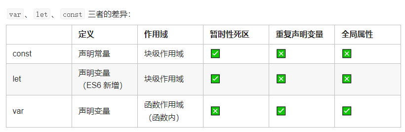

### falsy

​	`''、null、undefined、+0、-0、false、NaN`

### Optional chaining (?.)

```javascript
//syntax
obj.val?.prop
obj.val?.[expr]
obj.func?.(args)

const obj = {
  name: 'Alice',
  cat: {
    name: 'Dinah',
  },
}
const dogName = obj.dog?.name //undefined
obj.someNonExistentMethod?.() //undefined

//ES5写法 const nestedProp = obj.first && obj.first.second
//可选链等同以下语法
const temp = obj.first
const nestedProp = temp === null || temp === undefined ? undefined : temp.second

//for array
const printMagicIndex = (arr) => console.log(arr?.[42])
printMagicIndex([0, 1, 2, 3, 4, 5]); // undefined
printMagicIndex()// undefined

//other example
const customerCity = customer.details?.address?.city
const customerName = customer.name?.getName?.()

const customerCity = customer?.city ?? "Unknown city"
```

### Nullish coalescing operator (??)

```javascript
//other falsy value do not work
(null || undefined) ?? "foo"; // "foo"
```

### 数据类型

- number、boolean、string、null、undefined
- Object（`Array`、`Function`、`Date`、`RegExp`、`Error`、`Map`、`Set`)
- Symbol、BigInt

### ??=

```javascript
let a = null
let b = undefined
let c = 100
let d = 200
a ??= c
b ??= d
```

### const、let、块级作用域



- 不允许重复声明 `let p = 1; let p = 2`

- 不存在变量提升

- 暂时性死区

  ```javascript
  console.log(person) // ReferenceError: person is not defined
  let person = {
  	name: 'Lucy',
  }

  console.log(person) // undefined
  var person = {
  	name: 'Lucy',
  }
  ```

- 全局属性

  ```javascript
  var name = 'Lucy'
  console.log(window.name) // "Lucy"
  console.log(globalThis.name) // "Lucy"
  
  const age = 12
  console.log(window.age) // undefined
  console.log(globalThis.age) // undefined
  
  let gender = 'female'
  console.log(window.gender) // undefined
  console.log(globalThis.gender) // undefined
  ```

  字符串扩展

  - includes
  - repeat
  - startWith
  - endWith

### 模板字符串

### ==解构赋值==

- ==解构不成功是`undefined`==

- 规则：只要等号右边的值不是对象或数组，**先将其转为对象**，`undefined`和`null`无法转为对象，因此无法进行解构

- 字符串解构：`const [a, b, c, d, e] = "hello"`

- 数值解构：`const { toString: s } = 123`

- 布尔解构：`const { toString: b } = true`

- 对象解构

  - 形式：`const { x, y } = { x: 1, y: 2 }`
  - 默认：`const { x, y = 2 } = { x: 1 }`
  - 重命名：`const { x, y: z } = { x: 1, y: 2 }`
  - `;({ name: user.name, email: user.email, ...userDetails } = obj)`

- 数组解构

  ```javascript
  const csvFileLine = '1997,John Doe,US,john@doe.com,New York'
  const { 2: country, 4: state } = csvFileLine.split(',')
  ```

- 函数参数解构

  - `function Func([x = 0, y = 1]) {}`
  - `function Func({ x = 0, y = 1 } = {}) {}`(对象不在乎顺序)

- 应用场景

  - 排除对象不需要的属性：`const {prop1, prop2, ...otherProps} = obj`
  - 交换变量值：`[x, y] = [y, x]`
  - 函数返回值：`const [x, y, z] = Func()`
  - 定义函数参数：
    - `Func([1, 2]){}` 数组有序
    - `Func({x, y, z}) {}` 对象可无序
  - 提取 JSON 数据：`const { name, version } = packageJson`
  - 定义函数参数默认值：`function Func({ x = 1, y = 2 } = {}) {}`
  - 遍历 Map 结构：`for (let [k, v] of Map) {}`
  - 输入模块指定属性和方法：`const { readFile, writeFile } = require("fs")`

#### for of 可迭代对象原理基于对象的 Symbol.iterator 属性

```javascript
let obj = {
	[Symbol.iterator]() {
		return {
			num: 0,
			max: 5,
			next() {
				return this.num < this.max ? { value: this.num++, done: false } : { value: undefined, done: true }
			},
		}
	},
}

class MyIterator {
	constructor(params) {
		this.index = 0
		this.value = params
	}
	[Symbol.iterator]() {
		return this
	}
	next() {
		return {
			value: this.value[this.index++],
			done: this.index > this.value.length ? true : false,
		}
	}
}

let it = new MyIterator(['a', 'b', 'c'])
console.log(it.next()) // { value: "a", done: false }
console.log(it.next()) // { value: "b", done: false }
console.log(it.next()) // { value: "c", done: false }
console.log(it.next()) // { value: undefined, done: true }
console.log(it.next()) // { value: undefined, done: true }
```

#### Iterator

```javascript
function makeIterator(array) {
	let nextIdx = 0
	return {
		next() {
			return nextIdx < array.length
				? { value: array[nextIdx++], done: false }
				: { value: undefined, done: true }
		},
	}
}

let it = makeIterator(['a', 'b'])
it.next() // { value: "a", done: false }
it.next() // { value: "b", done: false }
it.next() // { value: undefined, done: true }
```

### 数值扩展

- Number.EPSILON
- Number.MIN_SAFE_INTEGER
- Number.MAX_SAFE_INTEGER
- Number.parseInt()
- Number.parseFloat()
- Number.isFinite()
- Number.isNaN()
- Number.isInteger()
- Number.isSafeInteger()

### 对象扩展

- 简洁表示
- 属性名可使用表达式
- API
  - Object.is()
  - **Object.assign()**
  - **Object.keys()、Object.values()、Object.entries()**
  - **Object.getPrototypeOf()、Object.setPrototypeOf()**
  - Object.getOwnPropertyDescriptors()
  - Object.fromEntries()
- **属性遍历**
  - for-in
  - Object.keys()、Object.values()、Object.entries()
  - Object.getOwnPropertyNames()
  - Object.getOwnPropertySymbols()
  - Reflect.ownKeys()
    - 规则
      - 首先遍历所有数值键，按照数值升序排列
      - 其次遍历所有字符串键，按照加入时间升序排列
      - 最后遍历所有 Symbol 键，按照加入时间升序排列
- 链判断操作符(?.)：是否存在对象属性(不存在返回`undefined`且不再往下执行)
  - 对象属性：obj?.prop、obj?.[expr]
  - 函数调用：func?.(...args)
- 空判断操作符(??)：是否值为 undefined 或 null，是则使用默认值

### 数组扩展

#### ==扩展运算符(...)==(原理可迭代对象)

- 浅克隆数组(对象)：`const arr = [...arr1]`
- 浅合并数组(对象)：`const arr = [...arr1, ...arr2]`
- 拼接数组：`arr.push(...arr1)`
- 代替 apply：`Math.max.apply(null, [x, y]) => Math.max(...[x, y])`
- 转换字符串为数组：`[..."hello"]`
- 转换字符串为对象：`{ ..."hello" }`
- 转换数组为对象：`{ ...[1, 2] }`
- 转换类数组为数组：`[...Arguments, ...NodeList]`
- 转换可遍历对象为数组：`[...String, ...Set, ...Map, ...Generator]`
- 与数组解构赋值结合：`const [x, ...rest] = [1, 2, 3]`
- 对象克隆(基本同 Object.assign):`const objCopy = { ...obj, ...objOthers }`
- 与对象解构赋值结合：`const { x, ...rest } = { x: 1, y: 2, z: 3 }`
- 修改现有对象部分属性：`const obj = { x: 1, ...{ x: 2 } }`

#### API

- **Array.from(arrayLike, mapFn, thisArg)**

- **Array.isArray**

  ```javascript
  let proxy = new Proxy([], {
  	get(target, key) {
  		if (key === 'constructor') return String
  		return Reflect.get(target, key)
  	},
  	getPrototypeOf() {
  		return null
  	},
  })

  console.log(Array.isArray(proxy))
  console.log(proxy instanceof Array)
  console.log(proxy.constructor === Array)
  ```

- Array.of()

- keys()、values()、entries() 返回遍历器对象，可用`for-of`自动遍历或`next()`手动遍历

- includes()

- fill()

- find()、findIndex()

- flat()

### ==函数扩展==

#### 参数默认值

- 指定某个参数不能省略
  ```javascript
  const required = () => {
  	throw new Error('Missing parameter')
  }
  const add = (a = required(), b = required()) => a + b
  ```

#### rest/spread 剩余参数

```javascript
const sortNumbers = (...numbers) => numbers.sort()
```

#### 箭头函数

1. 没有`this`,函数体里面的`this`是箭头函数**定义**时所处的对象,不是运行时(`this`看上一级，若上级还是箭头函数继续往上找), 作用域是栈内存不是堆内存
2. 不能改变`this`绑定,即使通过`call、apply、bind`
3. 不能用作构造函数
4. 没有原型对象
5. 没有`super`和 `new.target`
6. 没有`arguments`,但有...
7. 形参名称不能重复
8. **返回对象时必须在对象外面加上括号**
9. 不可用 yield,因此不能用 Generator 函数

### Symbol(作为对象属性名时，只能用方括号`[]`读取，不能用点`.`读取)

- Symbol.toPrimitive 一边是对象使用==比较时

- Symbol.toStringtTag

- Symbol.iterator

- Symbol.hasInstance

  ```javascript
  const s = Symbol(str)
  Symbol.for()
  Symbol.keyFor()
  ```

### Set

- 去重字符串：`[...new Set(str)].join("")`
- 去重数组：`[...new Set(arr)]、Array.from(new Set(arr))`
- 集合数组
  - 声明：`const a = new Set(arr1)、const b = new Set(arr2)`
  - 并集：`new Set([...a, ...b])`
  - 交集：`new Set([...a].filter(v => b.has(v)))`
  - 差集：`new Set([...a].filter(v => !b.has(v)))`
- WeakSet
- 遍历顺序：插入顺序
- 添加多个`NaN`时，只会存在一个`NaN`
- 添加相同的对象时，会认为是不同的对象

### Map

- 遍历顺序：插入顺序
- 添加多个以`NaN`作为键时，只会存在一个以`NaN`作为键的值
- `Object结构`提供`字符串—值`的对应，`Map结构`提供`值—值`的对应

### ==Promise==(see implementment)

### Proxy & Reflect

- 定义：修改某些操作的默认行为

  ```javascript
  const user = {
  	_name: 'Guest',
  	get name() {
  		return this._name
  	},
  }
  
  handler = {
  	//读取未知属性报错、读取数组负数索引的值、封装链式操作、生成DOM嵌套节点
  	get(target, key, receiver) {
  		//return target[key]
  		//receiver指向proxy或继承于它的对象
  		return Reflect.get(target, key, receiver)
  	},
  	//数据绑定(Vue数据绑定实现原理)、确保属性值设置符合要求、防止内部属性被外部读写
  	set(target, key, val, receiver) {
  		return Reflect.set(target, key, val, receiver)
  	},
  	//k in obj 隐藏内部属性不被发现、排除不符合属性条件的对象
  	has() {},
  	//保护内部属性不被删除
  	deleteProperty() {},
  	//for in  保护内部属性不被遍历
  	ownKeys() {},
  	construct() {},
  	//拦截函数
  	apply() {},
  }
  
  const userProxy = new Proxy(user, handler)
  
  let admin = {
  	__proto__: userProxy,
  	_name: 'Admin',
  }
  
  console.log(admin.name)
  ```

  ```javascript
  let target = {
  	m() {
  		//若想要获取目标对象的 this，使用 Reflect
  		console.log(this === proxyObj)
  	},
  }
  let handler = {}
  let proxyObj = new Proxy(target, handler)
  
  proxyObj.m() // true
  target.m() //false
  ```

### ==Class==

> 1 class`声明会提升,但不会初始化赋值,类似`const、let
>
> 2 `class`内部默认严格模式
>
> 3 `class`的所有方法(静态方法和实例方法)都是不可枚举的
>
> 4 `class`的所有方法(静态方法和实例方法)都没有原型对象`prototype`
>
> 5 必须使用`new`调用`class`
>
> 6 `class`内部无法重写类名

- constructor
  - **ES5 实质：先创造子类实例的 this,再将父类的属性方法添加到 this 上`Parent.apply(this)*`**
  - **ES6 实质：先将父类实例的属性方法加到 this 上(调用 super()),再用子类构造函数修改 this**
- extends

- super
  - 在普通方法中指向父类的原型对象,在静态方法中指向父类
- static

- ==`class`有两条原型链==
  - **Child.\_\_proto\_\_ === Parent //核心目的实现静态方法继承**
  - **Child.prototype.\_\_proto\_\_ === Parent.prototype**
  
- new.target

### ==Module==

- export

  - 默认导出：`export default Person`(导入时可指定模块任意名称,无需知晓内部真实名称,只能使用一次)
  - 单独导出：`export const name = "Jack"`
  - 按需导出：`export { age, name, sex }`(推荐)
  - 改名导出：`export { name as newName }`

- import

  - 默认导入：`import anyName from "module1"`
  - 整体导入：`import * as Person from "module1"`
  - 按需导入：`import { age, name, sex } from "module1"`
  - 改名导入：`import { xxx, name as newName} from "module1"`
  - 自执导入：`import "module1"`
  - 引入文件：`import "xxxx.js"`
  - 复合导入：`import anyName, { name } from "module1"`

- 复合模式

- CommonJS（同步） vs ESM（浏览器、服务器）

  - 导出方式不同

    - **具名**导出/导入: `Named Import/Export`

    - **默认**导出/导入: `Default Import/Export`

      ```javascript
      // Named export/import
      export { sum }
      import { sum } from 'sum'
    
      // Default export/import
      export default sum
      import sum from 'sum'
    
      //CommonJS中，导入导出的只有一种
      module.exports = sum
    
      //exports仅仅是module.exports的引用而已
      //exports = module.exports
      // 以下等价
      exports.a = 3
      module.exports.a = 3
      ```

  - **动态依赖与静态依赖（export/import 提升，必须定义在顶层）**：前者建立模块依赖关系是在运行时,后者是在编译时

    - require 的模块路径可以动态指定，支持传入一个表达式，甚至可以通过 if 语句判断是否加载某个模块

      ```javascript
      // calculator.js
      module.exports = {
      	name: 'calculator',
      }
      // index.js
      const name = require('./calculator.js').name
      ```

  - **输出值得拷贝 vs 输出值得引用（read-only）**

    ```javascript
    //CommonJS
    // a.js
    let a = 1
    let b = { num: 1 }
    setTimeout(() => {
    	a = 2
    	b = { num: 2 }
    }, 200)
    module.exports = {
    	a,
    	b,
    }

    // main.js
    let { a, b } = require('./a')
    console.log(a, b)
    setTimeout(() => {
    	console.log(a, b) // 1 { num: 1 }
    }, 500)
    ```

    ```javascript
    //ESM
    // a.mjs
    let a = 1
    let b = { num: 1 }
    setTimeout(() => {
    	a = 2
    	b = { num: 2 }
    }, 200)
    export { a, b }

    // main.mjs
    import { a, b } from './a.mjs'
    console.log(a, b)
    setTimeout(() => {
    	console.log(a, b) // 2 { num: 2 }
    }, 500)
    ```

    ```javascript
    //ESM
    //export {<变量>}这种方式一般称为命名式导出或者具名导出，导出的是一个变量的引用
    //export default这种方式称为默认导出或者匿名导出，导出的是一个值
    // a.js
    let x = 10
    let y = 20
    setTimeout(() => {
    	x = 100
    	y = 200
    }, 100)
    export { x }
    export default y

    // main.mjs
    import y, { x } from './a.mjs'
    setTimeout(() => {
    	console.log(x, y) // 100,20
    }, 200)
    ```

    ```javascript
    //ESM
    // a.mjs
    export let count = 1
    export function add() {
    	count++
    }
    export function get() {
    	return count
    }

    // main.mjs
    import { count, add, get } from './a.mjs'
    console.log(count) // 1
    add()
    console.log(count) // 2
    console.log(get()) // 2
    ```

    ```javascript
    //CommonJS
    // a.js
    let count = 1
    module.exports = {
    	count,
    	add() {
    		count++
    	},
    	get() {
    		return count
    	},
    }

    // main.js
    const { count, add, get } = require('./a')
    console.log(count) // 1
    add()
    console.log(count) // 1
    console.log(get()) // 2
    ```

  - 都可解决**循环依赖**

    - CommonJS 使用的是**模块缓存**

      - 对应值得拷贝 -> 开辟新的内存

    - ESM 使用的**模块记录**

      ```javascript
      // CommonJS
      // main.js
      var a = require('./a')
      console.log('入口模块引用a模块：', a)
    
      // a.js
      exports.a = '原始值-a模块内变量'
      var b = require('./b')
      console.log('a模块引用b模块：', b)
      exports.a = '修改值-a模块内变量'
    
      // b.js
      exports.b = '原始值-b模块内变量'
      var a = require('./a')
      console.log('b模块引用a模块', a)
      exports.b = '修改值-b模块内变量'
    
      // 执行node ./main.js输出
      //b模块引用a模块： {a: '原始值-a模块内变量'}
      //a模块引用b模块：  {b: '修改值-b模块内变量'}
      //入口模块引用a模块：  {a: '修改值-a模块内变量'}
      ```

      ```javascript
      // ESM
      // main.js
      import * as a from './a.mjs'
      console.log('入口模块引用a模块：', a)
    
      // a.js
      import * as b from './b.mjs'
      let a = '原始值-a模块内变量'
      export { a }
      console.log('a模块引用b模块：', b)
      a = '修改值-a模块内变量'
    
      // b.js
      import * as a from './a.mjs'
      let b = '原始值-b模块内变量'
      export { b }
      console.log('b模块引用a模块：', a)
      b = '修改值-b模块内变量'
    
      // 执行 node ./main.js输出
      //b模块引用a模块： [Module: null prototype] { a: <uninitialized> }
      //a模块引用b模块： [Module: null prototype] { b: '修改值-b模块内变量' }
      //入口模块引用a模块： [Module: null prototype] { a: '修改值-a模块内变量' }
      ```

  - CommonJS 的 export 和 module.export 指向同一块内存，但由于最后导出的是 module.export，所以不能直接给 export 赋值，会导致指向丢失

  - CommonJS 查找模块时，核心模块和文件模块的查找都比较简单，对于 react/vue 这种第三方模块，会从当前目录下的 node_module 文件下开始，递归往上查找，找到该包后，根据 package.json 的 main 字段找到入口文件

- 加载实现

  - 传统加载
    - 同步加载：`<script src=""></script>`
    - defer 异步加载：`<script src="" defer></script>`(顺序加载,渲染完再执行)
    - async 异步加载：`<script src="" async></script>`(乱序加载,下载完就执行)
  - 模块加载：`<script type="module" src=""></script>`(默认是 defer 加载)

- import()：动态导入
  - require()同步加载，import()异步加载
  - 按需加载、条件加载、模块路径动态化
