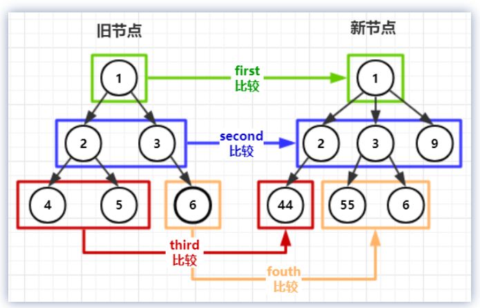
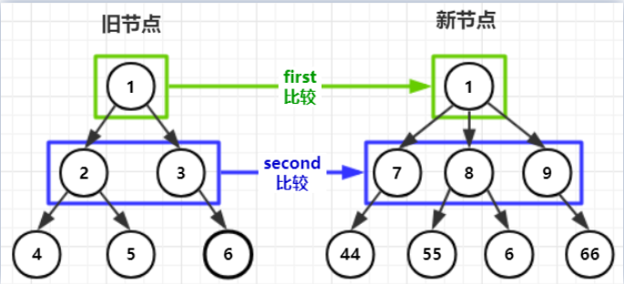

### Diff作用

减少DOM更新量，找到最小差异（打patch），只更新DOM差异部分

VNode

```html
<div class="parent" style="height:0" href="2222">
    111111
</div>

{    
  tag: 'div',    
  data: {        
    attrs: {
			href:"2222"
		},
    staticClass: "parent",        
    staticStyle: {            
      height: "0"
    }
  },    
  children: [{        
    tag: undefined,        
    text: "111111"
  }]
}
```

### 怎么做

- 只对比同层节点（也就是对比新旧节点中父节点是相同节点的子节点）

  



### 比较逻辑

1. 能不移动，尽量不移动

2. 没得办法，只好移动

3. 实在不行，新建或删除

   

#### 比较处理流程

1. 先找到不需要移动的相同节点，消耗最小
2. 再找相同但是需要移动的节点，消耗第二小
3. 最后找不到，才会去新建删除节点，保底处理
4. createPatchFunction -> patchVnode -> updateChildren
   1. 头头(newStartIdx++，oldStartIdx++) -> 尾尾(newStartIdx--，oldStartIdx--) -> 旧头、新尾 (newEndIdx--，oldStartIdx++), 放到oldEndVnode的后面 -> 旧尾、新头(oldEndIdx--，newStartIdx++, 放到oldStartVnode的前面)
   2. 单个新子节点在旧子节点数组中查找位置
      1. 生成旧子节点数组以`vnode.key`为key的map
      2. 拿到新子节点数组中一个子项，判断它的key是否在上面的map中，若没有key通过findIdxInOld查
      3. 不存在，则新建DOM
      4. 存在，继续判断是否sameVnode
   3. 新增、删除

代码分析

```javascript
function createPatchFunction() {
	return function patch(oldVnode, vnode, parentElm, refElm) {
		// 没有旧节点，直接生成新节点
		if (!oldVnode) {
			createElm(vnode, parentElm, refElm)
		} else {
			// 且是一样 Vnode（不包括其子节点）
			if (sameVnode(oldVnode, vnode)) {
				// 比较存在的根节点
				patchVnode(oldVnode, vnode)
			} else {
				// 替换存在的元素
				var oldElm = oldVnode.elm
				var _parentElm = oldElm.parentNode
				// 创建新节点
				createElm(vnode, _parentElm, oldElm.nextSibling)
				// 销毁旧节点
				if (_parentElm) {
					removeVnodes([oldVnode], 0, 0)
				}
			}
		}
		return vnode.elm
	}
}
```

```javascript
function patchVnode(oldVnode, vnode) {
	if (oldVnode === vnode) return
	var elm = (vnode.elm = oldVnode.elm)
	var oldCh = oldVnode.children
	var ch = vnode.children
	// 更新children
	if (!vnode.text) {
		// 存在 oldCh 和 ch 时
		if (oldCh && ch) {
			if (oldCh !== ch) updateChildren(elm, oldCh, ch)
		}
		// 存在 newCh 时，oldCh 只能是不存在，如果存在，就跳到上面的条件了
		else if (ch) {
			if (oldVnode.text) elm.textContent = ''
			for (var i = 0; i <= ch.length - 1; ++i) {
				createElm(ch[i], elm, null)
			}
		} else if (oldCh) {
			for (var i = 0; i <= oldCh.length - 1; ++i) {
				oldCh[i].parentNode.removeChild(el)
			}
		} else if (oldVnode.text) {
			elm.textContent = ''
		}
	} else if (oldVnode.text !== vnode.text) {
		elm.textContent = vnode.text
	}
}
```

```javascript
function updateChildren(parentElm, oldCh, newCh) {
	var oldStartIdx = 0
	var oldEndIdx = oldCh.length - 1
	var oldStartVnode = oldCh[0]
	var oldEndVnode = oldCh[oldEndIdx]
	var newStartIdx = 0
	var newEndIdx = newCh.length - 1
	var newStartVnode = newCh[0]
	var newEndVnode = newCh[newEndIdx]
	var oldKeyToIdx, idxInOld, vnodeToMove, refElm
	// 不断地更新 OldIndex 和 OldVnode ，newIndex 和 newVnode
	while (oldStartIdx <= oldEndIdx && newStartIdx <= newEndIdx) {
		if (!oldStartVnode) {
			oldStartVnode = oldCh[++oldStartIdx]
		} else if (!oldEndVnode) {
			oldEndVnode = oldCh[--oldEndIdx]
		}
		//  旧头 和新头 比较
		else if (sameVnode(oldStartVnode, newStartVnode)) {
			patchVnode(oldStartVnode, newStartVnode)
			oldStartVnode = oldCh[++oldStartIdx]
			newStartVnode = newCh[++newStartIdx]
		}
		//  旧尾 和新尾 比较
		else if (sameVnode(oldEndVnode, newEndVnode)) {
			patchVnode(oldEndVnode, newEndVnode)
			oldEndVnode = oldCh[--oldEndIdx]
			newEndVnode = newCh[--newEndIdx]
		}
		// 旧头 和 新尾 比较
		else if (sameVnode(oldStartVnode, newEndVnode)) {
			patchVnode(oldStartVnode, newEndVnode)
			// oldStartVnode 放到 oldEndVnode 后面，还要找到 oldEndValue 后面的节点
			parentElm.insertBefore(oldStartVnode.elm, oldEndVnode.elm.nextSibling)
			oldStartVnode = oldCh[++oldStartIdx]
			newEndVnode = newCh[--newEndIdx]
		}
		//  旧尾 和新头 比较
		else if (sameVnode(oldEndVnode, newStartVnode)) {
			patchVnode(oldEndVnode, newStartVnode)
			// oldEndVnode 放到 oldStartVnode 前面
			parentElm.insertBefore(oldEndVnode.elm, oldStartVnode.elm)
			oldEndVnode = oldCh[--oldEndIdx]
			newStartVnode = newCh[++newStartIdx]
		}
		// 单个新子节点 在 旧子节点数组中 查找位置
		else {
			// oldKeyToIdx 是一个 把 Vnode 的 key 和 index 转换的 map
			if (!oldKeyToIdx) {
				oldKeyToIdx = createKeyToOldIdx(oldCh, oldStartIdx, oldEndIdx)
			}
			// 使用 newStartVnode 去 OldMap 中寻找 相同节点，默认key存在
			idxInOld = oldKeyToIdx[newStartVnode.key]
			//  新孩子中，存在一个新节点，老节点中没有，需要新建
			if (!idxInOld) {
				//  把  newStartVnode 插入 oldStartVnode 的前面
				createElm(
					newStartVnode,
					parentElm,
					oldStartVnode.elm
				)
			} else {
				//  找到 oldCh 中 和 newStartVnode 一样的节点
				vnodeToMove = oldCh[idxInOld]
				if (sameVnode(vnodeToMove, newStartVnode)) {
					patchVnode(vnodeToMove, newStartVnode)
					// 删除这个 index
					oldCh[idxInOld] = undefined
					// 把 vnodeToMove 移动到  oldStartVnode 前面
					parentElm.insertBefore(
						vnodeToMove.elm,
						oldStartVnode.elm
					)
				}
				// 只能创建一个新节点插入到 parentElm 的子节点中
				else {
					// same key but different element. treat as new element
					createElm(newStartVnode, parentElm, oldStartVnode.elm)
				}
			}
			// 这个新子节点更新完毕，更新 newStartIdx，开始比较下一个
			newStartVnode = newCh[++newStartIdx]
		}
	}
	// 处理剩下的节点
	if (oldStartIdx > oldEndIdx) {
		var newEnd = newCh[newEndIdx + 1]
		refElm = newEnd ? newEnd.elm : null
		for (; newStartIdx <= newEndIdx; ++newStartIdx) {
			createElm(newCh[newStartIdx], parentElm, refElm)
		}
	}
	// 说明新节点比对完了，老节点可能还有，需要删除剩余的老节点
	else if (newStartIdx > newEndIdx) {
		for (; oldStartIdx <= oldEndIdx; ++oldStartIdx) {
			oldCh[oldStartIdx].parentNode.removeChild(el)
		}
	}
}
```

