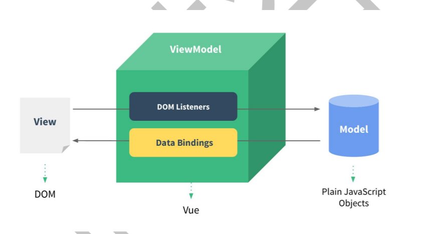

### 渐进式

可以渐渐地用Vue,而React几乎做不到这一点

动态构建用户界面

1. 可以继续操作DOM(作死)
2. 可以很方便地做SEO
3. 可以局部做单页面
4. 也可以整体做单页面

### MVVM



### 插值表达式(仅支持单一表达式)

  - `{{ number + 1 }}`
  - `{{ obj.name }}`
  - `{{ ok ? 'YES' : 'NO' }}`
  - `{{ message.split('').reverse().join('') }}`
  - `{{ formatDate(date) }}`

### Vue 属性

- el

- template --> render

- data

  - 如何触发data的更新
    1. 响应式
    2. 模板使用到

- methods

- components(global / local)

    - 全局命名不能重复

- watch -> single data
    - 深层

    - 即时

    - 回调触发时机

    - 停止

    - this.$watch

      ```javascript
      //可以直接写methods里的方法名字符串
      watch: {
        currentBranch: 'fetchData'
      }
      //其他属性
      watch: {
        username: {
          immediate: true,
      		deep: true
          handler: 'getUserInfo'
        }
      }
      ```

- ==computed -> multiple data==

    - 不要在计算属性中做异步请求或者更改DOM
    - VS watch
      - `computed`是计算一个新属性,并将该属性挂载到`vm`上,而`watch`是监听已经存在且已挂载到`vm`上的属性, 计算属性不需要在 data 里面提前定义,所以用`watch`同样可以监听`computed`计算属性的变化(其它还有 `data`、`props`)
      - `computed`本质是一个惰性求值的观察者,具有缓存性,只有当依赖变化后,第一次访问`computed`属性,才会计算新的值,而`watch`则是当数据发生变化便会调用执行函数
      - 从使用场景上说,`computed`适用一个数据被多个数据影响,而`watch`适用一个数据影响多个数据,`watch`适合异步或开销大的场景
    - VS method
      - `methods`没有缓存
      - `computed`不可传参,`methods`可以
      - `getter` 、`setter`

- ==class==

    - `<p :class="{ active: isActive, 'text-danger': hasError }">字符串</p>`
    - `<p :class="classObject">对象</p>`
    - `<p :class="['bClass', 'cClass']">数组</p>`
    - `<div :class="[isActive ? activeClass : '', errorClass]">三目</div>`
    - `<div :class="[{ active: isActive }, errorClass]">混合</div>`

- ==style==

    - `<p :style="{ color: activeColor, fontSize: fontSize + 'px' }">字符串</p>`
    - `<div :style="{ 'font-size': fontSize + 'px' }">字符串</div>`
    - `<p :style="styleObject">对象</p>`
    - `<p :style="[baseStyles, overridingStyles]">数组</p>`
    - `<div :style="{ display: ['-webkit-box', '-ms-flexbox', 'flex'] }"></div>`

- filters

  - global filter、local filter
  - `{{ message | filter }}`
  - `<div v-bind="msg | filter"></div>`


### Vue 实例属性

- $el、$options、$data

- $attrs(class 和 style 除外)、$listeners( (不含 .native 修饰符) 的v-on 事件监听器)

  ```vue
  <!-- 想要所有像 class 和 v-on 监听器这样的透传 attribute 都应用在内部的 <button> 上而不是外层的 <div> 上。通过设定 inheritAttrs: false 和使用 v-bind="$attrs" 来实现：  -->
  <div class="btn-wrapper">
    <button class="btn" v-bind="$attrs">click me</button>
  </div>
  ```

- $root、$parent、$children

- $refs

  ```vue
  <script>
  export default {
    mounted() {
      this.$refs.input.focus()
    }
  }
  </script>
  
  <template>
    <!-- ref代表的是子组件实例 -->
    <input ref="input" />
  </template>
  ```

- expose

  ```javascript
  export default {
    expose: ['publicData', 'publicMethod'],
    data() {
      return {
        publicData: 'foo',
        privateData: 'bar'
      }
    },
    methods: {
      publicMethod() {
        /* ... */
      },
      privateMethod() {
        /* ... */
      }
    }
  }
  ```

- DOM更新时机

  ```javascript
  import { nextTick } from 'vue'
  
  export default {
    methods: {
      increment() {
        this.count++
        //适用场景
        //1. 在`mounted`生命周期执行DOM操作
  		  //2. 在数据变化后需要进行基于DOM结构的操作
        nextTick(() => {
          // 访问更新后的 DOM
        })
      }
    }
  }
  ```

### directive

- v-once、v-cloak

  ```html
  <!-- 如果没有彻底解决问题，则在根元素加上style="display: none;" :style="{display: 'block'}" -->
  <!-- 解决闪屏 -->
  [v-cloak] {
    display: none;
  }
  ```

- v-model

  - 原生展开 ： `<input :value="val" @input="val=$event.target.value" />`
  - 自定义组件展开： `<CustomInput :modelValue="searchText"  @update:modelValue="newValue => searchText = newValue" />`

    ```javascript
    <!-- 为了使组件正常工作 -->
    <!-- 方式一：CustomInput.vue -->
    <script>
    export default {
      props: ['modelValue'],
      emits: ['update:modelValue']
    }
    </script>
    
    <template>
      <input
        :value="modelValue"
        @input="$emit('update:modelValue', $event.target.value)"
      />
    </template>
    
    <!-- 方式二：CustomInput.vue -->
    <script>
    export default {
      props: ['modelValue'],
      emits: ['update:modelValue'],
      computed: {
        value: {
          get() {
            return this.modelValue
          },
          set(value) {
            this.$emit('update:modelValue', value)
          }
        }
      }
    }
    </script>
    
    <template>
      <input v-model="value" />
    </template>
    
    //定义别名Vue2
    <MyComponent v-model:title="bookTitle" />
    
    Vue.component('base-checkbox', {
      model: {
        prop: 'checked',
        event: 'change'
      },
      props: {
        checked: Boolean
      },
      template: `
        <input
          type="checkbox"
          v-bind:checked="checked"
          v-on:change="$emit('change', $event.target.checked)"
        >
      `
    })
    ```

- v-for、v-else、v-else-if、v-show、v-if

- ==v-if > v-for==

  ```vue
  <!-- 抛出一个错误，因为属性 todo 此时没有在该实例上定义-->
  <li v-for="todo in todos" v-if="!todo.isComplete">
    {{ todo.name }}
  </li>
  
  <!-- 方式一 外套一层 -->
  <template v-for="todo in todos">
    <li v-if="!todo.isComplete">
      {{ todo.name }}
    </li>
  </template>
  
  <!-- 方式二 使用计算属性 -->
  ```

- v-text、v-html

- v-slot、v-pre

- ==v-bind ==> :==

- ==v-on ==> @==

  - 在内联事件处理器中访问事件参数

    ```vue
    <!-- 使用特殊的 $event 变量 -->
    <button @click="warn('Form cannot be submitted yet.', $event)">
      Submit
    </button>
    
    <!-- 使用内联箭头函数 -->
    <button @click="(event) => warn('Form cannot be submitted yet.', event)">
      Submit
    </button>
    ```

  - 事件修饰符`stop、prevent、self`

    ```vue
    <!-- 单击事件将停止传递 -->
    <a @click.stop="doThis"></a>
    <!-- 提交事件将不再重新加载页面 -->
    <form @submit.prevent="onSubmit"></form>
    <a @click.stop.prevent="doThat"></a>
    <form @submit.prevent></form>
    <!-- 仅当 event.target 是元素本身时才会触发事件处理器 -->
    <!-- 例如：事件处理器不来自子元素 -->
    <div @click.self="doThat">...</div>
    ```

  - `once、capture、passive`与[原生 `addEventListener` 事件相对应

    ```vue
    <!-- 添加事件监听器时，使用 `capture` 捕获模式 -->
    <!-- 例如：指向内部元素的事件，在被内部元素处理前，先被外部处理 -->
    <div @click.capture="doThis">...</div>
    
    <!-- 点击事件最多被触发一次 -->
    <a @click.once="doThis"></a>
    
    <!-- 滚动事件的默认行为 (scrolling) 将立即发生而非等待 `onScroll` 完成 -->
    <!-- 以防其中包含 `event.preventDefault()` -->
    <div @scroll.passive="onScroll">...</div>
    ```

  - 按键修饰符`enter、tab、delete、esc、space、up、down、left、right`

    ```vue
    <input @keyup.enter="submit" />
    <input @keyup.page-down="onPageDown" />
    ```

  - 系统按键修饰符`ctrl、alt、shift、exact、meta`

    ```vue
    <!-- Alt + Enter -->
    <input @keyup.alt.enter="clear" />
    
    <!-- Ctrl + 点击 -->
    <div @click.ctrl="doSomething">Do something</div>
    
    <!-- 当按下 Ctrl 时，即使同时按下 Alt 或 Shift 也会触发 -->
    <button @click.ctrl="onClick">A</button>
    
    <!-- 仅当按下 Ctrl 且未按任何其他键时才会触发 -->
    <button @click.ctrl.exact="onCtrlClick">A</button>
    
    <!-- 仅当没有按下任何系统按键时触发 -->
    <button @click.exact="onClick">A</button>
    ```

  - 鼠标修饰符`left、right、middle`

  - 自定义事件

- ==自定义指令==（只有当所需功能只能通过直接的 DOM 操作来实现时，才应该使用自定义指令。其他情况下应该尽可能地使用 `v-bind` 这样的内置指令来声明式地使用模板，这样更高效，也对服务端渲染更友好）

  - hooks
    - bind 指令第一次绑定到元素时调用，只执行一次，可用于一次性初始化设置
    - inserted 元素插入父节点时调用
    - update 所有 VNode 更新时调用，可能发生在子 VNode 之前
    - componentUpdated 指令所在组件在 VNode 和其子 VNode 更新后调用
    - unbind 指令与元素解绑时调用
  - 参数
    - `el` 指令绑定元素，可操作 DOM
    - `binding` 指令描述对象
      - `value`：传递给指令的值。例如在 `v-my-directive="1 + 1"` 中，值是 `2`
      - `oldValue`：之前的值，仅在 `beforeUpdate` 和 `updated` 中可用。无论值是否更改，它都可用
      - `arg`：传递给指令的参数 (如果有的话)。例如在 `v-my-directive:foo` 中，参数是 `"foo"`
      - `modifiers`：一个包含修饰符的对象 (如果有的话)。例如在 `v-my-directive.foo.bar` 中，修饰符对象是 `{ foo: true, bar: true }`
      - `instance`：使用该指令的组件实例
      - `dir`：指令的定义对象
    - `vnode` 代表绑定元素的底层 VNode
    - `prevNode`：之前的渲染中代表指令所绑定元素的 VNode。仅在 `beforeUpdate` 和 `updated` 钩子中可用

- ==表单输入绑定==

  - 

  - 基础用法

    ```javascript
    <input type='checkbox' v-model="name" true-value="xxx" false-value="yyy">
    ```

  - 值绑定

  - 表单事件修饰符`v-model:lazy、v-model:number、v-model:trim`

  - 自定义model

    ```javascript
    model: {
      prop: "phoneInfo", // 默认 value
      event: "change" // 默认 input
    },
    props: {
      phoneInfo: Object,
      zipCode: String
    }
    
    <PersonalInfo v-model="phoneInfo" :zip-code.sync="zipCode" />
    
    <PersonalInfo
        :phone-info="phoneInfo"
        :zip-code="zipCode"
        @change="val => (phoneInfo = val)"
        @update:zipCode="val => (zipCode = val)"
    />
    ```

### 组件(global / local)

- 属性
  - 传递props
    
    - 单向数据流
    
    - props初始化先于data,可挂载到子实例data上
    
    - 校验(null和undefined会通过任何类型验证)
    
      ```javascript
      props: {
      	//null和undefined会通过任何类型验证
      	propA: Number,
      	propB: [String, Number],
      	propC: {
      		type: String,
      		required: true
      	},
      	propD: {
      		type: Number,
      		default: 100
      	},
      	propE: {
      		type: Object,
      		// 对象或数组默认值必须从一个工厂函数获取
      		default: function () {
      			return { message: 'hello' }
      		}
      	},
      	propF: {
      		validator: function (value) {
      			return ['success', 'warning', 'danger'].indexOf(value) !== -1
      		}
      	},
          propG: {
      		type: Array,
               default: () => [] 
      	}
      }
      
      
      //对于多类型场景
      <template>
        <button :style="computedWidth">{{ computedWidth }}</button>
      </template>
      
      <script>
        export default {
          props: {
            width: [String, Number]
          },
          computed: {
            computedWidth () {
              let o = {}
              if (typeof this.width === 'string') o.width = this.width
              if (typeof this.width === 'number') o.width = this.width + 'px'
              return o
            }
          }
        }
      </script>
      ```
    
  - 原生属性自动挂载到组件根元素上，可设置`inheritAttrs = false`不继承
  
  - Non-props
  
    ```javascript
    //parent
    <Child style="color:red" :msg="msg">
      
    //Child
    //当子组件有父节点的时候，non-props才会挂载到子组件根节点，否则不挂
    //通过如下方式挂载到平级的某个节点上
    <div v-bind="$attrs">Hello world</div>
    <div>Hello world2</div>
    
    //只挂载style
    <div v-bind:style="$attrs.style">Hello world</div>
    <div>Hello world2</div>
    
    //业务逻辑上只使用msg
    mounted() {
      console.log(this.$attrs.msg)
    }
    ```
    
  - .sync
  
    ```vue
    //子组件
    this.$emit('update:title', newTitle)
    
    //父组件
    <text-document
      v-bind:title="doc.title"
      v-on:update:title="doc.title = $event"
    ></text-document>
    
    //to
    <text-document v-bind:title.sync="doc.title"></text-document>`
    ```
  
  - 特殊属性 `class / style / ref / key`
  
- 事件
  - 事件修饰符，应用于原生html元素

  - 普通事件

    ```vue
    <!-- 父组件 -->
    <BlogPost
      ...
      @enlarge-text="postFontSize += 0.1"
     />
    
    <!-- 子组件 -->
    <template>
      <div class="blog-post">
        <h4>{{ title }}</h4>
        <button @click="$emit('enlarge-text')">Enlarge text</button>
      </div>
    </template>
    ```

  - emits

    ```javascript
    <!-- BlogPost.vue -->
    <script>
    export default {
      props: ['title'],
      emits: ['enlarge-text']
    }
    </script>
    
    
    //emits校验
    export default {
      emits: {
        // 没有校验
        click: null,
         //校验父组件的add方法 <Child @add="xxx">
    		add: (value) => value < 20 ? true : false
        // 校验 submit 事件
        submit: ({ email, password }) => {
          if (email && password) {
            return true
          } else {
            console.warn('Invalid submit event payload!')
            return false
          }
        }
      },
      methods: {
        submitForm(email, password) {
          this.$emit('submit', { email, password })
        }
      }
    }
    ```

### 插槽

- 默认内容

- 具名插槽

  ```vue
  <BaseLayout>
    <template #header>
      <h1>Here might be a page title</h1>
    </template>
  
    <!-- 隐式的默认插槽 -->
    <p>A paragraph for the main content.</p>
    <p>And another one.</p>
  
    <template #footer>
      <p>Here's some contact info</p>
    </template>
  </BaseLayout>
  ```

- 作用域插槽(父组件需要访问子组件data的时候)

  - 默认插槽

    ```vue
    <!-- <MyComponent> 的模板 -->
    <div>
      <slot :text="greetingMessage" :count="1"></slot>
    </div>
    
    <MyComponent v-slot="{ text, count }">
      {{ text }} {{ count }}
    </MyComponent>
    ```

  - 具名插槽

    ```vue
    <!-- <MyComponent> 的模板 -->
    <slot name="header" message="hello"></slot>
    
    <MyComponent>
      <template #header="headerProps">
        {{ headerProps }}
      </template>
    
      <template #default="defaultProps">
        {{ defaultProps }}
      </template>
    
      <template #footer="footerProps">
        {{ footerProps }}
      </template>
    </MyComponent>
    ```
  
- 动态组件

  ```javascript
  <keep-alive>
    <component :is="showComponent" />
  </keep-alive>
  ```

- 异步组件

  ```javascript
  app.component('async-component', Vue.defineAsyncComponent(
  	() => {
      return new Promise((resolve, reject) => {
        setTimeout(() => {
          resolve({
            template: `<div>这是一个异步组件</div>`
          })
        })
      })
    }
  ))
  ```


### 生命周期

- `beforeCreate/created、beforeMount/mounted、beforeUpdate/updated、beforeDestroyed/destroyed、errorCaptured`

  

- `activated/deactivated、errorCaptured`

### Vue优化

- 编码阶段
  - 尽量减少data中的数据，data中的数据都会增加getter和setter，会收集对应的watcher
  - v-if和v-for不能连用
  - 若需要使用v-for给每项元素绑定事件时使用事件代理
  - key保证唯一
  - 使用路由懒加载、异步组件
  - SPA页面采用keep-alive缓存组件
  - 第三方模块按需导入
  - 长列表滚动到可视区域动态加载
  - 图片懒加载
- SEO优化
  - 预渲染
  - 服务端渲染SSR
- 打包优化
  - 压缩代码
  - Tree Shaking/Scope Hoisting
  - 使用CDN加载第三方模块
  - 多线程打包happypack
  - splitChunks抽离公共文件
  - sourceMap优化
- 用户体验
  - 骨架屏
  - PWA
  - 还可以使用缓存(客户端缓存、服务端缓存)优化、服务端开启gzip压缩等
