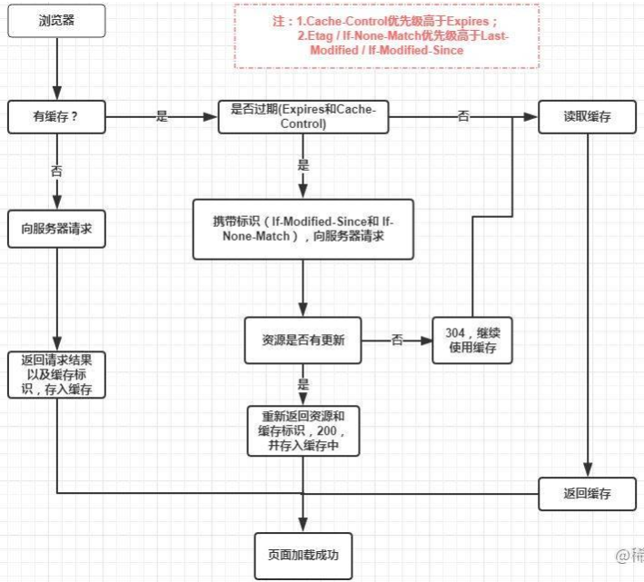
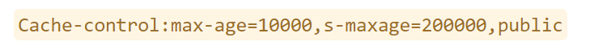
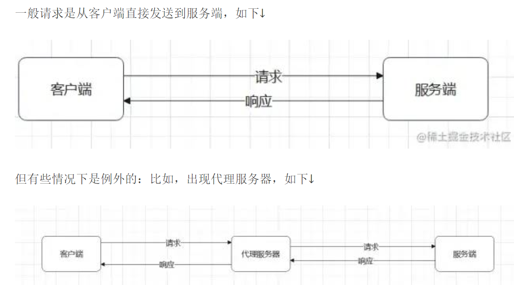
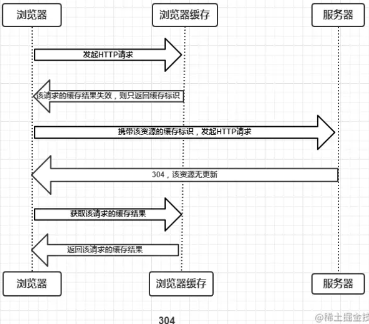
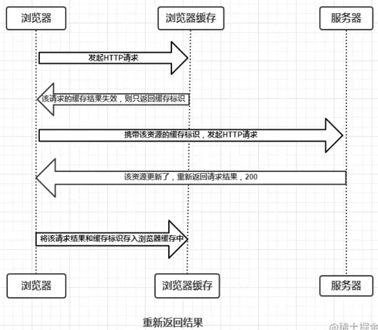
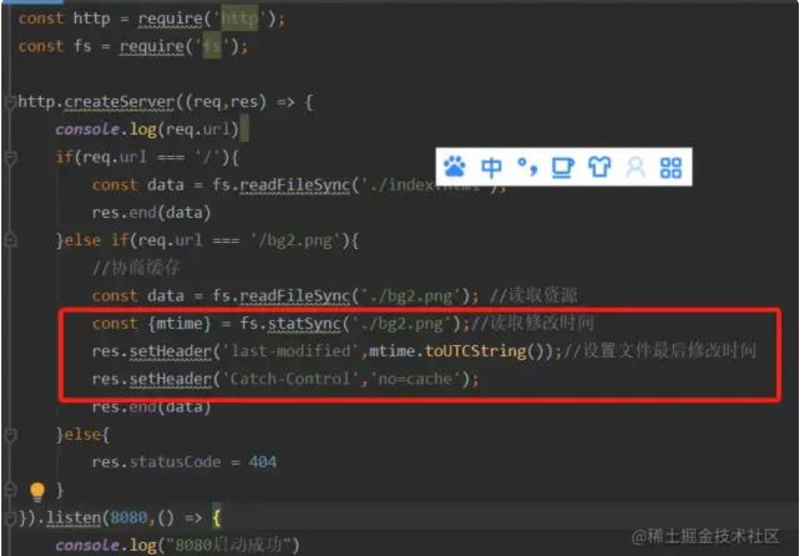

### 分类

web缓存

- 浏览器缓存
  - localStorage
  - sessionStorage
  - cookie
- http缓存

### http流程

1. 第一次访问界面,请求服务器,然后服务器应答,浏览器会根据`response Header`判断是否对资源进行缓存,若有代表缓存的字段,浏览器就会把资源缓存在`memory cache`或`disk cache`中

2. 第二次请求,浏览器会判断请求参数，若符合强缓存条件就直接返回状态码`200`，从本地缓存中拿数据。否则把上次响应参数存在 `request header`请求头中，浏览器携带缓存标识向服务器发送请求,由服务器根据缓存标识来决定是否符合协商缓存，符合则返回状态码`304`，不符合则服务器会返回全新的资源

   

### 强制缓存(响应头)

- `Expires: Fri, 04 Jan 2019 12:00:00 GMT` 绝对时间

  - 弊端：使用本地时间来判断

- `Cache-Control: max-age=86400` 相对时间，上面的完全替代方案

  

  - no-store:不使用缓存

  - no-cache:浏览器缓存资源，强制进行协商缓存

    - no-cache和no-store是一组互斥属性

  - private:资源只有浏览器可以缓存

  - public:资源浏览器和代理服务器都可以缓存

    - public和private也是一组互斥属性

  - max-age:浏览器缓存保质期,单位秒

  - smaxage:代理服务器缓存保质期,单位秒

    

- 问题：该缓存方式优先级高,若在过期时间内缓存的资源在服务器上更新了,客服端不能及时获取最新的资源

### 协商缓存

- 协商缓存生效，返回304

- 协商缓存失效，返回200

  

- Last-Modified(响应头,返回该资源文件在服务器最后被修改的时间) & If-Modified-Since(请求头)
  
  - 弊端(基于时间进行判断)
    1. 若资源更新速度是秒以下单位，则该缓存无法使用，因其时间最低精确到秒
    2. 若文件是通过服务器动态生成的，那么该方法的更新时间永远是服务器文件生成的时间，尽管文件可能没有变化，所以起不到缓存的作用
    3. 文件内容没改但最后修改时间却变了
    4. 某些服务器不能精确的得到文件的最后修改时间
  
- ETag(响应头,返回当前资源文件的一个唯一标识(由服务器生成)) & If-None-Match(请求头)，上面的补充方案

  - 弊端
    - ETag需要计算文件指纹这样意味着，服务端需要更多的计算开销。若文件尺寸大，数量多，并且计算频繁，那么ETag的计算就会影响服务器的性能。显然，ETag在这样的场景下就不是很适合
    - ETag有**强验证**和**弱验证**，所谓将强验证，ETag生成的哈希码深入到每个字节。哪怕文件中只有一个字节改变了，也会生成不同的哈希值，它可以保证文件内容绝对的不变。但是，强验证非常消耗计算量。ETag还有一个弱验证，弱验证是提取文件的部分属性来生成哈希值。因为不必精确到每个字节，所以他的整体速度会比强验证快，但是准确率不高，会降低协商缓存的有效性

#### 基于last-modified的协商缓存实现方式

1. 首先需要在服务器端读出文件修改时间
2. 将读出来的修改时间赋给响应头的`last-modified`字段
3. 最后设置`Cache-control:no-cache`

### 优先级

- 强制 > 协商
- Pragma > Cache-Control > Expires > ETag & If-None-Match > Last-Modified & If-Modified-Since

### 如何设置缓存

- 有哈希值的文件设置强缓存即可。没有哈希值的文件（如index.html）设置协商缓存
- HTML: 协商缓存
- css、js、图片：强缓存，文件名带上hash
- 所有带304的资源都是协商缓存，所有标注（从内存中读取/从磁盘中读取）的资源都是强缓存

### 刷新对于强缓存和协商缓存的影响

- 当Ctrl+F5强制刷新网页时，直接从服务器加载，跳过强缓存和协商缓存
- 当F5刷新网页时，跳过强缓存，但是会走协商缓存
- 浏览器地址栏中写入URL回车，浏览器发现缓存中有这个文件，直接去缓存拿（最快）

