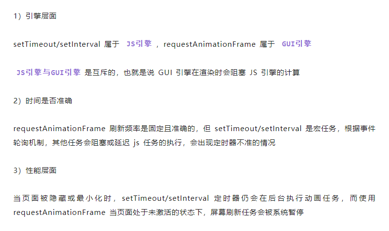
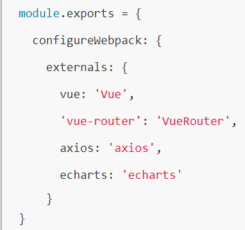
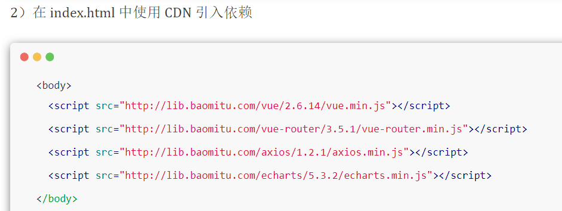

### 宗旨

#### 尽量减少 Http 请求数

- 资源合并
- 接口合并
- 有效利用缓存
  - 浏览器缓存
  - 接口缓存?
- 图片
  - 雪碧图
  - 懒加载


#### 尽量减少请求内容的大小(html、css、js、image)

- 代码、文件压缩
- 传输时开启gzip
- 打包tree-shaking
- 代码拆分
- 第三方组件按需引入、按需加载
- 懒加载(路由、图片、组件)
  - 该页面的 JS 文件体积大，导致页面打开慢，可以通过组件懒加载进行资源拆分，利用浏览器并行下载资源，提升下载速度（比如首页）
  - 该组件不是一进入页面就展示，需要一定条件下才触发（比如弹框组件）
  - 该组件复用性高，很多页面都有引入，利用组件懒加载抽离出该组件，一方面可以很好利用缓存，同时也可以减少页面的 JS 文件大小（比如表格组件、图形组件等）

- 服务器分片
  - CDN
  - 图片
    - 压缩、选择合适的文件格式
    - 内联体积小(<5KB)的图片，图片转 base64 格式
    - iconfont
    - cdn、图片服务器
    - 渐进式图片
    - 动态裁剪
    - 预加载
  - 浏览器在同一时刻向同一个域名请求文件的并行下载数是有限的,因此可以利用多个域名的主机来存放不同的静态资源,增大页面加载时资源的并行下载数,缩短页面资源加载的时间。通常根据多个域名来分别存储 JavaScript、CSS 和图片文件

### 其他分类

#### 骨架屏

#### Web Worker 优化长任务

#### requestAnimationFrame 制作动画



#### JS加载

- async   无序，下载完就执行
- defer  有序， 资源会在  `DOMContentLoaded` 执行之前
- module `<script type="module">import { a } from './a.js'</script>` 行为同defer
- preload  `<link rel="preload" as="script" href="index.js">`
  - 加载的资源是在浏览器渲染机制之前进行处理的，并且不会阻塞 onload 事件
  - JS脚本其加载和执行的过程是分离的，即 preload 会预加载相应的脚本代码，待到需要时自行调用

- prefetch `<link rel="prefetch" as="script" href="index.js">`
  - 加载的资源可以获取非当前页面所需要的资源，并且将其放入缓存至少 5 分钟（无论资源是否可以缓存）
  - 当页面跳转时，未完成的 prefetch 请求不会被中断


#### 打包阶段

- 优化搜索文件

  - 缩小文件搜索范围
    - resolve.alias、resolve.extension、resolve.modules

  - 对匹配的文件进行分析、转化
    - module.noParse

- DllPlugin 避免重复编译第三方库，第三方库单独打包到一个文件中，这个文件就是一个单纯的依赖库，这个依赖库不会跟着业务代码一起被重新打包，只有当依赖自身发生变化时才会重新打包

- tree-shaking

- ### speed-measure-webpack-plugin

- ### cache-loader

- ### HappyPack 多线程打包

- ### webpack-parallel-uglify-plugin 多进程压缩

- 分离第三方库externals（缺点不支持组件按需加载，没有tree-shaking）

- Gzip压缩

  

  

  - 组件库按需引入（elementUI、momentjs）


#### 上线阶段

- ### webpack-bundle-analyzer

  ```javascript
  // webpack.config.js
  const BundleAnalyzerPlugin = require('webpack-bundle-analyzer').BundleAnalyzerPlugin
  plugins: [
      new BundleAnalyzerPlugin({
        analyzerMode: 'disabled', // 不启动展示打包报告的http服务器
        generateStatsFile: true, // 是否生成stats.json文件
      })
  ]

  // package.json
  "generateAnalyzeFile": "webpack --config build/webpack.dev.conf.js --profile --json > stats.json", // 生成分析文件
  "analyze": "webpack-bundle-analyzer --port 8888 ./stats.json" // 启动展示打包报告的http服务器
  ```

- 合并相同的包

#### 提升传输速度

- 加载的优先级,区别核心内容和增强体验的内容
- 首屏
- 核心功能
- 并行数量的控制
- 使用更高版本的 HTTP 协议。HTTP/2，HTTP/3
- 提升服务器端的响应速度
- 分片(浏览器在同一时刻向同一个域名请求文件的并行下载数是有限的,因此可以利用多个域名的主机来存放不同的静态资源,增大页面加载时资源的并行下载数,缩短页面资源加载的时间。通常根据多个域名来分别存储 JavaScript、CSS 和图片文件)

#### 运行时性能

- 渲染优化
  - 防止阻塞渲染(CSS放在首部、JS放底部、defer、async)
  - 复杂的动画，用绝对定位来脱离文档流来减少重绘
  - 减少重绘和回流
  - 组件缓存
  - 减少更新 DOM 的数量 -> Visual DOM
  - 减少 DOM 的数量
- CSS 的优化
  - 右侧指定性强的
  - 减少层级
  - 选择器的优化
- 计算优化
