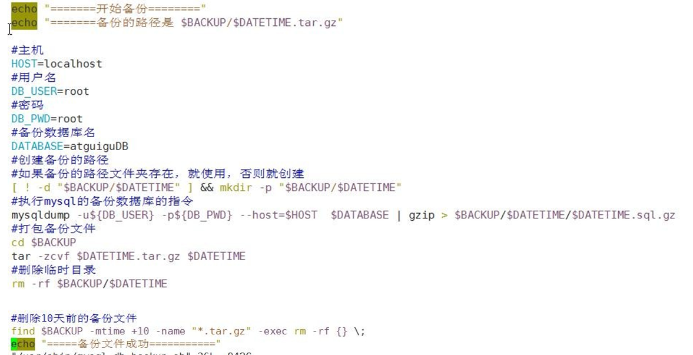
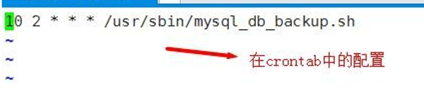

### Shell

Shell 是一个命令行解释器,它为用户提供了一个向 Linux 内核发送请求以便运行程序的界面系统级程序,用户可以用 Shell 来启动、挂起、停止甚至是编写一些程序

### 执行方式
1. #!/bin/bash开头
2. 脚本需要有可执行权限 或 sh ./myShell.sh(不推荐)

### 注释
```bash
# comments
# 多行注释
:<<!
e21e1e1
13213131
!
```
### 变量(系统变量、用户变量)
- \$HOME、\$PATH、\$PWD、\$USER、\$SHELL等
- 变量=值
- set //显示所有变量

#### 变量命名规则
1. 变量名称可以由字母、数字和下划线组成,但是不能以数字开头。
2. 等号两侧不能有空格
3. 变量名称一般习惯为大写

```bash
echo "PATH=$PATH"
A=100
echo "A=$A"
unset A
echo "A=$A"
readonly B=99 #静态变量不能unset

C = `ls -al`  #命令结果赋值
D = $(ls -al)
```

#### 位置参数变量
- \$n  n为数字 $0命令本身 \$1-\$9, 十以上大括号包含\${10}
- \$*  所有参数
- \$@  所有参数,用于遍历
- \$#  参数个数

```bash
echo "$0 $1 $2"
echo "$*"
echo "$@"
echo "$#"
```

#### 预定义变量
- \$$  进程ID
- \$!  后台运行的最后进程号
- \$?  最后一次执行命令的返回状态,0正确执行,非0执行不正确

### 运算符
- \$((运算式)) or $[运算式]
- expr m + n (- \\* / %)
```bash
RESULT1=$(((2+3)×4))
RESULT2=$[(2+3)×4]  #推荐

TEMP=`expr 2 + 3`
RESULT3=`expr $TEMP \* 4`

SUM=$[$1+$2]
```

### 条件判断
1. 两个整数比较(= -lt -le -eq -gt -ge -ne)
2. 按照文件权限(-r可读权限 -w可写权限 -x执行权限)
3. 按照文件类型(-f存在并是常规文件 -e文件存在 -d存在并是目录)

```bash
if [ "ok" = "ok" ]
then
    echo "equal"
fi

if [ 23 -gt 22 ]
then
    echo "dayu"
fi

if [ -e /root/shell/aaa.txt ]
then
    echo "existing"
fi
```

### 流程控制
#### if
```bash
if [$1 -ge 60 ]
then
    echo "xxx"
elif [$1 -lt 60 ]
then
    echo "yyy"
fi
```
#### case
```bash
case $1 in
"1")
    echo "1"
;;
"2")
    echo "2"
;;
*)
    echo "other"
;;
esac
```

#### for
```bash
for i in "$*"
do
    echo "$i"
done

for j in "$@"
do
    echo "$j"
done
```

```bash
SUM=0
for((i=1;i<=100;i++))
do
    SUM=$[$SUM+$i]
done
echo "sum=$SUM"
```
#### while
```bash
SUM=0
i=0
while [ $i -le $1 ]
do
    SUM=$[$SUM+$i]
    i=$[$1+1]
done
echo "sum=$SUM"

```

#### 控制台输入
```bash
read -p "请输入n=" NUM1

read -t 10 -p "请输入n=" NUM1
```

### function
#### 系统函数
`basename /home/aaa/test.txt`

`basename /home/aaa/test.txt .txt`

`dirname /home/aaa/test.txt`

#### 自定义
```bash
function getSum(){
    SUM=$[$n1+$n2]
    echo "$SUM"
}
```
#### 实例


