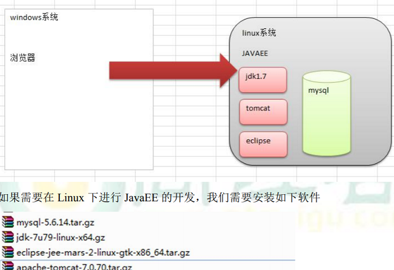

### required


### env setting

Mac下环境变量的加载顺序为

```bash
# /etc/profile和/etc/paths 这俩是系统级别的，在系统启动就会加载，后面的是用户级别的，一般首次配置环境变量，会新建.bash_profile文件，在里面进行PATH的配置，当系统读取到了.bash_profile文件后就终止读取了，如果没有找到这个文件就会继续向下读取
/etc/profile
/etc/paths
~/.bash_profile
~/.bash_login
~/.profile
~/.bashrc
```

sudo vi ~/.bash_profile 没有就新建

```bash
# Mac下环境变量用':'分隔
export JAVA_HOME="/Library/Java/JavaVirtualMachines/jdk-1.8.0_221.jdk/Contents/Home"

export MAVEN_HOME=/自定义maven路径/apache-maven-3.6.1

export PATH=$JAVA_HOME/bin:$PATH

export PATH=$MAVEN_HOME/bin:$PATH
```

### JDK

1. xftp upload to /opt
2. tar -zxvf jdk*
3. vi /etc/profile
```bash
JAVA_HOME=/opt/jdk1.7.0_79
PATH=/opt/jdk1.7.0_79/bin:$PATH
export JAVA_HOME PATH
```
4. source /etc/profile or 注销

### Tomcat
1. xftp upload to /opt
2. tar -zxvf apache-tomcat-*
3. cd apache-tomcat-*/bin
4. ./startup.sh
5. Linux本机访问
6. vi /etc/sysconfig/iptables    //开通8080
7. service iptables restart
8. service iptables status

### Eclipse
1. xftp upload to /opt
2. tar -zxvf eclipse-jee-*

### Mysql(通过源代码安装5.6.14)
1. uninstall existing mysql
```bash
1. rpm -qa | grep mysql //查看是否安装
2. rpm -e mysql_libs
```
2. install mysql
```bash
1. yum -y install make gcc-c++ cmake bison-devel ncurses-devel
2. download mysql
3. tar -zxvf mysql-5.6.14.tar.gz
4. cd mysql-5.6.14
5. cmake -DCMAKE_INSTALL_PREFIX=/usr/local/mysql -DMYSQL_DATADIR=/usr/local/mysql/data -DSYSCONFDIR=/etc -DWITH_MYISAM_STORAGE_ENGINE=1 -DWITH_INNOBASE_STORAGE_ENGINE=1 -DWITH_MEMORY_STORAGE_ENGINE=1 -DWITH_READLINE=1 -DMYSQL_UNIX_ADDR=/var/lib/mysql/mysql.sock -DMYSQL_TCP_PORT=3306 -DENABLED_LOCAL_INFILE=1 -DWITH_PARTITION_STORAGE_ENGINE=1 -DEXTRA_CHARSETS=all -DDEFAULT_CHARSET=utf8 -DDEFAULT_COLLATION=utf8_general_ci
6. make && make install
```
3. config mysql
```bash
1. /etc/passwd and /etc/group  //查看是否存在mysql用户及用户组
2. groupadd mysql and useradd -g mysql mysql
3. chown -R mysql:mysql /usr/local/mysql
4. 进入安装路径初始化配置，执行初始化配置脚本，创建系统自带的数据库和表
cd /usr/local/mysql
scripts/mysql_install_db --basedir=/usr/local/mysql --datadir=/usr/local/mysql/data --user=mysql

注：在启动MySQL服务时，会按照一定次序搜索my.cnf，先在/etc目录下找，找不到则会搜索"$basedir/my.cnf"，在本例中就是 /usr/local/mysql/my.cnf，这是新版MySQL的配置文件的默认位置！

注意：在CentOS 6.8版操作系统的最小安装完成后，在/etc目录下会存在一个my.cnf，需要将此文件更名为其他的名字，如：/etc/my.cnf.bak，否则，该文件会干扰源码安装的MySQL的正确配置，造成无法启动。
修改名称，防止干扰：
mv /etc/my.cnf /etc/my.cnf.bak

启动MySQL
添加服务，拷贝服务脚本到init.d目录，并设置开机启动
cp support-files/mysql.server /etc/init.d/mysql  //在/usr/local/mysql下执行
chkconfig mysql on
service mysql start

执行下面的命令修改root密码
cd /usr/local/mysql/bin
./mysql -u root -p
mysql> SET PASSWORD = PASSWORD('root');
```