CentOS为例
### concept
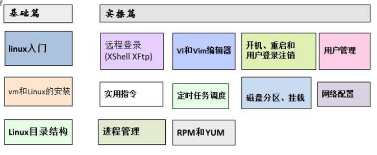

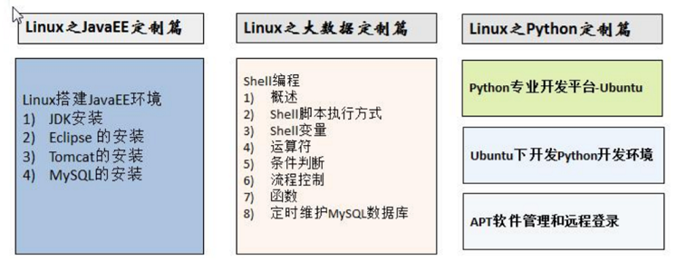

### Linux学习阶段
1. linux环境下的基本操作命令,包括文件操作命令(rm mkdir chmod, chown) 编辑工具使用(vi vim)linux 用户管理(useradd userdel usermod)等
2. linux的各种配置(环境变量配置,网络配置,服务配置)
3. linux下如何搭建对应语言的开发环境(大数据,JavaEE, Python 等)
4. 能编写shell脚本,对Linux服务器进行维护
5. 能进行安全设置,防止攻击,保障服务器正常运行,能对系统调优
6. 深入理解Linux系统(对内核有研究),熟练掌握大型网站应用架构组成、并熟悉各个环节的部署和维护方法

### install vm + CentOS
1. install vm
2. BIOS设置开始虚拟化技术
3. create virtual machine
4. setting virtual machine
   1. ROM  2G+
   2. CPU
   3. Network
    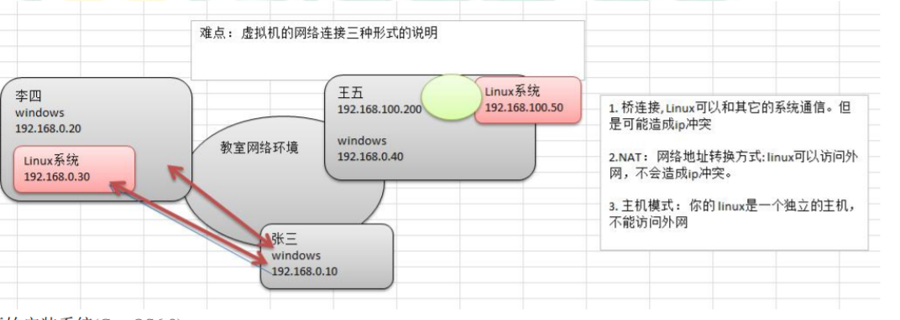
5. install centOS
   1. 分区(至少3个分区)
    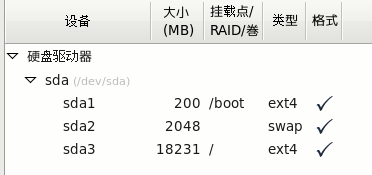


### vmtools
#### requirement
1. 可以直接粘贴命令在windows和centos系统之间
2. 可以设置windows和centos的共享文件夹

#### install vmtools
1. 进入centos
2. 点击vm菜单的->install vmware tools
3. 解压
4. ./vmware-install.pl
5. reboot

#### shared folder
1. window create a folder
2. vm => setting, check always enable,loate to the foler which created by step 1
3. /mnt/hgfs/


### Linux Directory
1. linux的目录中有且只要一个根目录 /
2. linux的各个目录存放的内容是规划好,不用乱放文件
3. linux是以文件的形式管理我们的设备,因此**linux系统一切皆为文件**
4. linux的各个文件目录下存放什么内容
   1. /bin        常用命令，如vi su
   2. /sbin       要具有一定权限才可以使用命令
   3. /home       普通用户相关文件
   4. /root       root用户相关文件
   5. /etc        配置
   6. /boot       启动相关
   7. /media      U盘 光驱
   8. /mnt        挂载别的文件系统
   9. /opt        安装文件
   10. /usr/local  安装目录，相当于windows下的program file
   11. /var        日志、经常修改的东西

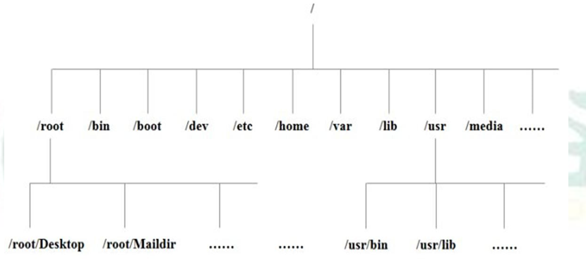

### Xshell + Xftp
#### resolve can not login by password
- change /etc/ssh/sshd_config, set PasswordAuthentication yes
- service sshd restart
#### resolve can not login as root
- change /etc/ssh/sshd_config, set PermitRootLogin yes
- service sshd restart

### command
#### 注销、关机、重启
1. shutdown
   1. shutdown -h now  立即关机
   2. shutdown -h 1    1分后关机
   3. shutdown -r now  立即重启
2. halt(关机)
3. reboot(重启)
> 关机前执行`sync`保存内存中的东西到磁盘

#### 进入桌面
startx

#### 用户
- useradd [选项] username
  - useradd -d /home/test xm
- passwd username
- userdel [选项] username
  - userdel -r username
- su - username
- id username
- whoami
- exit / logout

#### 用户组
- groupadd groupname
- groupdel groupname
- usermod -g groupname username
- /etc/password
- /etc/shadow
- /etc/group

#### 运行级别
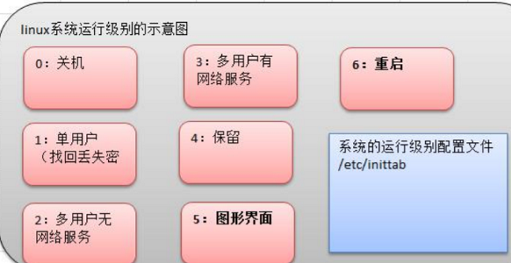
- init [0-5]
- /etc/inittab //修改默认运行级别
> 找回root密码, 开机>引导时输入enter>e>选中第二行输入e>空格+1+enter>b进入单用户模式,然后passwd root

#### 帮助指令
- man ls
- help cd

#### 文件目录
- pwd
- ls -al
- cd
  - cd ~ or cd+空格+enter
  - cd ..
- mkdir
  - mkdir -p /home/dir1/dir2 //多级创建
- rmdir
  - rmdir -rf /xxx/yyy //删除非空目录
- touch filename
  - touch filename1 filename2
- **cp**
  - cp aaa.txt ./test2/
  - cp -r ./test/ ./test2/
  - \cp -r ./test/ ./test2/  //不会有覆盖提示
- rm
  - rm xxx
  - rm -r ./test //删除目录
  - rm -rf xxxx
- mv
  - mv 1.txt 2.txt
  - mv 1.txt ../1.txt
- cat / more / less
  - cat -n /etc/profile
  - cat -n /etc/profile | more
  - more aaa.txt
  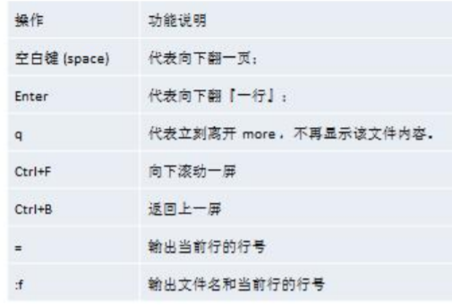
  - less(分屏显示大文件)

  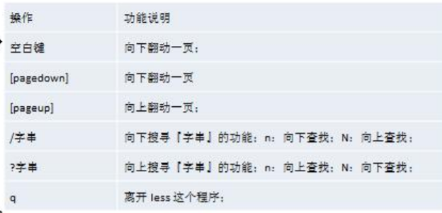

- \>(输出重定向) / >>(追加)
  - ls -l > aaa.txt
  - ls -l >> aaa.txt
  - ls -l ./home/ > /home/info.txt
  - cat aaa.txt > bbb.txt
  - echo 'xxxx' > bbb.txt

- echo / head / tail
  - echo $PATH
  - echo 'hello JACK'
  - head test.txt //默认10行
  - head -n 5 test.txt
  - tail test.txt //默认10行
  - tail -n 5 test.txt
  - tail -f text.txt //实时追踪文件变化
- ln -s [源文件或目录] 软连接名
  - ln -s ./root linkToRoot
  - rm -rf linkToRoot
- en 查看环境变量

#### 历史指令
- history
  - history 10
  - !178 //运行编号178的命令
  - !ls //执行最后一次以ls开头的命令

#### 时间日期
- date
  - date "+%Y"
  - date "+%m"
  - date "+%d"
  - date "+%Y-%m-%d %H:%M:%S"
  - date -s "2018-10-10 11:22:22" //set date
- cal
  - cal 2020

#### 搜索查找类
- find
  - find /home -name hello.txt
  - find /opt -user root
  - find / -size +20M
  - find / -size -20480k
  - find / -size 20M
  - find / -name *.txt
  - find /home -amin -10：十分钟内存取的文件或目录
  - find /home -atime -10：十小时内存取的文件或目录
  - find /home -cmin -10：十分钟内更改过的文件或目录
  - find /home -ctime +10：十小时前更改过的文件或目录
- locate
  - updatedb
  - locate hello.txt
- grep and |
  - cat hello.txt | grep xxx
  - cat hello.txt | grep -n xxx
  - cat hello.txt | grep -i xxx

#### 压缩和解压
  - gzip/gunzip //不会保留压缩前的文件
  - zip/unzip
    - zip -r mypackage.zip /home/
    - unzip -d /opt/tmp/ mypackage.zip
  - **tar**
    - 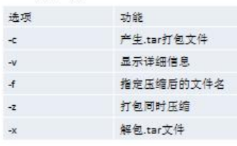
    - tar -zcvf a.tar.gz t1.txt t2.txt
    - tar -zcvf home.tar.gz /home/
    - tar -zxvf a.tar.gz
    - tar -zxvf a.tar.gz -C /opt/ //指定解压到的目录需要提前存在


#### 组管理
- Linux每个文件都有所有者、用户组、其他组
- ls -ahl
- chown 用户名 文件名
- groupadd 组名
- chgrp 组名 文件名
- usermod -g 组名 用户名
- usermod -d 目录名 用户名 //改变该用户登录的初始目录

#### 权限管理
`-rwxrw-r-- 1 root root 6 Feb 2 09:39 abc`
- 第0位文件类型 -普通 d目录 l软连接 c字符设备(键盘鼠标) b快文件(硬盘)
- 1-3 owner权限 4-6 group权限 7-9 other权限
- 如果是文件表示硬链接的数,如果是目录则表述该目录的子目录个数
- root 拥有者
- root 所属组
- 文件大小,如果是目录显示4096
- 最后修改时间
- 文件名

##### rwx作用在文件
1. r可读查看
2. w可写,但不一定能删除,删除前提条件是对文件所在的目录有w权限
3. x可执行
##### rwx作用在目录
1. r可读 ls
2. w可修改,目录内创建 + 删除 + 重命名
3. x可进入该目录

##### chmod
- chmod u=rwx,g=rx,o=x 文件目录名
- chomd o+w 文件目录名
- chomd a-x 文件目录名
- chmod 755 文件目录名

##### chown
- chown newowner file
- chown newowner:newgroup file
- chowm -R tom kkk/

##### chgrp
- chgrp newgroup file

#### crond
- crontab [选项] (-e 编辑 -l查询 -r 删除当前用户所有的crontab任务)
- service crond restart
```
cron -e
*/1 * * * * ls -l /etc/ >> /tmp/to.txt
```
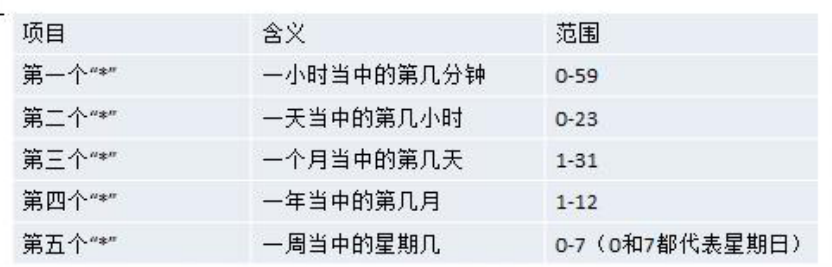
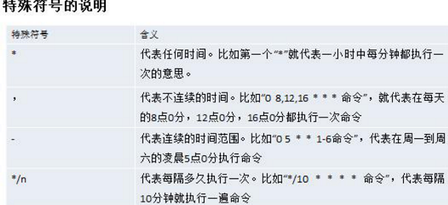
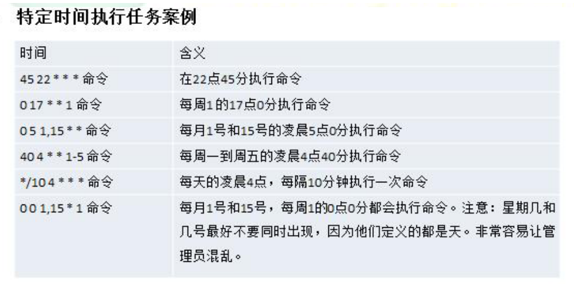

- **how to add a crond**
```
1. 先编写 /home/mytask1.sh
date >> /tmp/mycal
cal >> /tmp/mycal
2. chmod 744 /home/mytask1.sh
3. crontab -e
4. */1 * * * * /home/mytask1.sh
```

### 磁盘分区、挂载
#### 分区方式
1. mbr
2. gtp

#### Linux分区
1. Linux 来说无论有几个分区,分给哪一目录使用,它归根结底就只有一个根目录,一个独立且唯一的文件结构 , Linux 中每个分区都是用来组成整个文件系统的一部分
2. Linux 采用了一种叫“载入”的处理方法,它的整个文件系统中包含了一整套的文件和目录, 且将一个分区和一个目录联系起来。这时要载入的一个分区将使它的存储空间在一个目录下获得
3. 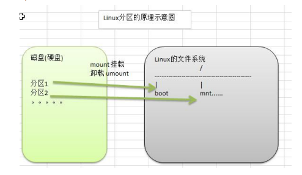
4. 对于 IDE 硬盘,驱动器标识符为“hdx~”,其中“hd”表明分区所在设备的类型,这里是指 IDE 硬盘了。“x”为盘号（a 为基本盘,b 为基本从属盘,c 为辅助主盘,d 为辅助从属盘）,“~”代表分区,前四个分区用数字 1 到 4 表示,它们是主分区或扩展分区,从 5 开始就是逻辑分区。例,hda3 表示为第一个 IDE 硬盘上的第三个主分区或扩展分区,hdb2 表示为第二个 IDE 硬盘上的第二个主分区或扩展分区
5. 对于 SCSI 硬盘则标识为“sdx~”,SCSI 硬盘是用“sd”来表示分区所在设备的类型的,其余则和 IDE 硬盘的表示方法一样
6. `lsblk` or `lsblk -f`查看分区情况
7. **how to add a disk in Linux**
```
1. 虚拟机增加硬盘(修改大小,加完重启)
2. 分区fdisk /dev/sdb  (m显示命令列表 n新增分区 p主分区 w写并退出)
3. 格式化 mkfs -t ext4 /dev/sdb1
4. 挂载  mount /dev/sdb1 /home/newdisk
        unmount 设备名称或挂载目录
5. 永久挂载
    vi /etc/fstab
        /dev/sdb1	/home/newdisk	ext4	defaults	0 0
    mount -a
```

#### 磁盘情况查询
##### 系统整体
`df -lh`
##### 指定目录
du -h	/目录 //查询指定目录的磁盘占用情况,默认为当前目录

-s 指定目录占用大小汇总

-h 带计量单位

-a 含文件

--max-depth=1	子目录深度

-c 列出明细的同时,增加汇总值

`du -ach --max-depth=1 /opt`

**实用命令**
- ls -l /home | grep "^-" | wc -l
- ls -l /home | grep "^d" | wc -l
- ls -lR /home | grep "^-" | wc -l
- ls -lR /home | grep "^d" | wc -l
- tree
- yum install tree

### 网路配置
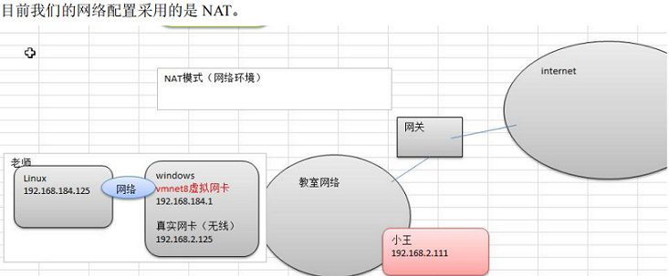

#### 查看网络IP和网关
- vm查看虚拟网络编辑器
- 修改ip
- vm查看网关
- winodws中ipconfig
- ping www.baidu.com

#### 配置IP
1. 自动获取(缺点会变)
2. `vi /etc/sysconfig/network-scripts/ifcfg-eth0`

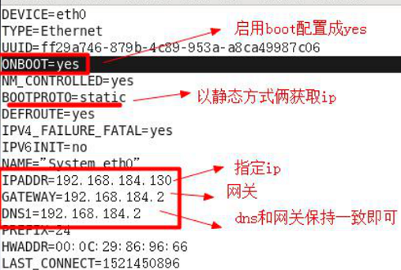

`service network restart`

### process
- `ps -aux` or `ps -aux | more`(a显示当前终端所有进程 u用户格式显示进程信息  x显示后台进程运行的参数)

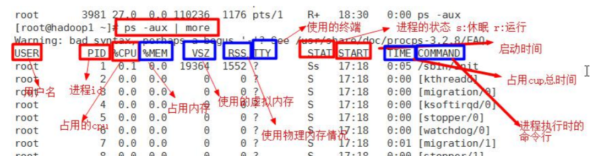

- `ps -aux | grep sshd`
- `ps -ef | more` 所有进程全格式显示
- `kill [-9] PID` 支持通配符 9代表强制
- `killall gedit`
- `pstree`

#### service
service 服务名 [start|stop|restart|reload|status]

在CentOS7.0后 systemctl 服务名 [start|stop|restart|reload|status]

`service iptables status`
- 使用telnet ip port 测试
- 上面的方式只是临时生效
- `chkconfig`永久生效,需重启

##### 查看服务名
- `setup`
- /etc/init.d/

##### 服务运行级别
- `vi /etc/inittab`
- 0-7 通常3和5

##### 开机流程说明
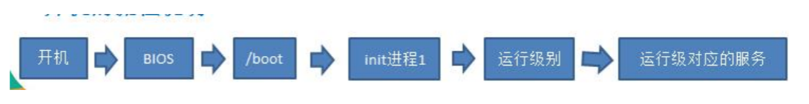

##### chkconfig(重启生效)
- chkconfig --list | grep sshd
- chkconfig iptables --list
- chkconfig --level 5 服务名 on/off

#### top动态监控进程
选项说明

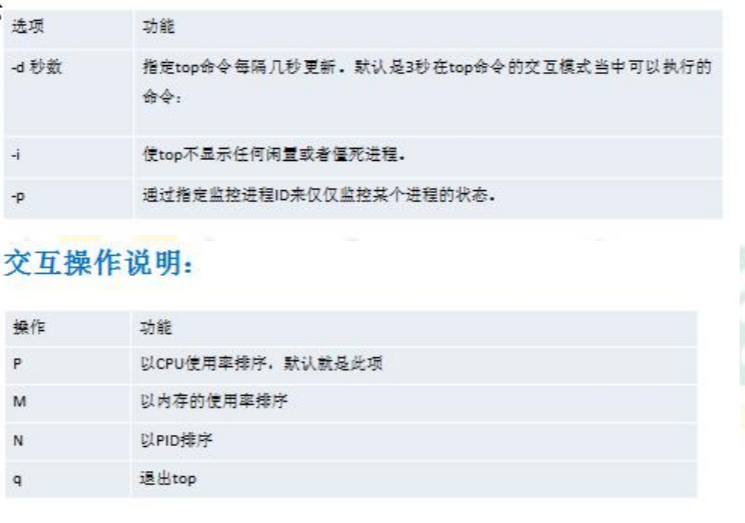

- 监控中按u,输入用户名进行用户过滤
- 监控中按k,再输入要结束的进程号
#### **netstat**
`netstat -anp` an按一定顺序排列输出  p显示那个进程在调用


### rpm & yum
#### rpm
- rpm -qa | grep sshd
- rpm -qa | more
- rpm -q firefox //查询是否安装
- rpm -qi firefox //查询软件包信息
- rpm -ql firefox //查询软件包中的文件
- rpm -qf /etc/passwd //查询某个文件属于哪个rpm包
- rpm -e firefox //卸载
- rpm -e --nodeps firefox //强制卸载
- rpm -ivh firefox //安装

#### yum
- yum list | grep firefox
- yum install firefox


### Ubuntu
- sudo passwd //设定root密码
- su - //切root, $一般用户, #root用户
- sudo + 命令 //root权限执行
- exit
- apt
  - `apt-get update`  更新源
  - `apt-get install xxx`
  - `apt-get remove xxx`
  - `apt-cache show xxx`
  - `apt-get source xxx`  下载该包源码
  - apt-get upgrade 更新安装包
  - apt-get remove xxx --purge 包括配置文件
  - apt-cache search xxx
  - apt-get install xxx --reinstall
  - apt-get -f install 恢复安装
  - apt-get build-dep xxx 安装相关的编译环境
  - apt-get dist-upgrate 升级系统
  - apt-cache depends xxx  该包依赖包
  - apt-cache rdepends xxx  该包被依赖包
- 切换apt源
```bash
#/etc/apt/sources.list
sudo cp /etc/apt/sources.list /etc/apt/sources.list.backup
echo '' > sources.list
copy 清华镜像地址
sudo apt-get update
```
- install sshd
```bash
sudo apt-get install openssh-server
service sshd restart

```
- linux系统客户机登录linux服务机
```bash
ssh 用户名@IP
使用ssh访问,如出现错误,查看是否有~/.ssh/known_ssh,尝试删除
```
