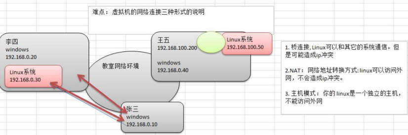

### concept

### Linux学习阶段
1. linux环境下的基本操作命令,包括文件操作命令(rm mkdir chmod, chown) 编辑工具使用(vi vim)linux 用户管理(useradd userdel usermod)等
2. linux的各种配置(环境变量配置,网络配置,服务配置)
3. linux下如何搭建对应语言的开发环境(大数据,JavaEE, Python 等)
4. 能编写shell脚本,对Linux服务器进行维护
5. 能进行安全设置,防止攻击,保障服务器正常运行,能对系统调优
6. 深入理解Linux系统(对内核有研究),熟练掌握大型网站应用架构组成、并熟悉各个环节的部署和维护方法

### install vm + CentOS
1. install vm
2. BIOS设置开始虚拟化技术
3. create virtual machine
4. setting virtual machine
   1. ROM  2G+
   2. CPU
   3. Network
    
5. install centOS
   1. 分区(至少3个分区)
    

### vmtools
#### requirement
1. 可以直接粘贴命令在windows和centos系统之间
2. 可以设置windows和centos的共享文件夹

#### install vmtools
1. 进入centos
2. 点击vm菜单的->install vmware tools
3. 解压
4. ./vmware-install.pl
5. reboot

#### shared folder
1. window create a folder
2. vm => setting, check always enable,loate to the foler which created by step 1
3. /mnt/hgfs/

### Linux Directory
1. linux的目录中有且只要一个根目录 /
2. linux的各个目录存放的内容是规划好,不用乱放文件
3. linux是以文件的形式管理我们的设备,因此**linux系统一切皆为文件**
4. linux的各个文件目录下存放什么内容,大家必须有一个认识
   1. /bin        常用命令
   2. /home
   3. /root
   4. /boot       启动相关
   5. /media      U盘 光驱
   6. /mnt        挂载别的文件系统
   7. /opt        安装文件
   8. /usr/local  安装目录
   9. /var        日志 经常修改的东西

### Xshell + Xftp
#### resolve can not login by password
- change /etc/ssh/sshd_config, set PasswordAuthentication yes
- service sshd restart
#### resolve can not login as root
- change /etc/ssh/sshd_config, set PermitRootLogin yes
- service sshd restart

### command
#### 注销、关机、重启
1. shutdown
   1. shutdown -h now  立即关机
   2. shutdown -h 1    1分后关机
   3. shutdown -r now  立即重启
2. halt(关机)
3. reboot(重启)
> 关机前执行`sync`保存内存中的东西到磁盘

#### 用户
- useradd [选项] username
  - useradd -d /home/test xm
- passwd username
- userdel [选项] username
  - userdel -r username
- su - username
- id username
- whoami
- exit / logout

#### 用户组
- groupadd groupname
- groupdel groupname
- usermod -g groupname username
- /etc/password
- /etc/shadow
- /etc/group

#### 运行级别

- init [0-5]
- /etc/inittab
> 找回root密码, 开机>引导时输入enter>e>选中第二行输入e>空格+1+enter>b进入单用户模式，然后passwd root

#### 帮助指令
- man ls
- help cd

#### 文件目录
- pwd
- ls -al
- cd
  - cd ~ or cd+空格+enter
  - cd ..
- mkdir
  - mkdir -p /home/dir1/dir2 //多级创建
- rmdir
  - rmdir -rf /xxx/yyy //删除非空目录
- touch filename
  - touch filename1 filename2
- **cp**
  - cp aaa.txt ./test2/
  - cp -r ./test/ ./test2/
  - \cp -r ./test/ ./test2/  //不会有覆盖提示
- rm
  - rm xxx
  - rm -r ./test //删除目录
  - rm -rf xxxx
- mv
  - mv 1.txt 2.txt
  - mv 1.txt ../1.txt
- cat / more / less
  - cat -n /etc/profile
  - cat -n /etc/profile | more
  - more aaa.txt
  
  - less(分屏显示大文件)

  

- \>(输出重定向) / >>(追加)
  - ls -l > aaa.txt
  - ls -l >> aaa.txt
  - ls -l ./home/ > /home/info.txt
  - cat aaa.txt > bbb.txt
  - echo 'xxxx' > bbb.txt

- echo / head / tail
  - echo $PATH
  - echo 'hello JACK'
  - head test.txt //默认10行
  - head -n 5 test.txt
  - tail test.txt //默认10行
  - tail -n 5 test.txt
  - tail -f text.txt //实时追踪文件变化
- ln -s [源文件或目录] 软连接名
  - ln -s ./root linkToRoot
  - rm -rf linkToRoot

### 历史指令
- history
  - history 10
  - !178 //运行编号178的命令

### 时间日期
- date
  - date "+%Y"
  - date "+%m"
  - date "+%d"
  - date "+%Y-%m-%d %H:%M:%S"
  - date -s "2018-10-10 11:22:22" //set date
- cal
  - cal 2020

### 搜索查找类
- find
  - find /home -name hello.txt
  - find /opt -user root
  - find / -size +20M
  - find / -size -20480k
  - find / -size 20M
  - find / -name *.txt
- locate
  - updatedb
  - locate hello.txt
- grep and |
  - cat hello.txt | grep xxx
  - cat hello.txt | grep -n xxx
  - cat hello.txt | grep -i xxx
- 压缩和解压
  - gzip/gunzip //不会保留压缩前的文件
  - zip/unzip
    - zip -r mypackage.zip /home/
    - unzip -d /opt/tmp/ mypackage.zip
  - **tar**
    - 
    - tar -zcvf a.tar.gz t1.txt t2.txt
    - tar -zcvf home.tar.gz /home/
    - tar -zxvf a.tar.gz
    - tar -zxvf a.tar.gz -C /opt/ //指定解压到的目录需要提前存在

### 组管理和权限管理
- Linux每个文件都有所有者、用户组、其他组
- ls -ahl
- chown 用户名 文件名
- groupadd 组名
- chgrp 组名 文件名
- usermod -g 组名 用户名
- usermod -d 目录名 用户名 //改变该用户登录的初始目录