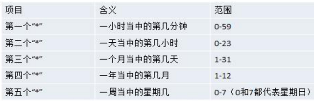
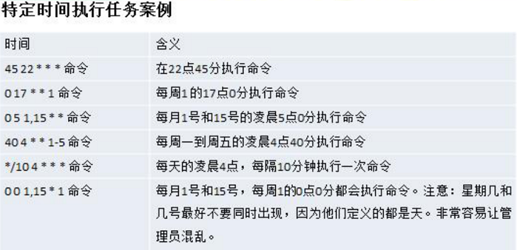

CentOS为例
### 1 concept


### 2 Linux学习阶段
1. linux环境下的基本操作命令,包括文件操作命令(rm mkdir chmod, chown) 编辑工具使用(vi vim)linux 用户管理(useradd userdel usermod)等
2. linux的各种配置(环境变量配置,网络配置,服务配置)
3. linux下如何搭建对应语言的开发环境(大数据,JavaEE, Python 等)
4. 能编写shell脚本,对Linux服务器进行维护
5. 能进行安全设置,防止攻击,保障服务器正常运行,能对系统调优
6. 深入理解Linux系统(对内核有研究),熟练掌握大型网站应用架构组成、并熟悉各个环节的部署和维护方法

### 3 install vm software + CentOS

below is vm example:

1. install vm
2. BIOS设置开始虚拟化技术
3. create virtual machine
4. setting virtual machine
   1. ROM  2G+
   2. CPU
   3. Network
    
5. install centOS
   1. 分区(至少3个分区)
    


### 4 vmtools
#### requirement
1. 可以直接粘贴命令在windows和centos系统之间
2. 可以设置windows和centos的共享文件夹

#### install vmtools
1. 进入centos
2. 点击vm菜单的->install vmware tools
3. 解压
4. ./vmware-install.pl
5. reboot

#### shared folder
1. window create a folder
2. vm => setting, check always enable,loate to the foler which created by step 1
3. /mnt/hgfs/


### 5 Linux Directory
1. linux的目录中有且只要一个根目录 /
2. linux的各个目录存放的内容是规划好,不要乱放文件
3. linux是以文件的形式管理我们的设备,因此**linux系统一切皆为文件**
4. linux的各个文件目录下存放什么内容
   1. /bin        常用命令，如vi、su
   2. /sbin      管理命令
   3. /home/username     普通用户家目录
   4. /root       root用户家目录
   5. /etc        配置文件目录
   6. /usr/bin、/usr/sbin 系统预装的其他命令
   7. /usr/local  安装目录，相当于windows下的program file
   8. /boot       启动相关
   9. /media      U盘 光驱
   10. /mnt        挂载别的文件系统
   11. /opt        安装文件
   12. /var        日志、经常修改的东西


### 6 Xshell + Xftp
#### resolve can not login by password
- change /etc/ssh/sshd_config, set PasswordAuthentication yes
- service sshd restart
#### resolve can not login as root
- change /etc/ssh/sshd_config, set PermitRootLogin yes
- service sshd restart

### 7 [command](./linuxcommand.md)

### 8 运行级别


- init [0-5]
- /etc/inittab //修改默认运行级别
> 找回root密码, 开机>引导时输入enter>e>选中第二行输入e>空格+1+enter>b进入单用户模式,然后passwd root

### 9 crond

- crontab [选项] (-e 编辑 -l查询 -r 删除当前用户所有的crontab任务)
- service crond restart
```
cron -e
*/1 * * * * ls -l /etc/ >> /tmp/to.txt
```




- **how to add a crond**
```
1. 先编写 /home/mytask1.sh
date >> /tmp/mycal
cal >> /tmp/mycal
2. chmod 744 /home/mytask1.sh
3. crontab -e
4. */1 * * * * /home/mytask1.sh
```

### 10 磁盘分区、挂载
#### 分区方式
1. mbr
2. gtp

#### Linux分区
1. Linux 来说无论有几个分区,分给哪一目录使用,它归根结底就只有一个根目录,一个独立且唯一的文件结构 , Linux 中每个分区都是用来组成整个文件系统的一部分
2. Linux 采用了一种叫“载入”的处理方法,它的整个文件系统中包含了一整套的文件和目录, 且将一个分区和一个目录联系起来。这时要载入的一个分区将使它的存储空间在一个目录下获得
3. 
4. 对于 IDE 硬盘,驱动器标识符为“hdx~”,其中“hd”表明分区所在设备的类型,这里是指 IDE 硬盘了。“x”为盘号（a 为基本盘,b 为基本从属盘,c 为辅助主盘,d 为辅助从属盘）,“~”代表分区,前四个分区用数字 1 到 4 表示,它们是主分区或扩展分区,从 5 开始就是逻辑分区。例,hda3 表示为第一个 IDE 硬盘上的第三个主分区或扩展分区,hdb2 表示为第二个 IDE 硬盘上的第二个主分区或扩展分区
5. 对于 SCSI 硬盘则标识为“sdx~”,SCSI 硬盘是用“sd”来表示分区所在设备的类型的,其余则和 IDE 硬盘的表示方法一样
6. `lsblk` or `lsblk -f`查看分区情况
7. **how to add a disk in Linux**
```
1. 虚拟机增加硬盘(修改大小,加完重启)
2. 分区fdisk /dev/sdb  (m显示命令列表 n新增分区 p主分区 w写并退出)
3. 格式化 mkfs -t ext4 /dev/sdb1
4. 挂载  mount /dev/sdb1 /home/newdisk
        unmount 设备名称或挂载目录
5. 永久挂载
    vi /etc/fstab
        /dev/sdb1	/home/newdisk	ext4	defaults	0 0
    mount -a
```

#### 磁盘情况查询
##### 系统整体
`df -lh`
##### 指定目录
du -h	/目录 //查询指定目录的磁盘占用情况,默认为当前目录

-s 指定目录占用大小汇总

-h 带计量单位

-a 含文件

--max-depth=1	子目录深度

-c 列出明细的同时,增加汇总值

`du -ach --max-depth=1 /opt`

**实用命令**
- ls -l /home | grep "^-" | wc -l
- ls -l /home | grep "^d" | wc -l
- ls -lR /home | grep "^-" | wc -l
- ls -lR /home | grep "^d" | wc -l
- tree
- yum install tree

### 11 网路配置


#### 查看网络IP和网关
- vm查看虚拟网络编辑器
- 修改ip
- vm查看网关
- winodws中ipconfig
- ping www.baidu.com

#### 配置IP
1. 自动获取(缺点会变)
2. `vi /etc/sysconfig/network-scripts/ifcfg-eth0`


`service network restart`

### 12 service
service 服务名 [start|stop|restart|reload|status]

在CentOS7.0后 systemctl 服务名 [start|stop|restart|reload|status]

`service iptables status`
- 使用telnet ip port 测试
- 上面的方式只是临时生效
- `chkconfig`永久生效,需重启

##### 查看服务名
- `setup`
- /etc/init.d/

##### 服务运行级别
- `vi /etc/inittab`
- 0-7 通常3和5

##### 开机流程说明


##### chkconfig(重启生效)
- chkconfig --list | grep sshd
- chkconfig iptables --list
- chkconfig --level 5 服务名 on/off
