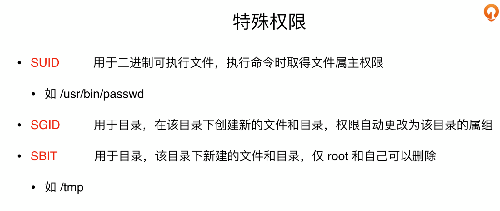

### Common

- init 3 //服务器终端登录
- init 0 //关机
- clear
- env
- ctrl + c
- ctrl + r //搜索执行过的命令
- `type command`
- `which command`
- `tree xxx`  树状图列出目录的内容
- `ssh userName@ip`  远程登录
- `git`
- `maven`

### 帮助指令

- `man ls`
- help
  1. type xxx
  2. xxx help(内部命令)or xxx --help(外部命令)
- info ls

### 注销、关机、重启

- shutdown
    - shutdown -h now  立即关机
    - shutdown -h 1    1分后关机
    - shutdown -r now  立即重启
- halt(关机)
- reboot

> 关机前执行`sync`保存内存中的东西到磁盘

### 进入桌面 `startx`

### 用户

- `useradd [options] username`

    - useradd -g groupname username

- `userdel [options] username`
    
    - userdel -r username //删除家目录
    
- `passwd [username]`

- 查询

    - `id [username]`
    - `whoami`
    - tail -10  /etc/passwd
    - tail -10  /etc/shadow
    - tail -10  /etc/group

- 修改用户属性

    - `usermod -g groupname username`
    - `usermod -d 目录名 用户名`
    - chage

- `exit / logout` 注销(在运行级别3下有效)

- 切换用户

    - su - [username]   // - 代表运行环境也切换
    - sudo 以其他用户身份执行命令

    >1. root运行visudo
    >2. username ALL=/sbin/shutdown -c增加相应的命令权限
    >3. 切换用户执行

- 用户配置文件
  -  /etc/passwd    7属性
  - /etc/shadow
  -  /etc/group       4属性

### 用户组

- `groupadd groupname`
- `groupdel groupname`

### 权限
- 文件类型

    - \-    普通文件
    - d   目录
    - b   块特殊文件
    - c   字符特殊文件
    - l    符号链接
    - f    命名管道
    - s   套接字文件

- `chmod`

    - chmod u=rwx,g=rx,o=x xxx
    - chmod o+w xxx
    - chmod a-x xxx
    - chmod 755 xxx

- `chown`

    - chown newowner fileName
    - chown [newowner]:newgroup fileName
    - chown -R tom kkk/

- `chgrp`

    - chgrp newgroup file

- `-rwxrw-r-- 1 root root 6 Feb 2 09:39 abc`

    > - 第0位文件类型
    > - 1-3 owner权限 4-6 group权限 7-9 other权限
    > - 如果是文件表示硬链接的数,如果是目录则表述该目录的子目录个数
    > - root 拥有者
    > - root 所属组
    > - 文件大小,如果是目录显示4096
    > - 最后修改时间
    > - 文件名
    > - r=4、w=2、x=1

- ##### rwx作用在文件

    1. r 可读查看
    2. w 可写,但不一定能删除,删除前提条件是对文件所在的目录有w权限
    3. x 可执行

- ##### rwx作用在目录

    1. rx 显示目录内文件名
    2. wx 可修改,目录内创建 + 删除 + 重命名
    3. x 进入目录
    
- 当权限冲突以属主优先

    > `-----w---- user1 group1` user1不能w, group1其他用户可以w

- 特殊权限

  

### install

- `wget http://file.tgz` //文件下载
- `curl http://file.tgz` //文件下载
    - curl xxx > yyy
- 配置环境变量`.bashrc`增加如下两行 
    - `export JAVA_HOME=/root/jdk-XXX_linux-x64`
    - `export PATH=$JAVA_HOME/bin:$PATH`
    - `source .bashrc` //重新加载
- `nohup command >out.file 2>&1 &` //后台运行
- `ps -ef |grep 关键字  |awk '{print $2}'|xargs kill -9` //查找进程

#### [curl](https://segmentfault.com/a/1190000020436170)

#### CentOS

```bash
//rpm
rpm -i jdk-XXX_linux-x64_bin.rpm
rpm -ivh firefox //安装
rpm -qa
rpm -qa | grep jdk
rpm -qa | more
rpm -qa | less
rpm -q firefox //查询是否安装
rpm -qi firefox //查询软件包信息
rpm -ql firefox //查询软件包中的文件
rpm -qf /etc/passwd //查询某个文件属于哪个rpm包
rpm -e firefox //卸载
rpm -e --nodeps firefox //强制卸载

//yum,配置文件/etc/yum.repos.d/CentOS-Base.repo
yum list | grep firefox
yum search jdk
yum install java-11-openjdk.x86_64
yum erase java-11-openjdk.x86_64

//install mysql,配置文件usr/lib/systemd/system 目录下，创建一个 XXX.service
yum install mariadb-server mariadb
systemctl start mariadb
systemctl enable mariadb
```

#### Ubuntu

```bash
dpkg -i jdk-XXX_linux-x64_bin.deb
dpkg -l
dpkg -l | grep jdk
dpkg -l | more
dpkg -l | less
dpkg -r

//apt-get,配置文件/etc/apt/sources.list
apt-get install openjdk-9-jdk
apt-get install openjdk-9-jdk --reinstall
apt-get --purge remove openjdk-9-jdk //移除软件包及配置文件
apt-get update xxx
apt-get remove xxx
apt-cache search jdk
apt-cache show xxx
apt-get source xxx  下载该包源码
apt-get -f install 恢复安装
apt-get build-dep xxx 安装相关的编译环境
apt-get dist-upgrate 升级系统
apt-cache depends xxx  该包依赖包
apt-cache rdepends xxx  该包被依赖包

//切换apt源
#/etc/apt/sources.list
sudo cp /etc/apt/sources.list /etc/apt/sources.list.backup
echo '' > sources.list
copy 清华镜像地址
sudo apt-get update

//install mysql,配置文件/lib/systemd/system 目录下会创建一个 XXX.service
apt-get install mysql-server
systemctl start mysql
systemctl enable mysql

//install sshd
sudo apt-get install openssh-server
service sshd restart

//linux系统客户机登录linux服务机
ssh 用户名@IP  //使用ssh访问,如出现错误,查看是否有~/.ssh/known_ssh,尝试删除
```

### 管道命令 |


### 目录列表
- `ls [-alrtRh] [目录名...]`
  - `ls /root /etc`
  - `ls -l [.]`
- `pwd`
- `cd`
  - `cd [~]` 
  - `cd -` 
  - `cd /xxx/yyy` 绝对路径
  - cd xxx/yyy 相对路径(可用.和..)


### 输出
- `echo $PATH`
- `echo $JAVA_HOME`
- echo 'hello JACK'


### 文件/文件夹
- `touch filename [filename2] [filenameX]`
- `mkdir foldername...`
    - mkdir -p /a/b/c   //递归创建
- `rm `
    - rm fileName...  //删除文件
    - rm [-rf] dirName... //删除非空目录
- `cp`
    - cp aaa.txt ./test2/
    - cp -r ./test/ ./test2/   //复制目录
    - cp -r  dir1 ../../newdir //复制并改名
    - cp -p xxx yyy   //时间不变
    - cp -a xxx yyy   //所有属性不变
- `mv`
    - mv 1.txt 2.txt
    - mv 1.txt ../1.txt
- `source xxxx` //重载配置文件
- **`~/.bashrc or ~/.zshrc` 环境变量配置**


### 文件内容查看
- cat fileName... / tac
  
  - `cat -n xxxxx` 将该文件的内容输出到标准输出中，并显示行号
- `cat file1 file2 > file3`  将file1和file2的内容依次添加到file3当中
  
  - cat -n /etc/profile | more
  
- head
  
  - `head -n xxx ` //默认10行
- `head -n -10 file` //不打印文件后十行内容
  
- tail
  - `tail -n xxx ` //默认10行
  -  `tail -n +100 xxx`  //显示100行以后的内容
  - `tail -f xxx`  //实时追踪文件变化

- `wc -l xxx` //行数

- more xxx 向下翻动文件

    

- less xxx 向上/下翻动文件 (分屏显示大文件)

    

- \>(输出重定向) / >>(追加)

    - ls -l > aaa.txt
    - ls -l >> aaa.txt
    - ls -l ./home/ > /home/info.txt
    - cat aaa.txt > bbb.txt
    - echo 'xxxx' >> bbb.txt
    - pbcopy < aaa.txt //复制到剪切板

- ln -s [源文件或目录] 软连接名

    - ln -s ./root linkToRoot
    - rm -rf linkToRoot

### 历史命令

- history 10
- !178 //运行编号178的命令
- !ls //执行最后一次以ls开头的命令

### 时间日期

- date
    - date "+%Y"
    - date "+%m"
    - date "+%d"
    - date "+%Y-%m-%d %H:%M:%S"
    - date -s "2018-10-10 11:22:22" //set date
- cal
    - cal 2020

### 打包/解包/压缩/解压缩

> .tar 打包
>
> .tar.gz / .tar.bz2 打包加压缩
>
> .tbz2和.tgz是双扩展名的缩写

- `tar -czf test.tar.gz /test1 /test2` //打包压缩文件可多个

- `tar -cjf test.tar.bz2 /test1 /test2` 

- `tar -zxf a.tar.gz -C /opt/ `  //指定解压到的目录需提前存在

- `tar -jxf test.tar.bz2`

    

- `apt-get install zip unzip`//zip unzip需要另行安装, 不会保留压缩前的文件

    - zip -r mypackage.zip /home/
    - unzip -d /opt/tmp/ mypackage.zip


### 查找
- find
  - `find / -name filename.txt`
    - 第一个参数代表从哪里找，可以指定目录或.或者..或者/根目录,可省略

    - filename.txt可以使用匹配  *.xml

        ```bash
        find /home -name hello.txt
        find /opt -user root  查找用户名为name的文件
        find / -group name 查找群组名为name的文件
        find / -size +20M
        find / -size -20480k
        find / -size 20M
        find / -name *.txt
        find /home -amin -10：十分钟内存取的文件或目录
        find / -mtime 0 查找24小时内被修改过的文件
        find /etc -mtime 3 查找3天前的24小时内被修改的文件
        find / -mtime +3 查找3天前（不含3天本身）被更改的文件
        find / -mtime -3 查找3天内被更改的文件
        find / -nouser 找不属于任何用户的文件，可能出现于网络文件，或是已经被删除的用户创建的文件
        find / -type TYPE 查找某一类文件，f：正规文件，b：设备文件，d：目录，l：连接文件，s：socket，p：FIFO
        ```

  - 结合管道命令

      ```bash
      find -name x.txt | xargs grep 234 结合管道命令查找文件内容
      find ./ -size 0 | xargs rm -f 根据size查找并删除
      ls -l | grep 'jar' 查找包含jar字符的文件
      ```

- `grep`and | (查找内容)

  - `grep 'test' d*`显示所有以d开头的文件中包含test的行
  - `grep 'test' aa bb cc`显示在aa、bb、cc文件中匹配test的行
  - `grep '[a-z]/{5/}' aa`显示所有包含每个字符串至少有5个连续小写字符的字符串的行
  - cat hello.txt | grep xxx
  - cat hello.txt | grep -n xxx
  - cat hello.txt | grep -i xxx

- locate

    - updatedb
    - locate hello.txt


### 进程
- ps
  - ps -ef | grep tomcat

  - ps -aux | grep java  // a显示当前终端所有进程 u用户格式显示进程信息  x显示后台进程运行的参数)

      

- `kill [-9] xxxxx`  //支持通配符 9代表强制

- killall gedit

- pstree

- top(动态监控进程)

    - 监控中按u,输入用户名进行用户过滤
    - 监控中按k,再输入要结束的进程号

    

### 网络

- `netstat -tln | grep 8080` 查看端口8080的使用情况
- `netstat -anp` an按一定顺序排列输出  p显示那个进程在调用
- `lsof -i :8080`  查看端口属于哪个程序
- `ping www.taobao.com`
