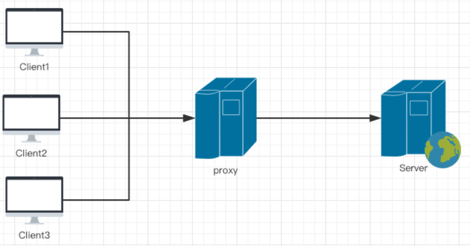
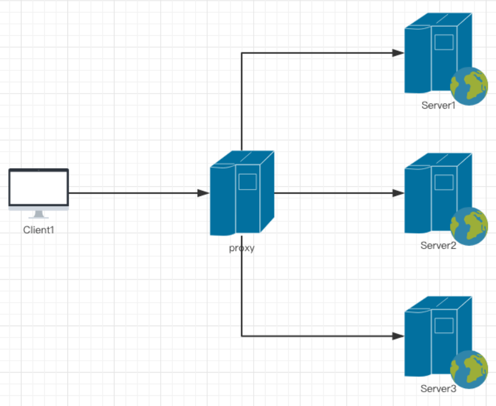

### Nginx
Nginx是一款轻量级的Web服务器，也是一款轻量级的反向代理服务器

### Nginx能干什么
1. 直接支持Rails和PHP的程序
2. 作为HTTP反向代理服务器
3. 作为负载均衡服务器
4. 作为邮件代理服务器
5. 帮助实现前端动静分离

### Nginx在应用程序中的作用
- 解决跨域
- 请求过滤
- 配置gzip
- 负载均衡
- 静态资源服务器

### Nginx特点
高稳定、高性能、资源占用少、功能丰富、模块化结构、支持热部署

### 安装Nginx

1. 环境搭建
    - 自己找个电脑搭建
    - 购买阿里云ECS
    - 使用虚拟软件

2. 安装依赖：

    `yum -y install gcc gcc-c++ pcre-devel autoconf make automake`

    `yum -y install wget httpd-tools vim`

3. 安装nginx

    ```bash
    yum list | grep nginx
    
    # 配置nginx yum源
    vim /etc/yum.repos.d/nginx.repo
    
    [nginx]
    name=nginx repo
    baseurl=http://nginx.org/packages/centos/7/$basearch/
    gpgcheck=0
    enabled=1
    
    yum install nginx
    ```

4. 检查是否安装成功：`nginx -v`

### 配置文件

```bash
# 查询nginx所有安装目录
rpm -ql nginx

# 总配置文件 etc/nginx/nginx.conf
#运行用户，默认即是nginx，可以不进行设置
user  nginx;
#nginx进程，一般设置为和CPU核数一样
worker_processes  1;   
#错误日志存放目录
error_log  /var/log/nginx/error.log warn;
#进程pid存放位置
pid        /var/run/nginx.pid;


events {
    worker_connections  1024; # 单个后台进程的最大并发数
}


http {
    include       /etc/nginx/mime.types;   #文件扩展名与类型映射表
    default_type  application/octet-stream;  #默认文件类型
    log_format  main  '$remote_addr - $remote_user [$time_local] "$request" '
                      '$status $body_bytes_sent "$http_referer" '
                      '"$http_user_agent" "$http_x_forwarded_for"';

    access_log  /var/log/nginx/access.log  main;   #nginx访问日志存放位置

    sendfile        on;   #开启高效传输模式
    #tcp_nopush     on;    #减少网络报文段的数量

    keepalive_timeout  65;  #保持连接的时间，也叫超时时间

    #gzip  on;  #开启gzip压缩

    include /etc/nginx/conf.d/*.conf; #包含的子配置项位置和文件
}


# default.conf 配置
server {
    listen       80;   # 配置监听端口
    server_name  localhost;  # 配置域名

    #charset koi8-r;     
    #access_log  /var/log/nginx/host.access.log  main;

    location / {
        root   /usr/share/nginx/html;     # 服务默认启动目录
        index  index.html index.htm;    # 默认访问文件
    }

    #error_page  404              /404.html;   # 配置404页面

    # redirect server error pages to the static page /50x.html
    #
    error_page   500 502 503 504  /50x.html;   # 错误状态码的显示页面，配置后需要重启
    location = /50x.html {
        root   /usr/share/nginx/html;
    }

    # proxy the PHP scripts to Apache listening on 127.0.0.1:80
    #
    #location ~ \.php$ {
    #    proxy_pass   http://127.0.0.1;
    #}

    # pass the PHP scripts to FastCGI server listening on 127.0.0.1:9000
    #
    #location ~ \.php$ {
    #    root           html;
    #    fastcgi_pass   127.0.0.1:9000;
    #    fastcgi_index  index.php;
    #    fastcgi_param  SCRIPT_FILENAME  /scripts$fastcgi_script_name;
    #    include        fastcgi_params;
    #}

    # deny access to .htaccess files, if Apache's document root
    # concurs with nginx's one
    #
    #location ~ /\.ht {
    #    deny  all;
    #}
}
```

### 基本使用

```bash
# launch
nginx
# launch
systemctl start nginx.service

# check nginx service
ps aux | grep nginx

# 立即停止服务
nginx  -s stop

# 从容停止服务
nginx -s quit

# 杀死进程
killall nginx

# systemctl 停止
systemctl stop nginx.service

# relaunch
systemctl restart nginx.service

# 重新载入配置文件
nginx -s reload
```

### 自定义错误页

```bash
# default.conf
error_page 404  /404_error.html;
# or
error_page  404 http://www.google.com;


```

### 访问控制

```bash
# example
location / {
    allow  45.76.202.231;
    deny   123.9.51.42;
}

# example
location / {
    allow  45.76.202.231;
    deny   123.9.51.42/200;
}

# example
location / {
    allow  45.76.202.231;
    deny all;
}

# 注意顺序
location / {
    deny all;
    allow  45.76.202.231;
}

# 精确匹配
location =/img{
    allow all;
}
location =/admin{
    deny all;
}

# regex
location ~\.php$ {
    deny all;
}
```

### 基于端口/IP/域名设置虚拟主机

```bash
server{
   listen new port;
   server_name localhost;
   # 网站文件目录
   root /usr/share/nginx/html/html8001;
   index index.html;
}

server{
   listen 80;
   server_name xxx.xxx.xxx.xxx;
   # 网站文件目录
   root /usr/share/nginx/html/html8001;
   index index.html;
}

server{
   listen 80;
   # 若走ECS的话需要解析一下
   server_name xxx.xxx.com;
   # 网站文件目录
   root /usr/share/nginx/html/html8001;
   index index.html;
}
```

### PC或移动端适配

```bash
# etc/nginx/conf.d/xxx.config
server{
	listen 80;
	server_name nginx2.jspang.com;
	location / {
		root /usr/share/nginx/pc;
		if ($http_user_agent ~* '(Android|webOS|iPhone|iPod|BlackBerry)') {
			root /usr/share/nginx/mobile;
		}
		index index.html;
	}
}
```

### Gzip压缩

```bash
# simplest configure
http {
   .....
    gzip on;
    gzip_types text/plain application/javascript text/css;
   .....
}
```

- gzip : 该指令用于开启或 关闭gzip模块
- gzip_buffers : 设置系统获取几个单位的缓存用于存储gzip的压缩结果数据流
- gzip_comp_level : gzip压缩比，压缩级别是1-9，1的压缩级别最低，9的压缩级别最高。压缩级别越高压缩率越大，压缩时间越长
- gzip_disable : 可以通过该指令对一些特定的User-Agent不使用压缩功能
- gzip_min_length:设置允许压缩的页面最小字节数，页面字节数从相应消息头的Content-length中进行获取
- gzip_http_version：识别HTTP协议版本，其值可以是1.1.或1.0
- gzip_proxied : 用于设置启用或禁用从代理服务器上收到相应内容gzip压缩
- gzip_vary : 用于在响应消息头中添加Vary： Accept-Encoding,使代理服务器根据请求头中的Accept-Encoding识别是否启用gzip压缩

### 正向代理



内网服务器主动去请求外网的服务的一种行为(梯子)

```bash
server {
    #指定DNS服务器IP地址
    resolver 114.114.114.114;
    #指定代理端口
    listen 8080;
    location / {
        #设定代理服务器的协议和地址(固定不变
        proxy_pass http://$http_host$request_uri;
    }
}
```

这样就可以做到内网中端口为8080的服务器主动请求到1.2.3.4的主机上，如在Linux下可以：

`curl --proxy proxy_server:8080 http://www.taobao.com/`

正向代理的关键配置：
> 1 resolver： DNS服务器IP地址
>
> 2 listen：主动发起请求的内网服务器端口
>
> 3 proxy_pass：代理服务器的协议和地址

### 反向代理
是指用代理服务器来接受客户端发来的请求，然后将请求转发给内网中的上游服务器，上游服务器处理完之后，把结果通过nginx返回给客户端



```bash
server {
    #监听端口
    listen 80;
    #服务器名称，也就是客户端访问的域名地址
    server_name  a.xxx.com;
    #nginx日志输出文件
    access_log  logs/nginx.access.log  main;
    #nginx错误日志输出文件
    error_log  logs/nginx.error.log;
    root   html;
    index  index.html index.htm index.php;
    location / {
        #被代理服务器的地址，一般IP
        proxy_pass  http://localhost:8081;
   }
}
```
- proxy_set_header :在将客户端请求发送给后端服务器之前，更改来自客户端的请求头信息
- proxy_connect_timeout:配置Nginx与后端代理服务器尝试建立连接的超时时间
- proxy_read_timeout : 配置Nginx向后端服务器组发出read请求后，等待相应的超时时间
- proxy_send_timeout：配置Nginx向后端服务器组发出write请求后，等待相应的超时时间
- proxy_redirect :用于修改后端服务器返回的响应头中的Location和Refresh

反向代理的关键配置：
> 1 server_name：代表客户端向服务器发起请求时输入的域名
>
> 2 proxy_pass：代表源服务器的访问地址，也就是真正处理请求的服务器
### 透明代理
也叫做简单代理，意思客户端向服务端发起请求时，请求会先到达透明代理服务器，代理服务器再把请求转交给真实的源服务器处理，也就是是客户端根本不知道有代理服务器的存在。

### 负载均衡

将服务器接收到的请求按照规则分发的过程，称为负载均衡。负载均衡是反向代理的一种体现。

nginx实现负载均衡有几种模式：

1. 轮询：每个请求按时间顺序逐一分配到不同的后端服务器，也是nginx的默认模式。轮询模式的配置很简单，只需要把服务器列表加入到upstream模块中即可。

下面的配置是指：负载中有三台服务器，当请求到达时，nginx按照时间顺序把请求分配给三台服务器处理。
```bash
upstream serverList {
    server 1.2.3.4;
    server 1.2.3.5;
    server 1.2.3.6;
}
```

> ip_hash：每个请求按访问IP的hash结果分配，同一个IP客户端固定访问一个后端服务器。可以保证来自同一ip的请求被打到固定的机器上，可以解决session问题。

下面的配置是指：负载中有三台服务器，当请求到达时，nginx优先按照ip_hash的结果进行分配，也就是同一个IP的请求固定在某一台服务器上，其它则按时间顺序把请求分配给三台服务器处理。
```bash
upstream serverList {
    ip_hash
    server 1.2.3.4;
    server 1.2.3.5;
    server 1.2.3.6;
}
```
>　url_hash：按访问url的hash结果来分配请求，相同的url固定转发到同一个后端服务器处理。

```bash
upstream serverList {
    server 1.2.3.4;
    server 1.2.3.5;
    server 1.2.3.6;
    hash $request_uri;
    hash_method crc32;
}
```
> fair：按后端服务器的响应时间来分配请求，响应时间短的优先分配。

```bash
upstream serverList {
    server 1.2.3.4;
    server 1.2.3.5;
    server 1.2.3.6;
    fair;
}
```

而在每一种模式中，每一台服务器后面的可以携带的参数有：

- down: 当前服务器暂不参与负载
- weight: 权重，值越大，服务器的负载量越大。
- max_fails：允许请求失败的次数，默认为1。
- fail_timeout:max_fails次失败后暂停的时间。
- backup：备份机， 只有其它所有的非backup机器down或者忙时才会请求backup机器。

如下面的配置是指：负载中有三台服务器，当请求到达时，nginx按时间顺序和权重把请求分配给三台服务器处理，例如有100个请求，有30%是服务器4处理，有50%的请求是服务器5处理，有20%的请求是服务器6处理。

```bash
upstream serverList {
    server 1.2.3.4 weight=30;
    server 1.2.3.5 weight=50;
    server 1.2.3.6 weight=20;
}
```

如下面的配置是指：负载中有三台服务器，服务器4的失败超时时间为60s，服务器5暂不参与负载，服务器6只用作备份机。

```bash
upstream serverList {
    server 1.2.3.4 fail_timeout=60s;
    server 1.2.3.5 down;
    server 1.2.3.6 backup;
}
```

下面是一个配置负载均衡的示例（只写了关键配置）：
其中：
1. upstream serverList是负载的配置模块
2. server_name是客户端请求的域名地址
3. proxy_pass是指向负载的列表的模块

```bash
upstream serverList {
    server 1.2.3.4 weight=30;
    server 1.2.3.5 down;
    server 1.2.3.6 backup;
}

server {
    listen 80;
    server_name  www.xxx.com;
    root   html;
    index  index.html index.htm index.php;
    location / {
        proxy_pass  http://serverList;
        proxy_redirect     off;
        proxy_set_header   Host             $host;
   }
}
```
### 静态服务器
现在很多项目流行前后分离，也就是前端服务器和后端服务器分离，分别部署，这样的方式能让前后端人员能各司其职，不需要互相依赖，而前后分离中，前端项目的运行是不需要用Tomcat、Apache等服务器环境的，因此可以直接用nginx来作为静态服务器。

```bash
server {
    listen       80;
    server_name  www.xxx.com;
    client_max_body_size 1024M;
    location / {
        root   /var/www/xxx_static;
        index  index.html;
    }
}
```
静态服务器的关键配置：
> root：直接静态项目的绝对路径的根目录。
>
> server_name : 静态网站访问的域名地址