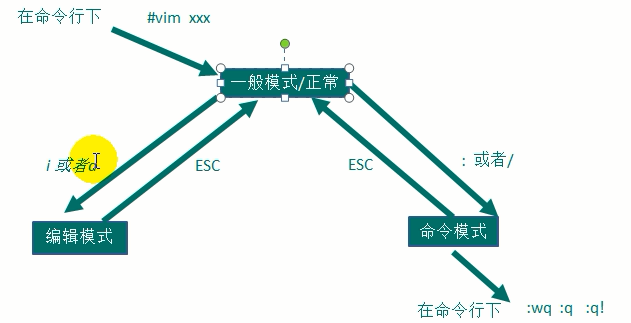

### 正常模式
- 可以使用快捷键
- 删除光标后字符 `x`
- 删除光标前字符 `X`
- 删除光标所在行 `dd`, 删除5行``5dd`
- 复制行`yy`,复制单词 `yw`, `#yy或#yw` #个字或行
- 粘帖 `p`
- 回到上一操作前状态 `u`
- `G`跳到末尾
- `gg`跳到行首
- control + u / d 翻半页

### 插入模式(修改内容)
- control + V 之后输入特殊字符比如 control + \

### 命令行模式(读取、存盘、替换、显示行号、退出vi等)
- 显示行号 `:set nu`
- 隐藏行号 `:set nonu`
- 跳到行 `:行号+回车` or `20 + shift + g`
- 查找 `/xxx+回车`  `n`后找  `N`前找
- :wq :q :q!