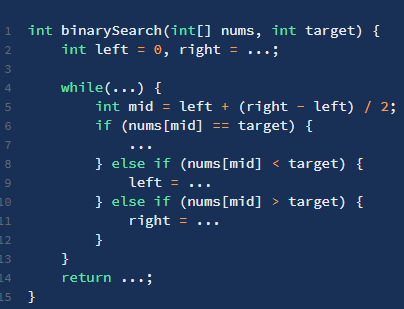

### 使用二分的条件(整数二分、浮点数二分)

1. 有单调性一定可以二分
2. 能用二分解的题不一定具有单调性
3. 有上下界

### 解题 3 步骤

1. 预处理：如果集合未排序,则进行排序
2. 二分查找：使用循环或递归在每次比较后将查找空间二分
   1. **先定义搜索区间**
   2. **根据搜索区间定义循环结束条件**
   3. 取中间元素和目标元素做对比(目标元素可能是需要找的元素或者是数组第一个/最后一个元素等)
   4. 根据比较的结果收缩区间,舍弃非法解
3. 后处理：在剩余空间中确定可行的候选者

### 常见变体

- 如果存在多个满足条件的元素,返回最左边满足条件的索引
- 如果存在多个满足条件的元素,返回最右边满足条件的索引
- 数组不是整体有序的,比如先升序再降序,或者先降序再升序
- 将一维数组变成二维数组
- 。。。

### framework

**很多人喜欢拿整型溢出的 bug 说事儿,但是二分查找真正的坑根本就不是那个细节问题,而是在于到底要给 mid 加一还是减一,while 里到底用 <= 还是 <**



> 1. 分析二分查找代码时,最好不要出现 else,全部展开成 else if 方便理解
> 2. 注意「搜索区间」和 while 的终止条件,如果存在漏掉的元素,记得在**最后检查**
> 3. 如需定义左闭右开的「搜索区间」搜索左右边界,只要在 `nums[mid] == target` 时做修改即可,搜索右侧时需要减一
> 4. 如果将「搜索区间」全都统一成两端都闭,好记,只要稍改 `nums[mid] == target` 条件处的代码和返回的逻辑即可

### some templates

#### 1 Basic Template

```javascript {.line-numbers}
//返回索引,arr必须提前排序
const binarySearch = (arr, target) => {
	const len = arr.length
	if (len === 0) return -1
	let l = 0,
		//Note 1
		r = len - 1,
		mid
	//Note 2
	while (l <= r) {
		//Maybe note
		mid = Math.floor(l + (r - l) / 2)
		if (arr[mid] === target) {
			return mid
		} else if (arr[mid] < target) {
			l = mid + 1
		} else if (arr[mid] > target) {
			//Note 3
			r = mid - 1
		}
	}
	//Maybe note
	return -1
}
```

#### 2 查找第一个值等于给定值的元素(左边界)

```javascript {.line-numbers}
//返回索引,arr必须提前排序
const binarySearchLeftBound = (arr, target) => {
	const len = arr.length
	if (len === 0) return -1
	let l = 0,
		r = len - 1,
		mid
	while (l <= r) {
		mid = Math.floor(l + (r - l) / 2)
		if (arr[mid] < target) {
			l = mid + 1
		} else if (arr[mid] > target) {
			r = mid - 1
		} else {
			//已搜到第一个或已找到
			//if (mid === 0 || arr[mid - 1] < target) {
			if (mid === 0 || arr[mid - 1] !== target) {
				return mid
				//继续收缩右边界
			} else {
				r = mid - 1
			}
		}
	}
	return -1
}
```

#### 3 查找最后一个值等于给定值的元素(右边界)

```javascript {.line-numbers}
//返回索引,arr必须提前排序
const binarySearch = (arr, target) => {
	const len = arr.length
	if (len === 0) return -1
	let l = 0,
		r = len - 1,
		mid
	while (l <= r) {
		mid = Math.floor(l + (r - l) / 2)
		if (arr[mid] < target) {
			l = mid + 1
		} else if (arr[mid] > target) {
			r = mid - 1
		} else {
			//已搜到最后一个或已找到
			//if (mid === len - 1 || arr[mid + 1] > target) {
			if (mid === len - 1 || arr[mid + 1] !== target) {
				return mid
			} else {
				l = mid + 1
			}
		}
	}
	return -1
}
```

#### 4 查找第一个大于等于给定值的元素

```javascript {.line-numbers}
const binarySearch = (arr, target) => {
	let l = 0,
		r = arr.length - 1,
		mid
	while (l <= r) {
		mid = Math.floor(l + (r - l) / 2)
		if (arr[mid] >= target) {
			if (mid === 0 || arr[mid - 1] < target) {
				return mid
			} else {
				r = mid - 1
			}
		} else {
			l = mid + 1
		}
	}
	return -1
}
```

#### 5 查找最后一个小于等于给定值的元素

```javascript {.line-numbers}
const binarySearch = (arr, target) => {
	const len = arr.length
	let l = 0,
		r = len - 1,
		mid
	while (l <= r) {
		mid = Math.floor(l + (r - l) / 2)
		if (arr[mid] <= target) {
			if (mid === len - 1 || arr[mid + 1] > target) {
				return mid
			} else {
				l = mid + 1
			}
		} else {
			r = mid - 1
		}
	}
	return -1
}
```

#### 6 寻找左侧边界的二分搜索(labuladuo version)

```javascript {.line-numbers}
const leftBound = (arr, target) => {
	let l = 0,
		//Note 1
		r = arr.length - 1
	//Note 2
	while (l <= r) {
		let mid = Math.floor(l + (r - l) / 2)
		if (arr[mid] < target) {
			//Note 3
			l = mid + 1
		} else if (arr[mid] > target) {
			//Note 3
			r = mid - 1
		} else if (arr[mid] === target) {
			//Note 3
			r = mid - 1
		}
	}
	//Note 4
	//检查出界情况
	if (l >= arr.length || arr[l] !== target) return -1
	return l
}
```

#### 7 寻找右侧边界的二分搜索(labuladuo version)

```javascript {.line-numbers}
const rightBound = (arr, target) => {
	let l = 0,
		r = arr.length - 1
	while (l <= r) {
		let mid = Math.floor(l + (r - l) / 2)
		if (arr[mid] < target) {
			l = mid + 1
		} else if (arr[mid] > target) {
			r = mid - 1
		} else if (arr[mid] === target) {
			l = mid + 1
		}
	}
	if (r < 0 || arr[r] !== target) return -1
	return r
}
```

### questions

#### [33.==搜索旋转排序数组==](https://leetcode-cn.com/problems/search-in-rotated-sorted-array/)

```javascript {.line-numbers}
var search = function (nums, target) {
	const len = nums.length
	if (len === 0) return -1
	let l = 0,
		r = len - 1,
		mid
	while (l <= r) {
		mid = Math.floor(l + (r - l) / 2)
		if (nums[mid] === target) return mid
		//看左边
		//in case mid === l 即下标相等
		//[start, mid]有序
		if (nums[mid] >= nums[l]) {
			if (target < nums[mid] && target >= nums[l]) {
				r = mid - 1
			} else {
				l = mid + 1
			}
			// [mid, end]有序
		} else {
			if (target > nums[mid] && target <= nums[r]) {
				l = mid + 1
			} else {
				r = mid - 1
			}
		}
	}
	return -1
}
```

#### [34.在排序数组中查找元素的第一个和最后一个位置](https://leetcode-cn.com/problems/find-first-and-last-position-of-element-in-sorted-array/)

```javascript {.line-numbers}
const binarySearch = (nums, target, lower) => {
	let l = 0,
		r = nums.length - 1,
		ret = nums.length
	while (l <= r) {
		const mid = Math.floor((l + r) / 2)
		if (nums[mid] > target || (lower && nums[mid] >= target)) {
			r = mid - 1
			ret = mid
		} else {
			l = mid + 1
		}
	}
	return ret
}

var searchRange = function (nums, target) {
	const ret = [-1, -1]
	const leftIdx = binarySearch(nums, target, true)
	const rightIdx = binarySearch(nums, target, false) - 1
	if (
		leftIdx <= rightIdx &&
		rightIdx < nums.length &&
		nums[leftIdx] === target &&
		nums[rightIdx] === target
	) {
		ret = [leftIdx, rightIdx]
	}
	return ret
}
```

#### [69. ==x 的平方根==](https://leetcode-cn.com/problems/sqrtx/)

```javascript {.line-numbers}
var mySqrt = function (x) {
	if (x < 2) return x
	let l = 0,
		r = x,
		mid
	while (l <= r) {
		mid = Math.floor(l + (r - l) / 2)
		if (mid * mid < x) {
			l = mid + 1
		} else if (mid * mid > x) {
			r = mid - 1
		} else {
			return mid
		}
	}
	//l > r即l = r + 1，返回较小数
	return r
}
```

#### [81.搜索旋转排序数组 II](https://leetcode-cn.com/problems/search-in-rotated-sorted-array-ii/)

```javascript {.line-numbers}
var search = function (nums, target) {
	const len = nums.length
	if (len === 0) return false
	let l = 0,
		r = len - 1,
		mid
	while (l <= r) {
		mid = Math.floor(l + (r - l) / 2)
		if (nums[mid] === target) return true

		//move left pointer to exclude repeat item, or we can not define the monotonic section
		if (nums[l] === nums[mid]) {
			l++
			continue
		}

		if (nums[mid] >= nums[l]) {
			if (target < nums[mid] && target >= nums[l]) {
				r = mid - 1
			} else {
				l = mid + 1
			}
		} else {
			if (target > nums[mid] && target <= nums[r]) {
				l = mid + 1
			} else {
				r = mid - 1
			}
		}
	}
	return false
}
```

#### [153.==寻找旋转排序数组中的最小值==](https://leetcode-cn.com/problems/find-minimum-in-rotated-sorted-array/)

```javascript {.line-numbers}
var findMin = function (nums) {
	const len = nums.length
	if (len === 0) return null
	if (len === 1) return nums[0]
	let l = 0,
		r = len - 1,
		mid
	//in case array is a sorted array
	if (nums[r] > nums[l]) return nums[0]
	while (l <= r) {
		mid = Math.floor(l + (r - l) / 2)
		//judge according to nums[mid]
		if (nums[mid] < nums[mid - 1]) return nums[mid]
		if (nums[mid] > nums[mid + 1]) return nums[mid + 1]
		//看右边
		if (nums[mid] < nums[len - 1]) {
			r = mid - 1
		} else {
			l = mid + 1
		}
	}
	return null
}

//better
var findMin = function (nums) {
	let l = 0
	let r = nums.length - 1
	while (l < r) {
		const mid = l + Math.floor((r - l) / 2)
		//所有数据不重复，即不存在(nums[mid] === nums[r]的情况
		//看右边
		if (nums[mid] < nums[r]) {
			r = mid
		} else {
			l = mid + 1
		}
	}
	return nums[l]
}
```

#### [367.==有效的完全平方数==](https://leetcode-cn.com/problems/valid-perfect-square/)

```javascript {.line-numbers}
var isPerfectSquare = function (num) {
	if (num < 2) return num
	let l = 0,
		r = num,
		mid
	while (l <= r) {
		mid = Math.floor(l + (r - l) / 2)
		if (mid * mid < num) {
			l = mid + 1
		} else if (mid * mid > num) {
			r = mid - 1
		} else if (mid * mid === num) {
			return true
		}
	}
	return false
}

//数学
var isPerfectSquare = function (num) {
	let x = 1,
		square = 1
	while (square <= num) {
		if (square === num) return true
		x++
		square = x * x
	}
	return false
}
```
