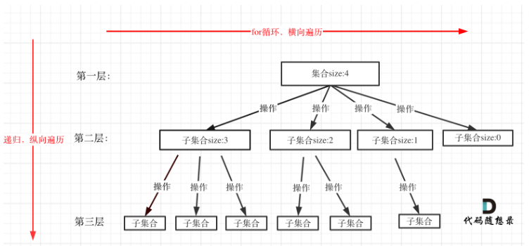
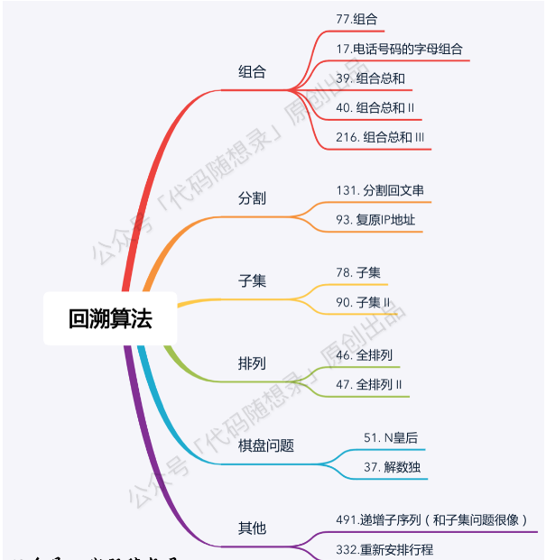

## concept

- **回溯法解决的问题都可以抽象为树形结构**

- **集合的大小就构成了树的宽度，递归的深度，都构成的树的深度**

  

- **一般来说：组合问题和排列问题是在树形结构的叶子节点上收集结果，而子集问题就是取树上所有节点的结果**

## questions



### [17.==电话号码的字母组合==](https://leetcode-cn.com/problems/letter-combinations-of-a-phone-number/)

```javascript
var letterCombinations = function (digits) {
	const ret = []
	if (!digits) return ret
	const hash = {
		2: 'abc',
		3: 'def',
		4: 'ghi',
		5: 'jkl',
		6: 'mno',
		7: 'pqrs',
		8: 'tuv',
		9: 'wxyz',
	}
	const dfs = (s, level) => {
		if (level === digits.length) {
			ret.push(s)
			return
		}
		for (let c of hash[digits[level]]) {
			//该问题传递的是字符串则可省略回溯的过程
			dfs(s + c, level + 1)
		}
	}
	//can pass more params if you want, like ret、hash、digits
	dfs('', 0)
	return ret
}
```

### [22.==括号生成==](https://leetcode-cn.com/problems/generate-parentheses/)

```javascript
//brute force O(2^3n * n) - O(n)
var generateParenthesis = function (n) {
	const ret = []
	const isValid = (s) => {
		let balance = 0
		for (let c of s) {
			if (c === '(') {
				balance++
			} else {
				balance--
			}
      //提前返回
			if (balance < 0) return false
		}
		return balance === 0
	}
	const dfs = (level, max, s) => {
		//1 recursion terminal
		if (level >= max) {
			if (isValid(s)) ret.push(s)
			return
		}
		//2 process logic of current level
		//3 drill down
		dfs(level + 1, max, `${s}(`)
		dfs(level + 1, max, `${s})`)
		//4 reverse current params if needed
	}
	//level, maxCount, pathStr
	dfs(0, 2 * n, '')
	return ret
}

//回溯 better
var generateParenthesis = function (n) {
	const ret = []
	const dfs = (l, r, max, s) => {
		if (l === max && r === max) {
			ret.push(s)
			return
		}
		//回溯的过程中直接剪枝掉无效的组合
		if (l < n) dfs(l + 1, r, max, s + '(')
		//回溯的过程中直接剪枝掉无效的组合
		if (l > r) dfs(l, r + 1, max, s + ')')
	}
	//pass ret if you want
	dfs(0, 0, n, '')
	return ret
}
```

### [36.==有效的数独==](https://leetcode-cn.com/problems/valid-sudoku/)

```javascript
var isValidSudoku = function (board) {
	const rows = {}, //记录每行对应的key
		columns = {}, //记录每列对应的key
		boxes = {} //记录每个小数独对应的key

	for (let i = 0; i < 9; i++) {
		for (let j = 0; j < 9; j++) {
			const num = board[i][j]
			if (num !== '.') {
				//计算子数独序号0 - 8
				const boxIdx = Number.parseInt(i / 3) * 3 + Number.parseInt(j / 3)
				if (
					rows[i + '-' + num] ||
					columns[j + '-' + num] ||
					boxes[boxIdx + '-' + num]
				)
					return false
				//标记
				rows[i + '-' + num] = true
				columns[j + '-' + num] = true
				boxes[boxIdx + '-' + num] = true
			}
		}
	}
	return true
}
```

### [77.==组合==](https://leetcode-cn.com/problems/combinations/)

```javascript {.line-numbers}
//dfs + backtrack 1
//best version
var combine = function (n, k) {
	const ret = []
	const dfs = (n, k, startIdx, path) => {
		if (path.length === k) {
			ret.push([...path])
			return
		}
		//剪枝，待组成的数凑不够k个
		for (let i = startIdx; i <= n - (k - path.length) + 1; i++) {
			path.push(i)
			dfs(n, k, i + 1, path)
			//backtrack [1,2...] ->  [1,3...] -> [2...]
			path.pop()
		}
	}
	dfs(n, k, 1, [])
	return ret
}

//dfs + backtrack 2
var combine = function (n, k) {
	const ret = []
	const dfs = (cur, n, k, path) => {
		//剪枝,当前选择个数 + 剩下的待选数不够k个
		if (path.length + (n - cur + 1) < k) return
		if (path.length === k) {
			ret.push(path)
			return
		}
		//选择当前数字
		dfs(cur + 1, n, k, [...path, cur])
		//不选当前数字
		dfs(cur + 1, n, k, path)
	}
	dfs(1, n, k, [])
	return ret
}
```

### [39.==组合总和==](https://leetcode-cn.com/problems/combination-sum/)

```javascript {.line-numbers}
//candidates无重复
//dfs + backtrack 1
var combinationSum = function (candidates, target) {
	const len = candidates.length,
		ret = []
	if (len === 0) return ret
	const dfs = (candidates, remain, startIdx, path) => {
		if (remain < 0) return
		if (remain === 0) {
			ret.push([...path])
			return
		}
		for (let i = startIdx; i < candidates.length; i++) {
			path.push(candidates[i])
			//可选重复元素
			dfs(candidates, remain - candidates[i], i, path)
			//backtrack
			path.pop()
		}
	}
	dfs(candidates, target, 0, [])
	return ret
}

//dfs + backtrack 2
var combinationSum = function (candidates, target) {
	const len = candidates.length,
		ret = []
	if (len === 0) return ret
	const dfs = (candidates, remain, start, path) => {
		//[2,3,6,7], 7,已选[2,2,2]
		if (remain < 0 || start >= candidates.length) return
		if (remain === 0) {
			ret.push(path)
			return
		}
		//choice
		//剪枝
		if (remain - candidates[start] >= 0) {
			dfs(candidates, remain - candidates[start], start, [
				...path,
				candidates[start],
			])
		}
		//no choice
		dfs(candidates, remain, start + 1, path)
	}
	dfs(candidates, target, 0, [])
	return ret
}
```

### [40.组合总和 II](https://leetcode-cn.com/problems/combination-sum-ii/)

```javascript {.line-numbers}
//candidates有重复
var combinationSum2 = function (candidates, target) {
	const len = candidates.length,
		ret = []
	if (len === 0) return ret
	//precondition!!!!!!!
	candidates.sort((a, b) => a - b)
	const dfs = (candidates, remain, begin, path) => {
		if (remain === 0) {
			ret.push([...path])
			return
		}
		for (let i = begin, len = candidates.length; i < len; i++) {
			//大剪枝:减去candidates[i]小于 0，减去后面的candidates[i + 1]、candidates[i + 2]肯定也小于 0
			if (remain - candidates[i] < 0) break
			//小剪枝:对同一层使用过相同数值的元素跳过
			if (i > begin && candidates[i - 1] === candidates[i]) continue
			path.push(candidates[i])
			dfs(candidates, remain - candidates[i], i + 1, path)
			path.pop()
		}
	}
	dfs(candidates, target, 0, [])
	return ret
}
```

### [46.==全排列 M==](https://leetcode-cn.com/problems/permutations/)

```javascript {.line-numbers}
//nums无重复
//dfs + backtrack
var permute = function (nums) {
	const len = nums.length,
		ret = []
	if (len === 0) return ret
	//space for time
	const visited = Array.from({ length: len }, () => false)

	const dfs = (nums, level, path) => {
		if (level >= nums.length) {
			ret.push([...path])
			return
		}
		//每次都从开头枚,visited标记是否使用过
		for (let i = 0, len = nums.length; i < len; i++) {
			if (visited[i]) continue
			visited[i] = true
			dfs(nums, level + 1, [...path, nums[i]])
			//backtrack
			visited[i] = false
		}
	}
	dfs(nums, 0, [])
	return ret
}
```

### [47.全排列 2 M](https://leetcode-cn.com/problems/permutations-ii/)

```javascript {.line-numbers}
//nums有重复
var permuteUnique = function (nums) {
	const len = nums.length,
		ret = []
	if (len === 0) return ret
	const visited = Array.from({ length: len }, () => false)
	//升序或者降序都可以，剪枝前提
	nums.sort((a, b) => a - b)
	const dfs = (nums, depth, path, visited) => {
		if (depth === nums.length) {
			ret.push([...path])
			return
		}
		for (let i = 0, len = nums.length; i < len; i++) {
			if (visited[i]) continue
			//剪枝
			//nums[i]和nums[i - 1]相同且前一个元素还没有被使用过,否则其在下层遍历肯定会出现
			if (i > 0 && nums[i] === nums[i - 1] && !visited[i - 1]) continue
			path.push(nums[i])
			visited[i] = true
			dfs(nums, depth + 1, path, visited)
			path.pop()
			visited[i] = false
		}
	}
	dfs(nums, 0, [], visited)
	return ret
}
```

### [78.==子集 M==](https://leetcode-cn.com/problems/subsets/)

```javascript {.line-numbers}
//backtrack 1
//best version
var subsets = function (nums) {
	const ret = []
	//start控制下层树枝的个数
	const dfs = (nums, startIdx, path) => {
		//在递归压栈前做事情,取的是所有树上的路径
		//该题不需要结束条件，全部遍历完即可
		//if (startIdx >= path.length) return
		ret.push([...path])
		for (let i = startIdx, len = nums.length; i < len; i++) {
			path.push(nums[i])
			dfs(nums, i + 1, path)
			path.pop()
		}
	}
	dfs(nums, 0, [])
	return ret
}

//backtrack 2
var subsets = function (nums) {
	const ret = []
	const dfs = (nums, index, path) => {
		if (index === nums.length) {
			ret.push([...path])
			return
		}
		path.push(nums[index])
		//choice
		dfs(nums, index + 1, path)
		path.pop()
		//no choice
		dfs(nums, index + 1, path)
	}
	dfs(nums, 0, [])
	return ret
}

//iteration
var subsets = function (nums) {
	const res = [[]]
	for (let i = 0; i < nums.length; i++) {
		//动态增加res
		res.forEach((item) => {
			res.push([...item, nums[i]])
		})
	}
	return res
}
```

### [90.子集 II](https://leetcode-cn.com/problems/subsets-ii/)

```javascript {.line-numbers}
var subsetsWithDup = function (nums) {
	const ret = []
	//precondition!!!
	nums.sort((a, b) => a - b)
	const dfs = (nums, start, path) => {
		ret.push([...path])
		for (let i = start, len = nums.length; i < len; i++) {
			//剪枝
			if (i > start && nums[i] === nums[i - 1]) continue
			path.push(nums[i])
			dfs(nums, i + 1, path)
			path.pop()
		}
	}
	dfs(nums, 0, [])
	return ret
}
```

### [93.复原 IP 地址](https://leetcode.cn/problems/restore-ip-addresses/)

```javascript {.line-numbers}
var restoreIpAddresses = function (s) {
	const ret = []
	backtracking(0, [])
	return ret
	function backtracking(startIdx, path) {
		const len = path.length
		if (len > 4) return
		//分成四段并且全部分割腕
		if (len === 4 && startIdx === s.length) {
			ret.push(path.join('.'))
			return
		}
		for (let j = startIdx; j < s.length; j++) {
			const str = s.slice(startIdx, j + 1)
			//剪枝
			if (str.length > 3 || +str > 255) break
			if (str.length > 1 && str[0] === '0') break
			//隐藏了回溯
			backtracking(j + 1, [...path, str])
		}
	}
}
```

### [51.==N 皇后 H==](https://leetcode-cn.com/problems/n-queens/)

```javascript {.line-numbers}
var solveNQueens = function (n) {
	if (n < 1) return []
	const solutions = [],
		cols = new Set(), //垂直线攻击位置
		pies = new Set(), //左对角线攻击位置
		nas = new Set() //右对角线攻击位置
	const dfs = (row, path) => {
		if (row >= n) {
			solutions.push([...path])
			return
		}
		//行通过层递进,这里遍历列
		for (let col = 0; col < n; col++) {
			if (cols.has(col) || pies.has(row + col) || nas.has(row - col)) continue
			cols.add(col)
			pies.add(row + col)
			nas.add(row - col)
			path.push(col)
			//drill down
			dfs(row + 1, path)
			//reverse
      path.pop()
			cols.delete(col)
			pies.delete(row + col)
			nas.delete(row - col)
		}
	}
	const generatorBoard = (solutions) => {
		return solutions.map((solution) => {
			return solution.map((position) => {
				return Array.from({ length: n }, (_, idx) => {
					return position === idx ? 'Q' : '.'
				}).join('')
			})
		})
	}
	dfs(0, [])
	return generatorBoard(solutions)
}
```

### [52. N 皇后 2 H](https://leetcode-cn.com/problems/n-queens-ii/)

```javascript {.line-numbers}
var totalNQueens = function (n) {
	if (n < 1) return []
	let ret = 0
	const cols = new Set(),
		pies = new Set(),
		nas = new Set()
	const dfs = (row) => {
		if (row >= n) {
			ret++
			return
		}
		for (let col = 0; col < n; col++) {
			if (cols.has(col) || pies.has(row + col) || nas.has(row - col)) continue
			cols.add(col)
			pies.add(row + col)
			nas.add(row - col)
			dfs(row + 1)
			cols.delete(col)
			pies.delete(row + col)
			nas.delete(row - col)
		}
	}
	dfs(0)
	return ret
}

//final bit version
var totalNQueens = function (n) {
	if (n < 1) return []
	let ret = 0

	const dfs = (n, row, col, pie, na) => {
		if (row >= n) {
			ret++
			return
		}

		//得到当前row所有可以放Queue空位
		//n位可放置的二进制数
		let bits = ~(col | pie | na) & ((1 << n) - 1)

		//直到没位置可放
		while (bits > 0) {
			//得到最低位的1的二进制数
			const p = bits & -bits
			//drill down next row
			dfs(n, row + 1, col | p, (pie | p) << 1, (na | p) >> 1)
			//打掉二进制数最后一位的1，即放上皇后
			bits &= bits - 1
		}
	}

	dfs(n, 0, 0, 0, 0)
	return ret
}
```

### [130.==被围绕的区域==](https://leetcode-cn.com/problems/surrounded-regions/)

```javascript {.line-numbers}
var solve = function (board) {
	if (!board || !Array.isArray(board) || board.length === 0) return board
	let row = board.length,
		col = board[0].length
	for (let i = 0; i < row; i++) {
		for (let j = 0; j < col; j++) {
			//from edge dfs for marking O to #
			let isEdge = i === 0 || j === 0 || i === row - 1 || j === col - 1
			if (isEdge && board[i][j] === 'O') {
				dfs(board, i, j, row, col)
			}
		}
	}
	for (let i = 0; i < row; i++) {
		for (let j = 0; j < col; j++) {
			//left O change to X
			if (board[i][j] === 'O') board[i][j] = 'X'
			//reverse O those can not be changed
			if (board[i][j] === '#') board[i][j] = 'O'
		}
	}

	function dfs(board, i, j, row, col) {
		if (
			i < 0 ||
			j < 0 ||
			i >= row ||
			j >= col ||
			board[i][j] === 'X' ||
			board[i][j] === '#'
		)
			return
		board[i][j] = '#'
		dfs(board, i - 1, j, row, col)
		dfs(board, i + 1, j, row, col)
		dfs(board, i, j - 1, row, col)
		dfs(board, i, j + 1, row, col)
	}
	return board
}
```

### [494.目标和](https://leetcode.cn/problems/target-sum/)

```javascript {.line-numbers}
var findTargetSumWays = function (nums, target) {
	let count = 0
	const backtrack = (nums, target, index, sum) => {
		if (index === nums.length) {
			if (sum === target) count++
		} else {
			backtrack(nums, target, index + 1, sum + nums[index])
			backtrack(nums, target, index + 1, sum - nums[index])
		}
	}
	backtrack(nums, target, 0, 0)
	return count
}
```

## 小岛问题

### [200.==岛屿数量==](https://leetcode-cn.com/problems/number-of-islands/)

```javascript {.line-numbers}
//DFS
var numIslands = function (grid) {
	let ret = 0
	if (!grid || !Array.isArray(grid) || grid.length === 0) return ret
	const row = grid.length,
		col = grid[0].length
	const dfs = (grid, i, j, row, col) => {
		if (i < 0 || j < 0 || i >= row || j >= col || grid[i][j] === '0') return
		//marked as zero
		grid[i][j] = '0'
		//四周外扩一格
		dfs(grid, i + 1, j, row, col)
		dfs(grid, i, j + 1, row, col)
		dfs(grid, i - 1, j, row, col)
		dfs(grid, i, j - 1, row, col)
	}
	for (let i = 0; i < row; i++) {
		for (let j = 0; j < col; j++) {
			if (grid[i][j] === '1') {
				ret++
				dfs(grid, i, j, row, col)
			}
		}
	}
	return ret
}

//BFS
var numIslands = function (grid) {
	let ret = 0
	if (!grid || !Array.isArray(grid) || grid.length === 0) return ret
	const m = grid.length,
		n = grid[0].length
	for (let i = 0; i < m; i++) {
		for (let j = 0; j < n; j++) {
			if (grid[i][j] === '1') {
				ret++
				//marked as zero
				grid[i][j] = 0
				//store each level's item
				const queue = []
				//二维转一维
				//queue.add(i * n + j);
				queue.push([i, j])
				while (queue.length > 0) {
					const cur = queue.shift(),
						x = cur[0],
						y = cur[1]
					//往左
					if (x - 1 >= 0 && grid[x - 1][y] === 1) {
						queue.push([x - 1, y])
						grid[x - 1][y] = 0
					}
					//往右
					if (x + 1 < m && grid[x + 1][y] === 1) {
						queue.push([x + 1, y])
						grid[x + 1][y] = 0
					}
					//往上
					if (y - 1 >= 0 && grid[x][y - 1] === 1) {
						queue.push([x, y - 1])
						grid[x][y - 1] = 0
					}
					//往下
					if (y + 1 < n && grid[x][y + 1] === 1) {
						queue.push([x, y + 1])
						grid[x][y + 1] = 0
					}
				}
			}
		}
	}
	return ret
}
```

### [463.岛屿的周长](https://leetcode-cn.com/problems/island-perimeter/)

```javascript {.line-numbers}
var islandPerimeter = function (grid) {
	if (!grid || !Array.isArray(grid) || grid.length === 0) return 0
	const rows = grid.length,
		cols = grid[0].length

	const dfs = (grid, i, j, rows, cols) => {
		//对应一条外边
		if (i < 0 || i >= rows || j < 0 || j >= cols) return 1
		//对应一条内边
		if (grid[i][j] === 0) return 1
		//遍历过的格子
		if (grid[i][j] !== 1) return 0
		//marked
		grid[i][j] = 2
		return (
			dfs(grid, i + 1, j, rows, cols) +
			dfs(grid, i, j + 1, rows, cols) +
			dfs(grid, i - 1, j, rows, cols) +
			dfs(grid, i, j - 1, rows, cols)
		)
	}
	for (let i = 0; i < rows; i++) {
		for (let j = 0; j < cols; j++) {
			if (grid[i][j] === 1) {
				//题目限制只有一个岛屿
				return dfs(grid, i, j, rows, cols)
			}
		}
	}
}
```

### [695.岛屿的最大面积](https://leetcode-cn.com/problems/max-area-of-island/)

```javascript {.line-numbers}
var maxAreaOfIsland = function (grid) {
	let ret = 0
	if (!grid || !Array.isArray(grid) || grid.length === 0) return ret
	const rows = grid.length,
		cols = grid[0].length

	const dfs = (grid, i, j, rows, cols) => {
		if (i < 0 || i >= rows || j < 0 || j >= cols || grid[i][j] !== '1') return 0
		//marked
		grid[i][j] = '2'
		return (
			1 +
			dfs(grid, i + 1, j, rows, cols) +
			dfs(grid, i, j + 1, rows, cols) +
			dfs(grid, i - 1, j, rows, cols) +
			dfs(grid, i, j - 1, rows, cols)
		)
	}
	for (let i = 0; i < rows; i++) {
		for (let j = 0; j < cols; j++) {
			if (grid[i][j] === '1') {
				//得到当次最大area
				const maxArea = dfs(grid, i, j, rows, cols)
				ret = Math.max(ret, maxArea)
			}
		}
	}
	return ret
}

//BFS
```

### [547.省份数量](https://leetcode-cn.com/problems/number-of-provinces/)

```javascript {.line-numbers}
var findCircleNum = function (M) {
	if (!M || !Array.isArray(M) || M.length === 0) return
	let len = M.length,
		visited = Array.from({ length: len }).fill(0),
		ret = 0

	let dfs = (i, M, len, visited) => {
		for (let j = 0; j < len; j++) {
			if (M[i][j] === 1 && visited[j] === 0) {
				//存在朋友圈即标注
				visited[j] = 1
				dfs(j, M, len, visited)
			}
		}
	}

	for (let i = 0; i < len; i++) {
		if (visited[i] === 0) {
			//visited[i] = 1
			dfs(i, M, len, visited)
			ret++
		}
	}
	return ret
}
```
