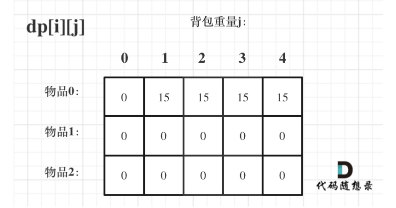
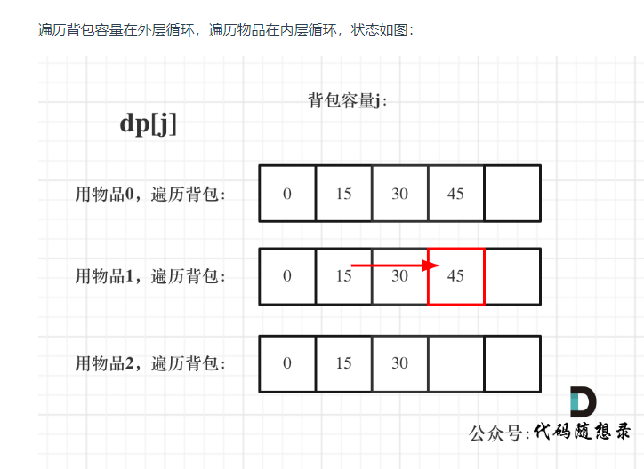

### 背包分类


### 01 背包

#### 题目

> 有 n 件物品和一个最多能装重量为 w 的背包。第 i 件物品的重量是 weight[i]，得到的价值是 value[i] 。**每件物品只能用一次**，求解将哪些物品装入背包里物品价值总和最大

#### 首先想到回溯

- 每一件物品只有两个状态，取或者不取，所以可以使用回溯法搜索出所有的情况，那么时间复杂度就是 O(2^n)，这里的 n 表示物品数量

  ```javascript
  function bag01(w, n, items, values) {
  	//存储背包中物品总价值的最大值
  	let maxValue = 0
  	dfs(0, 0, 0)
  	return maxValue
  	// cw表示当前已经装进去的物品的重量和
  	// cv表示当前已经装进去的物品的价值和
  	// i表示考察到哪个物品
  	function dfs(i, curWeight, curValue) {
  		// cw === w表示装满了;i === n表示已经考察完所有的物品
  		if (curWeight === w || i === n) {
  			if (curValue > maxValue) maxValue = curValue
  			return
  		}
  		// 不装第 i + 1 个物品
  		dfs(i + 1, curWeight, curValue)
  		// 不超过背包承受的重量再装
  		if (curWeight + items[i] <= w) {
  			// 装第 i + 1 个物品
  			dfs(i + 1, curWeight + items[i], curValue + values[i])
  		}
  	}
  }
  ```

#### DP 解法

##### dp 定义

dp\[i\]\[j\]表示从下标为[0-i]的物品里任意取，放进容量为 j 的背包，最大价值是多少

##### 递推公式

`dp[i][j] = max(dp[i - 1][j], dp[i - 1][j - weight[i]] + value[i])`

##### base case

- dp\[i\]\[0\]

  

- dp\[0\]\[j\] (当 j < weight[0]的时候，dp\[0\]\[j\] 是 0，因为背包容量比编号 0 的物品重量还小

  当 j >= weight[0]时，dp\[0\]\[j\] 应该是 value\[0\]，因为背包容量放足够放编号 0 物品)

  

- 初始化代码

  ```javascript
  let dp = Array.from({ length: items.length }, () =>
  	new Array(bagWeight + 1).fill(0)
  )
  for (let j = weight[0]; j <= bagWeight; j++) {
  	dp[0][j] = value[0]
  }
  ```

- 最终初始化 dp 如图

  

##### 遍历顺序

- **先遍历物品，再遍历背包**

  ```javascript
  for (let i = 1; i < weight.length; i++) {
  	for (let j = 1; j <= bagWeight; j++) {
  		if (j < weight[i]) {
  			dp[i][j] = dp[i - 1][j]
  		} else {
  			dp[i][j] = Math.max(dp[i - 1][j], dp[i - 1][j - weight[i]] + value[i])
  		}
  	}
  }
  ```

  

- 先遍历背包，再遍历物品

  ```javascript
  for (let j = 1; j <= bagWeight; j++) {
  	for (let i = 1; i < weight.length; i++) {
  		if (j < weight[i]) {
  			dp[i][j] = dp[i - 1][j]
  		} else {
  			dp[i][j] = Math.max(dp[i - 1][j], dp[i - 1][j - weight[i]] + value[i])
  		}
  	}
  }
  ```

  

- 最终 dp 结果


##### 完整代码

```javascript
const bag01 = (weight, value, bagWeight) => {
	const len = weight.length
	let dp = Array.from({ length: len }, () => new Array(bagWeight + 1).fill(0))
	//base case 第一行，第一列初始化已覆盖
	for (let j = weight[0]; j <= bagWeight; j++) dp[0][j] = value[0]
	//先遍历物品，再遍历背包更易于理解
	//第一行和第一列都已经初始化了
	for (let i = 1; i < len; i++) {
		for (let j = 1; j <= bagWeight; j++) {
			if (j < weight[i]) {
				dp[i][j] = dp[i - 1][j]
			} else {
				dp[i][j] = Math.max(dp[i - 1][j], dp[i - 1][j - weight[i]] + value[i])
			}
		}
	}
	return dp[len - 1][bagWeight]
}
console.log(bag01([1, 3, 4], [15, 20, 30], 4))
```

##### 状态压缩

###### dp 定义

dp[j]表示：容量为 j 的背包，所背的最大物品价值为 dp[j]

###### 递推公式

`dp[j] = max(dp[j], dp[j - weight[i]] + value[i])`

###### 初始化

dp[0] = 0, 其它根据递推公式初始化成 0 以防止被覆盖

###### ==遍历顺序==

1. 背包倒序遍历，保证物品 i 只被放入一次

2. 为什么二维 dp 数组历的时候不能倒序

   > 对于二维 dp，dp\[i\]\[j\]都是通过上一层即 dp\[i - 1\]\[j\]计算而来，只有前面的推导出来了才能正确推导出后面的 dp 数值，并且本层的 dp\[i\]\[j\]并不会被覆盖

3. 先遍历背包容量嵌套遍历物品

   > 滚动行没有更新完，即还未经过计算，直接被覆盖了
   >
   > 倒序遍历本质上还是一个对二维数组的遍历，并且右下角的值依赖上一层左上角的值，因此需要保证左边的值仍然是上一层的，从右向左覆盖

###### 完整代码

```javascript
const bag01Advanced = (weight, value, bagWeight) => {
	const len = weight.length
	//滚动行 + base case
	let dp = new Array(bagWeight + 1).fill(0)
	//必须先遍历物品，再遍历背包
	//背包必须倒序遍历，保证物品i只被放入一次，举例证明
	for (let i = 0; i < len; i++) {
		//结束条件为j >= 0则下面还需判断if (j - weight[i] >= 0) 才能推导
		for (let j = bagWeight; j >= weight[i]; j--) {
			dp[j] = Math.max(dp[j], dp[j - weight[i]] + value[i])
		}
	}
	return dp[bagWeight]
}
console.log(bag01Advanced([1, 3, 4], [15, 20, 30], 4))
```

### 完全背包(每个物品无限次)

- **在完全背包中，对于一维 dp 数组来说，循环顺序无所谓**

  > dp[j] 是根据 下标 j 之前所对应的 dp[j]计算出来的。 只要保证下标 j 之前的 dp[j]都是经过计算的就可以

- 先遍历物品

  ```javascript
  // 先遍历物品，再遍历背包
  for (let i = 0; i < weight.length; i++) {
  	for (let j = weight[i]; j <= bagWeight; j++) {
  		dp[j] = Math.max(dp[j], dp[j - weight[i]] + value[i])
  	}
  }
  ```

  

- 先遍历背包

  ```javascript
  // 先遍历背包，再遍历物品
  for (let j = 0; j <= bagWeight; j++) {
  	for (let i = 0; i < weight.length; i++) {
  		if (j - weight[i] >= 0) {
  			dp[j] = Math.max(dp[j], dp[j - weight[i]] + value[i])
  		}
  	}
  }
  ```

  

- 最终 dp 图


##### 完整代码

```javascript
// 先遍历物品，再遍历背包
const bagComplete1 = (weight, value, bagWeight) => {
	let dp = new Array(bagWeight + 1).fill(0)
	for (let i = 0; i < weight.length; i++) {
		for (let j = weight[i]; j <= bagWeight; j++) {
			dp[j] = Math.max(dp[j], dp[j - weight[i]] + value[i])
		}
	}
	console.log(dp)
}

// 先遍历背包，再遍历物品
const bagComplete2 = (weight, value, bagWeight) => {
	let dp = new Array(bagWeight + 1).fill(0)
	for (let j = 0; j <= bagWeight; j++) {
		for (let i = 0; i < weight.length; i++) {
			if (j >= weight[i]) dp[j] = Math.max(dp[j], dp[j - weight[i]] + value[i])
		}
	}
	console.log(dp)
}
console.log(bagComplete1([1, 3, 4], [15, 20, 30], 4))
```

### 总结

- 01 背包二维物品、背包先后遍历顺序无所谓
- 01 背包状态压缩版，必须**先物品再背包**
  - **背包倒序遍历，防止物品被放置多次**
  - 防止下层数据被提前覆盖，即从右向左覆盖，本质是右下角的数据依赖上层左上角的数据
- 完全背包状态压缩版，遍历顺序无所谓
- 01 背包变体
  - 纯 01 背包：问装满这个容器的最大价值
  - 分割等和子集：问能不能装满
  - 最后一块石头：问最多能装多少
  - 目标和：装满这个背包有多少种方法: `dp[j] += dp[j - nums[i]]`
  - 一和零：装满背包(二维)最多有多少个物品：`dp[i][j] = max(dp[i - x][j - y] + 1, dp[i][j])`
- 完全背包变体
  - 纯完全背包：问装满这个容器的最大价值
  - 装满这个背包有多少种方法
    - 组合数：先遍历物品再遍历背包（零钱兑换 2）
    - 排列数：先遍历背包再遍历物品（组合总和 4）
  - 装满这个背包最少用多少件物品（零钱兑换、完全平方数）
    - `dp[j] = min(dp[j - coins[i]] + 1, dp[j])`
    - 与先遍历物品还是背包无关
