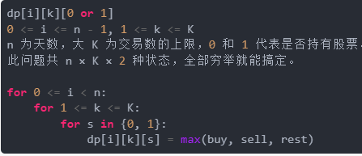
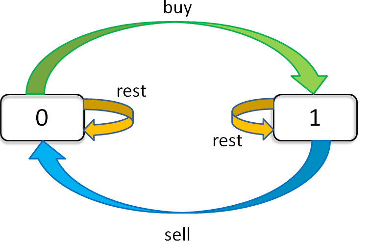

## 思路

1. dp定义: 第i天，k第i天的最大交易次数上限，0 不持有， 1持有

   

2. 递推公式

   **dp\[i\]\[k\]\[1\]今天选择buy的时候前一天k为什么减1**

   

   ```markdown
   对于dp[i][k][0] = max(dp[i-1][k][0], dp[i-1][k][1] + prices[i])
                 max( 今天选择 rest,        今天选择 sell      )
                 
   1、昨天就没有持有，且截至昨天最大交易次数限制为k；今天选择rest，所以今天还是没有持有，最大交易次数限制依然为k
   2、昨天持有股票，且截至昨天最大交易次数限制为k；但是今天sell了，所以今天没有持有股票了，最大交易次数限制依然为k
   
   对于dp[i][k][1] = max(dp[i-1][k][1], dp[i-1][k-1][0] - prices[i])
                 max( 今天选择 rest,         今天选择 buy        )
   1、昨天就持有着股票，且截至昨天最大交易次数限制为k；然后今天选择rest，所以今天还持有着股票，最大交易次数限制依然为k
   2、昨天没有持有，且截至昨天最大交易次数限制为k - 1；但今天我选择buy，所以今天持有股票，最大交易次数限制为k
   ```

3. 根据递推公式确定base case

   

4. 确定状态的遍历顺序（多状态的遍历先后）

5. 举例推导 dp 数组(打印 dp 数组)

## 股票系列问题

### [121. 买股票的最佳时机](https://leetcode-cn.com/problems/best-time-to-buy-and-sell-stock/)

```javascript {.line-numbers}
//找出买卖一次可获得最大利润的那次
//brute force O(n^2) - O(1) TLE
//枚举所有情况，找出最大的结果
var maxProfit = function (prices) {
	if (!prices) return 0
	const len = prices.length
	if (len < 2) return 0
	let maxProfit = 0,
		profit
	//loop every two different days
	for (let i = 0; i < len - 1; i++) {
		for (let j = i + 1; j < len; j++) {
			profit = prices[j] - prices[i]
			if (profit > maxProfit) maxProfit = profit
		}
	}
	return maxProfit
}

//DP 未考虑状态持有还是未持有 O(n) - O(n)
var maxProfit = function (prices) {
	if (!prices) return 0
	const len = prices.length
	if (len < 2) return 0
	let minPrice = prices[0]
	//dp[i] 表示前i天的最大利润
	//dp[i] = max(dp[i - 1], price[i] - minPrice)
	let dp = new Array(len).fill(0)
	for (let i = 1; i < len; i++) {
		minPrice = Math.min(minPrice, prices[i])
		dp[i] = Math.max(dp[i - 1], prices[i] - minPrice)
	}
	return dp[len - 1]
}

//DP 考虑状态持有还是未持有 O(n) - O(n)
var maxProfit = function (prices) {
	if (!prices) return 0
	const len = prices.length
	if (len < 2) return 0
	let dp = Array.from({length: len}, () => new Array(2).fill(0))
  //0 不持有 1 持有
  dp[0][0] = 0
  dp[0][1] = -prices[0]
	for (let i = 1; i < len; i++) {
		 dp[i][0] = Math.max(dp[i - 1][0], dp[i - 1][1] + prices[i])
     dp[i][1] = Math.max(dp[i - 1][1], -prices[i])
	}
	return dp[len - 1][0]
}

//DP状态压缩 考虑状态持有还是未持有 O(n) - O(n)
var maxProfit = function (prices) {
	if (!prices) return 0
	const len = prices.length
	if (len < 2) return 0
	let dp_i_0 = 0,
		dp_i_1 = -Infinity
  //当使用变量，必须从0开始推导, for example [1, 2]
	for (let i = 0; i < len; i++) {
		dp_i_0 = Math.max(dp_i_0, dp_i_1 + prices[i])
    dp_i_1 = Math.max(dp_i_1, -prices[i])
	}
	return dp_i_0
}

//O(n) - O(1)
var maxProfit = function (prices) {
	if (!prices) return 0
	const len = prices.length
	if (len < 2) return 0
	//维护最小价格和最大利润
	let maxProfit = 0,
		minPrice = Infinity
	for (let i = 0; i < len; i++) {
		//直接check比判断if (prices[i] < minPrice)清秀
		minPrice = Math.min(minPrice, prices[i])
		//直接check比判断prices[i] - minPrice > maxProfit清秀
		maxProfit = Math.max(maxProfit, prices[i] - minPrice)
	}
	return maxProfit
}
```

### [122. 买卖股票的最佳时机 II](https://leetcode-cn.com/problems/best-time-to-buy-and-sell-stock-ii/)

```javascript {.line-numbers}
//DFS TLE
var maxProfit = function (prices) {
	let len = prices.length
	if (len < 2) return 0
	let ret = 0
	//idx当前是第几天，从 0 开始
	//status 0 表示不持有股票，1表示持有股票
	//curProfit当前收益
	const dfs = (prices, idx, status, profit) => {
		if (idx >= prices.length) {
			if (profit > ret) ret = profit
		}
		dfs(prices, idx + 1, status, profit)
		if (status === 0) {
			dfs(prices, idx + 1, 1, profit - prices[idx])
		} else {
			dfs(prices, idx + 1, 0, profit + prices[idx])
		}
	}
	dfs(prices, 0, 0, 0)
	return ret
}

//Greedy
//计算的过程并不是实际的交易过程，收益被分成了若干个阶段
var maxProfit = function (prices) {
	let ret = 0
	let len = prices.length
	if (len < 2) return 0
	for (let i = 1; i < len; i++) {
		//profit += Math.max(prices[i] - prices[i - 1], 0);
		// if (prices[i] > prices[i - 1]) {
		// 	profit += prices[i] - prices[i - 1]
		// }
		ret += Math.max(prices[i] - prices[i - 1], 0)
	}
	return ret
}

//DP O(n)-O(n)
var maxProfit = function (prices) {
	let len = prices.length
	if (len < 2) return 0
	const dp = Array.from({ length: len }, () => new Array(2))
	//base case
	dp[0][0] = 0
	dp[0][1] = -prices[0]
	for (let i = 1; i < len; i++) {
		dp[i][0] = Math.max(dp[i - 1][0], dp[i - 1][1] + prices[i])
		dp[i][1] = Math.max(dp[i - 1][1], dp[i - 1][0] - prices[i])
	}
	return dp[len - 1][0]
}

//DP 分开定义 O(n)-O(n)
var maxProfit = function (prices) {
	let len = prices.length
	if (len < 2) return 0
	let cash = new Array(len)
	let hold = new Array(len)
	cash[0] = 0
	hold[0] = -prices[0]
	for (let i = 1; i < len; i++) {
		cash[i] = Math.max(cash[i - 1], hold[i - 1] + prices[i])
		hold[i] = Math.max(hold[i - 1], cash[i - 1] - prices[i])
	}
	return cash[len - 1]
}

//DP O(n)-O(1)
var maxProfit = function (prices) {
	let len = prices.length
	if (len < 2) return 0
	let dp_i_0 = 0,
		dp_i_1 = -Infinity
	for (let i = 0; i < len; i++) {
    const temp = dp_i_0
		dp_i_0 = Math.max(dp_i_0, dp_i_1 + prices[i])
		dp_i_1 = Math.max(dp_i_1, temp - prices[i])
	}
	return dp_i_0
}
```

### [123. 买卖股票的最佳时机 III](https://leetcode.cn/problems/best-time-to-buy-and-sell-stock-iii/)

```javascript {.line-numbers}
var maxProfit = function (prices) {
	const len = prices.length
	if (len < 2) return 0
	let dp = Array.from({ length: len }, () =>
		new Array(2 + 1).fill(0).map(() => new Array(2).fill(0))
	)
	for (let i = 0; i < len; i++) {
		for (let k = 2; k >= 1; k--) {
			if (i - 1 === -1) {
				// base case
				dp[i][k][0] = 0
				dp[i][k][1] = -prices[i]
				continue
			}
			dp[i][k][0] = Math.max(dp[i - 1][k][0], dp[i - 1][k][1] + prices[i])
			dp[i][k][1] = Math.max(dp[i - 1][k][1], dp[i - 1][k - 1][0] - prices[i])
		}
	}
	return dp[len - 1][2][0]
}

var maxProfit = function (prices) {
	// base case
	let dp_i10 = 0,
		dp_i11 = -Infinity
	let dp_i20 = 0,
		dp_i21 = -Infinity
	for (let price of prices) {
		dp_i20 = Math.max(dp_i20, dp_i21 + price)
		dp_i21 = Math.max(dp_i21, dp_i10 - price)
		dp_i10 = Math.max(dp_i10, dp_i11 + price)
		dp_i11 = Math.max(dp_i11, -price)
	}
	return dp_i20
}
```

### [188. ==买卖股票的最佳时机== IV](https://leetcode.cn/problems/best-time-to-buy-and-sell-stock-iv/)

```javascript {.line-numbers}
var maxProfit = function (k, prices) {
	const len = prices.length
	if (len < 2) return 0
	let dp = Array.from({ length: len }, () =>
		new Array(k + 1).fill(0).map(() => new Array(2).fill(0))
	)
  for (let i = 0; i< len; i++) {
    dp[i][0][0] = 0
    dp[i][0][1] = -Infinity
  }
	for (let i = 0; i < len; i++) {
		for (let k1 = k; k1 >= 1; k1--) {
			if (i - 1 === -1) {
				// base case
				dp[i][k1][0] = 0
				dp[i][k1][1] = -prices[i]
				continue
			}
			dp[i][k1][0] = Math.max(dp[i - 1][k1][0], dp[i - 1][k1][1] + prices[i])
			dp[i][k1][1] = Math.max(dp[i - 1][k1][1], dp[i - 1][k1 - 1][0] - prices[i])
		}
	}
	return dp[len - 1][k][0]
}
```

### [309. 最佳买卖股票时机含冷冻期](https://leetcode.cn/problems/best-time-to-buy-and-sell-stock-with-cooldown/)

```javascript {.line-numbers}
var maxProfit = function (prices) {
	const len = prices.length
  if (len < 2) return 0
	let dp = Array.from({ length: len }, () => new Array(2))
	dp[0][0] = 0
	dp[0][1] = -prices[0]
	dp[1][0] = Math.max(dp[0][0], dp[0][1] + prices[1])
	dp[1][1] = Math.max(dp[0][1], -prices[1])
	for (let i = 2; i < len; i++) {
		dp[i][0] = Math.max(dp[i - 1][0], dp[i - 1][1] + prices[i])
		dp[i][1] = Math.max(dp[i - 1][1], dp[i - 2][0] - prices[i])
	}
	return dp[len - 1][0]
}


var maxProfit = function (prices) {
	const len = prices.length
	if (len < 2) return 0
	let dp_i_0 = 0,
		dp_i_1 = -Infinity,
		dp_pre_0 = 0 // 代表 dp[i-2][0]
	for (let i = 0; i < len; i++) {
		const temp = dp_i_0
		dp_i_0 = Math.max(dp_i_0, dp_i_1 + prices[i])
		dp_i_1 = Math.max(dp_i_1, dp_pre_0 - prices[i])
		dp_pre_0 = temp
	}
	return dp_i_0
}
```

### [714. 买卖股票的最佳时机含手续费](https://leetcode.cn/problems/best-time-to-buy-and-sell-stock-with-transaction-fee/)

```javascript {.line-numbers}
var maxProfit = function (prices, fee) {
	const len = prices.length
  if (len < 2) return 0
	let dp = Array.from({ length: len }, () => new Array(2))
	dp[0][0] = 0
	dp[0][1] = -prices[0] - fee
	for (let i = 1; i < len; i++) {
		dp[i][0] = Math.max(dp[i - 1][0], dp[i - 1][1] + prices[i])
		dp[i][1] = Math.max(dp[i - 1][1], dp[i - 1][0] - prices[i] - fee)
	}
	return dp[len - 1][0]
}


var maxProfit = function (prices, fee) {
	const len = prices.length
	if (len < 2) return 0
	let dp_i_0 = 0,
		dp_i_1 = -Infinity
	for (let i = 0; i < len; i++) {
		const temp = dp_i_0
		dp_i_0 = Math.max(dp_i_0, dp_i_1 + prices[i])
		dp_i_1 = Math.max(dp_i_1, temp - prices[i] - fee)
		dp_pre_0 = temp
	}
	return dp_i_0
}
```
