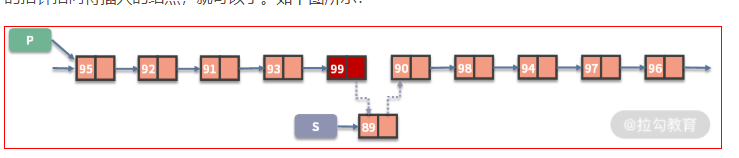
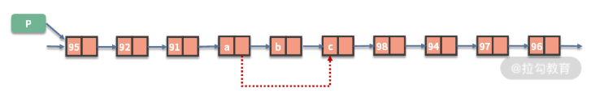

## 1 心得

- 一个原则: 画图
- 两种题型: 指针的修改、链表的拼接
- 三个注意: 环、边界、递归
- 四个技巧:
  - 虚拟头
    - 若题目的头节点可能被移除/会变，则可以使用虚拟头节点，这样头节点就变成了中间节点，就不需要为头节点做特殊判断
    - 通过在合适的时候断开链接，返回链表的中间节点
  - 快慢指针
  - 穿针引线
  - 先穿再排后判空
- Other: 若你想递归和迭代都写, 推荐前序遍历,因为前序遍历很容易改成迭代,准确的说前序遍历容易改成不需要栈的递归,而后续遍历则需要借助栈来完成
- Summary: 如果是单链表,我们无法在`O(1)`的时间拿到前驱节点,这也是为什么我们遍历的时候老是维护一个前驱节点`pre`的原因。但是本质原因其实是链表的增删操作都依赖前驱节点。这是链表的基本操作,是链表的特性天生决定的

- ==上一行的赋值右边为下一行的赋值左边，赋值的时候从左边思考好理解==

## 2 insert & delete

- 插入

```javascript
//pre待插入位置的前驱节点
next = pre.next
pre.next = targetInsertNode
targetInsertNode.next = next
```



- 删除

```javascript
//pre待删除节点的前驱节点
pre.next = 待删除位置的前驱节点.next.next
```




## 3 questions

### [2. 两数相加](https://leetcode-cn.com/problems/add-two-numbers/)

```javascript {.line-numbers}
var addTwoNumbers = function (l1, l2) {
	const dummyHead = new ListNode(-1)
	let p1 = l1,
		p2 = l2,
		cur = dummyHead,
		carry = 0
	while (p1 || p2) {
		const x = p1 !== null ? p1.val : 0
		const y = p2 !== null ? p2.val : 0
		const sum = x + y + carry
		carry = sum >= 10 ? 1 : 0
		cur.next = new ListNode(sum % 10)
		// update cur
		cur = cur.next
		if (p1 !== null) p1 = p1.next
		if (p2 !== null) p2 = p2.next
	}
	//最后的进位
	if (carry === 1) cur.next = new ListNode(carry)
	return dummyHead.next
}
```

### [19. ==删除链表的倒数第 N 个节点==](https://leetcode-cn.com/problems/remove-nth-node-from-end-of-list/)

```javascript {.line-numbers}
//basic version
var removeNthFromEnd = function (head, n) {
	const dummyHead = new ListNode(-1, head)
	const len = getLen(head)
	let cur = dummyHead
  //找到要删除节点的前驱结点
	for (let i = 0; i < len - n; i++) cur = cur.next
	cur.next = cur.next.next
	return dummyHead.next

	function getLen(head) {
		let len = 0
		while (head) {
			len++
			head = head.next
		}
		return len
	}
}

//O(n) - O(1)
//fast slow pointer
var removeNthFromEnd = function (head, n) {
	const dummyHead = new ListNode(-1, head)
	let fast = dummyHead,
		slow = dummyHead
	//移完后fast和slow的距离是n
	while (n >= 0) {
		fast = fast.next
		n--
	}
	//说明要删除的是头结点
	if (!fast) return head.next
	//同步走，slow走到要删除节点的前驱节点
	while (fast) {
		fast = fast.next
		slow = slow.next
	}
	slow.next = slow.next.next
	return dummyHead.next
}
```

### [21. ==合并两个有序链表==](https://leetcode-cn.com/problems/merge-two-sorted-lists/)

```javascript {.line-numbers}
//iteration
var mergeTwoLists = function (list1, list2) {
	const dummyHead = new ListNode(-1)
	let cur = dummyHead
	while (list1 && list2) {
		if (list1.val < list2.val) {
			cur.next = list1
			list1 = list1.next
		} else {
			cur.next = list2
			list2 = list2.next
		}
		//update cur
		cur = cur.next
	}
	//合并后 l1 和 l2 至多只有一个还未被合并完,将链表末尾指向未合并完的链表
	cur.next = list1 || list2
	return dummyHead.next
}

//recursion
var mergeTwoLists = function (list1, list2) {
	if (list1 == null) {
		return list2
	} else if (list2 == null) {
		return list1
	} else if (list1.val < list2.val) {
		list1.next = mergeTwoLists(list1.next, list2)
		//返回当前递归的头结点
		return list1
	} else {
		list2.next = mergeTwoLists(list1, list2.next)
		//同上
		return list2
	}
}
```

### [23. 合并 K 个排序链表 H](https://leetcode-cn.com/problems/merge-k-sorted-lists/)

```javascript {.line-numbers}
//O(KN) - O(n)
var mergeKLists = function (lists) {
	const len = lists.length
	if (len === 0) return null
	const mergeTwoLists = (l1, l2) => {
		if (!l1) return l2
		if (!l2) return l1
		if (l1.val < l2.val) {
			l1.next = mergeTwoLists(l1.next, l2)
			return l1
		} else {
			l2.next = mergeTwoLists(l1, l2.next)
			return l2
		}
	}
	let ret = lists[0]
	for (let i = 1; i < len; i++) {
		ret = mergeTwoLists(ret, lists[i])
	}
	return ret
}

//use array
var mergeKLists = function (lists) {
	const len = lists.length
	if (len === 0) return null
	const arr = []
	let cur
	//add each node's val to arr
	lists.forEach((list) => {
		cur = list
		while (cur) {
			arr.push(cur.val)
			cur = cur.next
		}
	})

	const dummyHead = new ListNode(-1)
	cur = dummyHead
	let node

	arr
		.sort((a, b) => a - b)
		.forEach((val) => {
			node = new ListNode(val)
			cur.next = node
			cur = cur.next
		})
	return dummyHead.next
}

//O(NlogK) - O(n) 分治
var mergeKLists = function (lists) {
	const len = lists.length
	if (len === 0) return null

	const mergeTwoLists = (l1, l2) => {
		if (!l1) return l2
		if (!l2) return l1

		if (l1.val < l2.val) {
			l1.next = mergeTwoLists(l1.next, l2)
			return l1
		} else {
			l2.next = mergeTwoLists(l1, l2.next)
			return l2
		}
	}

	const merge = (left, right) => {
		if (left === right) return lists[left]
		let mid = Math.floor((left + right) >> 1)
		let l1 = merge(left, mid)
		let l2 = merge(mid + 1, right)
		return mergeTwoLists(l1, l2)
	}
	return merge(0, len - 1)
}
```

### [24. ==两两交换链表==](https://leetcode-cn.com/problems/swap-nodes-in-pairs/)

```javascript {.line-numbers}
//iteration, three pointer  O(n) - O(1)
var swapPairs = function (head) {
	const dummyHead = new ListNode(-1, head)
	let cur = dummyHead
	//够2个才换
	while (cur.next && cur.next.next) {
		const first = cur.next
		const second = first.next
		first.next = second.next
		second.next = first
		cur.next = second
		cur = cur.next.next
	}
	return dummyHead.next
}

//recursion
var swapPairs = function (head) {
	//当前没有节点或者只有一个节点,不需要交换
	if (!head || !head.next) return head
	// 需要交换的两个节点是 head 和 head.next
	const first = head,
		second = head.next
	// first连接后面交换完成的子链表的头节点
	first.next = swapPairs(second.next)
	second.next = first
	// 返回当前层交换完的子链表,second变成了头结点
	return second
}
```

### [25. K 个一组翻转链表 H](https://leetcode-cn.com/problems/reverse-nodes-in-k-group/)

```javascript {.line-numbers}
var reverseKGroup = function (head, k) {
	let a = head,
		b = head
	//遍历完b变成了下次翻转的头结点
	for (let i = 0; i < k; i++) {
		//不够数量直接返回
		if (!b) return head
		b = b.next
	}
	const newHead = reverse(a, b)
	a.next = reverseKGroup(b, k)
	return newHead
}
function reverse(a, b) {
	let prev = null,
		cur = a,
		next
	while (cur !== b) {
		next = cur.next
		cur.next = prev
		prev = cur
		cur = next
	}
	return prev
}
```

### [61. ==旋转链表==](https://leetcode-cn.com/problems/rotate-list/)

```javascript {.line-numbers}
var rotateRight = function (head, k) {
	if (k === 0 || !head || !head.next) return head
	let len = 1,
		cur = head
	//get length
	//len initial is 1, so from cur.next begin loop， or cur.next = head throw null error
	while (cur.next) {
		cur = cur.next
		len++
	}
	// 当k大于长度时, 又是一个轮回, 所以对长度取余
	const num = k % len
	// 不需要旋转
	if (num === 0) return head
	//form ring
	cur.next = head
	let index = 1,
		newTail = head
	//find new tail
	while (index < len - num) {
		newTail = newTail.next
		index++
	}
	const newHead = newTail.next
	//break ring
	newTail.next = null
	return newHead
}
```

### [82. 删除排序链表中的重复元素 II](https://leetcode-cn.com/problems/remove-duplicates-from-sorted-list-ii/)

```javascript {.line-numbers}
var deleteDuplicates = function (head) {
	if (!head) return head
	let dummyHead = new ListNode(-1, head)
	let cur = dummyHead
	while (cur.next && cur.next.next) {
		if (cur.next.val === cur.next.next.val) {
			const x = cur.next.val
			while (cur.next && cur.next.val === x) {
				cur.next = cur.next.next
			}
		} else {
			cur = cur.next
		}
	}
	return dummyHead.next
}
```

### [83. 删除排序链表中的重复元素](https://leetcode-cn.com/problems/remove-duplicates-from-sorted-list/)

```javascript {.line-numbers}
var deleteDuplicates = function (head) {
	let cur = head
	while (cur && cur.next) {
		if (cur.val === cur.next.val) {
			cur.next = cur.next.next
		} else {
			cur = cur.next
		}
	}
	return head
}

var deleteDuplicates = function (head) {
	if (!head) return null
	let fast = head,
		slow = head
	while (fast) {
		if (fast.val !== slow.val) {
			slow.next = fast
			slow = slow.next
		}
		fast = fast.next
	}
	slow.next = null
	return head
}
```

### [86. ==分隔链表==](https://leetcode-cn.com/problems/partition-list/)

```javascript {.line-numbers}
//O(n) - O(1)
var partition = function (head, x) {
	const dummyBefore = new ListNode(-1),
		dummyAfter = new ListNode(-1)
	let before = dummyBefore,
		after = dummyAfter
	//build before List and after List
	while (head) {
		if (head.val < x) {
			before.next = head
			before = before.next
		} else {
			after.next = head
			after = after.next
		}
		head = head.next
	}
	after.next = null
	before.next = dummyAfter.next
	return dummyBefore.next
}
```

### [92. 反转链表 II](https://leetcode-cn.com/problems/reverse-linked-list-ii/)

```javascript {.line-numbers}
//loop once
var reverseBetween = function (head, left, right) {
	const dummyHead = new ListNode(-1)
	dummyHead.next = head
	let pre = dummyHead
	for (let i = 0; i < left - 1; i++) {
		pre = pre.next
	}

	let cur = pre.next
	for (let i = 0; i < right - left; i++) {
		const next = cur.next
		//按顺序穿
		cur.next = next.next
		next.next = pre.next
		pre.next = next
	}
	return dummyHead.next
}
```

### [106. 相交链表](https://leetcode-cn.com/problems/intersection-of-two-linked-lists/)

```javascript {.line-numbers}
var getIntersectionNode = function (headA, headB) {
	if (headA == null || headB == null) return null
	let pa = headA,
		pb = headB
	while (pa != pb) {
		pa = pa == null ? headB : pa.next
		pb = pb == null ? headA : pb.next
	}
	return pa
}
```

### [109. 有序链表转换二叉搜索树](https://leetcode-cn.com/problems/convert-sorted-list-to-binary-search-tree/)

```javascript {.line-numbers}
var sortedListToBST = function (head) {
	const getMedian = (left, right) => {
		let fast = (slow = left)
		while (fast !== right && fast.next !== right) {
			fast = fast.next.next
			slow = slow.next
		}
		return slow
	}

	const buildTree = (left, right) => {
		if (left === right) return null
		const mid = getMedian(left, right)
		const root = new TreeNode(mid.val)
		//左闭右开
		root.left = buildTree(left, mid)
		root.right = buildTree(mid.next, right)
		return root
	}
	//左闭右开
	return buildTree(head, null)
}
```

### [138. 复制带随机指针的链表](https://leetcode-cn.com/problems/copy-list-with-random-pointer/)

```javascript {.line-numbers}
//O(n) - O(n)
var copyRandomList = function (head) {
	const getCloneNode = (node) => {
		if (node) {
			if (visited.has(node)) {
				return visited.get(node)
			} else {
				visited.set(node, new Node(node.val, null, null))
				return visited.get(node)
			}
		}
		return null
	}

	if (!head) return null
	// Visited dictionary to hold old node reference as "key" and new node reference as the "value"
	const visited = new Map()
	let oldNode = head
	let newNode = new Node(oldNode.val)
	visited.set(oldNode, newNode)
	while (oldNode) {
		newNode.random = getCloneNode(oldNode.random)
		newNode.next = getCloneNode(oldNode.next)

		//move pointer forward,fill the attribute afterward
		oldNode = oldNode.next
		newNode = newNode.next
	}
	return visited.get(head)
}

//O(n) - O(1) 很难想出来
var copyRandomList = function (head) {
	if (!head) return null
	let ptr = head
	//A->A'->B->B'->C->C'
	while (ptr != null) {
		const newNode = new Node(ptr.val)
		newNode.next = ptr.next
		ptr.next = newNode
		ptr = newNode.next
	}
	ptr = head
	//link the random pointer
	while (ptr != null) {
		ptr.next.random = ptr.random != null ? ptr.random.next : null
		ptr = ptr.next.next
	}
	// A->B->C
	let ptrOldList = head,
		// A'->B'->C'
		ptrNewList = head.next
	const headOld = head.next
	//切断链接
	while (ptrOldList != null) {
		ptrOldList.next = ptrOldList.next.next
		ptrNewList.next = ptrNewList.next != null ? ptrNewList.next.next : null
		ptrOldList = ptrOldList.next
		ptrNewList = ptrNewList.next
	}
	return headOld
}
```

### [141. ==环形链表==](https://leetcode-cn.com/problems/linked-list-cycle/)

```javascript {.line-numbers}
//标记法 O(n) - O(1)
//或使用hash标记
var hasCycle = function (head) {
	while (head) {
		if (head.flag) {
			return true
		} else {
			head.flag = true
			head = head.next
		}
	}
	return false
}

//fast and slow pointer O(n) - O(1)
var hasCycle = function (head) {
	let fast = head,
		slow = head
	while (fast && fast.next) {
		//先走再判断
		fast = fast.next.next
		slow = slow.next
		if (fast === slow) return true
	}
	return false
}
```

### [142. 环形链表 II](https://leetcode.cn/problems/linked-list-cycle-ii/)

```javascript {.line-numbers}
//标记法 O(n) - O(1)
//或使用hash标记
var detectCycle = function (head) {
	let visited = new Set()
	while (head) {
		if (visited.has(head)) return head
		visited.add(head)
		head = head.next
	}
	return null
}

//fast and slow pointer O(n) - O(1)
//f=2s （快指针每次2步，路程刚好2倍）
//f = s + nb (相遇时，刚好多走了n圈）
//推出：s = nb
//从head结点走到入环点需要走 ： a + nb， 而slow已经走了nb，那么slow再走a步就是入环点了
//如何知道slow刚好走了a步? 从head开始，和slow指针一起走，相遇时刚好就是a步
var detectCycle = function (head) {
	let slow = head,
		fast = head
	while (fast && fast.next) {
		slow = slow.next
		fast = fast.next.next
		//第一次相遇,重定义fast,再走a步即再入口相遇
		if (fast === slow) {
			fast = head
			while (fast !== slow) {
				fast = fast.next
				slow = slow.next
			}
			return fast
		}
	}
	return null
}
```

### [143. 重排链表](https://leetcode-cn.com/problems/reorder-list/)

```javascript {.line-numbers}
// O(n) - O(n)
var reorderList = function (head) {
	if (!head) return
	const arr = []
	let cur = head
	//add to array
	while (cur) {
		arr.push(cur)
		cur = cur.next
	}
	//rebuild ListNode
	let i = 0,
		j = arr.length - 1
	while (i < j) {
		arr[i].next = arr[j]
		i++
		//当链表节点是偶数时
		if (i === j) break
		arr[j].next = arr[i]
		j--
	}
	//cut the ring
	arr[i].next = null
}
```

### [147. 对链表进行插入排序](https://leetcode-cn.com/problems/insertion-sort-list/)

```javascript {.line-numbers}
var insertionSortList = function (head) {
	if (!head || !head.next) return head
	const dummyHead = new ListNode(-1, head)
	//默认第一个已经排序，从第二个结点开始比
	let lastSorted = head,
		cur = head.next

	while (cur) {
		if (lastSorted.val <= cur.val) {
			lastSorted = lastSorted.next
		} else {
			let prev = dummyHead
			//从头开始找prev
			while (prev.next.val <= cur.val) prev = prev.next
			//插入到该插入的位置
			lastSorted.next = cur.next
			cur.next = prev.next
			prev.next = cur
		}
		//update cur
		cur = lastSorted.next
	}
	return dummyHead.next
}
```

### [160. ==相交链表==](https://leetcode.cn/problems/intersection-of-two-linked-lists/)

```javascript {.line-numbers}
//O(n) - O(n)
var getIntersectionNode = function (headA, headB) {
	let visited = new Set()
	let cur = headA
	while (cur) {
		visited.add(cur)
		cur = cur.next
	}
	cur = headB
	while (cur) {
		if (visited.has(cur)) return cur
		cur = cur.next
	}
	return null
}

//O(n) - O(1)
var getIntersectionNode = function (headA, headB) {
	if (!headA || !headB) return null
	let pA = headA,
		pB = headB
	while (pA !== pB) {
		pA = pA === null ? headB : pA.next
		pB = pB === null ? headA : pB.next
	}
	return pA
}
```

### [203. ==移除链表元素==](https://leetcode.cn/problems/remove-linked-list-elements/)

```javascript {.line-numbers}
var removeElements = function (head, val) {
	const dummyNode = new ListNode(-1, head)
	let cur = dummyNode
	while (cur.next) {
		if (cur.next.val === val) {
			cur.next = cur.next.next
			continue
		}
		cur = cur.next
	}
	return dummyNode.next
}
```

### [206. ==反转链表==](https://leetcode-cn.com/problems/fan-zhuan-lian-biao-lcof/)

```javascript {.line-numbers}
//iteration
var reverseList = function (head) {
	let prev = null,
		cur = head,
		next
	while (cur) {
		next = cur.next
		//change pointer ..3->2->1->null
		cur.next = prev
		//先移pre再移cur
		prev = cur
		cur = next
	}
	//返回反转后的头结点
	return prev
}

//recursion
//翻转head.next且返回的是tail节点
var reverseList = function (head) {
	if (!head || !head.next) return head
	const tail = reverseList(head.next)
	head.next.next = head
	//cut the ring
	head.next = null
	//原本的tail变成了head，一直返回tail就是反转后的头结点
	return tail
}
```

### [234. ==回文链表==](https://leetcode-cn.com/problems/palindrome-linked-list/)

```javascript {.line-numbers}
//convert ListNode to Array O(n) - O(n)
var isPalindrome = function (head) {
	const arr = []
	while (head) {
		arr.push(head.val)
		head = head.next
	}
	let l = 0,
		r = arr.length - 1
	while (l < r) {
		if (arr[l++] !== arr[r--]) return false
	}
	return true
}

//recursion
var isPalindrome = function (head) {
	let first = head
	const helper = (cur) => {
		if (!cur) return true
		if (!helper(cur.next)) return false
		if (first.val !== cur.val) return false
		first = first.next
		return true
	}
	return helper(head)
}
```

### [328. 奇偶链表](https://leetcode-cn.com/problems/odd-even-linked-list/)

```javascript {.line-numbers}
var oddEvenList = function (head) {
	if (!head || !head.next) return head

	const dummyHead1 = new ListNode(-1)
	dummyHead1.next = head
	const dummyHead2 = new ListNode(-1)
	dummyHead2.next = head.next

	let odd = dummyHead1.next
	let even = dummyHead2.next

	while (odd && odd.next && even && even.next) {
		const oddNext = odd.next.next
		const evenNext = even.next.next

		odd.next = oddNext
		even.next = evenNext

		odd = oddNext
		even = evenNext
	}
	odd.next = dummyHead2.next
	return dummyHead1.next
}
```

### [876. 链表中间节点](https://leetcode-cn.com/problems/middle-of-the-linked-list/)

```javascript {.line-numbers}
var middleNode = function (head) {
	let n = 0,
		cur = head
	while (cur) {
		n++
		cur = cur.next
	}
	let k = 0
	cur = head
	while (k < Math.trunc(n / 2)) {
		k++
		cur = cur.next
	}
	return cur
}

//fast / slow
var middleNode = function (head) {
	let fast = head,
		slow = head
	while (fast && fast.next) {
		slow = slow.next
		fast = fast.next.next
	}
	return slow
}
```
