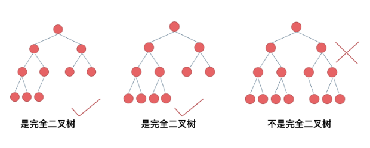
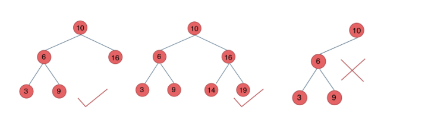
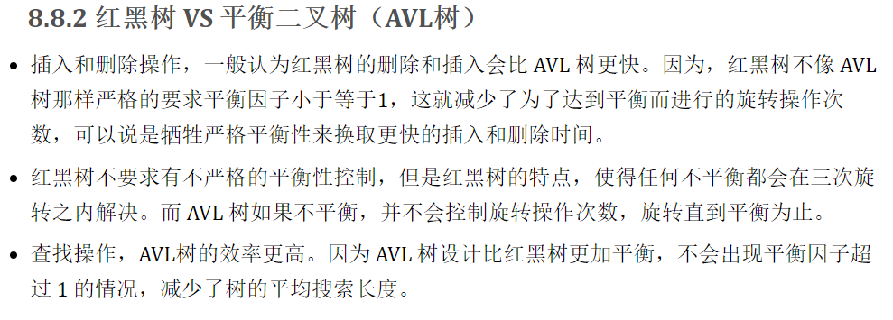
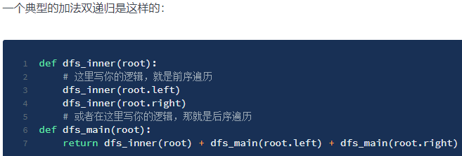
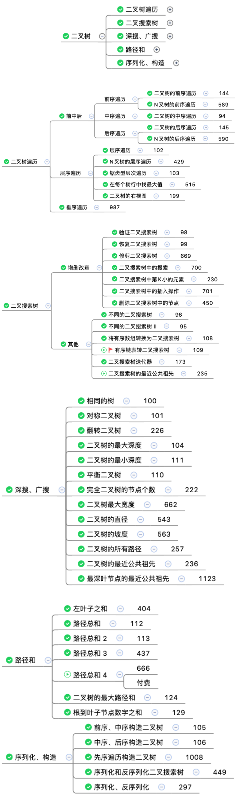

# Basic Concept

- What is Tree：

  - 仅有唯一一个根节点，没有则为空树
  - 除根节点外，每个节点都有且仅有一个父节点
  - 节点间不能形成闭环

- node、root、brother node、leaf node、parent node、child node

- branch

- level：根为第一层，根的孩子为第二层，依此类推

- height of node：叶子节点到该节点的最长路径，根节点的高度为树的高度

- depth of node：从根节点到该节点所经历的边的个数（根节点的深度和叶子节点的高度都是 0）

- width

- 二叉树,三叉树... N 叉树,由其子节点最多可以有几个决定,最多有 N 个就是 N 叉树

  - ==完全二叉树==：深度为`h`，除第`h`层外，其它各层`(1 ～ h-1)`的结点数都达到最大个数，第`h`层所有的结点都连续集中在最左边

    

  - ==满二叉树==：除了叶结点外每一个结点都有左右孩子且叶子结点都处在最底层的二叉树

  - ==二叉搜索树==：左孩子节点值均==小于==该节点值、右孩子节点值均==大于==该节点值，该节点的左、右子树也分别为二叉搜索树

  - 平衡二叉搜索树(AVL)：既满足左右子树高度差不大于 1， 又满足任意节点值大于它的左孩子节点值，小于它右孩子节点值

    

  - 红黑树

    - 节点是红色或黑色
    - 根节点必须是黑色节点
    - 所有的叶子节点都必须是值为 NULL 的黑节点
    - 如果一个节点是红色的，则它两个子节点都是黑色的
    - 从任一节点到达它的每个叶子节点的所有的路径，都有相同数目的黑色节点

    

  - Trie(字典树或前缀树，它是用来处理字符串匹配问题的数据结构，以及用来解决集合中查找固定前缀字符串的数据结构，高效的存储和查找字符串)

# 解题要素

- 一个中心:遍历
- 两个基本点:DFS(`preorder/inorder/postorder ` 使用 stack)、BFS(迭代，使用 queue)
- 三种题型:搜索类、构建类、修改类
- 四个重要概念:二叉搜索树(==中序遍历是有序的==)、完全二叉树、路径、距离
- 七个技巧
  - dfs(root)
  - 单/双递归(如果题目有类似,任意节点开始`xxx`或者所有`xxx`这样的说法,就可以考虑使用双递归，但是如果递归中有重复计算,则可以使用双递归 + 记忆化或者直接单递归)
    
  - 前后遍历
    - `自顶向下`：就是在每个递归层级,首先访问节点来计算一些值,并在递归调用函数时将这些值传递到子节点,一般是通过参数传到子树中
    - `自底向上`：是另一种常见的递归方法,首先对所有子节点递归地调用函数,然后根据返回值和根节点本身的值得到答案
  - 虚拟节点
  - 边界
  - 参数扩展大法
  - 返回元组/列表

# Binary Tree Problem List



## Binary Tree Traversal

### Preorder/Inorder/Postorder

##### [144. ==二叉树前序遍历==](https://leetcode-cn.com/problems/binary-tree-preorder-traversal/)

```javascript {.line-numbers}
//recursion
var preorderTraversal = function (root) {
	const ret = []
	const traversal = (root) => {
		if (!root) return
		ret.push(root.val)
		traversal(root.left)
		traversal(root.right)
	}
	traversal(root)
	return ret
}

//common template
const preorderTraversal = (root) => {
	const ret = [],
		stack = []
	while (root || stack.length > 0) {
		while (root) {
			ret.push(root.val)
			stack.push(root)
			root = root.left
		}
		root = stack.pop()
		root = root.right
	}
	return ret
}

//iteration use stack
var preorderTraversal = function (root) {
	const ret = [],
		stack = []
	root && stack.push(root)

	while (stack.length > 0) {
		root = stack.pop()
		ret.push(root.val)
		//先放右后放左, pop顺序是根->左->右
		if (root.right) stack.push(root.right)
		if (root.left) stack.push(root.left)
	}
	return ret
}
```

##### [589.N 叉树的前序遍历](https://leetcode-cn.com/problems/n-ary-tree-preorder-traversal/)

```javascript {.line-numbers}
var preorder = function (root) {
	let ret = []
	const traversal = (root, ret) => {
		if (!root) return
		ret.push(root.val)
		if (root.children && root.children.length > 0) {
			root.children.forEach((child) => {
				traversal(child, ret)
			})
		}
	}
	traversal(root, ret)
	return ret
}

//iteration
var preorder = function (root) {
	const ret = [],
		stack = [root]

	while (stack.length > 0) {
		const curNode = stack.pop()
		if (curNode) {
			ret.push(curNode.val)
			//preorder need push right son first
			for (let i = curNode.children.length - 1; i >= 0; i--) {
				stack.push(curNode.children[i])
			}
		}
	}
	return ret
}
```

##### [94. ==二叉树中序遍历==](https://leetcode-cn.com/problems/binary-tree-inorder-traversal/)

```javascript {.line-numbers}
//recursion
var inorderTraversal = function (root) {
	let ret = []
	let traversal = (root) => {
		if (!root) return
		traversal(root.left)
		ret.push(root.val)
		traversal(root.right)
	}
	traversal(root)
	return ret
}

//iteration
//common template
//BST inorder is sequential
var inorderTraversal = function (root) {
	const ret = [],
		stack = []

	while (root || stack.length > 0) {
		while (root) {
			stack.push(root)
			root = root.left
		}
		root = stack.pop()
		ret.push(root.val)
		root = root.right
	}
	return ret
}
```

##### [145. ==二叉树后序遍历==](https://leetcode-cn.com/problems/binary-tree-postorder-traversal/)

```javascript {.line-numbers}
//recursion
var postorderTraversal = function (root) {
	let ret = []
	var traversal = (root) => {
		if (!root) return
		traversal(root.left)
		traversal(root.right)
		ret.push(root.val)
	}
	traversal(root)
	return ret
}

//common template
var postorderTraversal = function (root) {
	const ret = []
	const stack = []
	while (root || stack.length > 0) {
		while (root) {
			ret.unshift(root.val)
			stack.push(root)
			root = root.right
		}
		root = stack.pop()
		root = root.left
	}
	return ret
}

//逆序输出
const postorderTraversal = (root) => {
	const ret = [],
		stack = []

	root && stack.push(root)
	while (stack.length > 0) {
		root = stack.pop()
		//unshift顺序从根左右 => 右左根
		ret.unshift(root.val)

		//右左根 => 左右根
		if (root.left !== null) {
			stack.push(root.left)
		}
		if (root.right !== null) {
			stack.push(root.right)
		}
	}
	return ret
}

//iteration
//节点第一次访问时并不打印,而是在第二次遍历时才打印.所以需要一个变量来标记该结点是否访问过
const postorderTraversal = (root) => {
	const ret = [],
		stack = []
	let prev = null

	while (root || stack.length > 0) {
		//一直放左儿子
		while (root) {
			stack.push(root)
			root = root.left
		}
		//出栈
		root = stack.pop()
		//root.right === prev 节点访问过一次
		if (!root.right || root.right === prev) {
			//第二次才加入结果
			ret.push(root.val)
			//更新prev，也就是定位住上一个访问节点
			prev = root
			root = null
		} else {
			//再次入栈
			stack.push(root)
			root = root.right
		}
	}
	return ret
}
```

##### [590.N 叉树的后序遍历](https://leetcode-cn.com/problems/n-ary-tree-postorder-traversal/)

```javascript {.line-numbers}
//recursion
var postorder = function (root) {
	const ret = []

	const postorderNode = (root, ret) => {
		if (!root) return
		root.children.forEach((child) => {
			postorderNode(child, ret)
		})
		ret.push(root.val)
	}
	postorderNode(root, ret)
	return ret
}

//iteration
var postorder = function (root) {
	const ret = [],
		stack = [root]

	while (stack.length > 0) {
		const curNode = stack.pop()

		if (curNode) {
			//左右根
			for (let i = 0; i < curNode.children.length; i++) {
				stack.push(curNode.children[i])
			}
			ret.unshift(curNode.val)
		}
	}
	return ret
}
```

### Level Traversal

##### [102. ==二叉树的层序遍历==](https://leetcode-cn.com/problems/binary-tree-level-order-traversal/)

```javascript {.line-numbers}
//BFS iteration, use queue
//层用queue
var levelOrder = function (root) {
	const ret = [],
		queue = []
	root && queue.push(root)
	while (queue.length > 0) {
		const size = queue.length,
			curLevel = []
		for (let i = 0; i < size; i++) {
			const cur = queue.shift()
			curLevel.push(cur.val)
			if (cur.left) queue.push(cur.left)
			if (cur.right) queue.push(cur.right)
		}
		ret.push(curLevel)
	}
	return ret
}

//DFS
var levelOrder = function (root) {
	const ret = []
	const dfs = (root, level) => {
		if (!root) return
		if (!ret[level]) ret[level] = []
		ret[level].push(root.val)
		dfs(root.left, level + 1)
		dfs(root.right, level + 1)
	}
	dfs(root, 0)
	return ret
}
```

##### [429.N 叉树的层序遍历](https://leetcode-cn.com/problems/n-ary-tree-level-order-traversal/)

```javascript {.line-numbers}
//BFS use queue
var levelOrder = function (root) {
	if (!root) return []
	let queue = [root]
	let ret = []
	while (queue.length) {
		let curLevel = [],
			size = queue.length
		for (let i = 0; i < size; i++) {
			let current = queue.shift()
			curLevel.push(current.val)
			if (current.children && current.children.length) {
				queue.push(...current.children)
			}
		}
		ret.push(curLevel)
	}
	return ret
}

//DFS
var levelOrder = function (root) {
	var nums = []

	let traversal = (root, level, nums) => {
		if (!root) return
		if (!nums[level]) nums[level] = []
		nums[level].push(root.val)
		for (var i = 0; i < root.children.length; i++) {
			traversal(root.children[i], level + 1, nums)
		}
	}
	traversal(root, 0, nums)
	return nums
}
```

##### [103.==二叉树的锯齿形层序遍历==](https://leetcode-cn.com/problems/binary-tree-zigzag-level-order-traversal/)

```javascript {.line-numbers}
var zigzagLevelOrder = function (root) {
	const ret = [],
		queue = []
	root && queue.push(root)
	let direction = true
	while (queue.length > 0) {
		const size = queue.length,
			curLevel = []
		for (let i = 0; i < size; i++) {
			const cur = queue.shift()
			direction ? curLevel.push(cur.val) : curLevel.unshift(cur.val)
			if (cur.left) queue.push(cur.left)
			if (cur.right) queue.push(cur.right)
		}
		direction = !direction
		ret.push(curLevel)
	}
	return ret
}
```

##### [515.==在每个树行中找最大值==](https://leetcode-cn.com/problems/find-largest-value-in-each-tree-row/)

```javascript {.line-numbers}
//bfs
var largestValues = function (root) {
	const ret = [],
		queue = []
	root && queue.push(root)
	while (queue.length > 0) {
		const size = queue.length
		let max = -Infinity
		for (let i = 0; i < size; i++) {
			const cur = queue.shift()
			max = Math.max(max, curNode.val)
			if (cur.left) queue.push(cur.left)
			if (cur.right) queue.push(cur.right)
		}
		ret.push(max)
	}
	return ret
}

//dfs
var largestValues = function (root) {
	const ret = []
	const dfs = (root, level, ret) => {
		if (!root) return
		//hole!!! node's value maybe null, so can not code like if (!ret[level])
		if (ret[level] === undefined) ret[level] = root.val
		ret[level] = Math.max(ret[level], root.val)
		dfs(root.left, level + 1, ret)
		dfs(root.right, level + 1, ret)
	}
	dfs(root, 0, ret)
	return ret
}
```

##### [199.二叉树的右视图](https://leetcode-cn.com/problems/binary-tree-right-side-view/)

```javascript {.line-numbers}
//use queue
var rightSideView = function (root) {
	if (!root) return []
	const ret = [],
		queue = [root]

	while (queue.length > 0) {
		const size = queue.length
		for (let i = 0; i < size; i++) {
			const curNode = queue.shift()
			if (curNode.left) queue.push(curNode.left)
			if (curNode.right) queue.push(curNode.right)
			if (i === size - 1) ret.push(curNode.val)
		}
	}
	return ret
}

//recursion
var rightSideView = function (root) {
	const ret = []
	const dfs = (root, level, ret) => {
		if (!root) return
		if (level === ret.length) ret.push(root.val)
		//visit right son first, so above line code can visit right first node of next level
		dfs(root.right, level + 1, ret)
		dfs(root.left, level + 1, ret)
	}

	dfs(root, 0, ret)
	return ret
}
```

### Others

##### [987.二叉树的垂序遍历](https://leetcode-cn.com/problems/vertical-order-traversal-of-a-binary-tree/)

```javascript {.line-numbers}
var verticalTraversal = function (root) {
	if (!root) return []

	// 二维数组,存坐标和值,形式如 [[x, y, val], [...]]
	let locations = []

	const dfs = function (root, x, y) {
		if (!root) return
		locations.push([x, y, root.val])
		dfs(root.left, x - 1, y - 1)
		dfs(root.right, x + 1, y - 1)
	}
	// 先前序遍历记录下节点坐标和值
	dfs(root, 0, 0)

	// 按照x升序,y降序,val升序
	locations = locations.sort((a, b) => {
		if (a[0] !== b[0]) {
			return a[0] - b[0]
		}
		if (a[1] !== b[1]) {
			return b[1] - a[1]
		}
		return a[2] - b[2]
	})

	// curValOfX当前遍历的节点的x的值,默认先取第一个节点的x值
	let curValOfX = locations[0][0]
	const ret = [[locations[0][2]]]

	// 从第2个节点开始遍历坐标数组,把x相同的val分成一组
	for (let i = 1; i < locations.length; i++) {
		const location = locations[i]
		const x = location[0]
		//一个垂序
		if (x === curValOfX) {
			const last = ret[ret.length - 1]
			last.push(location[2])
		} else {
			curValOfX = x
			ret.push([location[2]])
		}
	}
	return ret
}
```

## Binary Search Tree

### CRUD

##### [98.==验证二叉搜索树==](https://leetcode-cn.com/problems/validate-binary-search-tree/)

```javascript {.line-numbers}
//In-order遍历是有序的
var isValidBST = function (root) {
	const stack = []
	let prev = -Infinity
	while (root || stack.length) {
		while (root) {
			stack.push(root)
			root = root.left
		}
		root = stack.pop()
		if (root.val <= prev) return false
		//update prev
		//if store node, prev.val maybe throw error
		prev = root.val
		root = root.right
	}
	return true
}

//tricky
var isValidBST = function (root) {
	const helper = (root, low, high) => {
		if (!root) return true
		if (root.val <= low || root.val >= high) return false
		return (
			helper(root.left, low, root.val) && helper(root.right, root.val, high)
		)
	}
	//扩展参数，向下传递
	return helper(root, -Infinity, Infinity)
}
```

##### [99.恢复二叉搜索树](https://leetcode-cn.com/problems/recover-binary-search-tree/)

```javascript {.line-numbers}
// interview version
// use array
// O(n) - O(h)
var recoverTree = function (root) {
	const stack = []
	let prev = (first = second = null)

	while (root || stack.length) {
		while (root) {
			stack.push(root)
			root = root.left
		}
		root = stack.pop()
		//case 1: [1,2,3,4,5,6,7] -> [1,6,3,4,5,2,7],两处不合法
		//case 2: [1,2,3,4,5,6,7] -> [1,3,2,4,5,6,7],一处不合法
		if (prev && root.val < prev.val) {
			second = root
			if (first == null) {
				first = prev
				//提前返回
			} else break
		}
		prev = root
		root = root.right
	}

	if (first && second) {
		;[first.val, second.val] = [second.val, first.val]
	}
}

//Morris inorder
//来到当前节点,记为cur(引用)
//1、如果cur无左孩子,cur向右移动(cur = cur.right)
//2、如果cur有左孩子,找到cur左子树上最右的节点,记为predecessor
//  (1)如果predecessor的right指针指向空,让其指向cur,cur向左移动(cur = cur.left)
//  (2)如果predecessor的right指针指向cur,说明我们已经遍历完cur的左子树,让其指向空,cur向右移动(cur = cur.right)
//  (3)重复上述操作,直至访问完整棵树
var recoverTree = function (root) {
	let first = (second = pre = predecessor = null)

	while (root !== null) {
		if (root.left) {
			// predecessor 节点就是当前 root 节点向左走一步,然后一直向右走至无法走为止
			predecessor = root.left
			while (predecessor.right && predecessor.right !== root) {
				predecessor = predecessor.right
			}

			// 让 predecessor 的右指针指向 root,继续遍历左子树
			if (predecessor.right === null) {
				predecessor.right = root
				root = root.left
				// 说明左子树已经访问完了,我们需要断开链接
			} else {
				if (pre !== null && root.val < pre.val) {
					second = root
					if (first === null) {
						first = pre
					}
				}
				pre = root
				predecessor.right = null
				root = root.right
			}
			// 如果没有左孩子,则直接访问右孩子
		} else {
			if (pre !== null && root.val < pre.val) {
				second = root
				if (first === null) {
					first = pre
				}
			}
			pre = root
			root = root.right
		}
	}

	if (first !== null && second !== null) {
		;[first.val, second.val] = [second.val, first.val]
	}
}
```

##### [669.修剪二叉搜索树](https://leetcode-cn.com/problems/trim-a-binary-search-tree/)

```javascript {.line-numbers}
var trimBST = function (root, low, high) {
	if (!root) return null
	if (root.val > high) return trimBST(root.left, low, high)
	if (root.val < low) return trimBST(root.right, low, high)
	//需要连接,所以需要返回递归的头结点
	root.left = trimBST(root.left, low, high)
	root.right = trimBST(root.right, low, high)
	return root
}
```

##### [700.二叉搜索树中的搜索](https://leetcode-cn.com/problems/search-in-a-binary-search-tree/)

```javascript {.line-numbers}
var searchBST = function (root, val) {
	if (!root) return null
	if (root.val === val) {
		return root
	} else if (root.val > val) {
		return searchBST(root.left, val)
	} else {
		return searchBST(root.right, val)
	}
}

var searchBST = function (root, val) {
	while (root !== null) {
		if (root.val > val) {
			root = root.left
		} else if (root.val < val) {
			root = root.right
		} else {
			return root
		}
	}
	return null
}
```

##### [701.二叉搜索树中的插入操作](https://leetcode-cn.com/problems/insert-into-a-binary-search-tree/)

```javascript {.line-numbers}
var insertIntoBST = function (root, val) {
	if (!root) return new TreeNode(val)
	if (root.val < val) {
		root.right = insertIntoBST(root.right, val)
	} else {
		root.left = insertIntoBST(root.left, val)
	}
	//需要连接,所以需要返回递归的头结点
	return root
}
```

### Others

##### [96.不同的二叉搜索树](https://leetcode-cn.com/problems/unique-binary-search-trees/)

```javascript {.line-numbers}
var numTrees = function (n) {
	//dp[i]:用连着的i个数,所构建出的BST种类数
	const dp = new Array(n + 1).fill(0)
	//base case
	dp[0] = dp[1] = 1

	for (let i = 2; i <= n; i++) {
		//笛卡尔积
		for (let j = 0; j <= i - 1; j++) {
			dp[i] += dp[j] * dp[i - j - 1]
		}
	}
	return dp[n]
}

//recursion
const numTrees = (n) => {
	// n个整数能创建出的BST的种类数
	if (n == 0 || n == 1) return 1

	let num = 0
	for (let i = 0; i <= n - 1; i++) {
		num += numTrees(i) * numTrees(n - i - 1)
	}
	return num
}
```

##### [95.不同的二叉搜索树 II](https://leetcode-cn.com/problems/unique-binary-search-trees-ii/)

```javascript {.line-numbers}
var generateTrees = function (n) {
	if (n === 0) return []

	const buildTree = (start, end) => {
		//以当前i为root能够组成的BST个数
		const ret = []
		if (start > end) {
			ret.push(null)
			return ret
		}

		//loop root node
		for (let i = start; i <= end; i++) {
			//获得所有可行的左子树集合
			const leftTree = buildTree(start, i - 1)
			//获得所有可行的右子树集合
			const rightTree = buildTree(i + 1, end)

			// 从左子树集合中选出一棵左子树,从右子树集合中选出一棵右子树,拼接到根节点上
			for (let tl of leftTree) {
				for (let tr of rightTree) {
					const root = new TreeNode(i)
					root.left = tl
					root.right = tr
					ret.push(root)
				}
			}
		}
		return ret
	}
	return buildTree(1, n)
}
```

##### [108.==将有序数组转换为二叉搜索树==](https://leetcode-cn.com/problems/convert-sorted-array-to-binary-search-tree/)

```javascript {.line-numbers}
var sortedArrayToBST = function (nums) {
	const helper = (nums, l, r) => {
		//函数参数区间是左闭右闭,所以结束条件如下
		if (l > r) return null
		const mid = Math.floor((l + r) / 2)
		//因高度平衡则需从中点创建根节点开始
		const root = new TreeNode(nums[mid])
		root.left = helper(nums, l, mid - 1)
		root.right = helper(nums, mid + 1, r)
		return root
	}
	return helper(nums, 0, nums.length - 1)
}
```

##### [109.有序链表转换二叉搜索树](https://leetcode-cn.com/problems/convert-sorted-list-to-binary-search-tree/)

```javascript {.line-numbers}
var sortedListToBST = function (head) {
	const getMedian = (left, right) => {
		let fast = (slow = left)
		while (fast !== right && fast.next !== right) {
			fast = fast.next.next
			slow = slow.next
		}
		return slow
	}

	const buildTree = (left, right) => {
		if (left === right) return null
		const mid = getMedian(left, right)
		const root = new TreeNode(mid.val)
		//左闭右开
		root.left = buildTree(left, mid)
		root.right = buildTree(mid.next, right)
		return root
	}
	//左闭右开
	return buildTree(head, null)
}
```

##### [230.==二叉搜索树中第 K 小的元素==](https://leetcode-cn.com/problems/kth-smallest-element-in-a-bst/)

```javascript {.line-numbers}
var kthSmallest = function (root, k) {
	const stack = []
	while (root || stack.length) {
		while (root) {
			stack.push(root)
			root = root.left
		}
		root = stack.pop()
		if (--k === 0) break
		root = root.right
	}
	return root.val
}
```

##### [235.==二叉搜索树的公共祖先==](https://leetcode-cn.com/problems/lowest-common-ancestor-of-a-binary-search-tree/)

```javascript {.line-numbers}
var lowestCommonAncestor = function (root, p, q) {
	while (root) {
		if (root.val > p.val && root.val > q.val) {
			root = root.left
		} else if (root.val < p.val && root.val < q.val) {
			root = root.right
		} else {
			return root
		}
	}
	return null
}
```

##### [538.把二叉搜索树转换为累加树](https://leetcode-cn.com/problems/convert-bst-to-greater-tree/)

```javascript {.line-numbers}
//反序中序遍历
var convertBST = function (root) {
	let sum = 0
	const dfs = (root) => {
		if (!root) return null
		dfs(root.right)
		sum += root.val
		root.val = sum
		dfs(root.left)
	}
	dfs(root)
	return root
}
```

## DFS/BFS

##### [100.==相同的树==](https://leetcode-cn.com/problems/same-tree/)

```javascript {.line-numbers}
var isSameTree = function (p, q) {
	if (p == null && q == null) return true
	if (p == null || q == null) return false
	return (
		p.val === q.val &&
		isSameTree(p.left, q.left) &&
		isSameTree(p.right, q.right)
	)
}
```

##### [101.==对称二叉树==](https://leetcode-cn.com/problems/symmetric-tree/)

```javascript {.line-numbers}
var isSymmetric = function (root) {
	const helper = (left, right) => {
		if (left == null && right == null) return true
		if (left == null || right == null) return false
		return (
			left.val === right.val &&
			helper(left.left, right.right) &&
			helper(right.right, left.left)
		)
	}
	//扩展参数
	return helper(root, root)
}

//BFS
var isSymmetric = function (root) {
	if (!root) return true
	const queue = [root, root]
	while (queue.length) {
		//每次两两对比
		const l = queue.shift()
		const r = queue.shift()
		if (l && r) {
			if (l.val !== r.val) return false
			//放的时候也是两两放
			queue.push(l.left, r.right)
			queue.push(r.right, l.left)
			//exists one node
		} else if (l || r) {
			return false
		}
	}
	return true
}
```

##### [226.==翻转二叉树==](https://leetcode-cn.com/problems/invert-binary-tree/)

```javascript {.line-numbers}
//preorder or postorder can work, inorder means no invert
var invertTree = function (root) {
	if (!root) return root
	const l = invertTree(root.left)
	const r = invertTree(root.right)
	root.left = r
	root.right = l
	return root
}

//BFS 自上往下
var invertTree = function (root) {
	if (!root) return root
	const queue = [root]
	while (queue.length > 0) {
		const cur = queue.shift()
		;[cur.left, cur.right] = [cur.right, cur.left]
		if (cur.left) queue.push(cur.left)
		if (cur.right) queue.push(cur.right)
	}
	return root
}
```

##### [104.==二叉树的最大深度==](https://leetcode-cn.com/problems/maximum-depth-of-binary-tree/)

```javascript {.line-numbers}
var maxDepth = function (root) {
	//return root == null ? 0 : Math.max(maxDepth(root.left), maxDepth(root.right)) + 1
	if (!root) return 0
	const lMax = maxDepth(root.left)
	const rMax = maxDepth(root.right)
	//+1是加上当前node的深度
	return Math.max(lMax, rMax) + 1
}

//BFS
var maxDepth = function (root) {
	if (!root) return 0
	let queue = [root],
		depth = 0
	while (queue.length > 0) {
		const size = queue.length
		depth++
		for (let i = 0; i < size; i++) {
			const cur = queue.shift()
			if (cur.left) queue.push(cur.left)
			if (cur.right) queue.push(cur.right)
		}
	}
	return depth
}
```

##### [111.==二叉树的最小深度==](https://leetcode-cn.com/problems/minimum-depth-of-binary-tree/)

```javascript {.line-numbers}
//DFS
var minDepth = function (root) {
	if (!root) return 0
	const minLeftDepth = minDepth(root.left)
	const minRightDepth = minDepth(root.right)
	//return minLeftDepth === 0 || minRightDepth === 0 ?  minLeftDepth + minRightDepth + 1 : :Math.min(minLeftDepth, minRightDepth) + 1
	if (minLeftDepth && minRightDepth)
		return Math.min(minLeftDepth, minRightDepth) + 1
	return minLeftDepth === 0 ? minRightDepth + 1 : minLeftDepth + 1
}

//BFS
var minDepth = function (root) {
	if (!root) return 0
	let queue = [root],
		depth = 0
	while (queue.length > 0) {
		const size = queue.length
		depth++
		for (let i = 0; i < size; i++) {
			const cur = queue.shift()
			//若左右节点都是null(在遇见的第一个leaf节点上)，则该节点深度最小
			if (cur.left == null && cur.right == null) return depth
			if (cur.left) queue.push(cur.left)
			if (cur.right) queue.push(cur.right)
		}
	}
	return depth
}
```

##### [110.平衡二叉树](https://leetcode-cn.com/problems/balanced-binary-tree/)

```javascript {.line-numbers}
var isBalanced = function (root) {
	//后序遍历
	// 1. 确定递归函数参数以及返回值
	const getDepth = function (node) {
		// 2. 确定递归函数终止条件
		if (node === null) return 0
		// 3. 确定单层递归逻辑
		let leftDepth = getDepth(node.left) //左子树高度
		// 当判定左子树不为平衡二叉树时,即可直接返回-1
		if (leftDepth === -1) return -1
		let rightDepth = getDepth(node.right) //右子树高度
		// 当判定右子树不为平衡二叉树时,即可直接返回-1
		if (rightDepth === -1) return -1
		if (Math.abs(leftDepth - rightDepth) > 1) {
			return -1
		} else {
			return 1 + Math.max(leftDepth, rightDepth)
		}
	}
	return !(getDepth(root) === -1)
}

var isBalanced = function (root) {
	const depth = (root) => {
		return !root ? 0 : Math.max(depth(root.left), depth(root.right)) + 1
	}
	return !root
		? true
		: Math.abs(depth(root.left) - depth(root.right)) <= 1 &&
				isBalanced(root.left) &&
				isBalanced(root.right)
}
```

##### [222.完全二叉树的节点个数](https://leetcode-cn.com/problems/count-complete-tree-nodes/)

```javascript {.line-numbers}
var countNodes = function (root) {
	if (root == null) return 0
	let l = root,
		r = root
	let lh = 0,
		rh = 0
	while (l != null) {
		l = l.left
		lh++
	}
	while (r != null) {
		r = r.right
		rh++
	}
	if (lh === rh) return Math.pow(2, lh) - 1
	return 1 + countNodes(root.left) + countNodes(root.right)
}

var countNodes = function (root) {
	const countLevel = (root) => {
		let level = 0
		while (root) {
			root = root.left
			level++
		}
		return level
	}

	if (!root) return 0
	const leftLevel = countLevel(root.left)
	const rightLevel = countLevel(root.right)

	// 如果满二叉树的层数为h,则总节点数为:2^h - 1
	// 左子树一定是满二叉树,因为节点已经填充到右子树了,左子树必定已经填满了.所以左子树的节点总数我们可以直接得到,是 2^left - 1,加上当前这个 root 节点,则正好是 2^left.再对右子树进行递归统计
	if (leftLevel === rightLevel) {
		return countNodes(root.right) + (1 << leftLevel)
		//说明此时最后一层不满,但倒数第二层已经满了,可以直接得到右子树的节点个数.同理,右子树节点加上root节点,总数为 2^right.再对左子树进行递归查找
	} else {
		return countNodes(root.left) + (1 << rightLevel)
	}
}
```

##### [662.二叉树最大宽度](https://leetcode-cn.com/problems/maximum-width-of-binary-tree/)

```javascript {.line-numbers}
//not AC!!!
//如果我们走向左子树,那么 position -> position * 2,如果我们走向右子树,那么 position -> position * 2 + 1.当我们在看同一层深度的位置值 L 和 R 的时候,宽度就是 R - L + 1
var widthOfBinaryTree = function (root) {
	if (!root) return 0
	//node + depth + position
	const queue = [[root, 0, 0]]
	let curDepth = (left = ret = 0)

	while (queue.length) {
		const nodeWithDepthAndPosition = queue.shift()
		if (nodeWithDepthAndPosition[0]) {
			queue.push([
				nodeWithDepthAndPosition[0].left,
				nodeWithDepthAndPosition[1] + 1,
				nodeWithDepthAndPosition[2] * 2,
			])
			queue.push([
				nodeWithDepthAndPosition[0].right,
				nodeWithDepthAndPosition[1] + 1,
				nodeWithDepthAndPosition[2] * 2 + 1,
			])
			if (curDepth !== nodeWithDepthAndPosition[1]) {
				curDepth = nodeWithDepthAndPosition[1]
				left = nodeWithDepthAndPosition[2]
			}
			ret = Math.max(ret, nodeWithDepthAndPosition[2] - left + 1)
		}
	}
	return ret
}

var widthOfBinaryTree = function (root) {
	if (!root) return 0
	let ret = 1,
		//太大了所以用bigint
		queue = [[0n, root]]
	while (queue.length > 0) {
		const width = queue[queue.length - 1][0] - queue[0][0] + 1n
		if (width > ret) ret = width
		const tmp = []
		for (const [i, q] of queue) {
			q.left && tmp.push([i * 2n, q.left])
			q.right && tmp.push([i * 2n + 1n, q.right])
		}
		queue = tmp
	}
	return Number(ret)
}
```

##### [543.二叉树的直径](https://leetcode-cn.com/problems/diameter-of-binary-tree/)

```javascript {.line-numbers}
var diameterOfBinaryTree = function (root) {
	const dfs = (root) => {
		if (!root) return 0
		const leftDepth = dfs(root.left)
		const rightDepth = dfs(root.right)
		//inner cycle
		ret = Math.max(ret, leftDepth + rightDepth + 1)
		//return该节点为根的子树深度
		return Math.max(leftDepth, rightDepth) + 1
	}
	let ret = 1
	dfs(root)
	return ret - 1
}
```

##### [563.二叉树的坡度](https://leetcode-cn.com/problems/binary-tree-tilt/)

```javascript {.line-numbers}
var findTilt = function (root) {
	let ret = 0
	const dfs = (root) => {
		if (!root) return 0
		const left = dfs(root.left)
		const right = dfs(root.right)
		ret += Math.abs(left - right)
		return left + right + root.val
	}
	dfs(root)
	return ret
}
```

##### [257.==二叉树的所有路径==](https://leetcode-cn.com/problems/binary-tree-paths/)

```javascript {.line-numbers}
var binaryTreePaths = function (root) {
	const ret = []
	const dfs = (root, curPath) => {
		if (!root) return
		if (!root.left && !root.right) {
			ret.push(curPath + root.val)
			return
		}
		//隐藏了回溯
		dfs(root.left, curPath + root.val + '->')
		dfs(root.right, curPath + root.val + '->')
	}
	dfs(root, '')
	return ret
}

//BFS
var binaryTreePaths = function (root) {
	if (!root) return []
	let ret = [],
		queue = [root, root.val + '']
	while (queue.length) {
		const cur = queue.shift(),
			curPath = queue.shift()
		if (!cur.left && !cur.right) ret.push(curPath)
		if (cur.left) {
			queue.push(cur.left)
			queue.push(`${curPath}->${cur.left.val}`)
		}
		if (cur.right) {
			queue.push(cur.right)
			queue.push(`${curPath}->${cur.right.val}`)
		}
	}
	return ret
}

var binaryTreePaths = function (root) {
	if (!root) return []
	let ret = [],
		queue = [root],
    queuePath = [root.val + '']
	while (queue.length) {
		const cur = queue.shift(),
			curPath = queuePath.shift()
		if (!cur.left && !cur.right) ret.push(curPath)
		if (cur.left) {
			queue.push(cur.left)
			queuePath.push(`${curPath}->${cur.left.val}`)
		}
		if (cur.right) {
			queue.push(cur.right)
			queuePath.push(`${curPath}->${cur.right.val}`)
		}
	}
	return ret
}
```

##### [236.==二叉树的最近公共祖先==](https://leetcode-cn.com/problems/lowest-common-ancestor-of-a-binary-tree/)

```javascript {.line-numbers}
var lowestCommonAncestor = function (root, p, q) {
	//if (!root || root === p || root === q) return root
	if (!root) return root
	if (root === p || root === q) return root
	const lSon = lowestCommonAncestor(root.left, p, q)
	const rSon = lowestCommonAncestor(root.right, p, q)
	//下面两句合二为一
	//return left === null ? right : right === null ? left : root
	if (lSon && rSon) return root
	return !lSon ? rSon : lSon
}
```

##### [1123.最深叶节点的最近公共祖先](https://leetcode-cn.com/problems/lowest-common-ancestor-of-deepest-leaves/)

```javascript {.line-numbers}
var lcaDeepestLeaves = function (root) {
	const depth = (root) => {
		if (!root) return 0
		const left = depth(root.left)
		const right = depth(root.right)
		return Math.max(left, right) + 1
	}

	if (!root) return null
	const left = depth(root.left)
	const right = depth(root.right)
	if (left === right) return root
	return left > right
		? lcaDeepestLeaves(root.left)
		: lcaDeepestLeaves(root.right)
}
```

##### [652.寻找重复的子树](https://leetcode-cn.com/problems/find-duplicate-subtrees/)

```javascript {.line-numbers}
var findDuplicateSubtrees = function (root) {
	const map = new Map(),
		ret = []

	const dfs = (root) => {
		if (!root) return '#'
		const left = dfs(root.left)
		const right = dfs(root.right)

		const subTree = `${left},${right},${root.val}`
		if (map.has(subTree)) {
			if (map.get(subTree) === 1) {
				ret.push(root)
			}
			map.set(subTree, map.get(subTree) + 1)
		} else {
			map.set(subTree, 1)
		}
		return subTree
	}
	dfs(root)
	return ret
}
```

## Path Sum

##### [404.左叶子之和](https://leetcode-cn.com/problems/sum-of-left-leaves/)

```javascript {.line-numbers}
var sumOfLeftLeaves = function (root) {
	const dfs = (root) => {
		const isLeaf = (root) => {
			return !root.left && !root.right
		}
		//当前层的左叶子之和为左子树+右子树+当前节点的值
		let ret = 0
		if (root.left) {
			ret += isLeaf(root.left) ? root.left.val : dfs(root.left)
		}
		if (root.right && !isLeaf(root.right)) {
			ret += dfs(root.right)
		}
		return ret
	}
	return !root ? 0 : dfs(root)
}
```

##### [112.==路径总和==](https://leetcode-cn.com/problems/path-sum/)

```javascript {.line-numbers}
var hasPathSum = function (root, sum) {
	if (!root) return false
	if (!root.left && !root.right) return root.val === sum
	return (
		hasPathSum(root.left, sum - root.val) ||
		hasPathSum(root.right, sum - root.val)
	)
}

var hasPathSum = function (root, sum) {
	if (!root) return false
	//一个统计节点，一个统计节点值
	let queueNode = [root],
		queueVal = [root.val]

	while (queueNode.length > 0) {
		let cur = queueNode.shift()
		let accVal = queueVal.shift()
		if (!cur.left && !cur.right) if (accVal === sum) return true
		if (cur.left) {
			queueNode.push(cur.left)
			queueVal.push(cur.left.val + accVal)
		}
		if (cur.right) {
			queueNode.push(cur.right)
			queueVal.push(cur.right.val + accVal)
		}
	}
	return false
}

```

##### [113.==路径总和 II==](https://leetcode-cn.com/problems/path-sum-ii/)

```javascript {.line-numbers}
var pathSum = function (root, sum) {
	const ret = []
	const dfs = (root, sum, path) => {
		if (!root) return
		path.push(root.val)
		//due to array pass reference so add a copy
		if (!root.left && !root.right && sum === root.val) ret.push([...path])
		dfs(root.left, sum - root.val, path)
		dfs(root.right, sum - root.val, path)
		//backtrack
		path.pop()
	}
	dfs(root, sum, [])
	return ret
}
```

##### [437.路径总和 III](https://leetcode-cn.com/problems/path-sum-iii/)

```javascript {.line-numbers}
var pathSum = function (root, sum) {
	const dfs = (root, sum) => {
		if (!root) return 0
		let ret = 0
		if (sum === root.val) ret++
		ret += dfs(root.left, sum - root.val)
		ret += dfs(root.right, sum - root.val)
		return ret
	}
	return !root
		? 0
		: dfs(root, sum) + pathSum(root.left, sum) + pathSum(root.right, sum)
}
```

##### [124.二叉树中的最大路径和](https://leetcode-cn.com/problems/binary-tree-maximum-path-sum/)

```javascript {.line-numbers}
var maxPathSum = function (root) {
	let retMax = Number.MIN_SAFE_INTEGER
	const dfs = (root) => {
		if (!root) return 0
		//if negative, then return 0 to outerSum
		const left = Math.max(dfs(root.left), 0)
		const right = Math.max(dfs(root.right), 0)
		//update innerSum = left + right + root.val
		retMax = Math.max(retMax, left + right + root.val)
		return Math.max(left, right) + root.val
	}
	dfs(root)
	return retMax
}
```

##### [129.==求根到叶子节点数字之和==](https://leetcode-cn.com/problems/sum-root-to-leaf-numbers/)

```javascript {.line-numbers}
var sumNumbers = function (root, preSum) {
	const dfs = (root, preSum) => {
		if (!root) return 0
		preSum = preSum * 10 + root.val
		if (!root.left && !root.right) return preSum
		return dfs(root.left, preSum) + dfs(root.right, preSum)
	}
	return dfs(root, 0)
}
```

## Serialize/Deserialize

##### [105.==从前序与中序遍历序列构造二叉树==](https://leetcode-cn.com/problems/construct-binary-tree-from-preorder-and-inorder-traversal/)

```javascript {.line-numbers}
var buildTree = function (preorder, inorder) {
	const preLen = preorder.length,
		inLen = inorder.length
	if (preLen !== inLen) throw new TypeError('invalid params')
	const map = new Map()

	//space for time
	//get inorder idx from preorder value
	//note question: no same value Node, which means can form just one specific tree
	for (let i = 0; i < inLen; i++) map.set(inorder[i], i)
	return helper(preorder, 0, preLen - 1, map, 0, inLen - 1)
	function helper(preorder, preLeft, preRight, map, inLeft, inRight) {
		if (preLeft > preRight || inLeft > inRight) return null

		const rootVal = preorder[preLeft],
			root = new TreeNode(rootVal),
			pIndex = map.get(rootVal)

		root.left = helper(
			preorder,
			preLeft + 1,
			pIndex - inLeft + preLeft,
			map,
			inLeft,
			pIndex - 1
		)
		root.right = helper(
			preorder,
			pIndex - inLeft + preLeft + 1,
			preRight,
			map,
			pIndex + 1,
			inRight
		)
		return root
	}
}
```

##### [106.==从中序与后序遍历序列构造二叉树==](https://leetcode-cn.com/problems/construct-binary-tree-from-inorder-and-postorder-traversal/)

```javascript {.line-numbers}
var buildTree = function (inorder, postorder) {
	const inLen = inorder.length,
		postLen = postorder.length
	if (inLen !== postLen) throw new TypeError('invalid params')
	const map = new Map()

	//space for time
	//get root idx in inorder
	//note question: no same value Node, which means can form a specific tree
	for (let i = 0; i < inLen; i++) map.set(inorder[i], i)

	return helper(postorder, 0, postLen - 1, map, 0, inLen - 1)

	function helper(postorder, postLeft, postRight, map, inLeft, inRight) {
		if (inLeft > inRight || postLeft > postRight) return null
		const rootVal = postorder[postRight],
			root = new TreeNode(rootVal),
			pIndex = map.get(rootVal)

		root.left = helper(
			postorder,
			postLeft,
			pIndex - 1 - inLeft + postLeft,
			map,
			inLeft,
			pIndex - 1
		)
		root.right = helper(
			postorder,
			pIndex - inLeft + postLeft,
			postRight - 1,
			map,
			pIndex + 1,
			inRight
		)
		return root
	}
}
```

##### [1008.前序遍历构造二叉搜索树](https://leetcode-cn.com/problems/construct-binary-search-tree-from-preorder-traversal/)

```javascript {.line-numbers}
var bstFromPreorder = function (preorder) {
	let index = 0
	const helper = (preorder, low, high) => {
		if (index === preorder.length) return null
		const val = preorder[index]
		if (val < low || val > high) return null
		index++
		const root = new TreeNode(val)
		root.left = helper(preorder, low, val)
		root.right = helper(preorder, val, high)
		return root
	}
	return helper(preorder, -Infinity, Infinity)
}
```

##### [297.二叉树的序列化与反序列化](https://leetcode-cn.com/problems/serialize-and-deserialize-binary-tree/)

```javascript {.line-numbers}
const serialize = (root) => {
	if (!root) return 'X'
	const left = serialize(root.left)
	const right = serialize(root.right)
	return root.val + ',' + left + ',' + right // 按根,左,右  拼接字符串
}

const deserialize = (data) => {
	const list = data.split(',')
	const buildTree = (list) => {
		const rootVal = list.shift()
		if (rootVal == 'X') return null
		const root = new TreeNode(rootVal)
		root.left = buildTree(list)
		root.right = buildTree(list)
		return root
	}
	return buildTree(list)
}
```

##### [654.最大二叉树](https://leetcode-cn.com/problems/maximum-binary-tree/)

```javascript {.line-numbers}
var constructMaximumBinaryTree = function (nums) {
	if (!nums || nums.length === 0) return nums
	const build = (nums, low, high) => {
		if (low > high) return null
		let index = -1,
			max = Number.MIN_SAFE_INTEGER
		for (let i = low; i <= high; i++) {
			if (nums[i] > max) {
				max = nums[i]
				index = i
			}
		}
		const root = new TreeNode(max)
		root.left = build(nums, low, index - 1)
		root.right = build(nums, index + 1, high)
		return root
	}
	return build(nums, 0, nums.length - 1)
}
```

##### [114.二叉树展开为链表](https://leetcode-cn.com/problems/flatten-binary-tree-to-linked-list/)

```javascript {.line-numbers}
var flatten = function (root) {
	if (!root) return
	flatten(root.left)
	flatten(root.right)

	const left = root.left
	const right = root.right

	root.left = null
	root.right = left

	//原先右子树接到当前右子树的末端
	let p = root
	while (p.right) {
		p = p.right
	}
	p.right = right
}
```

##### [116.填充每个节点的下一个右侧节点指针](https://leetcode-cn.com/problems/populating-next-right-pointers-in-each-node/)

```javascript {.line-numbers}
//DFS
var connect = function (root) {
	const helper = (n1, n2) => {
		if (!n1 || !n2) return
		n1.next = n2
		helper(n1.left, n1.right)
		helper(n2.left, n2.right)
		helper(n1.right, n2.left)
	}
	if (!root) return null
	helper(root.left, root.right)
	return root
}

//BFS
var connect = function (root) {
	if (!root) return null
	const queue = [root]
	while (queue.length > 0) {
		const size = queue.length

		for (let i = 0; i < size; i++) {
			const curNode = queue.shift()
			//assign right point
			if (i < size - 1) {
				curNode.next = queue[0]
			}
			if (curNode.left) queue.push(curNode.left)
			if (curNode.right) queue.push(curNode.right)
		}
	}
	return root
}
```
