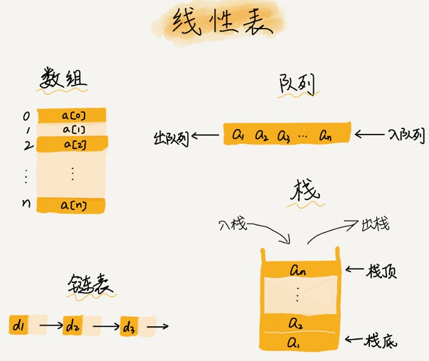
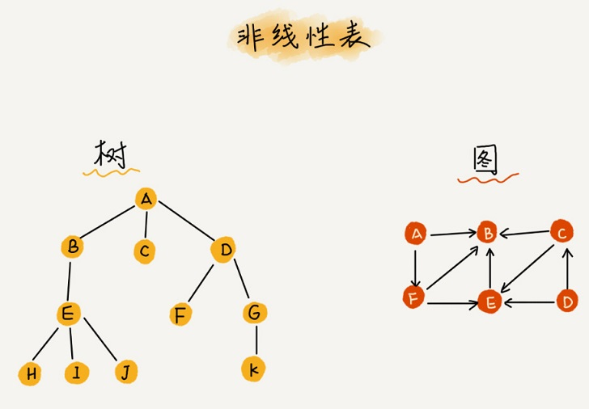

### 数组
数组是一种线性表数据结构。它用一组连续的内存空间，来存储一组具有相同类型的数据
- 线性表(Linear List):就是数据排成像一条线一样的结构。每个线性表上的数据最多只有前和后两个方向。其实除了数组，链表、队列、栈等也是线性表结构

- 非线性表

- 连续的内存空间和相同类型的数据
正是因为这两个限制，它才有了一个堪称“杀手锏”的特性：“随机访问”。但有利就有弊，这两个限制也让数组的很多操作变得非常低效，比如要想在数组中删除、插入一个数据，为了保证连续性，就需要做大量的数据搬移工作

> 数组和链表的区别?
>
> 数组支持随机访问(寻址公式)，根据下标随机访问的时间复杂度为 O(1)

#### 警惕数组的访问越界问题
#### 容器能否完全替代数组？
ArrayList最大的优势就是可以**将很多数组操作的细节封装起来**。比如前面提到的数组插入、删除数据时需要搬移其他数据等。另外，它还有一个优势，就是**支持动态扩容**,最好在创建ArrayList的时候事先指定数据大小。

1. Java ArrayList无法存储基本类型，比如int、long，需要封装为Integer、Long 类，而Autoboxing、Unboxing 则有一定的性能消耗，所以如果特别关注性能，或者希望使用基本类型，就可以选用数组
2. 如果数据大小事先已知，并且对数据的操作非常简单，用不到ArrayList提供的大部分方法，也可以直接使用数组
3. 当要表示多维数组时，用数组往往会更加直观。比如Object[][] array；而用容器的话则需要这样定义：ArrayList<ArrayList> array。

总结一下，对于业务开发，直接使用容器就足够了，省时省力。毕竟损耗一丢丢性能，完全不会影响到系统整体的性能。但如果你是做一些非常底层的开发，比如开发网络框架，性能的优化需要做到极致，这个时候数组就会优于容器，成为首选