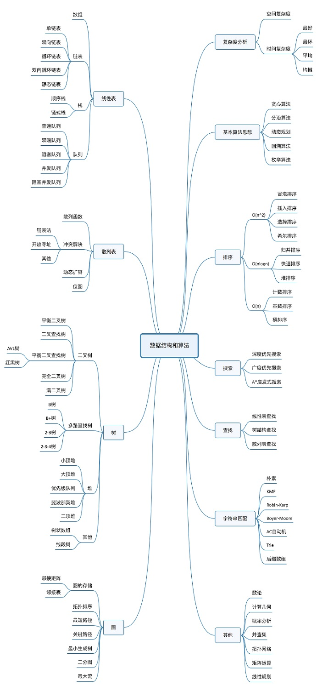

### concept
- 从广义上讲，数据结构就是指一组数据的存储结构。算法就是操作数据的一组方法。

- 从狭义上讲，指某些著名的数据结构和算法，比如队列、栈、堆、二分查找、动态规划等。这些都是前人智慧的结晶，我们可以直接拿来用。我们要讲的这些经典数据结构和算法，都是前人从很多实际操作场景中抽象出来的，经过非常多的求证和检验，可以高效地帮助我们解决很多实际的开发问题

**数据结构是为算法服务的，算法要作用在特定的数据结构之上**, 因此，我们无法孤立数据结构来讲算法，也无法孤立算法来讲数据结构

- 复杂度分析(复杂度分析是整个算法学习的精髓，只要掌握了它，数据结构和算法的内容基本上就掌握了一半)

- **20个最常用(学习它的“来历”“自身的特点”“适合解决的问题”以及“实际的应用场景”)**
> 10个数据结构：数组、链表、栈、队列、散列表、二叉树、堆、跳表、图、Trie 树
>
> 10 个算法：递归、排序、二分查找、搜索、哈希算法、贪心算法、分治算法、回溯算法、动态规划、字符串匹配算法

