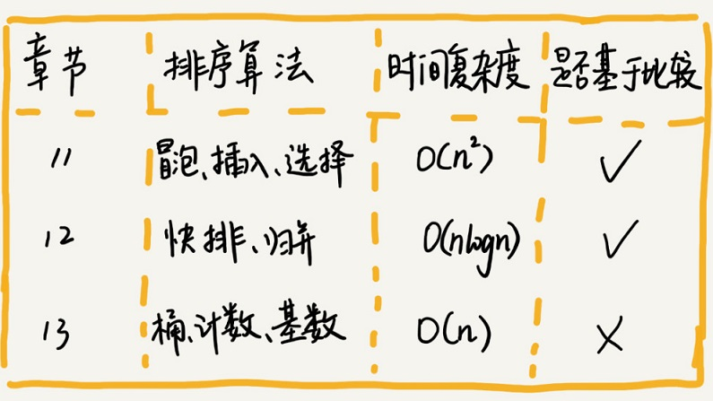
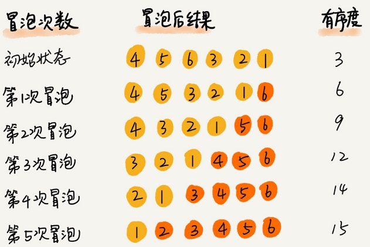
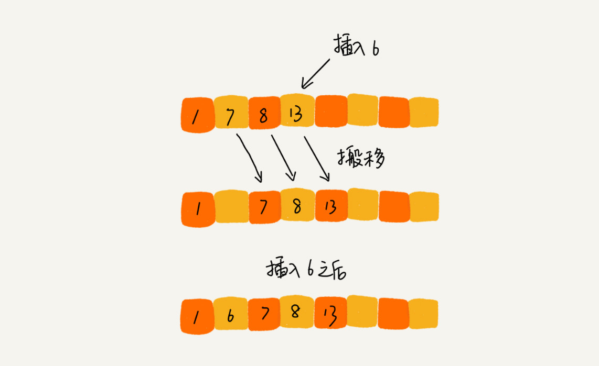
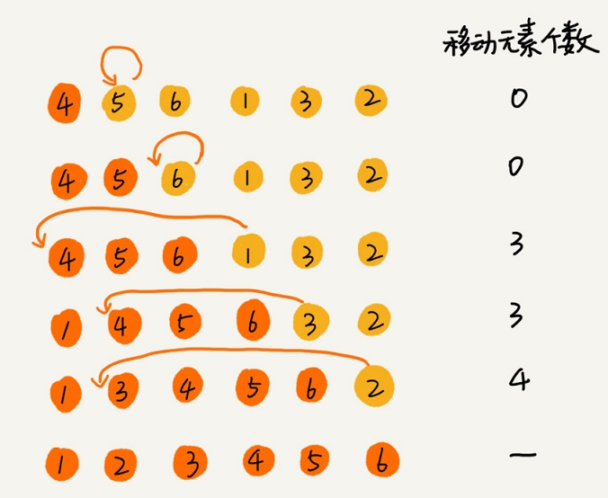
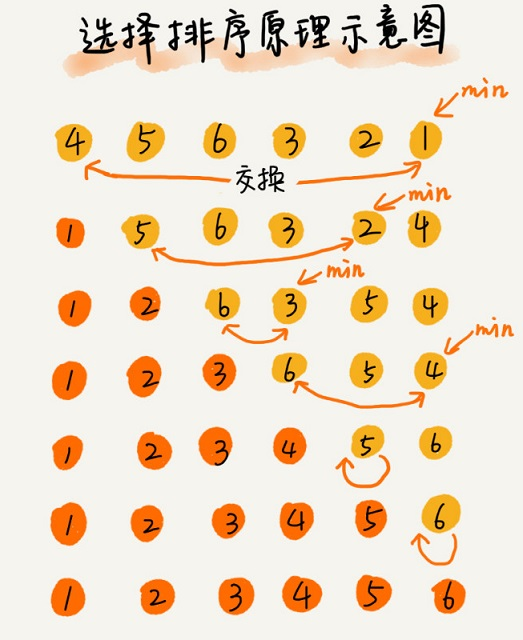
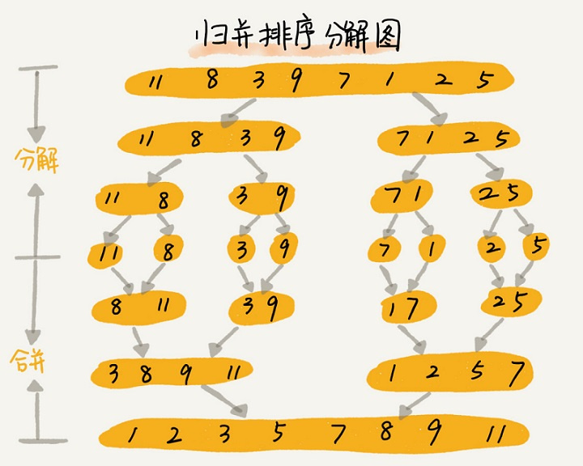

插入排序和冒泡排序的时间复杂度相同，都是 O(n<sup>2</sup>)，在实际的软件开发里，为什么我们更倾向于使用插入排序算法而不是冒泡排序算法呢？

#### 排序算法的执行效率
1. 最好情况、最坏情况、平均情况时间复杂度
2. 时间复杂度的系数、常数 、低阶
3. 比较次数和交换（或移动）次数

#### 排序算法的内存消耗
#### 排序算法的稳定性
稳定排序算法可以保持金额相同的两个对象，在排序之后的前后顺序不变

### 冒泡排序（Bubble Sort）



1. 冒泡排序是原地排序算法吗？
2. 冒泡排序是稳定的排序算法吗？
3. 冒泡排序的时间复杂度是多少？
4. 逆序度 = 满有序度 - 有序度
5. 满有序度 n*(n-1)/2

```javascript
const bubbleSort = arr => {
    if (!Array.isArray(arr)) return
    if (arr.length < 2) return
    for (let i = 0, len = arr.length; i < len; i++) {
        //提前退出flag
        var hasChange = false
        for (let j = 0; j < len - i - 1; j++) {
            if (arr[j] > arr[j + 1]) {
                var tmp = arr[j]
                arr[j] = arr[j + 1]
                arr[j + 1] = tmp
                hasChange = true
            }
        }
        if (!hasChange) break
    }
}
```

### 插入排序（Insertion Sort）
首先，我们将数组中的数据分为两个区间，已排序区间和未排序区间。初始已排序区间只有一个元素，就是数组的第一个元素。插入算法的核心思想是取未排序区间中的元素，在已排序区间中找到合适的插入位置将其插入，并保证已排序区间数据一直有序。重复这个过程，直到未排序区间中元素为空，算法结束




```javascript
const insertSort = arr => {
    if (!Array.isArray(arr)) return
    if (arr.length < 2) return

    for (let i = 1, len = arr.length; i < len; i++) {
        let tmp = arr[i]
        let j = i - 1
        for (; j >= 0; j--) {
            if (arr[j] > tmp) {
                arr[j + 1] = arr[j] //移动数据
            } else {
                break;
            }
        }
        arr[j + 1] = tmp //插入数据
    }
}
```

### 选择排序（Selection Sort）
选择排序算法的实现思路有点类似插入排序，也分已排序区间和未排序区间。但是选择排序每次会从未排序区间中找到最小的元素，将其放到已排序区间的末尾



```javascript
const selectSort = arr => {
    if (!Array.isArray(arr)) return
    if (arr.length < 2) return

    for (let i = 0, len = arr.length; i　<　len - 1; i++) {
        let minIndex = i
        for (let j = i + 1; j < arr.length; j++) {
            if (arr[j] < arr[minIndex]) {
                minIndex = j
            }
        }
        let temp = arr[i]
        arr[i] = arr[minIndex]
        arr[minIndex] = temp
    }
}
```

### 归并排序（Merge Sort）
归并排序的核心思想还是蛮简单的。如果要排序一个数组，我们先把数组从中间分成前后两部分，然后对前后两部分分别排序，再将排好序的两部分合并在一起，这样整个数组就都有序了



分治是一种解决问题的处理思想，递归是一种编程技巧

```javascript
const mergeArr = (left, right) => {
    let temp = []
    let leftIndex = 0
    let rightIndex = 0
    // 判断2个数组中元素大小，依次插入数组
    while (left.length > leftIndex && right.length > rightIndex) {
        if (left[leftIndex] <= right[rightIndex]) {
            temp.push(left[leftIndex])
            leftIndex++
        } else {
            temp.push(right[rightIndex])
            rightIndex++
        }
    }
    // 合并 多余数组
    return temp.concat(left.slice(leftIndex)).concat(right.slice(rightIndex))
}

const mergeSort = (arr) => {
    // 当任意数组分解到只有一个时返回
    if (arr.length <= 1) return arr
    const middle = Math.floor(arr.length / 2)
    const left = arr.slice(0, middle)
    const right = arr.slice(middle)
    // 递归 分解 合并
    return mergeArr(mergeSort(left), mergeSort(right))
}
```

### 快速排序
快排的思想是这样的：如果要排序数组中下标从p到r之间的一组数据，我们选择p到r之间的任意一个数据作为pivot（分区点）。我们遍历p到r之间的数据，将小于 pivot的放到左边，将大于pivot的放到右边，将pivot放到中间。经过这一步骤之后，数组p到r之间的数据就被分成了三个部分，前面p到q-1之间都是小于pivot的，中间是pivot，后面的q+1到r之间是大于pivot的


```javascript
const swap = (arr, i, j) => {
    const temp = arr[i]
    arr[i] = arr[j]
    arr[j] = temp
}

// 获取 pivot 交换完后的index
const partition = (arr, pivot, left, right) => {
    const pivotVal = arr[pivot]
    let startIndex = left
    for (let i = left; i < right; i++) {
        if (arr[i] < pivotVal) {
            swap(arr, i, startIndex)
            startIndex++
        }
    }
    swap(arr, startIndex, pivot)
    return startIndex
}

const quickSort = (arr, left, right) => {
    if (left < right) {
        let pivot = right
        let partitionIndex = partition(arr, pivot, left, right)
        quickSort(arr, left, partitionIndex - 1 < left ? left : partitionIndex - 1)
        quickSort(arr, partitionIndex + 1 > right ? right : partitionIndex + 1, right)
    }
}
```