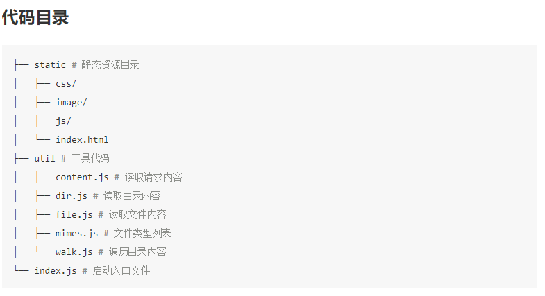
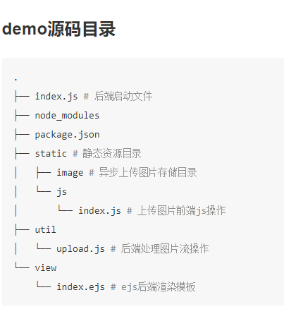
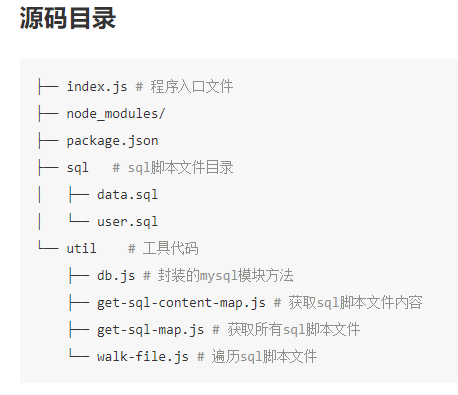
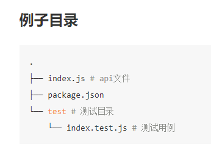
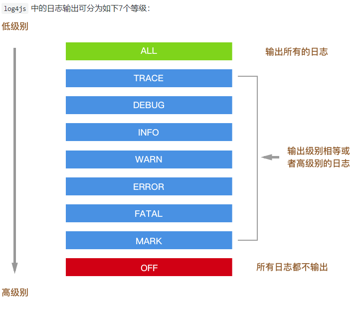

### 1.get started

```javascript
//1 npm init -y
//2 npm i koa

//3 hello world
const Koa = require('koa')
const app = new Koa()

app.use(async ctx => {
	ctx.body = `hello koa2`
}).listen(3000, _ => {
	console.log('server is starting at port 3000')
})
//4 run
node xxx.js
```

#### ctx
`ctx`作为上下文使用，Koa将node的r`equest`, `response`对象封装进一个单独对象。即`ctx.request 、 ctx.response`。Koa内部又对一些常用的属性或者方法做了代理操作，使得我们可以直接通过ctx获取。比如，`ctx.request.ur`以写成`ctx.url`

除此之外，Koa还约定了一个中间件的存储空间`ctx.state`。通过state可以存储一些数据，比如用户数据，版本信息等。如果你使用webpack打包的话，可以使用中间件，将加载资源的方法作为ctx.state的属性传入到view层，方便获取资源路径

#### next
next 参数的作用是将处理的控制权转交给下一个中间件

```javascript
//notice the sequence of middleware
const Koa = require('koa')
const app = new Koa()

app.use(async (ctx, next)=>{
  let startTime = new Date().getTime()
  await next()
  let endTime = new Date().getTime()
  console.log(`response time is：${endTime - startTime}ms`)
})

app.use(async (ctx, next) => {
  console.log('111, 然后doSomething')
  await next()
  console.log('111 end')
})

app.use(async (ctx, next) => {
  console.log('222, 然后doSomething')
  await next()
  console.log('222 end')
})

app.use(async (ctx, next) => {
  console.log('333, 然后doSomething')
  await next()
  console.log('333 end')
})

app.listen(3333, ()=>{
  console.log('server is running at http://localhost:3333')
})
```
### 2.koa2特性

- 只提供封装好http上下文、请求、响应，以及基于`async/await`的中间件容器

- 利用ES7的`async/await`的来处理传统回调嵌套问题和代替koa@1的generator，但是需要在node.js 7.x的harmony模式下才能支持`async/await`

- 中间件只支持 `async/await` 封装的，如果要使用koa@1基于generator中间件，需要通过中间件koa-convert封装一下才能使用

### 3.koa2中间件开发(顺序)

1. ### generator中间件,用在koa1

2. ### generator中间件在koa@2中的使用，需要用koa-convert封装一下

    ```javascript
    const Koa = require('koa') // koa v2
    const convert = require('koa-convert')
    const loggerGenerator  = require('./middleware/logger-generator')
    const app = new Koa()
    
    app.use(convert(loggerGenerator()))
    
    app.use(( ctx ) => {
        ctx.body = 'hello world!'
    })
    
    app.listen(3000)
    console.log('the server is starting at port 3000')
    ```

3. ## async中间件

    ```javascript
    /* ./middleware/logger-async.js */
    function log( ctx ) {
        console.log( ctx.method, ctx.header.host + ctx.url )
    }
    
    module.exports = function () {
      return async function ( ctx, next ) {
        log(ctx);
        await next()
      }
    }
    ```

    ```javascript
    //app.js
    const Koa = require('koa') // koa v2
    const loggerAsync  = require('./middleware/logger-async')
    const app = new Koa()
    
    app.use(loggerAsync())
    
    app.use(( ctx ) => {
        ctx.body = 'hello world!'
    })
    
    app.listen(3000)
    console.log('middleware demo is running at port 3000')
    ```

### 4.路由(koa-router)

#### example

```javascript
const Koa = require('koa')
const fs = require('fs')
const app = new Koa()
//npm i koa-router
const Router = require('koa-router')

let home = new Router()

// 子路由1
home.get('/', async ( ctx )=>{
  let html = `
    <ul>
      <li><a href="/page/helloworld">/page/helloworld</a></li>
      <li><a href="/page/404">/page/404</a></li>
    </ul>
  `
  ctx.body = html
})

// 子路由2
let page = new Router()
page.get('/404', async ( ctx )=>{
  ctx.body = '404 page!'
}).get('/helloworld', async ( ctx )=>{
  ctx.body = 'helloworld page!'
})

// 装载所有子路由
let router = new Router()
router.use('/', home.routes(), home.allowedMethods())
router.use('/page', page.routes(), page.allowedMethods())

// 加载路由中间件
app.use(router.routes()).use(router.allowedMethods())

app.listen(3000, () => {
  console.log('koa-router-demo is starting at port 3000')
})
```

#### router.all

```javascript
// 同时命中
router.get('/', async (ctx, next) => {
  ctx.response.body = `<h1>index page</h1>`
  await next();
})
router.all('/', async (ctx, next) => {
  console.log('match "all" method')
  await next();
});
```

#### 命名路由

```javascript
router.get('user', '/users/:id', function (ctx, next) {
  // ... 
});

router.url('user', 3);
// => 生成路由 "/users/3" 
 
router.url('user', { id: 3 });
// => 生成路由 "/users/3" 
 
router.use(function (ctx, next) {
  // 重定向到路由名称为 “sign-in” 的页面 
  ctx.redirect(ctx.router.url('sign-in'));
})
```

#### 多中间件

```javascript
router.get(
  '/users/:id',
  function (ctx, next) {
    return User.findOne(ctx.params.id).then(function(user) {
      // 首先读取用户的信息，异步操作
      ctx.user = user;
      next();
    });
  },
  function (ctx) {
    console.log(ctx.user);
    // 在这个中间件中再对用户信息做一些处理
    // => { id: 17, name: "Alex" }
  }
);
```

#### 嵌套路由

```javascript
var forums = new Router();
var posts = new Router();
 
posts.get('/', function (ctx, next) {...});
posts.get('/:pid', function (ctx, next) {...});
forums.use('/forums/:fid/posts', posts.routes(), posts.allowedMethods());
 
// 可以匹配到的路由为 "/forums/123/posts" 或者 "/forums/123/posts/123"
app.use(forums.routes());
```

#### 路由前缀(前缀是一个固定的字符串，不能添加动态参数)

```javascript
var router = new Router({
  prefix: '/users'
});
 
router.get('/', ...); // 匹配路由 "/users" 
router.get('/:id', ...); // 匹配路由 "/users/:id" 
```

#### URL 参数

```javascript
router.get('/:category/:title', function (ctx, next) {
  console.log(ctx.params);
  // => { category: 'programming', title: 'how-to-node' } 
});
```

### 5.请求数据获取

#### get

```javascript
const Koa = require('koa')
const app = new Koa()
app.use(async (ctx) => {
    let url = ctx.url
    // 从上下文的request对象中获取
    let request = ctx.request
    let req_query = request.query
    let req_querystring = request.querystring
    // 从上下文中直接获取
    let ctx_query = ctx.query
    let ctx_querystring = ctx.querystring
    ctx.body = {
        url,
        req_query,
        req_querystring,
        ctx_query,
        ctx_querystring
    }
})
app.listen(3000, () => {
    console.log('parameter demo is starting at port 3000')
})
```

```javascript
router.get('/data/:id', async (ctx, next) => {
    // 也从ctx.params对象获取数据
    let data = ctx.params
    ctx.body = data
  })
```

#### post

**注意：`ctx.request`是`context`经过封装的请求对象，`ctx.req`是`context`提供的`node.js`原生HTTP请求对象，同理`ctx.response`是`context`经过封装的响应对象，`ctx.res`是`context`提供的`node.js`原生HTTP请求对象**

```javascript
const Koa = require('koa')
const app = new Koa()

app.use( async ( ctx ) => {
  if ( ctx.url === '/' && ctx.method === 'GET' ) {
    // 当GET请求时候返回表单页面
    let html = `
      <h1>koa2 request post demo</h1>
      <form method="POST" action="/">
        <p>userName</p>
        <input name="userName" /><br/>
        <p>nickName</p>
        <input name="nickName" /><br/>
        <p>email</p>
        <input name="email" /><br/>
        <button type="submit">submit</button>
      </form>
    `
    ctx.body = html
  } else if ( ctx.url === '/' && ctx.method === 'POST' ) {
    // 当POST请求的时候，解析POST表单里的数据，并显示出来
    let postData = await parsePostData( ctx )
    ctx.body = postData
  } else {
    // 其他请求显示404
    ctx.body = '<h1>404！！！ o(╯□╰)o</h1>'
  }
})

// 解析上下文里node原生请求的POST参数
function parsePostData( ctx ) {
  return new Promise((resolve, reject) => {
    try {
      let postdata = "";
      ctx.req.addListener('data', (data) => {
        postdata += data
      })
      ctx.req.addListener("end",function(){
        let parseData = parseQueryStr( postdata )
        resolve( parseData )
      })
    } catch ( err ) {
      reject(err)
    }
  })
}

// 将POST请求参数字符串解析成JSON
function parseQueryStr( queryStr ) {
  let queryData = {}
  let queryStrList = queryStr.split('&')
  console.log( queryStrList )
  for (  let [ index, queryStr ] of queryStrList.entries()  ) {
    let itemList = queryStr.split('=')
    queryData[ itemList[0] ] = decodeURIComponent(itemList[1])
  }
  return queryData
}

app.listen(3000, () => {
  console.log('request post demo is starting at port 3000')
})
```

#### koa-bodyparser

```javascript
const Koa = require('koa')
const app = new Koa()
//npm i koa-bodyparser
const bodyParser = require('koa-bodyparser')

app.use(bodyParser())

app.use( async ( ctx ) => {

  if ( ctx.url === '/' && ctx.method === 'GET' ) {
    // 当GET请求时候返回表单页面
    let html = `
      <h1>koa2 request post demo</h1>
      <form method="POST" action="/">
        <p>userName</p>
        <input name="userName" /><br/>
        <p>nickName</p>
        <input name="nickName" /><br/>
        <p>email</p>
        <input name="email" /><br/>
        <button type="submit">submit</button>
      </form>
    `
    ctx.body = html
  } else if ( ctx.url === '/' && ctx.method === 'POST' ) {
    // 当POST请求的时候，中间件koa-bodyparser解析POST表单里的数据，并显示出来
    let postData = ctx.request.body
    ctx.body = postData
  } else {
    // 其他请求显示404
    ctx.body = '<h1>404！！！ o(╯□╰)o</h1>'
  }
})

app.listen(3000, () => {
  console.log('koa-bodyparser demo is starting at port 3000')
})
```

### 6.静态资源加载

一个http请求访问web服务静态资源，一般响应结果有三种情况

- 访问文本，例如js，css，png，jpg，gif
- 访问静态目录
- 找不到资源，抛出404错误

#### 原生实现




```javascript
//index.js
const Koa = require('koa')
const path = require('path')
const content = require('./util/content')
const mimes = require('./util/mimes')

const app = new Koa()

// 静态资源目录对于相对入口文件index.js的路径
const staticPath = './static'

// 解析资源类型
function parseMime( url ) {
  let extName = path.extname( url )
  extName = extName ?  extName.slice(1) : 'unknown'
  return  mimes[ extName ]
}

app.use( async ( ctx ) => {
  // 静态资源目录在本地的绝对路径
  let fullStaticPath = path.join(__dirname, staticPath)

  // 获取静态资源内容，有可能是文件内容，目录，或404
  let _content = await content( ctx, fullStaticPath )

  // 解析请求内容的类型
  let _mime = parseMime( ctx.url )

  // 如果有对应的文件类型，就配置上下文的类型
  if ( _mime ) {
    ctx.type = _mime
  }

  // 输出静态资源内容
  if ( _mime && _mime.indexOf('image/') >= 0 ) {
    // 如果是图片，则用node原生res，输出二进制数据
    ctx.res.writeHead(200)
    ctx.res.write(_content, 'binary')
    ctx.res.end()
  } else {
    // 其他则输出文本
    ctx.body = _content
  }
})

app.listen(3000)
console.log('static-server demo is starting at port 3000')
```

```javascript
//util/content.js
const path = require('path')
const fs = require('fs')

// 封装读取目录内容方法
const dir = require('./dir')

// 封装读取文件内容方法
const file = require('./file')


/**
 * 获取静态资源内容
 * @param  {object} ctx koa上下文
 * @param  {string} 静态资源目录在本地的绝对路径
 * @return  {string} 请求获取到的本地内容
 */
async function content( ctx, fullStaticPath ) {

  // 封装请求资源的完绝对径
  let reqPath = path.join(fullStaticPath, ctx.url)

  // 判断请求路径是否为存在目录或者文件
  let exist = fs.existsSync( reqPath )

  // 返回请求内容， 默认为空
  let content = ''

  if( !exist ) {
    //如果请求路径不存在，返回404
    content = '404 Not Found! o(╯□╰)o！'
  } else {
    //判断访问地址是文件夹还是文件
    let stat = fs.statSync( reqPath )

    if( stat.isDirectory() ) {
      //如果为目录，则渲读取目录内容
      content = dir( ctx.url, reqPath )

    } else {
      // 如果请求为文件，则读取文件内容
      content = await file( reqPath )
    }
  }

  return content
}

module.exports = content
```

```javascript
//util/dir.js
const url = require('url')
const fs = require('fs')
const path = require('path')

// 遍历读取目录内容方法
const walk = require('./walk')

/**
 * 封装目录内容
 * @param  {string} url 当前请求的上下文中的url，即ctx.url
 * @param  {string} reqPath 请求静态资源的完整本地路径
 * @return {string} 返回目录内容，封装成HTML
 */
function dir ( url, reqPath ) {

  // 遍历读取当前目录下的文件、子目录
  let contentList = walk( reqPath )

  let html = `<ul>`
  for ( let [ index, item ] of contentList.entries() ) {
    html = `${html}<li><a href="${url === '/' ? '' : url}/${item}">${item}</a>` 
  }
  html = `${html}</ul>`

  return html
}

module.exports = dir
```

```javascript
//util/file.js
const fs = require('fs')

/**
 * 读取文件方法
 * @param  {string} 文件本地的绝对路径
 * @return {string|binary} 
 */
function file ( filePath ) {

 let content = fs.readFileSync(filePath, 'binary' )
 return content
}

module.exports = file
```

```javascript
//util/walk.js
const fs = require('fs')
const mimes = require('./mimes')

/**
 * 遍历读取目录内容（子目录，文件名）
 * @param  {string} reqPath 请求资源的绝对路径
 * @return {array} 目录内容列表
 */
function walk( reqPath ){

  let files = fs.readdirSync( reqPath );

  let dirList = [], fileList = [];
  for( let i=0, len=files.length; i<len; i++ ) {
    let item = files[i];
    let itemArr = item.split("\.");
    let itemMime = ( itemArr.length > 1 ) ? itemArr[ itemArr.length - 1 ] : "undefined";

    if( typeof mimes[ itemMime ] === "undefined" ) {
      dirList.push( files[i] );
    } else {
      fileList.push( files[i] );
    }
  }


  let result = dirList.concat( fileList );

  return result;
};

module.exports = walk;
```

```javascript
//util/mime.js
let mimes = {
  'css': 'text/css',
  'less': 'text/css',
  'gif': 'image/gif',
  'html': 'text/html',
  'ico': 'image/x-icon',
  'jpeg': 'image/jpeg',
  'jpg': 'image/jpeg',
  'js': 'text/javascript',
  'json': 'application/json',
  'pdf': 'application/pdf',
  'png': 'image/png',
  'svg': 'image/svg+xml',
  'swf': 'application/x-shockwave-flash',
  'tiff': 'image/tiff',
  'txt': 'text/plain',
  'wav': 'audio/x-wav',
  'wma': 'audio/x-ms-wma',
  'wmv': 'video/x-ms-wmv',
  'xml': 'text/xml'
}

module.exports = mimes
```

#### koa-static

```javascript
const Koa = require('koa')
const path = require('path')
const static = require('koa-static')

const app = new Koa()

// 静态资源目录对于相对入口文件index.js的路径
const staticPath = './static'

app.use(static(
  path.join( __dirname,  staticPath)
))

// app.use( async ( ctx ) => {
//   ctx.body = 'hello world'
// })

app.listen(3000, () => {
  console.log('koa-static demo is starting at port 3000')
})
```

### 7.cookie/session

#### koa2使用cookie

koa提供了从上下文直接读取、写入cookie的方法

- ctx.cookies.get(name, [options]) 读取上下文请求中的cookie
- ctx.cookies.set(name, value, [options]) 在上下文中写入cookie

koa2 中操作的cookies是使用了npm的cookies模块，所以在读写cookie的使用参数与该模块的使用一致

```javascript
const Koa = require('koa')
const app = new Koa()

app.use( async ( ctx ) => {

  if ( ctx.url === '/index' ) {
    ctx.cookies.set(
      'cid', 
      'hello world',
      {
        domain: 'localhost',  // 写cookie所在的域名
        path: '/index',       // 写cookie所在的路径
        maxAge: 10 * 60 * 1000, // cookie有效时长
        expires: new Date('2017-02-15'),  // cookie失效时间
        httpOnly: false,  // 是否只用于http请求中获取
        overwrite: false  // 是否允许重写
      }
    )
    ctx.body = 'cookie is ok'
  } else {
    ctx.body = 'hello world' 
  }

})

app.listen(3000, () => {
  console.log('cookie demo is starting at port 3000')
})
```

#### koa2使用session

- 如果session数据量很小，可以直接存在内存中
- 如果session数据量很大，则需要存储介质存放session数据
- `koa-session-minimal`适用于koa2的session中间件，提供存储介质的读写接口
- `koa-mysql-session`为`koa-session-minimal`中间件提供MySQL数据库的session数据读写操作

```javascript
const Koa = require('koa')
//npm i koa-session-minimal
const session = require('koa-session-minimal')
//npm i koa-mysql-session
const MysqlSession = require('koa-mysql-session')

const app = new Koa()

// 配置存储session信息的mysql
let store = new MysqlSession({
  user: 'root',
  password: 'root',
  database: 'koa_demo',
  host: '127.0.0.1',
})

// 存放sessionId的cookie配置
let cookie = {
  maxAge: '', // cookie有效时长
  expires: '',  // cookie失效时间
  path: '', // 写cookie所在的路径
  domain: '', // 写cookie所在的域名
  httpOnly: '', // 是否只用于http请求中获取
  overwrite: '',  // 是否允许重写
  secure: '',
  sameSite: '',
  signed: ''
}

// 使用session中间件
app.use(session({
  key: 'SESSION_ID',
  store: store,
  cookie: cookie
}))

app.use( async ( ctx ) => {
  // 设置session
  if ( ctx.url === '/set' ) {
    ctx.session = {
      user_id: Math.random().toString(36).substr(2),
      count: 0
    }
    ctx.body = ctx.session
  } else if ( ctx.url === '/' ) {
    // 读取session信息
    ctx.session.count = ctx.session.count + 1
    ctx.body = ctx.session
  }

})

app.listen(3000)
console.log('session demo is starting at port 3000')
```

### 8.常用中间件

- reify

- ##### koa-conditional-get

- koa-etag

- ##### koa-bodyparser

- ##### koa-static

- ##### koa-views

- ##### koa-mount  通过 URL 挂载，将其他 Koa 实例挂在到一个主实例中

- ##### koa-connect  兼容 Express 中间件可以在 Koa 中使用

### 9.view

#### ejs

1. 安装koa模板使用中间件`npm i koa-views`
2. 安装[ejs](https://github.com/mde/ejs)模板引擎`npm i ejs`

```javascript
//index.js
const Koa = require('koa')
const views = require('koa-views')
const path = require('path')
const app = new Koa()

// 加载模板引擎
//入口文件同级存在view目录
app.use(views(path.join(__dirname, './view'), {
  extension: 'ejs'
}))

app.use( async ( ctx ) => {
  let title = 'hello koa2 templeta engine'
  await ctx.render('index', {
    title
  })
})

app.listen(3000)
console.log('ejs view demo is starting at port 3000')
```

```ejs
<!--./view/index.ejs -->
<!DOCTYPE html>
<html>
<head>
    <title><%= title %></title>
</head>
<body>
    <h1><%= title %></h1>
    <p>EJS Welcome to <%= title %></p>
</body>
</html>
```

#### Nunjucks

```javascript
//npm i koa-nunjucks-2
app.use(nunjucks({
    ext: 'html',
    path: path.join(__dirname, 'views'),// 指定视图目录
    nunjucksConfig: {
        trimBlocks: true // 开启转义 防Xss
    }
}));
```

##### grammar

- variable `{{ username }}  {{ foo.bar }} {{ foo["bar"] }}` 如果变量的值为 `undefined` 或 `null` 不显示

- filter ` {{ foo | title }}   {{ foo | join(",") }}   {{ foo | replace("foo", "bar") | capitalize }}`

- if 

    ```
    
      It is true
    
    
    
      I am hungry
    
      I am tired
    
      I am good!
    
    ```

- for

    ```
    var items = [{ title: "foo", id: 1 }, { title: "bar", id: 2}]
    <h1>Posts</h1>
    <ul>
    
      <li>{{ item.title }}</li>
    
      <li>This would display if the 'item' collection were empty</li>
    
    </ul>
    ```

- `macro` 

    ```
    
    <div class="field">
      <input type="{{ type }}" name="{{ name }}"
      value="{{ value | escape }}" />
    </div>
    
    
    {{ field('user') }}
    {{ field('pass', type='password') }}
    ```

- ### 继承功能

    ```
    //layout.html
    <html>
        <head>
          
          <link rel="stylesheet">
          
        </head>  
        <body>
          
          <h1>this is header</h1>
          
    
          
          <h1>this is body</h1>
          
    
          
          <h1>this is footer</h1>  
          
    
          
          <script>
            //this is place for javascript
          </script>
          
        </body>
      </html>
    ```

    ```
    //home.html
    
    
    
    <link href="home.css">
    
    
    
    <h1>home 页面内容</h1>
    
    
    
    <script src="home.js"></script>
    
    ```

    ```
     //最终的 home.html
     <html>
        <head>
          <link href="home.css">
        </head>  
        <body>
          <h1>this is header</h1>
    
          <h1>home 页面内容</h1>
    
          <h1>this is footer</h1>  
    
          <script src="home.js"></script>
        </body>
      </html>
    ```

### 10.upload

#### busboby

```javascript
//npm i busboy用来解析POST请求，node原生req中的文件流
const inspect = require('util').inspect 
const path = require('path')
const fs = require('fs')
const Busboy = require('busboy')

// req 为node原生请求
const busboy = new Busboy({ headers: req.headers })

// ...

// 监听文件解析事件
busboy.on('file', function(fieldname, file, filename, encoding, mimetype) {
  console.log(`File [${fieldname}]: filename: ${filename}`)


  // 文件保存到特定路径
  file.pipe(fs.createWriteStream('./upload'))

  // 开始解析文件流
  file.on('data', function(data) {
    console.log(`File [${fieldname}] got ${data.length} bytes`)
  })

  // 解析文件结束
  file.on('end', function() {
    console.log(`File [${fieldname}] Finished`)
  })
})

// 监听请求中的字段
busboy.on('field', function(fieldname, val, fieldnameTruncated, valTruncated) {
  console.log(`Field [${fieldname}]: value: ${inspect(val)}`)
})

// 监听结束事件
busboy.on('finish', function() {
  console.log('Done parsing form!')
  res.writeHead(303, { Connection: 'close', Location: '/' })
  res.end()
})
req.pipe(busboy)
```

#### 上传文件简单实现

```javascript
//npm i busboy
const inspect = require('util').inspect
const path = require('path')
const os = require('os')
const fs = require('fs')
const Busboy = require('busboy')

/**
 * 同步创建文件目录
 * @param  {string} dirname 目录绝对地址
 * @return {boolean}        创建目录结果
 */
function mkdirsSync( dirname ) {
  if (fs.existsSync( dirname )) {
    return true
  } else {
    if (mkdirsSync( path.dirname(dirname)) ) {
      fs.mkdirSync( dirname )
      return true
    }
  }
}

/**
 * 获取上传文件的后缀名
 * @param  {string} fileName 获取上传文件的后缀名
 * @return {string}          文件后缀名
 */
function getSuffixName( fileName ) {
  let nameList = fileName.split('.')
  return nameList[nameList.length - 1]
}

/**
 * 上传文件
 * @param  {object} ctx     koa上下文
 * @param  {object} options 文件上传参数 fileType文件类型， path文件存放路径
 * @return {promise}         
 */
function uploadFile( ctx, options) {
  let req = ctx.req
  let res = ctx.res
  let busboy = new Busboy({headers: req.headers})

  // 获取类型
  let fileType = options.fileType || 'common'
  let filePath = path.join( options.path,  fileType)
  let mkdirResult = mkdirsSync( filePath )

  return new Promise((resolve, reject) => {
    console.log('文件上传中...')
    let result = { 
      success: false,
      formData: {},
    }

    // 解析请求文件事件
    busboy.on('file', function(fieldname, file, filename, encoding, mimetype) {
      let fileName = Math.random().toString(16).substr(2) + '.' + getSuffixName(filename)
      let _uploadFilePath = path.join( filePath, fileName )
      let saveTo = path.join(_uploadFilePath)

      // 文件保存到制定路径
      file.pipe(fs.createWriteStream(saveTo))

      // 文件写入事件结束
      file.on('end', function() {
        result.success = true
        result.message = '文件上传成功'

        console.log('文件上传成功！')
        resolve(result)
      })
    })

    // 解析表单中其他字段信息
    busboy.on('field', function(fieldname, val, fieldnameTruncated, valTruncated, encoding, mimetype) {
      console.log('表单字段数据 [' + fieldname + ']: value: ' + inspect(val));
      result.formData[fieldname] = inspect(val);
    });

    // 解析结束事件
    busboy.on('finish', function( ) {
      console.log('文件上结束')
      resolve(result)
    })

    // 解析错误事件
    busboy.on('error', function(err) {
      console.log('文件上出错')
      reject(result)
    })

    req.pipe(busboy)
  })

} 


module.exports =  {
  uploadFile
}
```

```javascript
//index.js
const Koa = require('koa')
const path = require('path')
const app = new Koa()
// const bodyParser = require('koa-bodyparser')

const { uploadFile } = require('./util/upload')

// app.use(bodyParser())

app.use( async ( ctx ) => {

  if ( ctx.url === '/' && ctx.method === 'GET' ) {
    // 当GET请求时候返回表单页面
    let html = `
      <h1>koa2 upload demo</h1>
      <form method="POST" action="/upload.json" enctype="multipart/form-data">
        <p>file upload</p>
        <span>picName:</span><input name="picName" type="text" /><br/>
        <input name="file" type="file" /><br/><br/>
        <button type="submit">submit</button>
      </form>
    `
    ctx.body = html

  } else if ( ctx.url === '/upload.json' && ctx.method === 'POST' ) {
    // 上传文件请求处理
    let result = { success: false }
    let serverFilePath = path.join( __dirname, 'upload-files' )

    // 上传文件事件
    result = await uploadFile( ctx, {
      fileType: 'album', // common or album
      path: serverFilePath
    })

    ctx.body = result
  } else {
    // 其他请求显示404
    ctx.body = '<h1>404！！！ o(╯□╰)o</h1>'
  }
})

app.listen(3000, () => {
  console.log('upload-simple demo is starting at port 3000')
})
```

#### 异步上传图片实现




```javascript
//后端代码
//入口文件 demo/upload-async/index.js
const Koa = require('koa')
const views = require('koa-views')
const path = require('path')
const convert = require('koa-convert')
const static = require('koa-static')
const { uploadFile } = require('./util/upload')

const app = new Koa()

app.use(views(path.join(__dirname, './view'), {
  extension: 'ejs'
}))

// 静态资源目录对于相对入口文件index.js的路径
const staticPath = './static'

app.use(static(
  path.join( __dirname,  staticPath)
))

app.use( async ( ctx ) => {
  if ( ctx.method === 'GET' ) {
    let title = 'upload pic async'
    await ctx.render('index', {
      title,
    })
  } else if ( ctx.url === '/api/picture/upload.json' && ctx.method === 'POST' ) {
    // 上传文件请求处理
    let result = { success: false }
    let serverFilePath = path.join( __dirname, 'static/image' )

    // 上传文件事件
    result = await uploadFile( ctx, {
      fileType: 'album',
      path: serverFilePath
    })
    ctx.body = result
  } else {
    // 其他请求显示404
    ctx.body = '<h1>404！！！ o(╯□╰)o</h1>'
  }

})

app.listen(3000, () => {
  console.log('upload-pic-async demo is starting at port 3000')
})
```

```javascript
//后端上传图片流写操作 入口文件 demo/upload-async/util/upload.js
const inspect = require('util').inspect
const path = require('path')
const os = require('os')
const fs = require('fs')
const Busboy = require('busboy')

/**
 * 同步创建文件目录
 * @param  {string} dirname 目录绝对地址
 * @return {boolean}        创建目录结果
 */
function mkdirsSync( dirname ) {
  if (fs.existsSync( dirname )) {
    return true
  } else {
    if (mkdirsSync( path.dirname(dirname)) ) {
      fs.mkdirSync( dirname )
      return true
    }
  }
}

/**
 * 获取上传文件的后缀名
 * @param  {string} fileName 获取上传文件的后缀名
 * @return {string}          文件后缀名
 */
function getSuffixName( fileName ) {
  let nameList = fileName.split('.')
  return nameList[nameList.length - 1]
}

/**
 * 上传文件
 * @param  {object} ctx     koa上下文
 * @param  {object} options 文件上传参数 fileType文件类型， path文件存放路径
 * @return {promise}         
 */
function uploadFile( ctx, options) {
  let req = ctx.req
  let res = ctx.res
  let busboy = new Busboy({headers: req.headers})

  // 获取类型
  let fileType = options.fileType || 'common'
  let filePath = path.join( options.path,  fileType)
  let mkdirResult = mkdirsSync( filePath )

  return new Promise((resolve, reject) => {
    console.log('文件上传中...')
    let result = { 
      success: false,
      message: '',
      data: null
    }

    // 解析请求文件事件
    busboy.on('file', function(fieldname, file, filename, encoding, mimetype) {
      let fileName = Math.random().toString(16).substr(2) + '.' + getSuffixName(filename)
      let _uploadFilePath = path.join( filePath, fileName )
      let saveTo = path.join(_uploadFilePath)

      // 文件保存到制定路径
      file.pipe(fs.createWriteStream(saveTo))

      // 文件写入事件结束
      file.on('end', function() {
        result.success = true
        result.message = '文件上传成功'
        result.data = {
          pictureUrl: `//${ctx.host}/image/${fileType}/${fileName}`
        }
        console.log('文件上传成功！')
        resolve(result)
      })
    })

    // 解析结束事件
    busboy.on('finish', function( ) {
      console.log('文件上结束')
      resolve(result)
    })

    // 解析错误事件
    busboy.on('error', function(err) {
      console.log('文件上出错')
      reject(result)
    })

    req.pipe(busboy)
  })

} 

module.exports =  {
  uploadFile
}
```

```html
<!-- 前端代码 -->
<button class="btn" id="J_UploadPictureBtn">上传图片</button>
<hr/>
<p>上传进度<span id="J_UploadProgress">0</span>%</p>
<p>上传结果图片</p>
<div id="J_PicturePreview" class="preview-picture">
</div>
<script src="/js/index.js"></script>
```

```javascript
(function(){
let btn = document.getElementById('J_UploadPictureBtn')
let progressElem = document.getElementById('J_UploadProgress')
let previewElem = document.getElementById('J_PicturePreview')
btn.addEventListener('click', function(){
  uploadAction({
    success: function( result ) {
      console.log( result )
      if ( result && result.success && result.data && result.data.pictureUrl ) {
        previewElem.innerHTML = ''
      }
    },
    progress: function( data ) {
      if ( data && data * 1 > 0 ) {
        progressElem.innerText = data
      }
    }
  })
})

/**
 * 类型判断
 * @type {Object}
 */
let UtilType = {
  isPrototype: function( data ) {
    return Object.prototype.toString.call(data).toLowerCase();
  },

  isJSON: function( data ) {
    return this.isPrototype( data ) === '[object object]';
  },

  isFunction: function( data ) {
    return this.isPrototype( data ) === '[object function]';
  }
}

/**
 * form表单上传请求事件
 * @param  {object} options 请求参数
 */
function requestEvent( options ) {
  try {
    let formData = options.formData
    let xhr = new XMLHttpRequest()
    xhr.onreadystatechange = function() {

      if ( xhr.readyState === 4 && xhr.status === 200 ) {
        options.success(JSON.parse(xhr.responseText))
      } 
    }

    xhr.upload.onprogress = function(evt) {
      let loaded = evt.loaded
      let tot = evt.total
      let per = Math.floor(100 * loaded / tot) 
      options.progress(per)
    }
    xhr.open('post', '/api/picture/upload.json')
    xhr.send(formData)
  } catch ( err ) {
    options.fail(err)
  }
}

/**
 * 上传事件
 * @param  {object} options 上传参数      
 */
function uploadEvent ( options ){
  let file
  let formData = new FormData()
  let input = document.createElement('input')
  input.setAttribute('type', 'file')
  input.setAttribute('name', 'files')

  input.click()
  input.onchange = function () {
    file = input.files[0]
    formData.append('files', file)

    requestEvent({
      formData,
      success: options.success,
      fail: options.fail,
      progress: options.progress
    })  
  }

}

/**
 * 上传操作
 * @param  {object} options 上传参数     
 */
function uploadAction( options ) {
  if ( !UtilType.isJSON( options ) ) {
    console.log( 'upload options is null' )
    return
  }
  let _options = {}
  _options.success = UtilType.isFunction(options.success) ? options.success : function() {}
  _options.fail = UtilType.isFunction(options.fail) ? options.fail : function() {}
  _options.progress = UtilType.isFunction(options.progress) ? options.progress : function() {}

  uploadEvent(_options)
}
})()
```


### 11.integrated with MySQL

#### mysql

```javascript
//npm i mysql
const mysql = require('mysql')
const connection = mysql.createConnection({
  host     : '127.0.0.1', 
  user     : 'root',
  password : 'root',
  database : 'test'
})

// 执行sql脚本对数据库进行读写 
connection.query('SELECT * FROM my_table',  (error, results, fields) => {
  if (error) throw error
  // connected! 

  // 结束会话
  connection.release() 
});
```

#### 创建数据连接池

```javascript
const mysql = require('mysql')

// 创建数据池
const pool  = mysql.createPool({
  host     : '127.0.0.1',
  user     : 'root',
  password : 'root',
  database : 'test'
})

// 在数据池中进行会话操作
pool.getConnection(function(err, connection) {

  connection.query('SELECT * FROM my_table',  (error, results, fields) => {

    // 结束会话
    connection.release();

    // 如果有错误就抛出
    if (error) throw error;
  })
})
```

#### async/await封装使用mysql

```javascript
const mysql = require('mysql')
const pool = mysql.createPool({
  host     :  '127.0.0.1',
  user     :  'root',
  password :  'root',
  database :  'test'
})

let query = function( sql, values ) {
  return new Promise(( resolve, reject ) => {
    pool.getConnection(function(err, connection) {
      if (err) {
        reject( err )
      } else {
        connection.query(sql, values, ( err, rows) => {
          if ( err ) {
            reject( err )
          } else {
            resolve( rows )
          }
          connection.release()
        })
      }
    })
  })
}

module.exports = { query }
```

```javascript
const { query } = require('./async-db')
async function selectAllData( ) {
  let sql = 'SELECT * FROM my_table'
  let dataList = await query( sql )
  return dataList
}

async function getData() {
  let dataList = await selectAllData()
  console.log( dataList )
}
```

#### 建表初始化



```javascript
//数据库操作文件 ./util/db.js
const mysql = require('mysql')

const pool = mysql.createPool({
  host     :  '127.0.0.1',
  user     :  'root',
  password :  'abc123',
  database :  'koa_demo'
})

let query = function( sql, values ) {
  return new Promise(( resolve, reject ) => {
    pool.getConnection(function(err, connection) {
      if (err) {
        reject( err )
      } else {
        connection.query(sql, values, ( err, rows) => {
          if ( err ) {
            reject( err )
          } else {
            resolve( rows )
          }
          connection.release()
        })
      }
    })
  })
}

module.exports = {
  query
}
```

```javascript
//获取所有sql脚本内容 ./util/get-sql-content-map.js
const fs = require('fs')
const getSqlMap = require('./get-sql-map')

let sqlContentMap = {}

/**
 * 读取sql文件内容
 * @param  {string} fileName 文件名称
 * @param  {string} path     文件所在的路径
 * @return {string}          脚本文件内容
 */
function getSqlContent( fileName,  path ) {
  let content = fs.readFileSync( path, 'binary' )
  sqlContentMap[ fileName ] = content
}

/**
 * 封装所有sql文件脚本内容
 * @return {object} 
 */
function getSqlContentMap () {
  let sqlMap = getSqlMap()
  for( let key in sqlMap ) {
    getSqlContent( key, sqlMap[key] )
  }

  return sqlContentMap
}

module.exports = getSqlContentMap
```

```javascript
//获取sql目录详情 ./util/get-sql-map.js
const fs = require('fs')
const walkFile = require('./walk-file')

/**
 * 获取sql目录下的文件目录数据
 * @return {object} 
 */
function getSqlMap () {
  let basePath = __dirname
  basePath = basePath.replace(/\\/g, '\/')

  let pathArr = basePath.split('\/')
  pathArr = pathArr.splice( 0, pathArr.length - 1 )
  basePath = pathArr.join('/') + '/sql/'

  let fileList = walkFile( basePath, 'sql' )
  return fileList
}

module.exports = getSqlMap
```

```javascript
//遍历目录操作 ./util/walk-file.js
const fs = require('fs')

/**
 * 遍历目录下的文件目录
 * @param  {string} pathResolve  需进行遍历的目录路径
 * @param  {string} mime         遍历文件的后缀名
 * @return {object}              返回遍历后的目录结果
 */
const walkFile = function(  pathResolve , mime ){

  let files = fs.readdirSync( pathResolve )

  let fileList = {}

   for( let [ i, item] of files.entries() ) {
    let itemArr = item.split('\.')

    let itemMime = ( itemArr.length > 1 ) ? itemArr[ itemArr.length - 1 ] : 'undefined'
    let keyName = item + ''
    if( mime === itemMime ) {
      fileList[ item ] =  pathResolve + item
    }
  }

  return fileList
}

module.exports = walkFile
```

```javascript
//入口文件 ./index.js
const fs = require('fs');
const getSqlContentMap = require('./util/get-sql-content-map');
const { query } = require('./util/db');


// 打印脚本执行日志
const eventLog = function( err , sqlFile, index ) {
  if( err ) {
    console.log(`[ERROR] sql脚本文件: ${sqlFile} 第${index + 1}条脚本 执行失败 o(╯□╰)o ！`)
  } else {
    console.log(`[SUCCESS] sql脚本文件: ${sqlFile} 第${index + 1}条脚本 执行成功 O(∩_∩)O !`)
  }
}

// 获取所有sql脚本内容
let sqlContentMap = getSqlContentMap()

// 执行建表sql脚本
const createAllTables = async () => {
  for( let key in sqlContentMap ) {
    let sqlShell = sqlContentMap[key]
    let sqlShellList = sqlShell.split(';')

    for ( let [ i, shell ] of sqlShellList.entries() ) {
      if ( shell.trim() ) {
        let result = await query( shell )
        if ( result.serverStatus * 1 === 2 ) {
          eventLog( null,  key, i)
        } else {
          eventLog( true,  key, i) 
        }
      }
    }
  }
  console.log('sql脚本执行结束！')
  console.log('请按 ctrl + c 键退出！')

}

createAllTables()
```

```sql
--sql脚本文件 ./sql/data.sql
CREATE TABLE   IF NOT EXISTS  `data` (
  `id` int(11) NOT NULL AUTO_INCREMENT,
  `data_info` json DEFAULT NULL,
  `create_time` varchar(20) DEFAULT NULL,
  `modified_time` varchar(20) DEFAULT NULL,
  `level` int(11) DEFAULT NULL,
  PRIMARY KEY (`id`)
) ENGINE=InnoDB DEFAULT CHARSET=utf8
```

```sql
--sql脚本文件 ./sql/user.sql
CREATE TABLE   IF NOT EXISTS  `user` (
  `id` int(11) NOT NULL AUTO_INCREMENT,
  `email` varchar(255) DEFAULT NULL,
  `password` varchar(255) DEFAULT NULL,
  `name` varchar(255) DEFAULT NULL,
  `nick` varchar(255) DEFAULT NULL,
  `detail_info` json DEFAULT NULL,
  `create_time` varchar(20) DEFAULT NULL,
  `modified_time` varchar(20) DEFAULT NULL,
  `level` int(11) DEFAULT NULL,
  PRIMARY KEY (`id`)
) ENGINE=InnoDB DEFAULT CHARSET=utf8;

INSERT INTO `user` set email='1@example.com', password='123456';
INSERT INTO `user` set email='2@example.com', password='123456';
INSERT INTO `user` set email='3@example.com', password='123456';
```

### 12.jsonp

#### 原生koa2实现jsonp

```javascript
const Koa = require('koa')
const app = new Koa()

app.use( async ( ctx ) => {
  // 如果jsonp 的请求为GET
  if ( ctx.method === 'GET' && ctx.url.split('?')[0] === '/getData.jsonp') {

    // 获取jsonp的callback
    let callbackName = ctx.query.callback || 'callback'
    let returnData = {
      success: true,
      data: {
        text: 'this is a jsonp api',
        time: new Date().getTime(),
      }
    }

    // jsonp的script字符串
    let jsonpStr = `;${callbackName}(${JSON.stringify(returnData)})`

    // 用text/javascript，让请求支持跨域获取
    ctx.type = 'text/javascript'

    // 输出jsonp字符串
    ctx.body = jsonpStr
  } else {
    ctx.body = 'hello jsonp'
  }
})

app.listen(3000, () => {
  console.log('jsonp demo is starting at port 3000')
})

//同域访问JSON请求
//http://localhost:3000/getData.jsonp

//跨域访问JSONP请求
$.ajax({
  url:'http://localhost:3000/getData.jsonp',
  type:'get',
  dataType:'JSONP',
  success: function(res) {
    console.log(res)
  }
})
```

#### koa-jsonp

```javascript
//npm i koa-jsonp
const Koa = require('koa')
const jsonp = require('koa-jsonp')
const app = new Koa()

// 使用中间件
app.use(jsonp())

app.use( async ( ctx ) => {
  let returnData = {
    success: true,
    data: {
      text: 'this is a jsonp api',
      time: new Date().getTime(),
    }
  }

  // 直接输出JSON
  ctx.body = returnData
})

app.listen(3000, () => {
  console.log('jsonp demo is starting at port 3000')
})
```

#### 挂载jsonp返回格式到ctx

```javascript
module.exports = () => {
  function render(json) {
      this.set("Content-Type", "application/json")
      this.body = JSON.stringify(json)
  }
  return async (ctx, next) => {
      ctx.send = render.bind(ctx)
      await next()
  }
}

ctx.send({
  status: 'success',
  data: 'hello ikcmap'
})
```

### 13.unit test

- mocha 模块是测试框架
- chai 模块是用来进行测试结果断言库，比如一个判断 1 + 1 是否等于 2
- supertest 模块是http请求测试库，用来请求API接口



```javascript
//npm i -D mocha chai supertest
const Koa = require('koa')
const app = new Koa()

const server = async ( ctx, next ) => {
  let result = {
    success: true,
    data: null
  }

  if ( ctx.method === 'GET' ) { 
    if ( ctx.url === '/getString.json' ) {
      result.data = 'this is string data'
    } else if ( ctx.url === '/getNumber.json' ) {
      result.data = 123456
    } else {
      result.success = false
    }
    ctx.body = result
    next && next()
  } else if ( ctx.method === 'POST' ) {
    if ( ctx.url === '/postData.json' ) {
      result.data = 'ok'
    } else {
      result.success = false
    }
    ctx.body = result
    next && next()
  } else {
    ctx.body = 'hello world'
    next && next()
  }
}

app.use(server)

module.exports = app

app.listen(3000, () => {
  console.log('test-unit demo is starting at port 3000')
})
```

```javascript
//test/app.test.js
const supertest = require('supertest')
const chai = require('chai')
const app = require('./../index')

const expect = chai.expect
//服务入口加载
const request = supertest( app.listen() )

// 测试套件/组
describe( '开始测试demo的GET请求', ( ) => {
  // 测试用例
  it('测试/getString.json请求', ( done ) => {
      request
        .get('/getString.json')
        .expect(200)
        .end(( err, res ) => {
            // 断言判断结果是否为object类型
		   expect(res.body).to.be.an('object')
            expect(res.body.success).to.be.an('boolean')
            expect(res.body.data).to.be.an('string')
            done()
        })
  })
})
```

### 14.log4js




#### log4js middleware

```javascript
//npm i log4js
const log4js = require('log4js');
module.exports = ( options ) => {
  return async (ctx, next) => {
    const start = Date.now()
    log4js.configure({
      appenders: { cheese: { type: 'file', filename: 'cheese.log' } },
      categories: { default: { appenders: ['cheese'], level: 'info' } }
    }); 
    const logger = log4js.getLogger('cheese');
    await next()
    const end = Date.now()
    const responseTime = end - start;
    logger.info(`响应时间为${responseTime/1000}s`);
  }
}
```

#### 挂载应用日志到 `ctx` 上

```javascript
const log4js = require('log4js');
const methods = ["trace", "debug", "info", "warn", "error", "fatal", "mark"]

module.exports = () => {
  const contextLogger = {}
  log4js.configure({
    appenders: { cheese: { type: 'file', filename: 'cheese.log' } },
    categories: { default: { appenders: ['cheese'], level: 'info' } }
  }); 
 
  const logger = log4js.getLogger('cheese');
  
  return async (ctx, next) => {
  	 // 记录请求开始的时间
    const start = Date.now()
	 // 循环methods将所有方法挂载到ctx 上
    methods.forEach((method, i) => {
	   contextLogger[method] = (message) => {
	     logger[method](message)
	   }
    })
    ctx.log = contextLogger;

    await next()
    // 记录完成的时间 作差 计算响应时间
    const responseTime = Date.now() - start;
    logger.info(`响应时间为${responseTime/1000}s`);
  }
}
```

#### 抽出可配置量

#### 丰富日志信息

#### 项目自定义内容

#### 对日志中间件进行错误处理

### 15.错误处理

#### 抽取中间件并引入

#### 渲染页面逻辑

### 16.规范与部署

- `nodemon`自动重启(全局本地都安装)

- `pm2`Node应用的进程管理器

    ```javascript
    npm i pm2 -g
    pm2 start app.js
    ```


