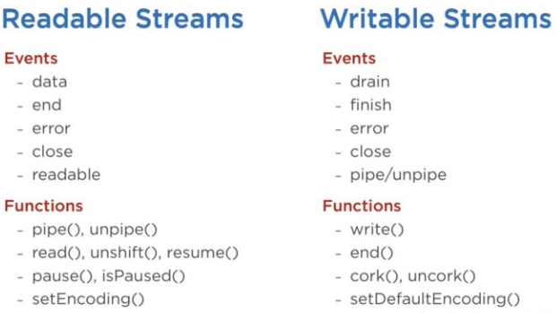

### 流（Stream）到底是什么?

流就是一系列的数据——就跟数组或者字符串一样。有一点不同，就是 stream 可能无法在一次性全部可用，且它们不需要与内存完全合槽。这么一来，stream 在处理大量数据，或者操作一个一次只给出一部分数据的数据源的时候显得格外有用。

其实，流不只是在操作大量数据的时候有用。它还为在代码中使用各种强大的组合类功能提供能力。例如，我们在 Linux 命令行中可以通过管道（pipe）来完成一些组合性的命令，在 Node.js 的流中也能实现。

`~/learn-node $ grep -R exports * | wc -l 6`

上面的命令行在 Node.js 中可以这么实现：

```
const grep = ... // grep 输出流
const wc = ... // wc 输入流

grep.pipe(wc)
```

很多 Node.js 的内置模块都是基于流接口的：


上图列表中就是一些使用了流的原生 Node.js 对象。其中有一些对象甚至是既可读又可写的，例如 TCP socket、zlib 以及 crypto 等。

值得注意的是上面说的一些对象也是彼此紧密联系的。例如 HTTP 响应在客户端中是一个可读流，而在服务端则是一个可写流。毕竟在 HTTP 场景中，我们在客户端侧是从相应对象（http.IncommingMessage）读取数据，而在服务端则是写入数据（http.ServerResponse）。

还需要注意的是，stdio 相应的流（stdin, stdout, stderr）在子进程中与主进程都是相反的流类型。这样一来主进程和子进程直接就可以方便地 pipe stdio 数据了。

### 小试牛刀

首先创建一个大大大大大大大文件：

```
const fs = require('fs');
const file = fs.createWriteStream('./big.file');

for(let i=0; i<= 1e6; i++) {
  file.write('Lorem ipsum dolor sit amet, consectetur adipisicing elit, sed do eiusmod tempor incididunt ut labore et dolore magna aliqua. Ut enim ad minim veniam, quis nostrud exercitation ullamco laboris nisi ut aliquip ex ea commodo consequat. Duis aute irure dolor in reprehenderit in voluptate velit esse cillum dolore eu fugiat nulla pariatur. Excepteur sint occaecat cupidatat non proident, sunt in culpa qui officia deserunt mollit anim id est laborum.\n');
}

file.end();
```

fs 模块可以让你用流来写入或者读取文件。在上面的例子中，我们在一个一百万次的循环中用一个可写流写了一个大文件 big.file。

运行完这段代码后，你会得到一个将近 400 MB 的文件。

接下去是一个托管这个 big.file 的 Node.js web 服务端：

```
const fs = require('fs');
const server = require('http').createServer();

server.on('request', (req, res) => {
  fs.readFile('./big.file', (err, data) => {
    if (err) throw err;
    res.end(data);
  });
});

server.listen(8000);
```

当服务端进来一个请求，它就会通过 fs.readFile 来异步读取文件并返回。

当我运行服务端的时候，它的内存消耗很正常，8.7 MB
然后我连接到服务端。各部门注意，看看内存消耗了,一下子就跳到了 434.8 MB！

我们就是简单地把整个 big.file 文件的内容放到了内存中，然后再把它传输给响应对象。真特么低效。

其实 HTTP 响应对象（也就是上面代码中的 res）是一个可写流。这就意味着如果我们有一个可以代表 big.file 的可读流，那么我们只需要将这两者管道（pipe）接起来就能得到几乎一样的效果，而且根本用不了那么多内存。

Node.js 的 fs 模块中有一个 createReadStream 方法，可以让你从任意文件中创建一个可读流。我们只要把这个流与响应对象 pipe 起来就可以了：

```
const fs = require('fs');
const server = require('http').createServer();

server.on('request', (req, res) => {
  const src = fs.createReadStream('./big.file'); // 就是
  src.pipe(res);                                 // 这两句
});

server.listen(8000);
```

当一个客户端请求这个大文件的时候，我们每次只返回一块内容（chunk），也就是说我们不需要一次性把整个大象放到冰箱里。内存大约只增长了 25 MB。

你还能把这个样例给改到极限——把写文件的循环改到 500 万次，这样一来生成的文件就超过 2 GB 了，也就是说超过了 Node.js 的默认内存上线。

如果这个时候你还是用 fs.readFile 来传递文件的话，默认情况下是做不到的，除非你改 Node.js 的默认内存上限。但是如果你用的是 fs.createReadStream 的话，2 GB 的流式文件传输根本不会成为问题，而且内存使用量基本上会稳定在很小的量。

### 造流 101

Node.js 中的流有 4 种基本类型：**Readable（可读流）、Writable（可写流）、Duplex（双工流）和 Transform（变形金刚流）**。

- 可读流是对于可被消耗的数据源的抽象。例如 fs.createReadStream 方法；
- 可写流是对于可被写入的数据目标的抽象。例如 fs.createWriteStream 方法；
- 双工流是可读流与可写流的集合体。例如 TCP socket；
- 变形金刚流基本上就是一个双工流，只不过在读写的时候可以修改或者转化数据，例如 zlib.createGzip 就将数据使用 gzip 压缩了。你可以将变形金刚流看成是一个函数，其中输入是可写流，而输出是一个可读流。

所有的流都是继承自 EventEmitter。也就是说，它们触发的事件可以用于读写数据。不过，我们也可以简单粗暴地用 pipe 来消费流数据。

### pipe

`readableSrc.pipe(writableDest)`

这么简单一行，我们就将数据源，也就是可读流的输出给嫁接到数据目标，也就是可写流的输入中去了。数据源必须是一个可读流，而数据目标得是一个可写流。当然了，双工流和变形金刚流既可以是数据源也可以是数据目标。事实上，如果我们把数据嫁接到一个双工流去，我们就可以像 Linux 一样进行链式调用了：

```
readableSrc
  .pipe(transformStream1)
  .pipe(transformStream2)
  .pipe(finalWrtitableDest)
```

`pipe`方法会返回数据目标流，所以我们才能进行链式调用。对于 a（可读流）、b 和 c（双工流）、d（可写流）来说，我们就可以用各种姿势玩：

```
a.pipe(b).pipe(c).pipe(d)

# 等效于
a.pipe(b)
b.pipe(c)
c.pipe(d)

# 在 Linux 下等效于
$ a | b | c | d
```

pipe 方法是消费流数据最简单的方法。我的建议是要么使用 pipe 方法，要么通过事件来消耗，但是要避免二者混合使用。而且通常，如果你用了 pipe，你就用不到事件了，但如果你想用更自由的形式来消费流数据，那么你可能就需要用事件了。

### 流事件

`pipe`在读取和写入数据的时候，还会自动做一些其它的管理相关的事情。例如它会处理错误、文件结束符（end-of-files）以及当一个流的流速比另一个流要快或者慢的情况。

不过就算这样，你也还是可以自行直接使用事件来消费流数据。下面的代码是一个最简单的与 pipe 方法等效的样例：

```
# readable.pipe(writable)

readable.on('data', (chunk) => {
  writable.write(chunk);
});

readable.on('end', () => {
  writable.end();
});
```

下面是可读流和可写流中一些重要的事件和函数：



这些函数和时间密切相关，因为它们通常一起被使用。

在可读流中，几个重要的事件分别是：

- data 事件，当流中传出一块数据给消费者的时候会触发这个事件；
- end 事件，当没有更多数据了的时候触发该事件；

在可写流中，几个重要的事件分别是：

- drain 事件，该事件触发后就表示可写流可以写入数据了；
- finish 事件，该事件触发后表示数据已经写入到下层系统了。

事件和函数组合起来，可以自定义和优化流的使用。我们可以通过 pipe / unpipe 函数来消费可读流，也可以通过 read / unshift / resume 等。我们可以将可写流作为 pipe / unpipe 的参数传入，或者直接调用可写流的 write，当写入结束的时候可以调用 end 函数。

### 可读流的暂停与流动模式

可读流有两种模式来影响我们消费流：

- 暂停（Paused）模式；
- 流动（Flowing）模式。

某种意义上，我们可以将其类比于拉（pull）模式与推（push）模式。

默认情况下，所有的可读流都是以暂停模式启动的，但是可以轻松切换为流动模式，然后在需要的时候切回暂停状态。有时候这个切换会自动执行。

当可读流处于暂停模式的时候，我们可以通过 read() 函数来按需读取，但是对于流动模式来说，数据是源源不断进来的，这时候我们就需要通过监听来消耗它了。

敲黑板，**在流动模式下，如果没有消费者去处理这些数据，实际上可能会丢失数据**。这就是为什么当我们的可读流处于流动模式的时候，我们需要一个事件处理函数去监听这个事件。实际上，添加一个数据事件监听函数，就会自动将流动模式切换成暂停模式，删除监听则会切换回来。这么做的原因是为了向后兼容老的 Node.js 流接口。

如果你要手动切换的话，只需要使用 `resume()` 和 `pause()` 函数。


当使用 pipe 方法去消费一个可读流的时候，我们不需要关心这些东西，因为 pipe 函数内部自动做了这些相关的处理。

### 实现流

当我们在谈论 Node.js 流的时候，其实主要有两件事可做：

- 实现一个流；
- 消费流。

流的实现通常以 `require` 这个 `stream`模块开始。

#### 实现一个可写流

我们使用 stream 模块的 Writable 类来实现一个可读流：

`const { Writable } = require('stream')`

我们可以用好几种姿势来实现一个可读流。例如，我们可以从 Writable 继承一个类：

```
class myWritableStream extends Writable {
}
```

我个人是喜欢更简单的构造方法。我们只需要实例化一个 Writable 对象，并往里面传入几个参数。这些参数中唯一的必选参数是 write 方法，用于实现写入一块（chunk）数据。

```
const { Writable } = require('stream');

const outStream = new Writable({
  write(chunk, encoding, callback) {
    console.log(chunk.toString());
    callback();
  }
});

process.stdin.pipe(outStream);
```

write 函数有三个参数。

- chunk 通常是一个 Buffer，除非我们用了别的奇葩姿势；
- encoding 参数指的就是编码，实际上我们通常可以忽略它；
- callback 是我们在写完数据后需要调用一下的回调函数。它相当于是告知调用方数据写入成功或者失败的信标。如果写入失败，在调用 callback 函数的时候传入一个错误对象即可。

在 outStream 中，我们只是简单地将一块数据给 console.log 出来，并紧接着调用回调函数 callback，不传入任何错误参数，表示写入成功了。这是一个非常简单但并没什么乱用的 echo 流。它只是把它接收到的数据原样输出而已。

如果要消费这个流，我们只需要与 process.stdin 这个可读流一起使用，也就是说只需要简单地将 process.stdin 给 pipe 到 outStream。

当我们运行上面的代码，我们输入给 process.stdin 的内容就会被 outStream 又给原封不动地 console.log 出来。

这东西真的没什么卵用，毕竟已经内置被实现了。它基本上等价于 process.stdout。我们可以简单地将 stdin 给 pipe 到 stdout，那么我们将会得到一样的效果：

`process.stdin.pipe(process.stdout);`

#### 实现一个可读流

如果要实现一个可读流，我们只需要 require 其 Readable，然后在实例化的时候传入一个对象即可。其中我们需要实现 `read()` 方法：

```
const { Readable } = require('stream');

const inStream = new Readable({
  read() {}
});
```

实现一个可读流非常简单。我们只需要直接往里 push 待消费数据。

```
const { Readable } = require('stream');
const inStream = new Readable({
  read() {}
});

inStream.push('ABCDEFGHIJKLM');
inStream.push('NOPQRSTUVWXYZ');

inStream.push(null); // No more data

inStream.pipe(process.stdout);
```

当我们 push 一个 null 对象，就表示我们告知流，没有更多数据了。

我们可以将该可读流直接 pipe 给 process.stdout 来消费这些数据。

当我们执行上面的代码，我们就会从 inStream 读取数据并将其输出到标准输出中。非常简单，但还是没什么卵用。

我们刚才在 pipe 至 process.stdout 之前就把所有的数据都推入流中。实际上，更好的方法是按需推数据——当消费者需要的时候再推。我们可以实现 `read()` 函数：

```
const inStream = new Readable({
  read(size) {
    // there is a demand on the data... Someone wants to read it.
  }
});
```

当一个可读流的 read 方法被调用的时候，我们应该可以把数据推入到一个队列中。例如，我们可以一次推入一个字母，从 ASCII 65（也就是大写字母 A）开始，然后每次都推入下一个字母：

```
const inStream = new Readable({
  read(size) {
    this.push(String.fromCharCode(this.currentCharCode++));
    if (this.currentCharCode > 90) {
      this.push(null);
    }
  }
});

inStream.currentCharCode = 65;

inStream.pipe(process.stdout);
```

这样一来，当有消费者来读取该可读流的时候，read 函数会一直被调用，这样一来我们就推入了更多的字母。我们再在最后结束这个循环就好了，也就是在 currentCharCode 大于 90（也就是大写字母 Z）的时候 push 进去一个 null。

这段代码等效于我们再先前写的更简单的那段，只不过这一次我们是按需推入数据。事实上我们就应该按需推入。

#### 实现双工 / 变形金刚流

在双工流中，我们既可以实现可读流，也可以实现可写流。其实就相当于我们从两个流类型中一起继承出来。

这里有一个双工流的样例，把之前的可读流和可写流样例给结合起来了：

```
const { Duplex } = require('stream');

const inoutStream = new Duplex({
  write(chunk, encoding, callback) {
    console.log(chunk.toString());
    callback();
  },

  read(size) {
    this.push(String.fromCharCode(this.currentCharCode++));
    if (this.currentCharCode > 90) {
      this.push(null);
    }
  }
});

inoutStream.currentCharCode = 65;

process.stdin.pipe(inoutStream).pipe(process.stdout);
```

糅杂了这些方法后，我们可以用这个双工流去读取 A 到 Z 的字母，然后也可以用做 echo。我们将可读流 stdin 给 pipe 到这个双工流中来进行 echo，然后再将双工流再给连接到可写流 stdout 中，我们就可以看到 A 到 Z 的输出了。

敲黑板，**重点是我们要理解双工流的读写是完全独立操作的，它只是将可读流和可写流的特征给糅杂到一个对象中**。

变形金刚流则更有意思了，它的输出是经过计算的自身输入。

对于变形金刚流来说，我们不需要实现 read 或者 write 方法，我们只需要实现 transform 方法就好了——它是一个糅杂方法。它既有 `write` 方法的特征，又可以在里面 `push` 数据。

这是一个简单的变形金刚流，它会把流入的数据全部大写化后再输出出来：

```
const { Transform } = require('stream');

const upperCaseTr = new Transform({
  transform(chunk, encoding, callback) {
    this.push(chunk.toString().toUpperCase());
    callback();
  }
});

process.stdin.pipe(upperCaseTr).pipe(process.stdout);
```

这个变形金刚流中，我们只实现了 transform()。在该方法中，我们将 chunk 给转换成大写字符串，然后将其 push 给自身可读流的部分。

### 流对象模式

默认情况下，流接受 Buffer 和字符串类型的数据。不过有一个 `objectMode` 参数，我们可以通过设置它来使得流接受 JavaScript 对象。

下面是一个简单的例子。例子中是一个变形金刚流，它将接收到的以逗号分隔的字符串给转换成一个对象。如："a,b,c,d" 转换为 {a: b, c: d}

```
const { Transform } = require('stream');

const commaSplitter = new Transform({
  readableObjectMode: true,
  transform(chunk, encoding, callback) {
    this.push(chunk.toString().trim().split(','));
    callback();
  }
});

const arrayToObject = new Transform({
  readableObjectMode: true,
  writableObjectMode: true,
  transform(chunk, encoding, callback) {
    const obj = {};
    for(let i=0; i < chunk.length; i+=2) {
      obj[chunk[i]] = chunk[i+1];
    }
    this.push(obj);
    callback();
  }
});

const objectToString = new Transform({
  writableObjectMode: true,
  transform(chunk, encoding, callback) {
    this.push(JSON.stringify(chunk) + '\n');
    callback();
  }
});

process.stdin
  .pipe(commaSplitter)
  .pipe(arrayToObject)
  .pipe(objectToString)
  .pipe(process.stdout)
```

我们将输入数据（例如 "a,b,c,d"）给传入 commaSplitter，它会将字符串分割成数组（["a", "b", "c", "d"]）来作为自身数据。为其加上 readableObjectMode 标记来使得其可以接受对象作为 push 的参数。

接下去，我们将这个数组给 `pipe` 到 `arrayToObject` 流中。这里我们则需要 `writableObjectMode` 标记，使其能接受对象作为输入数据。此外，我们还需要在里面将数组给转换为字符串并 `push`，所以还需要为其加上 `readableObjectMode` 标记。最后一个 `objectToString` 流接受一个对象，但输出的是字符串，所以我们只需要 `writableObjectMode` 标记就好了，毕竟可读流部分是一个普通字符串（一个被 `stringify` 后的对象）。


### Node.js 的内置变形金刚流

Node.js 内置了一些很有用的变形金刚流。点一下名，如 zlib 和 crypto。

下面是一个使用 zlib.createGzip 和 fs 的可读/可写流结合起来写的一个文件压缩脚本：

```
const fs = require('fs');
const zlib = require('zlib');
const file = process.argv[2];

fs.createReadStream(file)
  .pipe(zlib.createGzip())
  .pipe(fs.createWriteStream(file + '.gz'));
```

我们可以使用这个脚本来压缩传入参数中所指明的文件。我们将一个文件的可读流给 pipe 到 zlib 的内置变形金刚流中，然后将其传入可写流中去，这样就出来了一个新的压缩后文件。Easy。

特别腻害的是，我们可以在必要时候为其加上一些事件。例如我想用户看到压缩的进度条，然后在压缩完成的时候看到 “Done” 字样。由于 pipe 方法返回的是目标流，所以我们就可以链式调用，并在期间加上监听：

```
const fs = require('fs');
const zlib = require('zlib');
const file = process.argv[2];

fs.createReadStream(file)
  .pipe(zlib.createGzip())
  .on('data', () => process.stdout.write('.'))
  .pipe(fs.createWriteStream(file + '.zz'))
  .on('finish', () => console.log('Done'));
```
虽然跟 pipe 函数一起搞事情的话，我们可以非常方便地消费流，但是我们想要一些额外功能的时候，就需要用到事件了。

用 pipe 还有很酷的一点就是，我们可以通过这种形式来逐条组合我们的代码，使其方便阅读。例如，我们用另外一种姿势去实现上述代码，也就是创建一个变形金刚流去汇报进度，然后把 .on() 替换成 .pipe()：

```
const fs = require('fs');
const zlib = require('zlib');
const file = process.argv[2];

const { Transform } = require('stream');

const reportProgress = new Transform({
  transform(chunk, encoding, callback) {
    process.stdout.write('.');
    callback(null, chunk);
  }
});

fs.createReadStream(file)
  .pipe(zlib.createGzip())
  .pipe(reportProgress)
  .pipe(fs.createWriteStream(file + '.zz'))
  .on('finish', () => console.log('Done'));
```

这个 `reportProgress` 流是一个简单的即传即走流，但它也能正常地将进度输出到标准输出。注意看我给 `callback()` 的第二个参数传入了输入数据 `chunk`。这等同于先 `push` 再 `callback`。

组合流的用法是无止境的。例如我想要在压缩文件前先加密文件，以及在解压文件后再解密文件，我们所需要做的就是将其再 pipe 到另一个变形金刚流中。我们可以这样用 Node.js 的 `crypto` 模块：

```
const crypto = require('crypto');
// ...

fs.createReadStream(file)
  .pipe(zlib.createGzip())
  .pipe(crypto.createCipher('aes192', 'a_secret'))
  .pipe(reportProgress)
  .pipe(fs.createWriteStream(file + '.zz'))
  .on('finish', () => console.log('Done'));
```

上面的脚本在压缩后再对文件加了个密，有 secret 的人才能使用输出文件。我们不能使用普通的 unzip 方式去解压该文件——毕竟被加密了。

我们需要使用一个相反的顺序和流对上述脚本生成的文件进行解压，这也很简单：

```
fs.createReadStream(file)
  .pipe(crypto.createDecipher('aes192', 'a_secret'))
  .pipe(zlib.createGunzip())
  .pipe(reportProgress)
  .pipe(fs.createWriteStream(file.slice(0, -3)))
  .on('finish', () => console.log('Done'));
```
假设我们传入的就是一个对的压缩文件，那么上述代码就会为其创建一个可读流，然后传给 `crypto.createDecipher` 创建的流，将其输出传入 `zlib.createGunzip()` 创建的流中，最后把内容写回一个另一个文件，其文件名是将传入的文件名 *.zz 后缀去掉。
