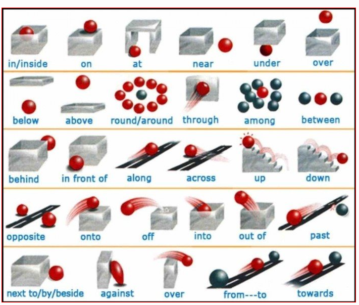

#### on
1. on sth surface
2. 具体某一天`on friday / on Jan 1st`
3. 支撑、依靠、依赖
```
It is on me
We live on water
It's on you
```
4. 表示在一个状态中（动态or静态）
```
It am on holiday
I am on business trip
It's on sale
I'm on diet
I'm on my way to school
```
5. 表示一个状态的持续运动中
```
The light is on
I'm working on my computer
My heart will go on and on and on
```
6. 表示动作、行为、事物所指向的对象(same as about)
```
Please be easy on the door
This book is on/about China
I will keep an eye on my phone
```

#### in
1. 表示时间段
`in the morning/afternoon/evening`
2. 表示具体事件之后
`in 3 minutes`
3. 固定用法,表示等一会
`in a minute/second/moment`
4. 在...里面
5. 表示沉浸、陷入
`in/into(有从out到in的过程) the class`
6. 表示某一心情、情感
```
in a relationship
in a good mood
in happiness
```
7. 表示形状
```
in a rectangle
in large degree
```
8. 表示份数
`I cut off the cake in two`

#### up
1. 从无到有
```
come up
show up
loop up a word
```
2. 往上、变强（物理上、精神上）
```
move up
speak up
turn up
pick up
go up
warm up
```
3. 充满
```
fill up
```
4. 清空、用完
```
use up
eat up
```
5. 强调、彻底
```
shut up
meet up
I'll call you up
what are you doing up
```

#### over
1. 从一边到另一边
```
go over to your friend's place
take over your company
```
2. 从状态不好到状态好,克服
`get over`
3. 覆盖、笼罩
`cover over`
4. 超过
`I run over you`
5. 考虑
```
think over a thing
look over a proposal
```
6. 结束
`game over`

#### for and to
1. 都有表示目的的意思，to只是方位的转移，for带有情感
```
I come here to buy a gift
I come here for a gift
I send him to the hospital
I go to the park
I brought a cake for her
ten to ten
```
2. for表示原因
`he was  put into prison for no reason`
3. for表示一段时间
`I have been working as a programmer for years`

#### around
1. 周围 大约
```
I don't wanna go around here bare foot
```
2. 绕圈子
```
drive around
take you around
don't talk around
```

#### about
1. 关于
2. 打算(plan to do)
`Our puppet show is about to start`
3. 大约
`He is about 50 years old`

#### within、without、beyond(超出...之外、远离)、toward(XXXward)
```
I'll be coming within an hour
No fishing is allowed within a twenty mile limit
The level of inflation has gone beyond 8%
we are beyond reach
He ran toward his house
```

#### with
1. 使用
```
I muffled up her head with a blanket
I killed tha spider with a shoe
```
2. 与...在一起
```
I leave the baby with my mother everyday
I assure you they'll be perfectly safe with us
```
3. 携带、伴随
```
I go to school with a backpack
She asked me with a smile
```
4. 具有...特征
```
She is a girl with big eyes
It's a dog with waggle tail
```

#### from
1. 从...来
`He is running away from home`
2. 距离...远
```
We live about fifty miles from Boston
He was standing a few feet away from me
```
3. 从某个时间开始
`From now on, I will only be working in the mornings`
4. 从一个状态到另一个状态，从一个位置到另一个位置

#### through
1. 穿过
```
He smile at her when he walked through the door
Water will be pumped through a pipe
```
2. 从开始到结束
```
The cold weather will be continued through the spring
It's a miracle that these buildings came through the war undamaged
```
3. 通过某种方式(by)
```
I heard about it through the radio
She got her first job through an employment agency
```

#### at
1. 时间点
2. 确切的地点
```
I was waiting at the bus stop
Turn left at the church
```
3. 某件事情的进行中
```
Dad is at work
Pam's at lunch now
```
4. 对着
```
He gazed up at the sky
You don't have to shot at me
The older girls used to throw stones at me
```
5. 时间段或特殊日子
```
My father often works at night(at midnight)
We go to Midnight Mass at Christmas
```
6. 在旁边
`He is sitting at me`

#### down
1. 位置往下、心情往下、状态往下
```
sit down
get down
I feel down today
```
2. 从北到南、从地势高的地方到地势低的地方

#### off
1. 脱离某个状态
```
Dad took off his pants
```

#### by
1. 在静态的空间位置上有“在旁边、靠近”的意思(next to/near/beside)
```
Stanley lives by the sea.(可以看得见海的那种)
Stanley lives near the sea.(差不多住在几公里以外)
```
2. 在动态的空间运动上有“通过、经过(through or through the medium)”的意思
`They came in by the back door.`
3. 引申出时间关系，表示“不晚于某一时间(no later than; at or before)”
`The application needs to be in by the 31st to be accepted.`
4. 凭借(某种交通工具) 
```
by air/bus/bike/boat
My parents have never travelled by plane before.
```
5. 通过(某种通讯手段)
`by telephone/post/email/fax`
6. 支付手段
```
by credit card/cheque
Can I pay by credit card? No. You must pay in cash.
```
1. 以…的方式
```
by doing something
I killed the cockroach by hitting it.
I killed the cockroach with my shoe
I got where I am by hard work. No you didn’t. You got there with your wife’s money
```

#### despite(in spite of)
```
We understood him in spite of his accent
We understood him although he had a strong accent
```