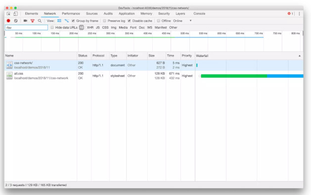
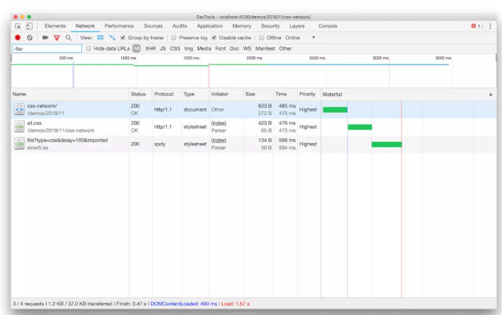
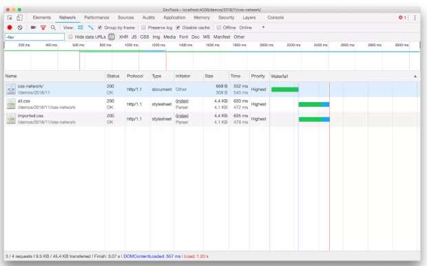
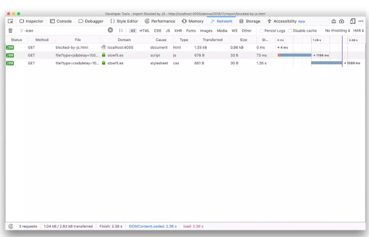
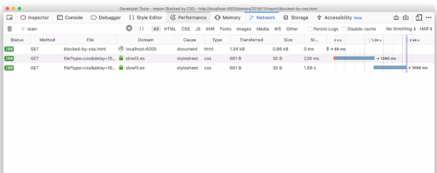
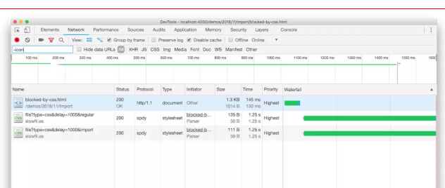
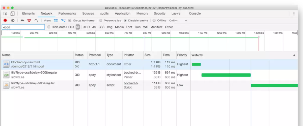
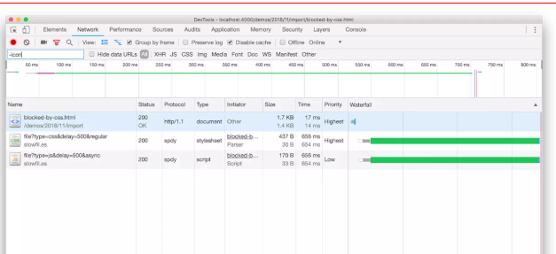
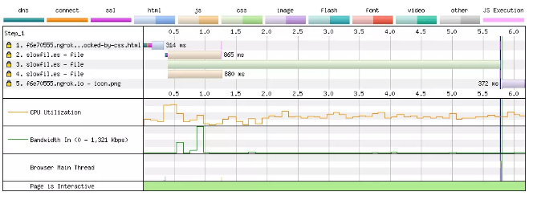

### 概述

CSS 是页面渲染的关键因素之一，（当页面存在外链 CSS 时，）浏览器会等待全部的 CSS 下载及解析完成后再渲染页面。关键路径上的任何延迟都会影响首屏时间，因而我们需要尽快地将 CSS 传输到用户的设备，否则，（在页面渲染之前，）用户只能看到一个空白的屏幕。

### 最大的问题是什么？

1. 浏览器直到渲染树构建完成后才会渲染页面
2. 渲染树由 DOM 与 CSSDOM 组合而成
3. DOM 是 HTML 加上（同步）阻塞的 JavaScript 操作（DOM 后的）结果
4. CSSDOM 是 CSS 规则应用于 DOM 后的结果
5. 使 JavaScript 非阻塞非常简单，添加 async 或 defer 属性即可
6. 相对而言，要让 CSS 变为异步加载是比较困难的
7. 所以记住这条经验法则：（理想情况下，）**最慢样式表的下载时间决定了页面渲染的时间**

基于上述考虑，我们需要尽快构建 DOM 与 CSSDOM。一般情况下，DOM 的构建是相对较快，（当请求某个页面时，）服务器响应的首个请求是 HTML 文档。但一般 CSS 是作为 HTML 的子资源而存在，因此 CSSOM 的构建通常需要更长的时间。
在这篇文章中，会讲述 CSS 为何是网络瓶颈（无论是对于它自己或是其他资源），该如何突破它，从而缩短关键路径以减少首次渲染前的等待时间。

### 使用关键 CSS
如果条件允许，缩短渲染前等待时间最有效的方式就是使用 Critical CSS （关键 CSS）模式：找出首次渲染所需的样式（通常是首屏相关的样式），将它们内联到 `<head>` 标签中，其他样式则通过异步的方式进行加载。
虽然这十分有效，但实施起来却并不容易，比如：高度动态化的网站（译者注：如 SPA）通常难以提取首屏相关的样式、提取的过程需要自动化、需要对首屏不同元素显示或隐藏的状态作出假设、某些边界情况难以处理以及相关工具仍未成熟等问题。如果你的项目相当庞大或是有历史包袱，这将变得更为复杂。

### 根据媒体类型拆分代码

如果在项目组难以执行关键 CSS 策略，可以尝试根据媒体查询拆分 CSS 文件，这也是一种可靠的策略。执行此策略后，浏览器表现如下：

- 以非常高的优先级下载符合当前上下文（设备、屏幕尺寸、分辨率、方向等）的 CSS 文件，阻塞关键路径；
- 以非常低的优先级下载不符合当前上下文的 CSS 文件，不会阻塞关键路径。

浏览器基本上能将未命中媒体查询的 CSS 文件延迟下载。
`<link rel="stylesheet" href="all.css" />`



如果我们把全部的 CSS 代码都放在一个文件中，这个单独的 CSS 文件会以 最高 的优先级下载。

根据媒体查询拆分成若干个 CSS 文件后：

```html
<link rel="stylesheet" href="all.css" media="all" />
<link rel="stylesheet" href="small.css" media="(min-width: 20em)" />
<link rel="stylesheet" href="medium.css" media="(min-width: 64em)" />
<link rel="stylesheet" href="large.css" media="(min-width: 90em)" />
<link rel="stylesheet" href="extra-large.css" media="(min-width: 120em)" />
<link rel="stylesheet" href="print.css" media="print" />
```


浏览器仍然会下载全部的 CSS 文件，但只有符合当前上下文的 CSS 文件会阻塞渲染。

### 避免在 CSS 文件中使用 @import

如果了解 @import 的原理，那应该清楚它的性能并不高，使用它会阻塞渲染更长时间。这是因为我们在关键路径上创造了更多（队列式）的网络请求：

1. 下载 HTML；
2. 请求并下载依赖的 CSS；（下载及解析完成后，本该是构造渲染树，然而；）
3. CSS 依赖了其他的 CSS，继续请求并下载 CSS 文件；
4. 构造渲染树

以下是相关的案例：

`<link rel="stylesheet" href="all.css" />`

all.css 的内容：  `@import url(imported.css);`



关键路径上的 CSS 文件并没有并行下载。

通过将 `@imports` 请求的文件改为 `<link rel="stylesheet" />`：

```html
<link rel="stylesheet" href="all.css" />
<link rel="stylesheet" href="imported.css" />
```



关键路径上的 CSS 文件是并行下载的。可以提高网络性能

**注意**，有一个特殊的情况值得讨论。如果你没有包含 @import 的 CSS 文件的修改权限，为了让浏览器并行下载 CSS 文件，可以往 HTML 中补充相应的 `<link rel="stylesheet" src="@import的地址" />`浏览器会并行下载相应的 CSS 文件且不会重复下载 @import 引用的文件。

### 在 HTML 中谨慎地使用 @import

本节的内容比较奇怪。各大浏览器的相关实现上似乎都有问题，我以前提交了相关的bugs（译者注：简单说，当页面中存在：`<style>@import url(xxx.url);</style>`，浏览器不会并行下载，但加上引号后：`<style>@import url("xxx.url");</style>`，浏览器会并行下载）。
为了透彻地理解本节的内容，首先我们需要了解浏览器的预加载扫描器：各大浏览器都实现了一个名为预加载扫描器的辅助解析器。浏览器的核心解析器主要用于构建 DOM、CSSOM、运行 JavaScript 等。HTML 文档中某些标签与状态会阻塞核心解析器，因而核心解析器的运行是断断续续的。而预加载扫描器可以跳到核心解析器尚未解析的部分，用以发现其他待引用的子资源（如 CSS、JS 文件、图片等）。一旦发现此类子资源，预加载扫描器会开始下载它们，以便核心解析器在解析到对应内容时就能使用它们（，而不是直到那一刻才开始下载该资源）。预加载扫描器的出现，使网页的加载性能提高了19%，这是一项了不起的成就，可以极大地优化用户体验。
作为开发者，需要警惕预加载扫描器背后隐藏的问题，这在后文会进行阐述。
在 HTML 中使用 `@import`，在以 WebKit 与 Blink 为内核的浏览器中，可能会触发它们预加载扫描器的 bug，在 Firefox 与 IE/Edge 中，则表现低效。

#### Firefox 与 IE / Edge：在 HTML 中将 @import 放在 JS 和 CSS 之前

在 Firefox 与 IE/Edge 中，预加载扫描器不会并行下载 `<script src="">` 和 `<link rel="stylesheet" />` 后 `@imports` 引用的资源。

这意味着如下的 HTML：

```html
<script src="app.js"></script>

<style>
  @import url(app.css);
</style>
```
会出现这样的请求瀑布图:



由于预加载扫描器失效，导致资源在 Firefox 中无法并行下载（IE/Edge 中有着同样的问题）。
通过上图，可以清晰地观察到：直到 JavaScript 文件下载完成之后，`@import` 引用的 CSS 文件才开始下载。
不单 `<script>` 标签会触发此问题，`<link>` 标签也会：

```html
<link rel="stylesheet" href="style.css" />

<style>
  @import url(app.css);
</style>
```



与 `<script>` 标签一样，子资源无法并行下载。
此问题最简单的解决方案是调换 `<script>` 或 `<link rel="stylesheet" />` 标签与（包含 `@import` 的）`<style>` 标签的位置。然而，当我们改变顺序时，可能会对页面造成影响。
最佳解决方案是完全不使用 `@import`，再往 HTML 文档中加入另一个 `<link rel="stylesheet" />` 取而代之：

```html
<link rel="stylesheet" href="style.css" />
<link rel="stylesheet" href="app.css" />
```


浏览器并行下载资源，IE/Edge 表现相同。

#### 以 Blink 或 WebKit 内核的浏览器：在 HTML 文档中使用 @import 时，要用引号包裹 url

对于以 Blink 或 WebKit 为内核的浏览器而言，当 `@import` 引用的 url 未被引号包裹时，表现与  Firefox 和 IE/Edge 一致（无法并行下载）。这意味着上述两个内核的预加载扫描器存在 bug。
因此，无需调整代码的顺序，只需要添加引号即可解决问题。但我还是建议使用另一个 `<link rel="stylesheet" />` 取代 `@import`。

未添加引号时的代码：

```html
<link rel="stylesheet" href="style.css" />

<style>
  @import url(app.css);
</style>
```


可以看到，缺失引号会破坏 Chrome 的预加载（Opera 与 Safari 表现也是如此。）

添加引号后的代码：
```html
<link rel="stylesheet" href="style.css" />

<style>
  @import url("app.css");
</style>
```


添加引号后，Chrome、Opera 和 Safari 的预加载扫描器表现恢复正常，
这绝对是 WebKit 与 Blink 内核的一个 bug，是否添加引号不应成为影响预加载扫描器的因素。

### 不要将动态插入 JavaScript 的代码放在 <link rel="stylesheet" />之后
在上一节中，我们了解到某些引用 CSS 文件路径 的方法，会对其他资源的下载造成负面影响。在本节中，我们将探究为何稍有不慎，CSS 将延迟其他资源的下载。该问题主要出现在动态创建的 `<script>` 标签中：
```html
<script>
  var script = document.createElement('script');
  script.src = "analytics.js";
  document.getElementsByTagName('head')[0].appendChild(script);
</script>
```

所有浏览器都存在一个鲜为人知，但符合逻辑的现象，它会对性能造成很大的影响：

在浏览器下载完该 CSS 文件之前，不会执行下面的 JS
```html
<link rel="stylesheet" href="slow-loading-stylesheet.css" />
<script>
  console.log("I will not run until slow-loading-stylesheet.css is downloaded.");
</script>
```
这是合理的。当 CSS 文件尚未下载完成时，HTML 文档中任何同步的 JavaScript 代码，均不会执行。考虑以下场景： `<script>` 中的代码会访问当前的页面样式，为确保结果正确，需要等待（ `<script>` 标签前）所有 CSS 文件下载并解析完毕后再获取，否则无法保证正确性。因此，在 CSSOM 构建完成之前，`<script>` 中的代码不会执行。

根据这现象，CSS 文件的下载时间会对后续 `<script>` 的执行时间造成影响。下面的例子能较好地说明问题。

如果我们将一个 `<link rel="stylesheet" />` 放在 `<script>` 之前，`<script>` 中动态创建新 `<script>` 的代码只会在 CSS 文件下载完之后才会执行，这意味着 CSS 推迟了资源的下载与执行：
```html
<link rel="stylesheet" href="app.css" />

<script>
  var script = document.createElement('script');
  script.src = "analytics.js";
  document.getElementsByTagName('head')[0].appendChild(script);
</script>
```
从下面的瀑布图可以看到，JavaScript 文件在 CSSOM 构建完成之后才开始下载，完全失去了并行下载的优势：



尽管预加载扫描器希望能预下载 `analytics.js`，但对 `analytics.js` 的引用并非一开始就存在于 HTML 的文档之中，它是由 `<link>` 后面 `<script>` 的代码动态创建的，在创建之前，它只是一些字符串，而不是预加载扫描器可识别的资源，无形中它被隐藏起来了。
为了更安全地加载脚本，第三方服务商经常提供这样的代码片段。然而，开发者通常不信任第三方的代码，因而会把该片段放在页面的最后，但这可能会导致不良的后果。事实上，Google Analytics （在文档中）对此的建议是：

> 将代码复制后，作为第一项粘贴到待追踪页面的 中

综上，我的建议是： **如果 `<script>` 中的代码并不依赖 CSS，把它们放在样式表之前。**

```html
<script>
  var script = document.createElement('script');
  script.src = "analytics.js";
  document.getElementsByTagName('head')[0].appendChild(script);
</script>

<link rel="stylesheet" href="app.css" />
```


交换位置之后，子资源可以并行下载，页面的整体性能提高了两倍以上。（译者注：本节的内容只同意一半，`<head>` 中的代码，确实是建议先放 `<script>`，再放 `<link>`，后文也会有相关的内容，但第三方代码放在 `<head>` 中的第一项，取决于相关代码的用途。如非必要，放在页面末尾或空闲时下载及执行也未尝不可）

#### 将无需查询 CSSOM 的 JavaScript 代码放在 CSS 文件之前，需要查询的放在 CSS 文件之后

这条建议远比你想象中的有用。

上文讨论了插入新 `<script>` 的代码应放在 `<link>` 之前，那是否能推广到其他的 CSS 与 JavaScript 呢？为了弄明白这个问题，先提出以下假设：

假设：

- CSSOM 的构建会阻塞 CSS 后面同步 JS 的执行；
- 同步的 JS 会阻塞 DOM 的构建...

那如果 JS 并不依赖 CSSOM，以下那种情况会更快？

- script 在前 style 在后;
- style 在前 script 在后?

答案是：**如果 JS 文件没有依赖 CSS，你应该将 JS 代码放在样式表之前**。 既然没有依赖，那就没有任何理由阻塞 JavaScript 代码的执行。

（尽管执行 JavaScript 代码时会停止解析 DOM， 但预加载扫描器会提前下载之后的 CSS）

如果你一部分 JavaScript 需要依赖 CSS 而另一部分却不用，最佳的实践是将 JavaScript 分为两部分，分别置于 CSS 的两侧：

```html
<!-- 这部分 JavaScript 代码下载完后会立即执行 -->
<script src="i-need-to-block-dom-but-DONT-need-to-query-cssom.js"></script>

<link rel="stylesheet" href="app.css" />

<!-- 这部分 JavaScript 代码在 CSSOM 构建完成后才会执行 -->
<script src="i-need-to-block-dom-but-DO-need-to-query-cssom.js"></script>
```

根据这种组织方式，我们的页面会按最佳的方式下载与执行相关代码。下面的截图中，粉色代表 JS 的执行，但它们都比较“纤细”了，希望你能看得清楚。（第一栏的（下同））第一行是整个页面的时间轴，留意该行粉色的部分，代表 JS 正在执行。第二行是首个 JS 文件的时间轴，可以看到下载完后并立即执行。第三行是 CSS 的时间轴，因而没有任何 JS 执行。最后一行是第二个 JS 文件的时间轴，可以清晰地看到，直到 CSS 下载完成后才执行。



**注意**，你应该根据页面的实际情况测试这种代码组织方式，取决于 CSS 与 JavaScript 文件大小与 JavaScript 文件执行所需的时间，可能会出现不同的结果。记得多测试！（译者注：根据实践经验，`<head>` 中的代码组织基本可以按照这种方式，即 JS 在 CSS 之前，因为 `<head>` 中的 JS 代码基本不依赖 CSS，唯一的反例是 JS 代码体积非常大或执行时间很长。）

### 将 `<link rel="stylesheet" />` 放在 `<body>` 中

最后一条优化策略比较新颖，它对页面性能有很大帮助，并使页面达到逐步渲染的效果，同时易于执行。

在 HTTP/1.1 中，我们习惯于将全部的 css 打成一个文件，如 app.css：

```html
<html>
<head>

  <link rel="stylesheet" href="app.css" />

</head>
<body>

  <header class="site-header">

    <nav class="site-nav">...</nav>

  </header>

  <main class="content">

    <section class="content-primary">

      <h1>...</h1>

      <div class="date-picker">...</div>

    </section>

    <aside class="content-secondary">

      <div class="ads">...</div>

    </aside>

  </main>

  <footer class="site-footer">
  </footer>

</body>
```

然而，从三方面而言，渲染性能降低了：

1. 每个页面只用到 app.css 中的部分样式： 用户会下载多余的 CSS。
2. 难以制定缓存策略： 例如，某个页面使用的日期选择器更改了背景颜色，重新生成 app.css 后，旧的 app.css 缓存将失效。
3. 整个 app.css 在解析构建完 CSSOM 之前，页面渲染被阻塞： 尽管当前页面可能只用到了 17% 的 CSS代码，但（浏览器）仍需等待其他 83% 的代码下载并解析完后，才能开始渲染。

使用 HTTP/2，可以解决第一与第二点：
```html
<html>
<head>

  <link rel="stylesheet" href="core.css" />
  <link rel="stylesheet" href="site-header.css" />
  <link rel="stylesheet" href="site-nav.css" />
  <link rel="stylesheet" href="content.css" />
  <link rel="stylesheet" href="content-primary.css" />
  <link rel="stylesheet" href="date-picker.css" />
  <link rel="stylesheet" href="content-secondary.css" />
  <link rel="stylesheet" href="ads.css" />
  <link rel="stylesheet" href="site-footer.css" />

</head>
<body>

  <header class="site-header">

    <nav class="site-nav">...</nav>

  </header>

  <main class="content">

    <section class="content-primary">

      <h1>...</h1>

      <div class="date-picker">...</div>

    </section>

    <aside class="content-secondary">

      <div class="ads">...</div>

    </aside>

  </main>

  <footer class="site-footer">
  </footer>

</body>
```
根据页面的不同组件下载不同的 CSS，能有效地解决冗余问题。这减少了对关键路径造成阻塞的 CSS 文件总大小。
同时，我们可以制定更有效的缓存策略，（当代码产生变化之后，）只会影响对应文件的缓存，其他的文件保持不变。
但仍有解决的问题：下载并解析全部 CSS 文件之前，页面的渲染仍然是阻塞的。页面的渲染时间仍然取决于最慢的 CSS 文件下载与解析的时间。假设由于某种原因，页脚的 CSS 下载需要很长时间，（即使页头的 CSSOM 已经构建完成，）浏览器也只能等待而无法渲染页头。
然而，这现象在 Chrome （v69）中得到缓解，Firefox 与 IE/Edge 也已经进行了相关的优化。`<link rel="stylesheet" />` 只会阻塞后续内容，而不是整个页面的渲染。这意味着我们可以用以下方式组织代码：

```html
<html>
<head>

  <link rel="stylesheet" href="core.css" />

</head>
<body>

  <link rel="stylesheet" href="site-header.css" />
  <header class="site-header">

    <link rel="stylesheet" href="site-nav.css" />
    <nav class="site-nav">...</nav>

  </header>

  <link rel="stylesheet" href="content.css" />
  <main class="content">

    <link rel="stylesheet" href="content-primary.css" />
    <section class="content-primary">

      <h1>...</h1>

      <link rel="stylesheet" href="date-picker.css" />
      <div class="date-picker">...</div>

    </section>

    <link rel="stylesheet" href="content-secondary.css" />
    <aside class="content-secondary">

      <link rel="stylesheet" href="ads.css" />
      <div class="ads">...</div>

    </aside>

  </main>

  <link rel="stylesheet" href="site-footer.css" />
  <footer class="site-footer">
  </footer>

</body>
```
这样的结果是我们能逐步渲染页面，当前面的 CSS 可用时，页面将呈现对应的内容（，而不需等待全部 CSS 下载并解析完毕）。
I如果浏览器不支持这种特性，也不会损害页面的性能。整个页面将回退为原来的模式，只有在最慢的 CSS 下载并解析完成后，才能渲染页面。
有关这种特性的更多细节，建议阅读[这篇文章](https://jakearchibald.com/2016/link-in-body/)。

### 总结

- 懒加载非关键 CSS
    - 优先加载关键 CSS，懒加载其他 CSS
    - 或根据媒体类型拆分 CSS 文件
- 避免使用 `@import`
    - 在 HTML 文档中应该避免
    - 在 CSS 文件之中更应避免
    - 以及警惕预加载扫描器的怪异行为
- 关注 CSS 与 JavaScript 的顺序
    - 在 CSS 文件后的 JavaScript 仅在 CSSOM 构建完成后才会执行
    - 如果你的 JavaScript 不依赖 CSS
        - 将它放置于 CSS 之前
    - 如果 JavaScript 依赖 CSS
        - 将它放置于 CSS 之后
- 仅加载 DOM 依赖的 CSS
    - 这将提高初次渲染的速度使让页面逐步渲染

#### 注意

本文叙述的内容都遵循规范或根据浏览器的行为推导得出，然而，你应该亲自进行测试。尽管理论上是正确的，但在实践中可能会有所不同。记得好好[测试](https://csswizardry.com/2018/10/three-types-of-performance-testing/)