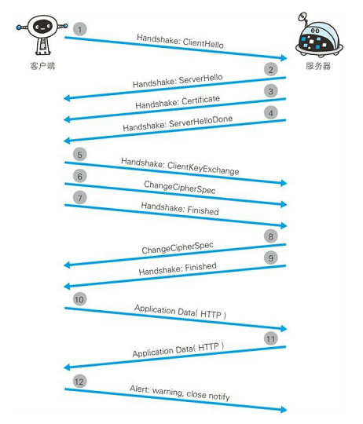

### 前置知识
我们知道，HTTP是基于TCP/IP协议的。属于TCP/IP 协议的一个子集，TCP/IP是互联网通信相关联的协议族的总称。了解TCP/IP协议族有助于我们更好的理解HTTP协议。
#### 1 分层管理
TCP/IP协议族主要分为:

- 应用层 :向用户提供应用服务时通信的活动。
- 传输层 :提供处于网络连接中的两台计算机之间的数据传输。
- 网络层 :网络层用来处理在网络上流动的数据包。
- 数据链路层 ：用来处理连接网络的硬件部分。
#### 2 TCP/IP传输流

举个栗子，客户端在应用层按规范发起了一个HTTP请求，然后由传输层（TCP）负责将报文分片，编序发给网络层，再由网络层增加目标服务器的mac地址，最终由链路层将请求发往目标机器。服务器在链路层接收到数据，按序往上层发送，一直到应用层。当传输到应用层，才能算真正接收到由客户端发送过来的 HTTP请求。

#### 3 URL 和 URI
- URI：统一资源标识符
- URL：统一资源定位符

URI是一个用于标识互联网资源名称的字符串，最常见的形式是统一资源定位符（URL），经常指定为非正式的网址。更罕见的用法是统一资源名称（URN），其目的是通过提供一种途径。用于在特定的命名空间资源的标识，以补充网址。
即URL和URN 都是 URI的子集，URI是一种抽象的概念，URL是URI的一种常见的具象表达形式。
#### 4 代理、网关、隧道的概念
##### 代理

代理是一种有转发功能的应用程序，它扮演了位于服务器和客户端“中间人”的角色，接收由客户端发送的请求并转发给服务器，同时也接收服务器返回的响应并转发给客户端。每次通过代理服务器转发请求或响应时，会追加写入 Via 首部信息。

    - 代理的分类：
        - 透明代理： 直接转发请求，不对请求做任何加工，反之则是非透明代理
        - 缓存代理： 将请求的资源缓存在代理服务器上，用于下次请求。
    - 代理的方式:
        - 正向代理 ：简单来说，正向代理就是对服务器透明，将不同用户的请求代理到某台服务器，服务器并不知道请求来自哪个用户。
        - 反向代理 ：反之，反向代理就是对用户透明，将用户的请求转发到服务器集群的某一台服务器，用户不知道自己访问的具体是哪台服务器。
    - 使用代理的好处：
        - 利用缓存技术减少网络带宽的流量。
        - 组织内部针对特定网站的访问控制，以获取访问日志为主要目的
##### 网关
网关的工作机制和代理十分相似，但是它可以使用非http协议与服务器、数据库进行通信，即是说，网关在收到来自客户端的http请求之后，可以直接与数据库连接，使用sql查询数据库。
##### 隧道
隧道的目的是确保客户端能与服务器进行安全的通信，本身不会去解析 HTTP 请求，也就是说，请求保持原样中转给之后的服务器，隧道会在通信双方断开连接时结束。隧道多用于相隔较远的两台服务器的安全通信。

### HTTP协议
#### 什么是HTTP？
##### 1 HTTP是一种属于应用层通信协议，它允许将超文本标记语言(HTML)文档从Web服务器传送到客户端的浏览器。
##### 2 报文的结构
HTTP请求的报文一般是由 协议行、可选的请求头部、请求体组成

- 请求：
Request line
包括：请求方法、请求的资源、HTTP协议的版本号
Request header
包括：Cache头域、Client头域、Cookie/Login头域、Entity头域、Miscellaneous头域、Transport头域等
空行
Request body
Response响应

- 回包：
Response line
包括：HTTP协议的版本号、状态码、消息
Response header
包括：Cache头域、Cookie/Login头域、Entity头域、Miscellaneous头域、Transport头域、Location头域等
空行
Response body

##### 3 请求的过程
一个完整的HTTP请求过程如下：

- 用户在浏览器输入URL
- 域名解析（DNS的寻址）
- TCP三次握手
- 握手成功后建立TCP通道，发起HTTP请求
- 服务器响应HTTP请求，返回对应的响应报文
- 客户端开始解析渲染
##### 4 状态码
    - 1XX 提示信息：请求正在处理中
    - 2XX 成功错误码：请求已被接受处理
    - 3XX 重定向：完成请求需要附加操作
    - 4XX 客户端错误：请求资源有误或者请求不合法，服务器无法处理
    - 5XX 服务器错误：服务器处理请求出错

> 常见状态码：
> 200 OK
>
> 302 Found 暂时重定向
>
> 301 Move Permanently永久重定向
>
> 304 Not Modified 没有内容更新，使用缓存
>
> 400 Bad Request 客户端请求与语法错误
>
> 403 Forbidden 服务器拒绝提供服务
>
> 404 Not Found 请求资源不存在
>
> 500 Internal Server Error服务器发生了不可预期的错误
>
> 503 Server Unavailable 服务器当前不能处理客户端的请求，一段时间后可能恢复正常

##### 5 首部字段

首部字段一般分为4类：

- 通用字段（connection、via、cache-control、data等）
- 请求首部字段（accept-charset、accept-encoding、If-Modified-Since、Referer、User-Agent等）
- 响应首部字段（Age、ETag 、Server、Location 等）
- 实体首部字段（Allow 、Content-Type 、Expires 、Last-Modified等）

#### 特性
HTTP被设计之初，就以简易、灵活为目的。它的主要特性就是简易、灵活 、 无状态 、无连接、支持B/S模式。

##### 1 无状态的HTTP。
- 简介
    - 无状态是指：协议本身不保存状态，即每次请求，HTTP这一层都不对请求和响应之中的状态进行保存，后一次请求无法得知前一次请求的信息。
    - 优点是：由于不需要保存状态，对CPU和内存的资源消耗减少，协议可以更快的处理大量事务，可伸缩性也更强。
    - 存在的问题: 随着web应用的快速发展，web变得越来越复杂，这样的设计却对一些业务造成了严重的阻碍，比如说，一个购物网站，登陆后，每个页面都需要保持当前的登录态。而不是让用户每次发起请求都去登录一下。显然，HTTP无状态的特性无法实现状态的保留。于是，为了解决这个问题，cookie 和 session 技术应运而生。

- Cookie技术
    - 概念：Cookie 技术通过在请求和响应报文中写入 Cookie 信息来控制客户端的状态。
    - 如何工作：Cookie 会根据从服务器端发送的响应报文内的一个叫做 Set-Cookie 的首部字段信息，通知客户端保存 Cookie。当下次客户端再往该服务器发送请求时，客户端会自动在请求报文中加入 Cookie 值后发送出去。服务器端发现客户端发送过来的 Cookie 后，会去检查究竟是从哪一个客户端发来的连接请求，然后对比服务器上的记录，最后得到之前状态信息。
    - 缺点： Cookie存在长度和数量的限制，每个domian不能超过20条，每条不能超过4kb，从安全性的角度来说，cookie容易被盗用，偷盗者无需知道Cookie中每个字段的意义，只需要透传cookie就能达到

- Session 技术
    - 概念： Session是在服务端保存的一个数据结构，用来跟踪用户的状态，这个数据可以保存在集群、数据库、文件中。
    - 如何工作：session 由服务端存储，在一次登陆操作后，服务器将登陆的账户信息等作为一个session 写入在特定等文件里，在回包报文中使用set-cookies为客户端设置sessionId，最终，客户端在发送下一次请求的时候，会带上session信息，从而达到状态保存的目的。所以，当客户端禁用了cookie，sessoin也无法工作

- 其他的认证技术-token
    - token验证的大致过程是：客户端和服务器端约定了一种特定的加密方式，比如以cookie中的某个字段通过特定的位运算，加密编码成一串字符串。最终在请求中作为参数传递给服务器，服务器在收到请求时，再使用同样的加密方式，获取加密串，与传过来的参数进行对比。从而达到身份认证的关系。由于同源的关系，cookie无法被盗取，而加密手段也是自定义的，从而保证了安全性。

##### 2 无连接的HTTP
- 简介：

无连接是指每一次请求结束后都会断开TCP连接。在web技术高速发展的今天，每个页面需要请求的资源都日益增多，而每次请求都需要重新建立TCP连接，这显然极大的增加了无意义的通信开销。于是，Keep-Alive 被提出，以解决TCP无法复用的问题。

- Keep-Alive:
    - Keep-Alive 其实就是在协议头里面设置 Connection： Keep-Alive , 表示当前连接是持久化的，持续时间有服务器控制，在没有接收到关闭信号时，TCP连接不会断开，这样避免了重复建立TCP请求的无用耗时。
    - keep-Alive 对应PC端的帮助很大，但在APP端，请求比较分散，且时间跨度大，将keep-Alive的时间设置为很大显然是不合理的。所以，一般会寻求其他的长连接方案和伪长连接方案。这个下文会详细介绍。

- 存在的缺陷：

HTTP是一个优秀的协议，但是仍然存在着一些缺陷：

- 数据明文传输，容易被窃听
- 不验证通信方的身份，因此有可能遭遇伪装
- 无法证明报文的完整性，所以有可能已遭篡改
但是，程序员的智慧是无穷的，既然不安全，那就让它安全，于是，HTTPS就诞生了。

### HTTPS
#### 什么是HTTPS？
HTTPS是 HTTP+ SSL +TLS 的产物，用于对通信的加密、认证、完整性保护。它并不是一种新的协议，而是HTTP的某些部分由SSL和TLS代理。

#### HTTPS如何保证通信安全（原理）?
- 原理

我们先来了解一下常用的两种加密方式：

- 对称加密： 加密和解密都是用同一把密钥。
- 非对称加密： 加密和解密是两把不同的密钥。
HTTPS 使用混合加密机制，即先通过非对称加密交换通信密钥，拿到密钥后再使用对称加密的方式进行后续的通信。但是如何保证第一步中，客户端获取到的公共密钥是正确的呢？这时候，就需要用到我们的数字证书了。

证书是由第三方机构提供认证的，服务器先去第三方机构申请公共密钥，然后会获得公共密钥和使用第三方数字签名，在非对称加密的过程中，将数字证签名和包含的公共密钥一起发给客户端，客户端通过第三方机构的公共密钥对证书上的签名进行验证，一旦通过，则说明公共密钥是正确的。

- 请求过程

下面看看具体的安全通信建立过程：

1. 客户端发起client hello 报文， 携带客户端支持的ssl版本、加密相关的约定（密钥长度和加密算法）。
2. 服务器响应 server hello 报文， 表示可以进行ssl通信，并携带相关加密约定。
3. 服务器发送 certificate 报文, 携带了公共密钥的证书。
4. 服务器发送 server hello done，表示最初的ssl协商部分结束。
5. 客户端发起 Client Key Exchange 报文，并携带使用第一阶段协商之后得到的Pre-master

secret加密随机串（对称密钥）。

1. 客户端发起 Change Cipher Spec 报文，表示之后的请求将使用Pre-master secret进行加密通信
2. 客户端发送 Finished 报文。该报文包含连接至今全部报文的整体校验值。这次握手协商是否能够成功，要以服务器是否能够正确解密该报文作为判定标准。
3. 服务器发送 Change Cipher Spec 报文，表示解密成功，下面将使用协商的密钥进行安全通信。
4. 服务器发送 Finished 报文，至此，一个安全的通信已经简历。
5. 应用层协议通信，即发送 HTTP 响应。
6. 最后由客户端发送 close_notify 报文断开连接。

#### HTTPS存在的缺陷
##### 历史痛点
HTTP1.0 时代最大的两个问题就是：
- 连接无法复用 : 每次请求都需要重新建立tcp通道，经历三次握手的过程。
- 队头阻塞：请求通道如一个独木桥，多个请求一起发出，只能先等第一个请求获得回包之后才能开始第二个请求，否则就只能排队等候。

那些年的解决之道：

1. 解决连接无法复用：

**基于tcp的长链接:**
一般APP会基于TCP造一个长连接的通信协议，门槛较高，但是一旦完成，带来的回报也是非常大的。信息的推送和更新变得及时，且在一些请求爆发点，相较于传统HTTP重复建立请求的耗时，也能减轻服务器的压力。现在业界的成熟方案如：google的protobuf。

**http long-polling:**
long-polling请求就是在客户端初始化的时候发起一个polling请求到服务器，然后请求一直等待中，当服务器有资源更新的时候，再返回数据，数据放回时，再次发起一个polling请求继续监听。当然，polling请求也有一些缺陷，比如 长时间的连接会增加服务器压力，复杂的业务场景下需要考虑如何才能建立健康的请求通道等。此外，这种方式有个致命的缺陷是：数据通信是单向的，主动权在服务端这边，客户端只能根据服务端被动的接受数据，有新的业务请求的时候无法及时传送。

**http streaming:**
与http-polling 不同的是， http-streaming 在初始化的的时候就发起一个不会断开的请求，持续监听服务器的回包，服务器有数据更新时就通过这个请求通道返回数据。此种方式跟http-polling一样是单向的，streaming是通过在server response的头部里增加”Transfer Encoding: chunked”来告诉客户端后续还会有新的数据到来。当然，streaming 也有缺陷: 业务数据无法按照请求来做分割，所以客户端没收到一块数据都需要自己做协议解析，也就是说要做自己的协议定制。

**websocket:**
WebSocket和传统的tcp socket连接相似，也是基于tcp协议，提供双向的数据通道。WebSocket优势在于提供了message的概念，比基于字节流的tcp socket使用更简单，同时又提供了传统的http所缺少的长连接功能。websocket 一般在数据需要实时更新的场景中使用。

2. 解决队头阻塞:

**http pipelining（管线化）**
管线化的前提是长连接的建立，keep-alive的多个请求使用同一个tcp连接使请求并行成为可能，pipelining与传统的请求可以形象的比喻为 串行和并行 ， 多个请求同时发起，无需等待上一个请求的回包。但是它并不是救世主，也存在着缺陷：

- pipelining只适用与HTTP1.1，并且需要服务器端支持
- 队头阻塞的问题并没有根本的解决，因为服务端要响应要遵循先进先出的原则，第一个请求的回包发出之后，才会响应第二个请求。

#### 新的改变(HTTP2)

HTTP1.0和1.1的普及程度使得HTTP2必须得在不改变原有方式的情况下解决上述问题，即HTTP2 并不能像angular2那样放飞自我。所以，HTTP2的使用方式和原来的差不多，HTTP2的改变相当之多，这里主要讲一下对我们影响较大的几点：

##### 二进制

http2.0的协议解析决定采用二进制格式，实现方便且健壮。每一个请求都有这些公共字段：Type, Length, Flags, Steam Identifier和frame payload。http2.0的格式定义更接近tcp层的方式，length定义了整个frame的开始到结束，type定义frame的类型（一共10种），flags用bit位定义一些重要的参数，stream id用作流控制，剩下的payload就是request的正文了。

##### 多路复用
多路复用是HTTP2.0主要解决的一个问题，一个request对应一个stream并分配一个id，这样一个连接上可以有多个stream，每个stream的frame可以随机的混杂在一起，接收方可以根据stream id将frame再归属到各自不同的request里面。

##### 头部压缩
无状态的HTTP导致每次请求都需要携带服务器所需要的参数，而一些头部信息基本上是固定的，这部分重复的信息刚好可以用于压缩，减少报文体积。

##### 连接重置
HTTP 1.1的有一个缺点是：当一个含有确切值的Content-Length的HTTP消息被送出之后，你就很难中断它了。当然，通常你可以断开整个TCP链接（但也不总是可以这样），但这样导致的代价就是需要重新通过三次握手建立一个新的TCP连接。一个更好的方案是只终止当前传输的消息并重新发送一个新的。在http2里面，我们可以通过发送RST_STREAM帧来实现这种需求，从而避免浪费带宽和中断已有的连接。

##### 依赖与优先级
每个流都包含一个优先级，优先级被用来告诉对端哪个流更重要。从而实现资源的有效分配。

##### 服务器推送
当一个客户端请求资源X，而服务器知道它很可能也需要资源Z的情况下，服务器可以在客户端发送请求前，主动将资源Z推送给客户端。这个功能帮助客户端将Z放进缓存以备将来之需。

##### 流量控制
http2上面每个流都拥有自己的公示的流量窗口，它可以限制另一端发送数据。

### 总结：
HTTP 虽然只有2个版本，但是每个版本所包含的改动是非常之大的。所做出的突破和尝试也是非常多的，当然，HTTP也有竞争者，比如在HTTP2还未提出时，由google提出并推行的SPDY协议，它的优势在于解决了HTTP1.0的不能多路复用的问题，对资源请求速度有极大的提升，目前在市场上仍然有许多的使用量，HTTP2也是借鉴了很多SPDY的特性。再比如quic协议，是号称比HTTP2更快的协议。这个在下一篇文章中会重点介绍~ 哈！主要是这篇有点长了。