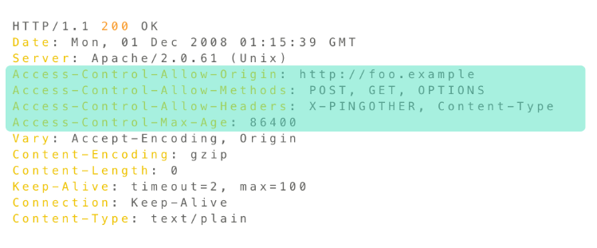
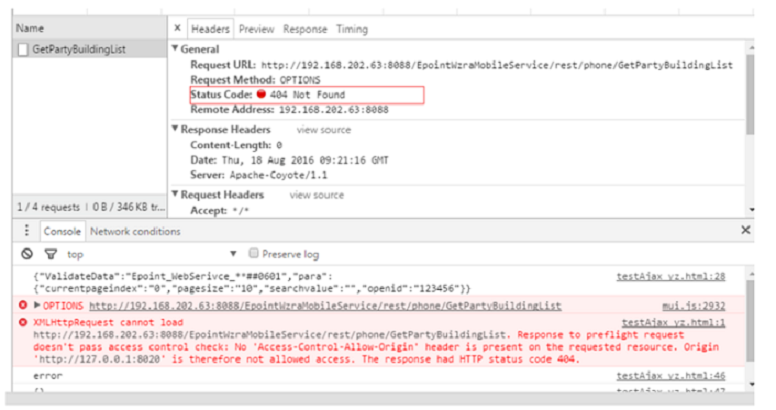
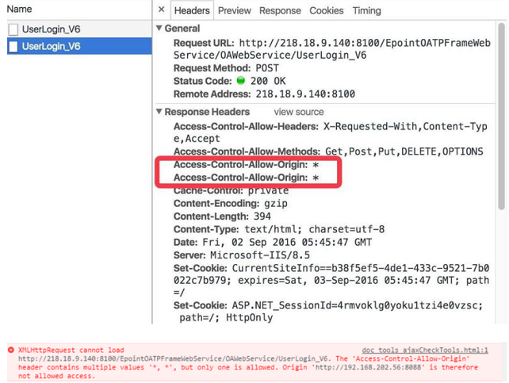

###  什么是跨域请求

简单来说，当一台服务器资源从另一台服务器（不同的域名或者端口）请求一个资源时，就会发起一个跨域 HTTP 请求。

举个简单的例子，http://example-a.com/index.html 这个 HTML 页面请求了 http://example-b.com/resource/image.jpg 这个图片资源时（发起 Ajax 请求，非  标签），就是发起了一个跨域请求。

在不做任何处理的情况下，这个跨域请求是无法被成功请求的，因为浏览器基于同源策略会对跨域请求做一定的限制。


### 浏览器同源策略

浏览器的同源策略（Same-origin policy），同源策略限制了从同一个源加载的文档或者脚本如何与来自另一个源的资源进行交互。这是一个用于隔离潜在恶意文件的重要安全机制。

同源需要同时满足三个条件：

1. 请求协议相同（例如同为http协议）
2. 请求域名相同（例如同为www.example.com）
3. 请求端口相同（例如同为80端口）

如果不同时满足这上面三个条件，那就不符合浏览器的同源策略。

**必须是域名完全相同，比如说`blog.example.com`和`mail.example.com`这两个域名，虽然它们的顶级域名和二级域名（均为 example.com）都相同，但是三级域名（blog 和 mail）不相同，所以也不能算作域名相同**

#### 修改域名只能往上修改
修改`document.domain`参数可以更改当前的源，例如`blog.example.com`想要访问父域`example.com`的资源时，可以执行`document.domain = 'example.com';`来进行修改

但是`document.domain`不能被设置为`foo.com`或者是`bar.com`，因为它们不是 `blog.example.com`的超级域。

当然，也不是所有的交互都会被同源策略拦截下来，下面两种交互就不会触发同源策略：

- 跨域写操作（Cross-origin writes），例如超链接、重定向以及表单的提交操作，特定少数的`HTTP`请求需要添加预检请求（preflight）
- 跨域资源嵌入（Cross-origin embedding）
    - `<script>`标签嵌入的跨域脚本,可以使用 CDN，CDN 基本都是其他域的链接,还可以实现 JSONP
    - `<link>`标签嵌入的 CSS 文件,可以使用 CDN，CDN 基本都是其他域的链接
    - ``标签嵌入图片,可以做打点统计，因为统计方并不一定是同域的，在讲解 JS 基础知识异步的时候有过代码示例。除了能跨域之外，``几乎没有浏览器兼容问题，它是一个非常古老的标签
    - `<video>`和`<audio>`标签嵌入多媒体资源
    - `<object>`, `<embed>`, `<applet>`的插件
    - `@font-face`引入的字体，一些浏览器允许跨域字体（cross-origin fonts），一些需要同源字体（same-origin fonts）
    - `<frame>`和`<iframe>`载入的任何资源，站点可以使用 X-Frame-Options 消息头来组织这种形式的跨域交互

如果浏览器缺失同源策略这种安全机制会怎么样呢？设想一下，当你登陆了`www.bank.com`银行网站进行操作时，浏览器保存了你登录时的`Cookie`信息，如果没有同源策略，在访问其他网站时，其他网站就可以读取还未过期的`Cookie`信息，从而伪造登陆进行操作，造成财产损失

### CORS（Cross-origin resource sharing，跨域资源共享）

虽然同源策略一定程度上保证了安全性，但是如果是一个正常的请求需要跨域该怎么做呢？

常见的方法有四种：
1. JSONP （script、img、link）
2. **CORS（Cross-origin resource sharing，跨域资源共享）**
3. `<iframe> `(**postMessage**、document.domain、 window.name、location.hash)
4. websocket(双通)
5. 代理服务器(webpack、nginx)

1和`iframe`本质上是利用浏览器同源策略的漏洞来进行跨域请求，不是推荐的做法，只能作为低版本浏览器的缓兵之计。

代理服务器的做法是让浏览器访问同源服务器，再由同源服务器去访问目标服务器，这样虽然可以避免跨域请求的问题，但是原本只需要一次的请求被请求了两次，无疑增加了时间的开销。

#### 什么是 CORS
CORS 其实是浏览器制定的一个规范，它的实现则主要在服务端，它通过一些`HTTP Header`来限制可以访问的域，例如页面`A`需要访问`B`服务器上的数据，如果`B`服务器上声明了允许`A`的域名访问，那么从`A`到`B`的跨域请求就可以完成。

对于那些会对服务器数据产生副作用的`HTTP`请求，浏览器会使用`OPTIONS`方法发起一个预检请求（preflight request），从而可以获知服务器端是否允许该跨域请求，服务器端确认允许后，才会发起实际的请求。在预检请求的返回中，服务器端也可以告知客户端是否需要身份认证信息。

#### 简单请求（Simple requests）

某些请求不会触发`CORS`预检请求，我们称这样的请求为简单请求。

若请求满足下面所有条件，则该请求可视为简单请求：
- GET, HEAD, POST 方法之一
- Header 仅有以下字段
    - Accept
    - Accept-Language
    - Content-Language
    - Content-Type 为下面三者之一
        - text / plain
        - multipart / form-data
        - application / x-www.form-urlencoded
    - DPR
    - Downloadlink
    - Save-Data
    - Viewport-Width
    - Width
- 请求中的任意`XMLHttpRequestUpload`对象均没有注册任何事件监听器，`XMLHttpRequestUpload`对象可以使用`XMLHttpRequest.upload`属性访问
- 请求中没有使用`ReadableStream`对象

举一个例子1，例如站点 http://foo.example 的网页应用想要访问 http://bar.other 的资源，http://foo.example 的网页中可能包含类似于下面的 JavaScript 代码
```javascript
var invocation = new XMLHttpRequest();
var url = 'http://bar.other/resources/public-data/';

function callOtherDomain() {
  if(invocation) {
    invocation.open('GET', url, true);
    invocation.onreadystatechange = handler;
    invocation.send();
  }
}
```

请求报文：


响应报文：


在请求报文中，`Origin`字段表明该请求来源于 http://foo.example。

在响应报文中，`Access-Control-Allow-Origin`字段被设置为`*`，表明该资源可以被任意的域访问。

使用 Origin 和 Access-Control-Allow-Origin 就能完成最简单访问控制。如果服务端仅允许来自 http://foo.example 域的访问，应该把 进行如下设置：`Access-Control-Allow-Origin: http://foo.example`

#### 预检请求（Preflight Request）
和简单请求不同，「需预检的请求」要求必须先使用 OPTIONS 方法发送一个预检请求到服务器，以获知服务器是否允许该请求，或者是否需要携带身份认证信息。「预检请求」的使用，可以避免跨域请求对服务器的用户数据产生未预期的影响。

当一个请求满足所有以下条件时，该请求需要首先发送预检请求。

- 使用了下面任一`HTTP`方法：PUT、DELETE、CONNECT、OPTIONS、TRACE、PATCH
- Header中设置了除简单请求 Header 字段外的其他字段（见简单请求中的Header字段说明）
- Content-Type 的值不属于下列之一
    - application/x-www-form-urlencoded
    - multipart/form-data
    - text/plain
- 请求中的 XMLHttpRequestUpload 对象注册了任意多个事件监听器
- 请求中使用了 ReadableStream 对象

```javascript
var invocation = new XMLHttpRequest();
var url = 'http://bar.other/resources/post-here/';
var body = '<?xml version="1.0"?><person><name>Arun</name></person>';

function callOtherDomain(){
  if(invocation)
    {
      invocation.open('POST', url, true);
      invocation.setRequestHeader('X-PINGOTHER', 'pingpong');
      invocation.setRequestHeader('Content-Type', 'application/xml');
      invocation.onreadystatechange = handler;
      invocation.send(body);
    }
}
```

上面的代码使用`POST`请求发送一个`XML`文档，该请求中包含了一个自定义的Header字段X-PINGOTHER: pingpong。另外，该请求的Content-Type为application/xml，因此，该请求需要首先发起「预检请求」

OPTIONS 请求报文：


OPTIONS 响应报文：


OPTIONS方法是HTTP/1.1中定义的方法，用以从服务器获取更多的信息，该方法不会对服务器资源产生影响。预检请求的 Headers 中携带了两个字段：

`Access-Control-Request-Method: POST`

`Access-Control-Request-Headers: X-PINGOTHER, Content-Type`

Access-Control-Request-Method: POST字段告诉服务器，实际请求将使用POST方法；Access-Control-Request-Headers字段告诉服务器，实际请求将携带两个自定义请求的Header字段：X-PINGOTHER和Content-Type，服务器根据此决定，该实际请求是否被允许。

OPTIONS 响应报文表明服务器将接受后续的实际请求，其中：
```
Access-Control-Allow-Origin: http://foo.example
Access-Control-Allow-Methods: POST, GET, OPTIONS
Access-Control-Allow-Headers: X-PINGOTHER, Content-Type
Access-Control-Max-Age: 86400
```

- `Access-Control-Allow-Origin`表示允许 http://foo.example 的域进行访问；
- `Access-Control-Allow-Methods`表明允许客户端发送 POST，GET，OPTIONS 请求；
- `Access-Control-Allow-Headers`表明语序客户端携带 X-PINGOTHER 和 Content-Type Header字段；
- `Access-Control-Max-Age`表明该响应的有效时间为 86400 秒（24 小时），在有效时间内，浏览器无需为同一请求再次发起预检请求。（注，浏览器自身维护了一个最大有效时间，如果该Header字段超过了最大有效时间，将不会生效）。

预检请求完成之后，发送实际的请求，请求报文如下：
```
POST /resources/post-here/ HTTP/1.1
Host: bar.other
User-Agent: Mozilla/5.0 (Macintosh; U; Intel Mac OS X 10.5; en-US; rv:1.9.1b3pre) Gecko/20081130 Minefield/3.1b3pre
Accept: text/html,application/xhtml+xml,application/xml;q=0.9,*/*;q=0.8
Accept-Language: en-us,en;q=0.5
Accept-Encoding: gzip,deflate
Accept-Charset: ISO-8859-1,utf-8;q=0.7,*;q=0.7
Connection: keep-alive
X-PINGOTHER: pingpong
Content-Type: text/xml; charset=UTF-8
Referer: http://foo.example/examples/preflightInvocation.html
Content-Length: 55
Origin: http://foo.example
Pragma: no-cache
Cache-Control: no-cache

<?xml version="1.0"?><person><name>Arun</name></person>
```

响应报文：
```
HTTP/1.1 200 OK
Date: Mon, 01 Dec 2008 01:15:40 GMT
Server: Apache/2.0.61 (Unix)
Access-Control-Allow-Origin: http://foo.example
Vary: Accept-Encoding, Origin
Content-Encoding: gzip
Content-Length: 235
Keep-Alive: timeout=2, max=99
Connection: Keep-Alive
Content-Type: text/plain
```
##### OPTIONS预检的优化
`Access-Control-Max-Age:`

这个头部加上后，可以缓存此次请求的秒数。

在这个时间范围内，所有同类型的请求都将不再发送预检请求而是直接使用此次返回的头作为判断依据。

非常有用，可以大幅优化请求次数

#### 附带身份认证的请求
一般而言，对于跨域`XMLHTTPRequest`或者`Fetch`请求，浏览器不会发送身份凭证信息，如果需要发送身份凭证信息，需要把`XMLHTTPRequest`的`withCredentials`属性设置为 true。

举个例子1，下面这段代码表示 http://foo.example 向 http://bar.other 发送一个GET请求，并且设置Cookies。
```
var invocation = new XMLHttpRequest();
var url = 'http://bar.other/resources/credentialed-content/';

function callOtherDomain(){
  if(invocation) {
    invocation.open('GET', url, true);
    invocation.withCredentials = true;
    invocation.onreadystatechange = handler;
    invocation.send();
  }
}
```

通过把 withCredentials 设置为 true，从而向服务器发送一个携带 Cookies 的请求。因为这是一个简单的 GET 请求，所以浏览器不会发起预检请求，但是，服务端的响应中如果未携带 Access-Control-Allow-Credentials: true ，浏览器不会把响应内容返回给请求的发送者。

**对于携带身份认证的请求，服务器不得设置 Access-Control-Allow-Origin 的值为 ***

#### 用于 CORS 的 Headers
下面列出所有用于HTTP请求和响应中的Header字段，具体的使用请查阅相关文档。

HTTP请求Headers：
- `Origin`：表明预检请求或实际请求的源站，它不包含任何路径信息，只是服务器名称（URI）；
- `Access-Control-Request-Method`：用于预检请求，作用是将实际请求所使用 HTTP 方法告诉服务器；
- `Access-Control-Request-Headers`：用于预检请求，作用是将实际请求所使用的 Header 字段告诉服务器；

HTTP响应Headers：
- `Access-Control-Allow-Origin`：指定了允许访问该资源的外域 URI；
- `Access-Control-Expose-Headers`：让服务器把允许浏览器访问的头放入白名单，这样浏览器就能使用getResponseHeader方法来访问了；
- A`ccess-Control-Max-Age`：指定了预检请求的结果能够被缓存多久；
- `Access-Control-Allow-Credentials`：指定了当浏览器的credentials设置为 true时是否允许浏览器读取response的内容；
- `Access-Control-Allow-Methods`首部字段用于预检请求的响应。其指明了实际请求所允许使用的HTTP方法。
- `Access-Control-Allow-Headers`：用于预检请求的响应。其指明了实际请求中允许携带的首部字段。

#### 服务器端实现
为了实现 CORS，在服务器端需要做一些工作，最主要的就是在响应Header中添加指定的字段。

##### Node.js后台配置(express)
```javascript
app.all('*', function(req, res, next) {
    res.header("Access-Control-Allow-Origin", "*");
    res.header("Access-Control-Allow-Headers", "X-Requested-With");
    res.header("Access-Control-Allow-Methods", "PUT,POST,GET,DELETE,OPTIONS");
    res.header("X-Powered-By", ' 3.2.1')
    //这段仅仅为了方便返回json而已
    res.header("Content-Type", "application/json;charset=utf-8");
    if(req.method == 'OPTIONS') {
        //让options请求快速返回
        res.sendStatus(200);
    } else {
        next();
    }
});
```

```javascript
var express=require('express');
var url=require('url');
var app=express();
var allowCrossDomain = function(req, res, next) {
    res.header('Access-Control-Allow-Origin', 'http://localhost:63342');
    res.header('Access-Control-Allow-Methods', 'GET,PUT,POST,DELETE');
    res.header('Access-Control-Allow-Headers', 'Content-Type');
    res.header('Access-Control-Allow-Credentials','true');
    next();
};
app.use(allowCrossDomain);
app.get('/getData',function (req,res,next) {
    var queryValue=url.parse(req.url).query;
    if(queryValue==='fortunewheel@sina.com'){
        res.send(true);
    }else {
        res.send(false);
    }

});
app.listen(3000);
```

##### JAVA后台配置
- 第一步:获取依赖jar包 (下载 cors-filter-1.7.jar, java-property-utils-1.9.jar 这两个库文件放到lib目录下。(放到对应项目的webcontent/WEB-INF/lib/下))
- 第二步:如果项目用了Maven构建的,请添加如下依赖到pom.xml中:(非maven请忽视)
```
<dependency>
    <groupId>com.thetransactioncompany</groupId>
    <artifactId>cors-filter</artifactId>
    <version>[ version ]</version>
</dependency>
```

- 第三步:添加CORS配置到项目的Web.xml中( App/WEB-INF/web.xml)
```
<!-- 跨域配置-->
<filter>
        <!-- The CORS filter with parameters -->
        <filter-name>CORS</filter-name>
        <filter-class>com.thetransactioncompany.cors.CORSFilter</filter-class>

        <!-- Note: All parameters are options, if omitted the CORS
             Filter will fall back to the respective default values.
          -->
        <init-param>
            <param-name>cors.allowGenericHttpRequests</param-name>
            <param-value>true</param-value>
        </init-param>

        <init-param>
            <param-name>cors.allowOrigin</param-name>
            <param-value>*</param-value>
        </init-param>

        <init-param>
            <param-name>cors.allowSubdomains</param-name>
            <param-value>false</param-value>
        </init-param>

        <init-param>
            <param-name>cors.supportedMethods</param-name>
            <param-value>GET, HEAD, POST, OPTIONS</param-value>
        </init-param>

        <init-param>
            <param-name>cors.supportedHeaders</param-name>
            <param-value>Accept, Origin, X-Requested-With, Content-Type, Last-Modified</param-value>
        </init-param>

        <init-param>
            <param-name>cors.exposedHeaders</param-name>
            <!--这里可以添加一些自己的暴露Headers   -->
            <param-value>X-Test-1, X-Test-2</param-value>
        </init-param>

        <init-param>
            <param-name>cors.supportsCredentials</param-name>
            <param-value>true</param-value>
        </init-param>

        <init-param>
            <param-name>cors.maxAge</param-name>
            <param-value>3600</param-value>
        </init-param>

    </filter>

    <filter-mapping>
        <!-- CORS Filter mapping -->
        <filter-name>CORS</filter-name>
        <url-pattern>/*</url-pattern>
    </filter-mapping>
```

请注意,以上配置文件请放到web.xml的前面,作为第一个filter存在(可以有多个filter)

- 第四步:可能的安全模块配置错误(注意，某些框架中-譬如公司私人框架，有安全模块的，有时候这些安全模块配置会影响跨域配置，这时候可以先尝试关闭它们)

##### JAVA Spring Boot配置
```
@Configuration
public class CorsConfig {

    private CorsConfiguration buildConfig() {
        CorsConfiguration corsConfiguration = new CorsConfiguration();

        // 可以自行筛选
        corsConfiguration.addAllowedOrigin("*");
        corsConfiguration.addAllowedHeader("*");
        corsConfiguration.addAllowedMethod("*");

        return corsConfiguration;
    }

    @Bean
    public CorsFilter corsFilter() {
        UrlBasedCorsConfigurationSource source = new UrlBasedCorsConfigurationSource();

        source.registerCorsConfiguration("/**", buildConfig());

        return new CorsFilter(source);
    }
}
```
新建配置，然后添加Configuration注解即可配置成功

### 其他跨域解决方案
#### jsonp（只支持GET、XSS攻击）
jsonp解决跨域问题是一个比较古老的方案(实际中不推荐使用),这里做简单介绍(实际项目中如果要使用JSONP,一般会使用JQ等对JSONP进行了封装的类库来进行ajax请求)

客户端代码：
```javascript
<script type="text/javascript">
    //原生实现
    function callbackFn(data){
        data = typeof data != 'string' ? JSON.stringify(data) : data;
        console.log('callback:'+ data);
    }
    function ajaxFn(){
        var xmlhttp = window.XMLHttpRequest ? new XMLHttpRequest() : new ActiveXObject("Microsoft.XMLHTTP");
        var url = "http://localhost:9393/ccy_server/server.jsp";
        xmlhttp.onreadystatechange = function(){
            if(xmlhttp.readyState==4){
                if(xmlhttp.status==200){
                    callbackFn(xmlhttp.responseText);
                }
            }
        }
        xmlhttp.open('GET',url,true);
        xmlhttp.send(null);
    }
    ajaxFn();
</script>
```

```javascript
//jquery ajax请求实现
function callbackFn(data){
    data = typeof data != 'string' ? JSON.stringify(data) : data;
    console.log('callback:'+data);
}

function jsonpFn(){
    $.ajax({
        type:"get",
        dataType:"jsonp",
        url:"http://localhost:9393/ccy_server/server.jsp",
        jsonpCallback:"callbackFn",
        success:function(data){
            data = typeof data != 'string' ? JSON.stringify(data) : data;
            console.log('success.data:'+data);
        }
    });
}
jsonpFn();
```

```javascript
function addScriptTag(src) {
  var script = document.createElement('script');
  script.setAttribute("type","text/javascript");
  script.src = src;
  document.body.appendChild(script);
}

window.onload = function () {
  addScriptTag('http://example.com/ip?callback=foo');
}

function foo(data) {
  console.log('response data: ' + JSON.stringify(data));
};
```

```javascript
const jsonp = ({url, cb, params}) => {
    return new Promise((resolve, reject) => {
        let script = document.createElement('script')
        window[cb] = (data) => {
            resolve(data)
            document.body.removeChild(script)
        }
        params = {...params, cb}
        let arr = []
        for(let key in params) {
            arr.push(`${key}=${params[key]}`)
        }
        script.src = `${url}?${arr.join('&')}`
        document.body.appendChild(script)
    })
}

jsonp({
    url: 'http://localhost:3000/show',
    cb: 'show',
    params: {wd: 'jack'}
}).then((data) => {
    console.log(data)
})
```

服务端nodejs为例：（服务端对应的接口在返回参数外面添加函数包裹层）

```jsp
const express = require('express')
const app = express()
const port = 3000

app.get('/show', (req, res) => {
    let result = '{"name":"Jack","age":18,"info":{"address":"xian","interest":"JS"}}'
    res.send(`show(${result})`)
})

app.listen(port, () => console.log(`express is listening on ${port}`))
```

#### postMessage
postMessage是HTML5 XMLHttpRequest Level 2中的API，且是为数不多可以跨域操作的window属性之一，它可用于解决以下方面的问题：

- iframe嵌套页面跨域通信
- 页面和其打开的新窗口的通信
- 多窗口之间消息传递

window.postMessage(data,origin);

- data：需要传递的数据，html5规范支持任意基本类型或可复制的对象，但部分浏览器只支持字符串，所以传参时最好用JSON.stringify()序列化。
- origin：协议+主机+端口号，也可以设置为"*"，表示可以传递给任意窗口，如果要指定和当前窗口同源的话设置为"/"。

```html
<iframe id="iframe" src="http://www.b.com/b.html" style="display:none;"></iframe>
<script>
    var iframe = document.getElementById('iframe');
    iframe.onload = function() {
        var data = {
            name: 'jianjian'
        };
        // 向http://www.b.com传送跨域数据
        iframe.contentWindow.postMessage(JSON.stringify(data),'http://www.b.com');
    };

    // 接受http://www.b.com返回数据
    window.addEventListener('message', function(e) {
        alert('data from http://www.b.com---> ' + e.data);
    }, false);
</script>
```

```html
<script>
    // 接收http://www.a.com/a.html的数据
    window.addEventListener('message', function(e) {
        alert('data from http://www.a.com/a.html---> ' + e.data);

        var data = JSON.parse(e.data);
        if (data) {
            data.number = 16;

            // 处理后再发回http://www.a.com/a.html
            //e.source.postMessage(JSON.stringify(data), 'http://www.a.com');
            window.parent.postMessage(JSON.stringify(data), 'http://www.a.com');
        }
    }, false);
</script>
```

chrome打印信息


成功获取非同源数据，将非同源地址嵌入获取数据页面窗口。

#### window.name

在客户端浏览器中每个页面都有一个独立的窗口对象window，默认情况下window.name为空，在窗口的生命周期中，载入的所有页面共享一个window.name并且每个页面都有对此读写的权限，window.name会一直存在当前窗口，但存储的字符串不超过2M。

```html
//http://localhost:8383/ccy_client/window_name.html
<!DOCTYPE html>
<html>
<head>
<meta charset="UTF-8">
<title>window.name-跨域</title>
<script type="text/javascript">
    window.name = "我是 window.name 字符串";
    setTimeout(function(){
        window.location = "http://localhost:9393/ccy_server/window_name.html";
    },2000);
</script>
</head>
<body>

</body>
</html>
```

```html
//http://localhost:9393/ccy_server/window_name.html
<!DOCTYPE html>
<html>
<head>
<meta charset="UTF-8">
<title>window.name-跨域</title>
<script type="text/javascript">
    var str = window.name;
    console.log('ccy_server.window_name:'+str);
</script>
</head>
<body>

</body>
</html>
```

chrome打印信息


上面是以window.location跳转的方式获取window.name字符串信息，平时开发中经常需要异步获取：

http://localhost:8383/ccy_client/window_name_iframe.html代码

```html
<!DOCTYPE html>
<html>
<head>
<meta charset="UTF-8">
<title>window.name-跨域</title>
</head>
<body>
<script type="text/javascript">
    var boo = false;
    var iframe = document.createElement('iframe');
    var loadData = function() {
        if (boo) {
            var data = iframe.contentWindow.name;    //获取window.name
            console.log(data);
            //销毁数据
            iframe.contentWindow.document.write('');
            iframe.contentWindow.close();
            document.body.removeChild(iframe);
        } else {
            boo = true;
            iframe.contentWindow.location = "";    // 设置的代理文件,iframe重新载入
        }
    };
    iframe.src = 'http://localhost:9393/ccy_server/window_name_iframe.html';
    if (iframe.attachEvent) {
        iframe.attachEvent('onload', loadData);
    } else {
        iframe.onload  = loadData;
    }
    document.body.appendChild(iframe);
</script>

</body>
</html>
```

http://localhost:9393/ccy_server/window_name_iframe.html代码

```html
<!DOCTYPE html>
<html>
<head>
<meta charset="UTF-8">
<title>window.name-跨域</title>
<script type="text/javascript">
    window.name = '我是 http://localhost:9393/ccy_server/window_name_iframe.html';
</script>
</head>
<body>

</body>
</html>
```

chrome打印信息

成功获取非同源地址的数据信息，主要是通过iframe的src属性，类似含有src属性的标签都可以成功处理跨域问题img,script


#### location.hash

- 路径后面的hash可以用来通信

- 目的a访问c

- a给c传个hash，c收到hash后，c把新的ash传递给b，b将结果放到a的hash中

    `window.parent.parent.location.hash`

#### document.domain

**这种方式只适合主域名相同，但子域名不同的iframe跨域**
实现原理：两个页面都通过js强制设置document.domain为基础主域，就实现了同域。

```javascript
//http://www.a.com/a.html
<iframe id="iframe" src="http://www.child.a.com/b.html" style="display:none;"></iframe>
<script>
      document.domain = 'a.com';
      var a = 'hello world';
</script>
```

```javascript
//http://www.child.a.com/b.html
<script>
      document.domain = 'a.com';
      var b = window.parent.a;
      console.log(b);
</script>
```

#### WebSocket

```javascript
//front
<script type="text/javascript">
        //高级API 不见同 socket.io(一般使用)
        let socket = new WebSocket('ws://localhost:3000')
        socket.onopen = function() {
            socket.send('from front')
        }
        socket.onmessage = function(e) {
            console.log(e.data)
        }
</script>
```


```javascript
//backend
const WebSocket = require('ws')

let wss = new WebSocket.Server({port:3000})

wss.on('connection', (ws) => {
    ws.on('message', (data) => {
        console.log(data)
        ws.send('from backend')
    })
})
```

#### nginx代理跨域

配置之后就不需要前端做什么修改了，一般我们在前后端分离项目中开发阶段会采用这种方式，但不是所有场景都能这样做，例如后端接口是一个公共的API，比如一些公共服务获取天气什么的

```
server{
    # 监听8080端口
    listen 8080;
    # 域名是localhost
    server_name localhost;
    #凡是localhost:8080/api这个样子的，都转发到真正的服务端地址http://www.b.com:8080
    location ^~ /api {
        proxy_pass http://www.b.com:8080;
    }
    //~忽略大小写  其它是正则
    location ~.*\.json {
        root json;
        add_header "Access-Control-Allow-Origin" "*";
    }
}
```


### ajax跨域问题分析

- 第一种现象:No 'Access-Control-Allow-Origin' header is present on the requested resource,并且The response had HTTP status code 404




出现这种情况的原因如下：

- 本次ajax请求是“非简单请求”,所以请求前会发送一次预检请求(OPTIONS)
- 服务器端后台接口没有允许OPTIONS请求,导致无法找到对应接口地址


解决方案: 后端允许options请求

- 第二种现象:No 'Access-Control-Allow-Origin' header is present on the requested resource,并且The response had HTTP status code 405


这种现象和第一种有区别,这种情况下，后台方法允许OPTIONS请求,但是一些配置文件中(如安全配置),阻止了OPTIONS请求,才会导致这个现象

解决方案: 后端关闭对应的安全配置

- 第三种现象:No 'Access-Control-Allow-Origin' header is present on the requested resource,并且status 200


这种现象和第一种和第二种有区别,这种情况下，服务器端后台允许OPTIONS请求,并且接口也允许OPTIONS请求,但是头部匹配时出现不匹配现象

比如origin头部检查不匹配,比如少了一些头部的支持(如常见的X-Requested-With头部),然后服务端就会将response返回给前端,前端检测到这个后就触发XHR.onerror,导致前端控制台报错

解决方案: 后端增加对应的头部支持

- 第四种现象:heade contains multiple values '*,*'



表现现象是，后台响应的http头部信息有两个Access-Control-Allow-Origin:*

说实话，这种问题出现的主要原因就是进行跨域配置的人不了解原理，导致了重复配置，如:

- 常见于.net后台(一般在web.config中配置了一次origin,然后代码中又手动添加了一次origin(比如代码手动设置了返回*))
- 常见于.net后台(在IIS和项目的webconfig中同时设置Origin:*)

解决方案(一一对应):

- 建议删除代码中手动添加的*，只用项目配置中的即可
- 建议删除IIS下的配置*，只用项目配置中的即可