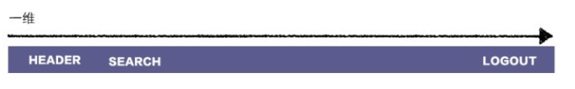
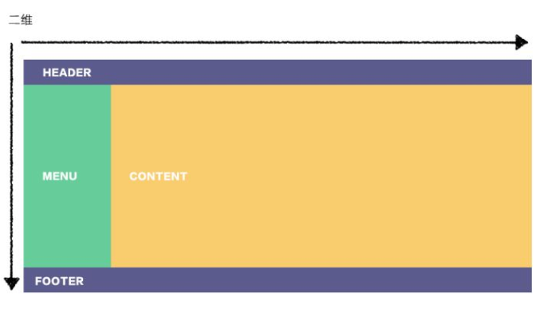
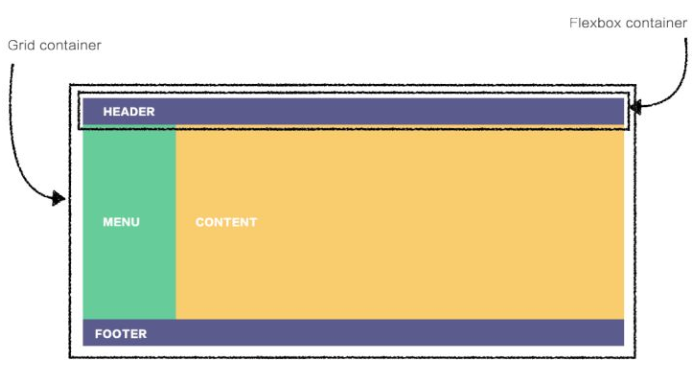
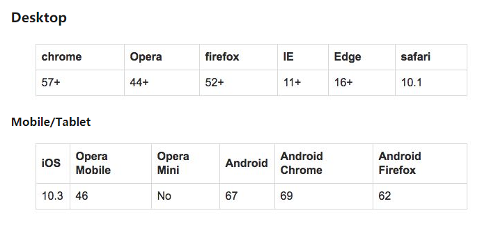

一般来说，布局的传统解决方案，是基于盒状模型，依赖`display + position + float`，但它对于那些特殊的布局非常不方便，比如，垂直居中实现起来很麻烦

`Flexbox`的出现很好的解决了这个问题。它赋予父容器更改子元素宽高或顺序的能力，来更好的填充可用的空间(响应式)。它是简单的一维布局，最适合用在组件和小规模的布局中，如果是更复杂的布局，Grid布局会比较好一些

`CSS Grid`，基于网格的二维布局，目的是改变布局解决方法, 它有很多与Flexbox相同的功能，但优势不同，要根据实际情况选择布局方式

### 概念
1. Flexbox

Flexbox应用与一维布局，用来为盒状模型提供最大的灵活性 [Flexbox了解一下](https://zhuanlan.zhihu.com/p/46684565)

2. CSS Grid
Gird是css中最强大的布局系统，应用于二维布局，可以同时处理行和列，可以通过将css规则用于父元素（网格容器）和该元素的子元素（网格元素）来使用网格布局。 [Grid布局了解一下](https://zhuanlan.zhihu.com/p/46754464)

3. 一维与二维





### 内容优先与布局优先
两者之间的另一个核心差异是Flexbox基于内容，而Grid基于布局。看一个具体的例子，来理解它的含义

```html
<header>
    <div>HOME</div>
    <div>SEARCH</div>
    <div>LOGOUT</div>
</header>
```

在我们将它变成Flexbox布局之前，div独占一行向下排列


1. Flexbox 实现标题布局

```css
header {
    display：flex;
}
```


要将LOGOUT按钮移动到最右侧，给该元素左侧一个边距：
```css
header> div：nth-child(3){
    margin-left：auto;
}
```


以上是通过子项身来决定它们的放置方式。除了display: flex; 最初我们没有必要预先定义任何其他内容。


2. Grid 实现标题布局
下面定义网格有十列，每列为一个单位宽
```css
header {
    display：grid;
    grid-template-columns：repeat（10,1fr）;
}
```
效果看起来与Flexbox解决方案完全相同


但是，审查元素你会看到，内容被分成了十列：


这种方法的主要区别在于我们必须首先定义列和列的宽度，然后将内容放在可用的网格单元格中 为了将LOGOUT按钮移动到最右侧，我们将其放在第十列，如下所示：

```css
header> div：nth-child（3）{
    grid-column：10;
}
```


3. 将两者结合起来



```html
<div class =“container”>
  <header> HEADER </header>
  <aside> MENU </aside>
  <main> CONTENT </main>
  <footer> FOOTER </footer>
</div>
```

```css
.container {
    display：grid;
    grid-template-columns：repeat（12,1fr）;
    grid-template-rows：50px 350px 50px;
}

header {
    grid-column：span 12;
}
aside {
    grid-column：span 2;
}
main {
    grid-column：span 10;
}
footer {
    grid-column：span 12;
}

header {
    display：flex;
}

header> div：nth-child（3）{
    margin-left：auto;
}
```

### 浏览器兼容性

1. grid



2. flex


3. [grid demo](https://gridbyexample.com/examples/)


### example
要了解这两个体系构建布局的方式，我们将通过相同的 HTML 页面，利用不同的布局方式 （即 Flexbox 与 CSS Grid）为大家区分。

[demo](https://demo.tutorialzine.com/2017/03/css-grid-vs-flexbox/)

该页面由一个居中的容器组成，在其内部则包含了标头、主要内容部分、侧边栏和页脚。接下来，我们要完成同时保持 CSS 和 HTML 尽可能整洁的挑战事项：

- 在布局中将四个主要的部分进行定位
- 将页面变为响应式页面
- 对齐标头：导航朝左对齐，按钮向右对齐

#### 定位页面部分

##### Flexbox
为容器添加 display: flex 来指定为 Flex 布局，并指定子元素的垂直方向。
```css
.container {
    display: flex;
    flex-direction: column;
}
```

现在我们需要使主要内容部分和侧边栏彼此相邻。由于 Flex 容器通常是单向的，所以我们需要添加一个包装器元素。
```html
<header></header>
<div class="main-and-sidebar-wrapper">
    <section class="main"></section>
    <aside class="sidebar"></aside>
</div>
<footer></footer>
```

然后，我们给包装器在反向添加 display: flex 和 flex-direction 属性。
```css
.main-and-sidebar-wrapper {
    display: flex;
    flex-direction: row;
}
```

最后一步，我们将设置主要内容部分与侧边栏的大小。通过 Flex 实现后，主要内容部分会比侧边栏大三倍。
```css
.main {
    flex: 3;
    margin-right: 60px;
}
.sidebar {
   flex: 1;
}
```
如你所见，Flex 将其很好的实现了出来，但是仍需要相当多的 CSS 属性，并借助了额外的 HTML 元素。那么，让我们看看 CSS Grid 如何实现的。

##### CSS Grid
针对本页面有几种不同的 CSS Grid 解决方法，但是我们将使用网格模板区域语法来实现，因为它似乎最适合我们要完成的工作。

首先，我们将定义四个网格区域，所有的页面各一个：
```html
<header></header>
<!-- Notice there isn't a wrapper this time -->
<section class="main"></section>
<aside class="sidebar"></aside>
<footer></footer>
```

```css
header {
    grid-area: header;
}
.main {
    grid-area: main;
}
.sidebar {
    grid-area: sidebar;
}
footer {
    grid-area: footer;
}
```

然后，我们会设置网格并分配每个区域的位置。初次接触 Grid 布局的朋友，可能感觉以下的代码会有些复杂，但当你了解了网格体系，就很容易掌握了。

```css
.container {
    display: grid;

    /*
    Define the size and number of columns in our grid.
    The fr unit works similar to flex:
    fr columns will share the free space in the row in proportion to their value.
    We will have 2 columns - the first will be 3x the size of the second.
    */
    grid-template-columns: 3fr 1fr;

    /*
    Assign the grid areas we did earlier to specific places on the grid.
    First row is all header.
    Second row is shared between main and sidebar.
    Last row is all footer.
    */
    grid-template-areas:
        "header header"
        "main sidebar"
        "footer footer";

    /*  The gutters between each grid cell will be 60 pixels. */
    grid-gap: 60px;
}
```
 我们现在将遵循上述结构进行布局，甚至不需要我们处理任何的 margins 或 paddings


#### 将页面变为响应式页面

##### Flexbox
这一步的执行与上一步密切相关。对于 Flexbox 解决方案，我们将更改包装器的 flex-direction 属性，并调整一些 margins。
```css
@media (max-width: 600px) {
    .main-and-sidebar-wrapper {
        flex-direction: column;
    }

    .main {
        margin-right: 0;
        margin-bottom: 60px;
    }
}
```
由于网页比较简单，所以我们在媒体查询上不需要太多的重写。但是，如果遇见更为复杂的布局，那么将会重新的定义相当多的内容。

##### CSS Grid
由于我们已经定义了网格区域，所以我们只需要在媒体查询中重新排序它们。 我们可以使用相同的列设置。

```css
@media (max-width: 600px) {
    .container {
    /*  Realign the grid areas for a mobile layout. */
        grid-template-areas:
            "header header"
            "main main"
            "sidebar sidebar"
            "footer footer";
    }
}
```

或者，我们可以从头开始重新定义整个布局。
```css
@media (max-width: 600px) {
    .container {
        /*  Redefine the grid into a single column layout. */
        grid-template-columns: 1fr;
        grid-template-areas:
            "header"
            "main"
            "sidebar"
            "footer";
    }
}
```

#### 对齐标头组件

##### Flexbox
我们的标头包含了导航和一个按钮的相关链接。我们希望导航朝左对齐，按钮向右对齐。而导航中的链接务必正确对齐，且彼此相邻。

```html
<header>
    <nav>
        <li><a href="#"><h1>Logo</h1></a></li>
        <li><a href="#">Link</a></li>
        <li><a href="#">Link</a></li>
    </nav>
    <button>Button</button>
</header>
```

我们曾在一篇较早的文章中使用 Flexbox 做了类似的布局：响应式标头最简单的制作方法。这个技术很简单：
```css
header {
    display: flex;
    justify-content: space-between;
}
```

现在导航列表和按钮已正确对齐。下来我们将使内的 items 进行水平移动。这里最简单的方法就是使用 display：inline-block 属性，但目前我们需要使用一个 Flexbox 解决方案：
```css
header nav {
    display: flex;
    align-items: baseline;
}
```

##### CSS Grid
为了拆分导航和按钮，我们要为标头定义 display: grid 属性，并设置一个 2 列的网格。同时，我们还需要两行额外的 CSS 代码，将它们定位在相应的边界上。
```css
header{
    display: grid;
    grid-template-columns: 1fr 1fr;
}
header nav {
    justify-self: start;
}
header button {
    justify-self: end;
}
```

由于 CSS grid 不具备基线选项（不像 Flexbox 具备的 align-items 属性），所以我们只能再定义一个子网格。
```css
header nav {
    display: grid;
    grid-template-columns: auto 1fr 1fr;
    align-items: end;
}
```
CSS grid 在此步骤中，存在一些明显的布局上的缺陷。但你也不必过于惊讶。因为它的目标是对齐容器，而不是内部的内容。所以，用它来处理收尾工作，或许不是很好的选择哦。

**结论**

  - CSS Grid 适用于布局整体页面。它们使页面的布局变得非常容易，甚至可以处理一些不规则和非对称的设计。
  - Flexbox 非常适合对齐元素内的内容。你可以使用 Flexbox 来定位设计上一些较小的细节问题。
  - CSS Grid 适用于二维布局（行与列）
  - Flexbox 适用于一维布局（行或列）
  - 同时学习它们，并配合使用