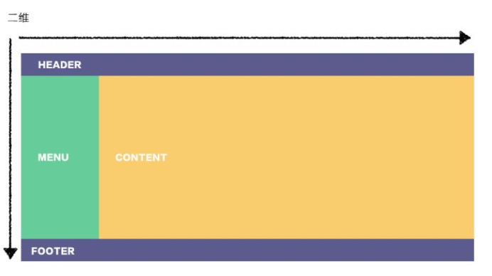
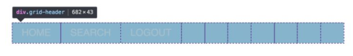
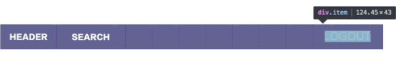
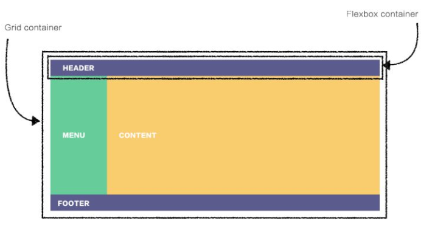
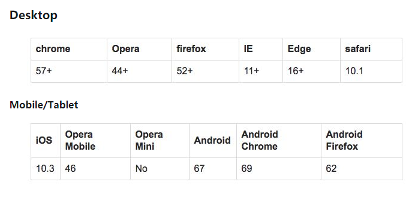
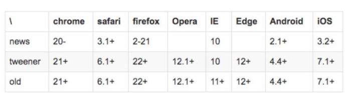

一般来说，布局的传统解决方案，是基于盒状模型，依赖`display + position + float`，但它对于那些特殊的布局非常不方便，比如，垂直居中实现起来很麻烦

`Flexbox`的出现很好的解决了这个问题。它赋予父容器更改子元素宽高或顺序的能力，来更好的填充可用的空间(响应式)。它是简单的一维布局，最适合用在组件和小规模的布局中，如果是更复杂的布局，Grid布局会比较好一些

`CSS Grid`，基于网格的二维布局，目的是改变布局解决方法, 它有很多与Flexbox相同的功能，但优势不同，要根据实际情况选择布局方式

### 概念
1. Flexbox

Flexbox应用与一维布局，用来为盒状模型提供最大的灵活性 [Flexbox了解一下](https://zhuanlan.zhihu.com/p/46684565)
2. CSS Grid
Gird是css中最强大的布局系统，应用于二维布局，可以同时处理行和列，可以通过将css规则用于父元素（网格容器）和该元素的子元素（网格元素）来使用网格布局。 [Grid布局了解一下](https://zhuanlan.zhihu.com/p/46754464)

3. 一维与二维




### 内容优先与布局优先

两者之间的另一个核心差异是Flexbox基于内容，而Grid基于布局。这个怎么说，让我们看一个具体的例子，来理解它的含义

```html
<header>
    <div>HOME</div>
    <div>SEARCH</div>
    <div>LOGOUT</div>
</header>
```

在我们将它变成Flexbox布局之前，div独占一行向下排列


1. Flexbox 实现标题布局

```css
header {
    display：flex;
}
```


要将LOGOUT按钮移动到最右侧，给该元素左侧一个边距：
```css
header> div：nth-​​child(3){
    margin-left：auto;
}
```


以上是通过子项身来决定它们的放置方式。除了display: flex; 最初我们没有必要预先定义任何其他内容。


2. Grid 实现标题布局
下面定义网格有十列，每列为一个单位宽
```css
header {
    display：grid;
    grid-template-columns：repeat（10,1fr）;
}
```
效果看起来与Flexbox解决方案完全相同


但是，审查元素你会看到，内容被分成了十列：



这种方法的主要区别在于我们必须首先定义列和列的宽度，然后将内容放在可用的网格单元格中 为了将LOGOUT按钮移动到最右侧，我们将其放在第十列，如下所示：

```css
header> div：nth-​​child（3）{
    grid-column：10;
}
```


3. 将两者结合起来



```html
<div class =“container”>
  <header> HEADER </header>
  <aside> MENU </aside>
  <main> CONTENT </main>
  <footer> FOOTER </footer>
</div>
```

```css
.container {
    display：grid;
    grid-template-columns：repeat（12,1fr）;
    grid-template-rows：50px 350px 50px;
}

header {
    grid-column：span 12;
}
aside {
    grid-column：span 2;
}
main {
    grid-column：span 10;
}
footer {
    grid-column：span 12;
}

header {
    display：flex;
}

header> div：nth-​​child（3）{
    margin-left：auto;
}
```

### 浏览器兼容性

1. grid



2. flex



3. [grid demo](https://gridbyexample.com/examples/)