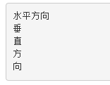

### 单行文本水平&垂直居中
```css
div {
line-height：200;
height：200;
text-align:center;
}
```


### 仅居中元素定宽高适用

    - absolute + 负margin
    - absolute + margin auto
    - absolute + calc

### 居中元素不定宽高

    - absolute + transform
    - lineheight
    - writing-mode
    - table
    - css-table
    - flex
    - grid

```html
<div class="wp">
    <div class="box size">123123</div>
</div>
```

```css
/* 公共代码 */
.wp {
    border: 1px solid red;
    width: 300px;
    height: 300px;
}

.box {
    background: green;
}

.box.size{
    width: 100px;
    height: 100px;
}
```
#### absolute + 负margin

```css
.wp {
    position: relative;
}
.box {
    position: absolute;;
    top: 50%;
    left: 50%;
    margin-left: -50px;
    margin-top: -50px;
}
```


#### absolute + margin auto

```html
<div class="wp">
    <div class="box size">123123</div>
</div>
```

```css
.wp {
    position: relative;
}
.box {
    position: absolute;;
    top: 0;
    left: 0;
    right: 0;
    bottom: 0;
    margin: auto;
}
```

#### absolute + calc

```html
<div class="wp">
    <div class="box size">123123</div>
</div>
```

```css
.wp {
    position: relative;
}
.box {
    position: absolute;;
    top: calc(50% - 50px);
    left: calc(50% - 50px);
}
```

#### absolute + transform

```html
<div class="wp">
    <div class="box">123123</div>
</div>
```

```css
.wp {
    position: relative;
}
.box {
    position: absolute;
    top: 50%;
    left: 50%;
    transform: translate(-50%, -50%);
}
```

#### lineheight

```html
<div class="wp">
    <div class="box">123123</div>
</div>
```

```css
.wp {
    line-height: 300px;
    text-align: center;
    font-size: 0px;
}
.box {
    font-size: 16px;
    display: inline-block;
    vertical-align: middle;
    line-height: initial;
    text-align: left; /* 修正文字 */
}
```

#### writing-mode

```html
<div class="div1">水平方向</div>
<div class="div2">垂直方向</div>
```

```css
.div2 {
    writing-mode: vertical-lr;
}
```



```html
<div class="wp">
    <div class="wp-inner">
        <div class="box">123123</div>
    </div>
</div>
```

```css
.wp {
    writing-mode: vertical-lr;
    text-align: center;
}
.wp-inner {
    writing-mode: horizontal-tb;
    display: inline-block;
    text-align: center;
    width: 100%;
}
.box {
    display: inline-block;
    margin: auto;
    text-align: left;
}
```


#### table

```html
<table>
    <tbody>
        <tr>
            <td class="wp">
                <div class="box">123123</div>
            </td>
        </tr>
    </tbody>
</table>
```

```css
.wp {
    text-align: center;
}
.box {
    display: inline-block;
}
```

#### css-table

```html
<div class="wp">
    <div class="box">123123</div>
</div>
```

```css
.wp {
    display: table-cell;
    text-align: center;
    vertical-align: middle;
}
.box {
    display: inline-block;
}
```

#### flex

```html
<div class="wp">
    <div class="box">123123</div>
</div>
```

```css
.wp {
    display: flex;
    justify-content: center;
    align-items: center;
}
```

#### grid

```html
<div class="wp">
    <div class="box">123123</div>
</div>
```

```css
.wp {
    display: grid;
}
.box {
    align-self: center;
    justify-self: center;
}
```

### 总结

- PC端有兼容性要求，宽高固定，推荐absolute + 负margin
- PC端有兼容要求，宽高不固定，推荐css-table
- PC端无兼容性要求，推荐flex
- 移动端推荐使用flex

| 方法                   | 居中元素定宽高固定 | PC兼容性                     | 移动端兼容性      |
| ---------------------- | ------------------ | ---------------------------- | ----------------- |
| absolute + 负margin    | 是                 | ie6+, chrome4+, firefox2+    | 安卓2.3+, iOS6+   |
| absolute + margin auto | 是                 | ie6+, chrome4+, firefox2+    | 安卓2.3+, iOS6+   |
| absolute + calc        | 是                 | ie9+, chrome19+, firefox4+   | 安卓4.4+, iOS6+   |
| absolute + transform   | 否                 | ie9+, chrome4+, firefox3.5+  | 安卓3+, iOS6+     |
| writing-mode           | 否                 | ie6+, chrome4+, firefox3.5+  | 安卓2.3+, iOS5.1+ |
| lineheight             | 否                 | ie6+, chrome4+, firefox2+    | 安卓2.3+, iOS6+   |
| table                  | 否                 | ie6+, chrome4+, firefox2+    | 安卓2.3+, iOS6+   |
| css-table              | 否                 | ie8+, chrome4+, firefox2+    | 安卓2.3+, iOS6+   |
| flex                   | 否                 | ie10+, chrome4+, firefox2+   | 安卓2.3+, iOS6+   |
| grid                   | 否                 | ie10+, chrome57+, firefox52+ | 安卓6+, iOS10.3+  |