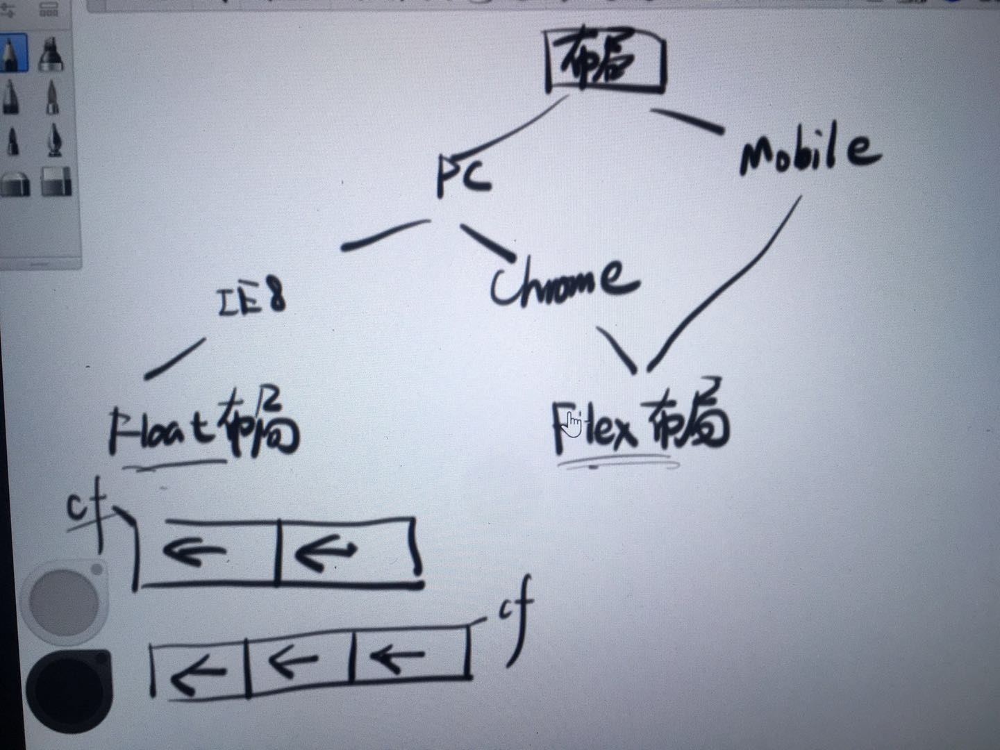
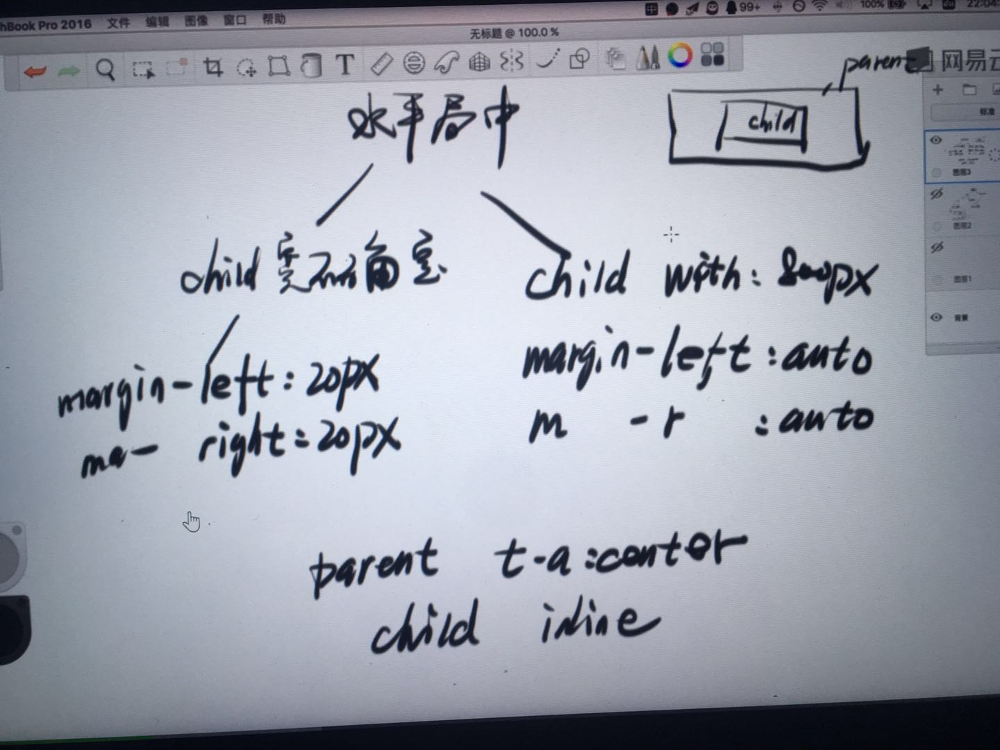
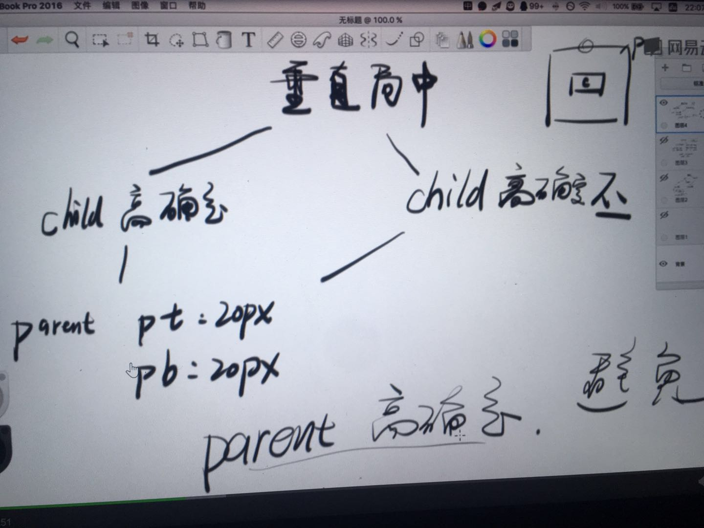
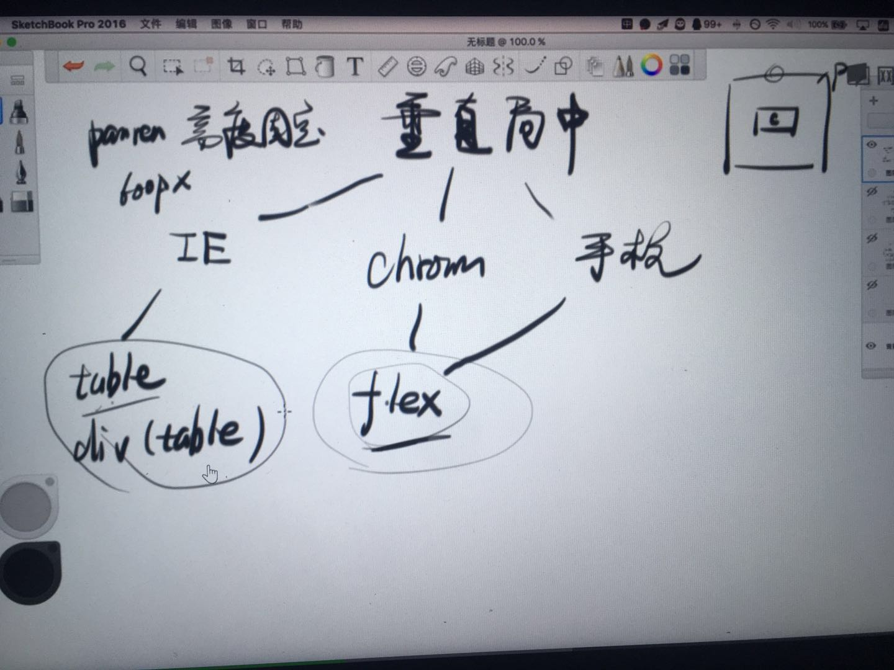

### CSS不正交

#### 各属性间影响
1. margin vs border   margin合并   margin塌陷
2. 小圆点 vs display   li
3. position:absolute vs display:inline

#### 各元素间影响
1. position:fixed vs transform
2. float影响inline元素


### CSS正交
1. 背套路(两种水平居中、三种垂直居中、两种左右结构、两种左中右结构、一行省略、多行省略)

    - 

    - 水平居中

    - 

    - 垂直居中

    ```css
        /*垂直居中时parent千万不要写高度 */
        /*垂直居中时parent千万不要写高度 */
        /*垂直居中时parent千万不要写高度 */
        .demo {
            text-align: center;
            padding: 5px 0;
            line-height: 22px;
        }
    ```

    - 

    - 
2. 工具
    - css3 generator
    - CSS-Tricks
    - animate.css

### 高度与宽度

#### 文档流
1. 内联元素宽高
    - padding和marging、border会影响宽度,但不会影响高度
2. 块级元素宽高(**由内部文档流中元素的高度总和决定的**)
    - 只有内联元素
        1. 一行内容(内联元素)则由行高决定
        2. 多行每行行高加起来
        3. word-break针对单词不换行
        4. **中文对齐**
        5. 内联元素很多则会基于文档流换行
    - 只有块级元素(块的内容+padding+border, margin要看是否合并)
    - 块级+内联

3. 水平居中  [css-tricks](https://css-tricks.com/)
    ```css
    //文字垂直居中,无论多还是单行，不要写高度!!!
    line-height: 24px;
    padding: 8px 0;
    text-align: center
    ```

    ```css
    //DIV里面的DIV绝对居中,父DIV
    display:flex;
    justify-content: center
    align-items: center;

    //或者子DIV
    margin: auto;
    width: 定宽;
    width: 定高;
    position: absolute;
    top: 0;
    right: 0;
    left: 0;
    bott0m: 0;
    ```
4. 垂直居中  [css-tricks](https://css-tricks.com/)
5. 文字溢出省略
    - 一行
    ```css
    white-space: nowrap;
    overflow: hidden;
    text-overflow: ellipsis;
    ```
    - 多行
    ```css
    display: -webkit-box;
    -webkit-line-clamp: 3;
    -webkit-box-orient: vertical;
    overflow: hidden
    ```
#### 盒模型
1. 1比1 DIV

    ```css
    padding-top: 100%;
    ```

2. outline
3. **border 调试大法**

### 堆叠上下文
#### 堆叠顺序
#### 堆叠上下文

### icon 全解
- img 法
- background 法
- background 合一法
- font 法
- SVG 法
- 新手慎用：「CSS 就是干」法