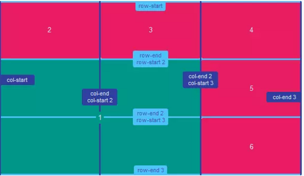
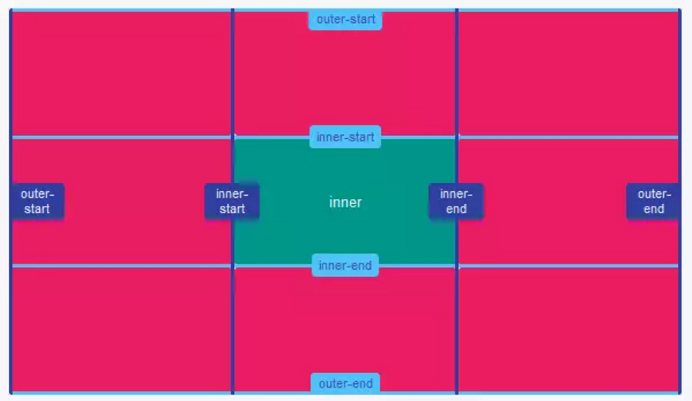
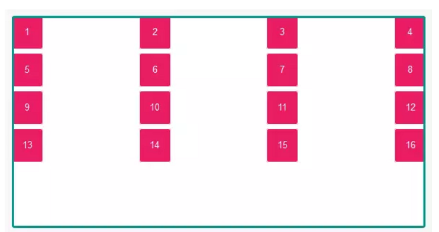

#### 1 网格容器

将属性 `display` 值设为 `grid` 或 `inline-grid` 就创建了一个网格容器，所有容器直接子结点自动成为网格项目

```css
grid  {
    display: grid;
｝
```


```css
/** 网格项目按行排列，网格项目宽度由自身宽度决定 */
grid  {
    display: inline-grid;
｝
```


#### 2 显示网格

属性`grid-template-rows`和`grid-template-columns`用于显示定义网格，分别用于定义行轨道和列轨道

```css
/**
属性`grid-template-rows`用于定义行的尺寸，即轨道尺寸。轨道尺寸可以是任何非负的长度值（px，%，em，等）
网格项目1的行高是50px，网格项目2的行高是100px。
因为只定义了两个行高，网格项目3和4的行高取决于其本身的高度。
*/
grid  {
    display: grid;
    grid-template-rows: 50px 100px；
｝
```


```css
/**
类似于行的定义，属性`grid-template-columns`用于定义列的尺寸。
因为定义中只有三列，所以项目4，5，6排在新的一行; 并因为它们位于第1，2，3列的轨道上，所以其宽度等于定义中第1，2，3列轨道的宽度。
网格项目的第1列，第2列，第3列的宽度分别是 90px, 50px 和 120px 。
*/
grid  {
    display: grid;
    grid-template-columns: 90px 50px 120px；
｝
```


```css
/**
单位fr用于表示轨道尺寸配额，表示按配额比例分配可用空间。
本例中，项目1占 1/4 宽度，项目2占 1/4 宽度，项目3占 1/2 宽度。
*/
grid  {
    display: grid;
    grid-template-columns: 1fr 1fr 2fr；
｝
```


```css
/**
单位fr和其它长度单位混合使用时，fr的计算基于其它单位分配后的剩余空间。
本例中，1fr = (容器宽度 - 3rem - 容器宽度的25%) / 3
*/
grid  {
    display: grid;
    grid-template-columns: 3rem 25% 1fr 2fr；
｝
```


#### 3 轨道的最小最大尺寸设置

函数`minmax()`用于定义轨道最小/最大边界值。

```css
/**
函数minmax()接收两个参数：第一个参数表示最小轨道尺寸，第二个参数表示最大轨道尺寸。长度值可以是auto，表示轨道尺寸可以根据内容大小进行伸长或收缩。
本例中，第一行最小高度设置成100px，但是最大高度设置成auto，表示行高可以根据内容伸长超过100px。
本例中，第一列宽度的最大值设置成50%，表示其宽度不能超过整个容器宽度的50%。
*/
grid  {
    display: grid;
    grid-template-rows:    minmax(100px, auto);
    grid-template-columns: minmax(auto, 50%) 1fr 3em;
｝
```


#### 4 重复的网格轨道

函数`repeat()`用来定义重复的网格轨道，尤其适用于有多个相同项目的情况下。

```css
/**
函数repeat()接收两个参数：第一个参数表示重复的次数，第二个参数表示轨道尺寸。
*/
grid  {
    display: grid;
    grid-template-rows:    repeat(4, 100px);
    grid-template-columns: repeat(3, 1fr);
｝
```


```css
/**
函数repeat()可以用在轨道定义列表当中。
本例中，第1列和第5列的宽度是30px。函数repeat()创建了中间3列，每一列宽度都是1fr。
*/
grid  {
    display: grid;
    grid-template-columns: 30px repeat(3, 1fr) 30px;
｝
```


#### 5 定义网格间隙

属性`grid-column-gap` 和 `grid-row-gap`用于定义网格间隙。
网格间隙只创建在行列之间，项目与边界之间无间隙。

```css
/** 间隙尺寸可以是任何非负的长度值（px，%，em等） */
grid  {
    display: grid;
    grid-row-gap:    20px;
    grid-column-gap: 5rem;
｝
```


```css
/**
属性grid-gap是grid-row-gap和grid-column-gap的简写形式。
第一个值表示行间隙，第二个值表示列间隙。
*/
grid  {
    display: grid;
    grid-gap: 100px 1em;
｝
```


```css
/** 如只有一个值，则其即表示行间隙，也表示列间隙 */
grid  {
    display: grid;
    grid-gap: 2rem;
｝
```


#### 6 用网格线编号定位项目
网格线本质上是用来表示网格轨道的开始和结束。
每一条网格线编号都以1开始，以1为步长向前编号，其中包括行列两组网格线。

```css
/**
这是一个3行2列的网格，即在行上有4条网格线，在列上有3条网格线。项目1利用网格线编号定位在第2行第2列的位置上。
本例中，项目只跨越一行一列，则grid-row-end和grid-column-end的定义可以省略
*/
.item1 {
    grid-row-start: 2;
    grid-row-end: 3;
    grid-column-start: 2;
    grid-column-end: 3;
}
```


```css
/**
属性grid-row 是 grid-row-start 和 grid-row-end的简写形式。
属性grid-column 是 grid-column-start 和 grid-column-end的简写形式。
如果只指定一个值，它表示 grid-row/column-start。
如果两个值都指定，第一个表示 grid-row/column-start ，第二个值表示grid-row/column-end。而且你必须用斜杠（/）分隔这两个值
*/
.item1 {
    grid-row:    2;
    grid-column: 3 / 4;
}
```


```css
/**
属性grid-area 是 grid-row-start, grid-column-start, grid-row-end 和 grid-column-end的简写形式
如果四个值都指定，则第一个表示 grid-row-start, 第二个表示 grid-column-start, 第三个表示 grid-row-end ,第四个表示 grid-column-end
*/
.item1 {
    grid-area: 2 / 2 / 3 / 3;
}
```


#### 7 网格项目跨越行列
网格项目默认都占用一行和一列，但可以使用前一节中定位项目的属性来指定项目跨越多行或多列。

```css
/** 通过grid-column-start和grid-column-end属性值的设置，使该网格项目跨越多列。*/
.item1 {
    grid-column-start: 1;
    grid-column-end:   4;
}
```


```css
/** 通过grid-row-start和grid-row-end属性值的设置，使该网格项目跨越多行。*/
.item1 {
    grid-row-start: 1;
    grid-row-end:   4;
}
```


```css
/** 简写属性 grid-row 和 grid-column 即能用来定位项目，也能用来使项目跨越多个行列。*/
.item1 {
    grid-row:    2 / 5;
    grid-column: 2 / 4;
}
```


```css
/** 关键字 span 用来指定跨越行或列的数量。*/
.item1 {
    grid-row:    2 / span 3;
    grid-column: span 2;
}
```


#### 8 网格线命名
当利用属性`grid-template-rows` 和 `grid-template-columns`定义网格时，可以同时定义网格线的名称。网格线名称可以用于定位网格项目。

```css
/**
用属性grid-template-rows 和 grid-template-columns定义网格，同时定义网格线名称。
为避免混淆，网格线名称应避免使用规范中的关键字（span等）。
定义网格线名称的方法是要将其放在中括号内（[name-of-line]），并要和网格轨道相对应。
*/
grid  {
    display: grid;
    grid-template-rows:    [row-1-start] 1fr [row-2-start] 1fr [row-2-end];
    grid-template-columns: [col-1-start] 1fr [col-2-start] 1fr [col-3-start] 1fr [col-3-end];
｝
```


```css
/**
可以给同一网格线定义多个名称，方法就是在中括号内用空格将多个名称分开。
每一个网格线名都可以被引用，以用来定位网格项目。
*/
grid  {
    display: grid;
    grid-template-rows:    [row-start row-1-start] 1fr [row-1-end row-2-start] 1fr [row-2-end row-end];
    grid-template-columns: [col-start] 1fr [col-2-start] 1fr [col-3-start] 1fr [col-end];
｝
```


#### 9 用网格线名定位项目
利用命名的网格线，可以很方便地进行项目定位。

```css
/** 引用网格线名称不用加中括号。*/
.item1 {
    grid-row-start:    row-2-start;
    grid-row-end:      row-end;
    grid-column-start: col-2-start;
    grid-column-end:   col-end;
}
```


```css
/** 简写属性grid-row 和 grid-column也可以利用网格线名称来定位项目。*/
.item1 {
    grid-row:    row-2-start / row-end;
    grid-column: col-2-start / col-end;
}
```


#### 10 用同名网格线命名和定位项目
函数repeat()可以定义同名网格线。这节省了给每条网格都命名的时间。

```css
/**
函数repeat()可以用来定义同名网格线。 这样多个网格线拥有相同的名字。
同名网格线会被分配一个位置编号，做为其唯一标识。
*/
grid {
    display: grid;
    grid-template-rows: repeat(3, [row-start] 1fr [row-end]);
    grid-template-columns: repeat(3, [col-start] 1fr [col-end]);
}
```


```css
/**
用同名网格线来定位项目时，应注意在网格线名称和编号之间有一个空格。
本例中，项目1的行定位开始于第2条名称是row-start的网格线，结束于第3条名称是row-end的网格线；
列定位开始于第1条名称是col-start的网格线，结束于第3条名称是col-start的网格线。
*/
.item1 {
    grid-row:    row-start 2 / row-end 3;
   grid-column: col-start / col-start 3;
}
```


#### 11 用网格区域命名和定位项目
如同网格线命名，可以用属性grid-template-areas给网格区域命名。网格区域名称可以用来定位网格项目。

```css
/**
一组区域名称要放在单引号或双引号内，每一个名称之间以空格分隔。
每一组名称定义一行，每一个名称定义一列。
*/
grid {
    display: grid;
    grid-template-areas:   "header header"
                        "content sidebar"
                        "footer footer";
    grid-template-rows:    150px 1fr 100px;
    grid-template-columns: 1fr 200px;
}
```


```css
/**
网格区域名称可以用在属性grid-row-start, grid-row-end, grid-column-start, 和 grid-column-end的值中，用来定位项目。
*/
header {
    grid-row-start: header;
    grid-row-end: header;
    grid-column-start: header;
    grid-column-end: header;
}
```


```css
/**
网格区域名称也可以用于简写属性grid-row 和 grid-column的值中。
*/
footer {
    grid-row: footer;
    grid-column: footer;
}
```


```css
/**
网格区域名称也可以用于简写属性grid-area的值中。
*/
aside {
    grid-area: sidebar;
}
```


#### 12 隐式网格
隐式网格用来在显式网格之外定位项目。有时在显示网格中没有足够的空间，或者是要在显示网格之外定位项目就要用到隐式网格。这时可以把这些项目放置在隐式网格中。

隐式网格可以通过属性 `grid-auto-rows`, `grid-auto-columns`, 和 `grid-auto-flow` 来定义。

```css
/**
本例中，只定一个行轨道，因此项目 1 和 2 高 70px 。
第2行轨道有隐式网格自动创建并为项目 3 和 4 分配了空间。 属性grid-auto-rows 定义了隐式网格的行轨道尺寸，即项目3和4的高度是 140px 。
*/
grid {
    display : grid;
    grid-template-rows:    70px;
    grid-template-columns: repeat(2, 1fr);
    grid-auto-rows:        140px;
}
```


```css
/** 缺省的网格布局方向是行的方向（row）。*/
grid {
    display : grid;
    grid-auto-flow: row;
}
```


```css
/** 网格的布局方向可以定义为列的方向（column）。*/
grid {
    display : grid;
    grid-auto-flow: column;
}
```


```css
/**
本例中，我们只定义了两个列轨道的尺寸30px 和 60px。
隐式网格中自动创建其它列并给项目3，4，5分配空间；分配的空间尺寸是通过属性 grid-auto-columns定义的。
*/
grid {
    display : grid;
    grid-template-columns: 30px 60px;
    grid-auto-flow:        column;
    grid-auto-columns:     1fr;
}
```


#### 13 隐式命名的网格区域
网格线名称可以任意指定，但分配以 `-start` 和 `-end` 结尾的名字有额外的益处，这样隐式地创建了具名网格区域，该名称可以用于项目定位。

```css
/**
本例中，行和列都有名为inner-start 和 inner-end的网格线，它们隐式地给网格区域分派了名称（inner）。
这样我们就能够直接使用网格区域名来定位，而不需要再用网格线来定位项目了。
*/
grid {
    display : grid;
    grid-template-rows:    [outer-start] 1fr [inner-start] 1fr [inner-end] 1fr [outer-end];
    grid-template-columns: [outer-start] 1fr [inner-start] 1fr [inner-end] 1fr [outer-end];
}

item1 {
    grid-area: inner;
}
```


#### 14 隐式命名的网格线
隐式命名网格线和隐式命名的网格区域的工作原理刚好相反。

```css
/** 定义网格区域时隐式的命名了网格线的名称。这些网格线的名称是基于区域名加上-start 或 -end后缀组成的。*/
grid {
    display : grid;
    grid-template-areas:   "header header"
                        "content sidebar"
                        "footer footer";
    grid-template-rows:    80px 1fr 40px;
    grid-template-columns: 1fr 200px;
}
```


```css
/** 本例中，header是通过隐式网格线名称进行定位的。 */
item1 {
    grid-row-start:    header-start;
    grid-row-end:      content-start;
    grid-column-start: footer-start;
    grid-column-end:   sidebar-end;
}
```


#### 15 层叠网格项目

```css
/**
本例中，项目1 和 2 行定位开始于第1条行网格线，并跨越两列。
两个项目都是用网格线编号进行定位。项目1起始于第1条列网格线，项目2起始于第2条列网格线，这使得两个项目在第一行中间列发生层叠。
缺省情况下，项目2将层叠于项目1之上；然而，给项目1设置属性z-index: 1就使得项目1层叠于项目2之上。
 */
.item-1, .item-2 {
  grid-row-start:  1;
  grid-column-end: span 2;
}
.item-1 { grid-column-start: 1; z-index: 1; }
.item-2 { grid-column-start: 2 }
```


```css
/** 本例中，利用在 grid-template-areas 定义中的隐式网格线名称，定位了一个网格项目（overlay），并将层叠于上层。 */
.overlay {
    grid-row-start:    header-start;
    grid-row-end:      content-end;
    grid-column-start: content-start;
    grid-column-end:   sidebar-start;
    z-index: 1;
}
```


#### 16 网格项目的对齐方式
CSS的 盒模型对齐模块 补充了CSS网格的内容，网格项目可以按行或列的轴线方向实现多种对齐方式。
属性`justify-items` 和 `justify-self` 以行轴为参照对齐项目，属性`align-items` 和 `align-self` 以列轴为参照对齐项目。
属性`justify-items` 和 `align-items` 是网格容器的属性，并支持如下这些值：

- auto
- normal
- start
- end
- center
- stretch
- baseline
- first baseline
- last baseline

```css
/** 在行的轴线起点处对齐。 */
.grid {
    grid-template-rows: 80px 80px;
    grid-template-columns: 1fr 1fr;
    grid-template-areas: "content content"
                       "content content";
}
.item { grid-area: content }
.grid {
    justify-items: start
}
```


```css
/** 在行的轴线中点处对齐。 */
grid {
    justify-items: center;
}
```


```css
/** 在行的轴线终点处对齐。 */
grid {
    justify-items: end;
}
```


```css
/** 在行的轴线方向延伸并填满整个区域。stretch是缺省值。 */
grid {
    justify-items: stretch;
}
```


```css
/** 在列的轴线起点处对齐。 */
grid {
    align-items: start;
}
```


```css
/** 在列的轴线中点处对齐。 */
grid {
    align-items: center;
}
```


```css
/** 在列的轴线终点处对齐。 */
grid {
    align-items: end;
}
```


```css
/** 在列的轴线方向延伸并填满整个区域。 */
grid {
    align-items: stretch;
}
```


```css
/** 项目定位于行轴和列轴线的中间位置。*/
grid {
    justify-items: center;
    align-items:   center;
}
```


#### 17 网格项目的对齐方式2
项目可以用属性align-self 和 justify-self定义自己的对齐方式，并支持如下这些属性值：

- auto
- normal
- start
- end
- center
- stretch
- baseline
- first baseline
- last baseline

```css
/** 属性justify-self 在行的轴线方向定义对齐方式。*/
.item1 { justify-self: start }
.item2 { justify-self: center }
.item3 { justify-self: end }
```


```css
/** 属性align-self 在列的轴线方向定义对齐方式。*/
.item1 { align-self: start }
.item2 { align-self: center }
.item3 { align-self: end }
```


```css
/** 项目1定位在行的轴线和列的轴线的中间位置。*/
.item1 {
    justify-self: center
    align-self:   center
}
```


#### 18 网格轨道的对齐方式
在网格容器中，网格轨道延轴线方向有多种对齐方式。

属性align-content用于定义网格轨道延着行的轴线的对齐方式，而属性justify-content用于定义网格轨道沿着列的轴线的对齐方式。并分别支持如下属性：

- normal
- start
- end
- center
- stretch
- space-around
- space-between
- space-evenly
- baseline
- first baseline
- last baseline

```css
/** 列的轨道在行的轴线起点处对齐。start 是缺省值。*/
.grid {
    width: 100%;
    height: 300px;
    grid-template-columns: repeat(4, 45px);
    grid-template-rows: repeat(4, 45px);
    grid-gap: 0.5em;
    justify-content: start;
}
```


```css
/** 列的轨道在行的轴线终点处对齐。*/
.grid {
    justify-content: end;
}
```


```css
/** 列的轨道在行的轴线中间处对齐。*/
.grid {
    justify-content: center;
}
```


```css
/** 在每一列的两侧平均分配额外空间。*/
.grid {
    justify-content: space-around;
}
```


```css
/** 在列与列之间平均分配额外的空间。*/
.grid {
    justify-content: space-between;
}
```


```css
/** 在列与列之间及列与边界之间平均分配额外空间。*/
.grid {
    justify-content: space-evenly;
}
```


```css
/** 行的轨道在列的轴线起点处对齐，属性start是缺省值。*/
.grid {
    align-content: start;
}
```


```css
/** 行的轨道在列的轴线终点处对齐。*/
.grid {
    align-content: end;
}
```


```css
/** 行的轨道在列的轴线中点处对齐。*/
.grid {
    align-content: center;
}
```


```css
/** 每一行的两侧平均分配额外空间。*/
.grid {
    align-content: space-around;
}
```


```css
/** 在行与行之间平均分配额外空间。*/
.grid {
    align-content: space-between;
}
```


```css
/** 在行与行之间及行与边界之间平均分配额外空间。*/
.grid {
    align-content: space-evenly;
}
```
