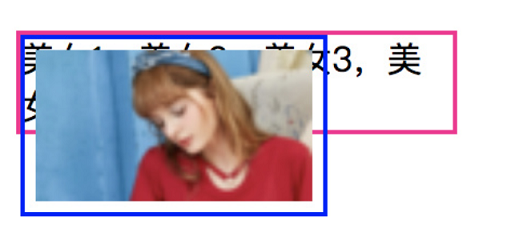

### float

#### 1.介紹
**让block元素无视float元素，让inline元素像流水一样围绕着float元素实现浮动布局**

#### 2.特性
- 包裹性
- 高度塌陷
- 块状化
- 没有任何margin合并

##### 2.1 包裹性
所谓"包裹性"，其实是由"包裹"和"自适应"两部分组成

```css
.father{
    border: 1px solid deeppink;
    width: 200px;
}
.son {
    float: left;
    font-size: 0;
    border: 1px solid blue;
    padding: 5px;
}
.father img {
    width: 128px;
}
```
1. 包裹。本例中将浮动元素父元素宽度设置为200px，浮动元素的子元素是一个128px宽度的图片，则此时浮动元素宽度表现为"包裹"，也就是里面图片的宽度128px。

```html
<div class="father">
    <div class="son">
        
    </div>
</div>
```


2）自适应性。在浮动子元素的中增加一些文字：
```html
<div class="father">
    <div class="son">
        
        <span style="font-size: 12px">美女1，美女2，美女3，美女4，美女5，美女6，后宫1，后宫2，后宫3，后宫</span>
    </div>
</div>
```
此时，浮动元素宽度就自适应父元素的200px宽度，最终的宽度表现也是200px。如下图所示：


##### 2.2 高度塌陷
float属性有一个著名的特性：**会让父元素的高度塌陷**。如章节2.1中的效果图，父元素div的高度并没有被子元素撑开(粉色区域)。float给`div.son`施了个障眼法，让该元素的高度塌陷为0了，这样外层div计算高度时，认为`div.son`的高度为0，相当于`div.son`的content的高度为0，则`div.father`认为其没有子元素，所以产生了高度塌陷。后文中将讲述如何解决高度塌陷的问题。

##### 2.3 块状化
块状化的意思是，一旦元素float的属性不为none，则其display计算值就是block或者table

```javascript
var span = document.createElement('span')
document.body.appendChild(span)
console.log('1.' + window.getComputedStyle(span).display)
// 设置元素左浮动
span.style.cssFloat = 'left'
console.log('2.' + window.getComputedStyle(span).display)
```

这里的块状化意思是可以像block元素一样设置宽和高，并不是真正的块元素。
因此，没有任何理由出现下面的样式组合：
```css
span{
    display: block; /* 多余 */
    float: left;
}
span{
    float: left;
    vertical-align: middle; /* 多余 */
}
```
##### 2.4 没有任何的margin重叠
在这里，我们将`.son`类增加`margin:10px`样式，在浏览器中查看实际效果。

```html
<div class="father">
    <div class="son">
        
    </div>
    <div class="son">
        
    </div>
    <div class="son">
        
    </div>
</div>
```
我们增加.son类的margin为10px，在浏览器中查看相邻的.son元素的空白区域的高度是20px，可以发现设置了float属性的元素没有任何的margin重叠，这和普通的元素margin重叠不一样。


> 什么是外边距(margin)重叠
> 外边距重叠是指两个或多个盒子(可能相邻也可能嵌套)的相邻边界(其间没有任何非空内容、补白、边框)重合在一起而形成一个单一边界

```html
<style>
    *{
        margin:0;
        padding: 0;
    }
    .divout{
        width: 100px;
        height: 100px;
        background: yellow;
        margin-bottom: 50px;
        border: 1px solid black;
    }
    .divout1{
        width:50px;
        height: 50px;
        background: yellow;
        margin-top: 80px;
            /*float:left;*/
        /*position:absolute;*/
        border: 1px solid black;
    }
</style>
<body>
    <div class="divout">
    </div>
    <div class="divout1">
    </div>
</body>
```

#### 3.float与流体布局
使用float可以通过破坏正常的文档流实现CSS环绕，但是却带来了**高度塌陷**的问题！然而我们可以利用float破坏正常文档流的特性实现一些常用的布局：

- 文字环绕变身-中间内容居中，左中右布局

```html
<div class="box">
    <a href="javascript:;" class="fl">左青龙</a>
    <a href="javascript:;" class="fr">右白虎</a>
    <h3 class="text-center">标题</h3>
</div>
```

```css
.box{
    background-color: #f5f5f5;
}
.fl{
    float: left;
}
.fr{
    float: right;
}
.text-center{
    text-align: center;
}
```


- 文字环绕的衍生-单侧固定

```html
<div class="father">
    
    <p class="girl">美女1，美女2，美女3，美女4，美女5，美女6，后宫1，后宫2，后宫3，后宫4，后宫5，后宫6</p>
</div>
```

```css
.father{
    border: 1px solid #444;
    overflow: hidden;
}
.father > img {
    width: 60px; height: 64px;
    float: left;
}
.girl {
    /* 环绕和自适应的区别所在 */
    margin-left: 70px;
}
```
和文字环绕效果相比，区别就是`.girl`多了一个`margin-left: 70px`，同时图片的宽度设置60px，因此不会发生文字环绕的效果。这里，我们也可以不使用`margin-left`，改用`border-left`或者`padding-left`都可以达到改变content box的尺寸，从而实现宽度自适应布局效果。


#### 4.float的克星

##### 4.1 clear属性

```css
clear: none | left | right | both
```
如果单从字面上的意思来理解，clear:left应该是**清除左浮动**，clear:right应该是**清除右浮动**，实际上，这种说法是有问题的，**因为浮动一直还在，并没有清除！只能清除浮动带来的影响**。

官方对clear属性的解释是："**元素盒子的边不能和前面的浮动元素相邻**"。注意这里的"前面的"3个字，也就是clear属性对"后面的"浮动元素是不闻不问的。clear属性只能清除元素的自身，不能影响其他的元素。接着看下面的这个例子：

```html
<div class="box1"></div>
<div class="box2"></div>
```

```css
.box1 {
    float: left;
    width: 100px;
    height: 60px;
    padding: 10px;
    border: 3px solid black;
    background: url("../../lib/img/mm1.png") center no-repeat;
}
.box2 {
    border: 3px solid red;
    padding:10px;
    width:100px;
    height: 60px;
    background: url("../../lib/img/mm2.jpg") center no-repeat;
}
```


如上图所示，box1元素为设置了左浮动，已经脱离了正常的文档流，所以box2能够在box1的底层显示。如果想让box2能够换行排列，则只需要在`.box2`类中增加`clear:left`样式即可。如下图所示：


##### 4.2 clear属性的不足

clear属性只对块级元素有效，但是::after等伪元素默认都是内联水平，因此，在实际工作中，我们常常使用下面的代码来清除浮动带来的影响：

```css
.clear::after{
    content: "";
    display: table;/*也可以是'block'或者是'list-item'*/
    clear: both;
}
```
由于`clear:both`作用的本质是让自己不和float元素在一行显示，并不是真正意义上的清除浮动，因此float元素有一些不好的特性依然存在，表现在：

- 如果clear:both元素前面的元素就是float元素，则设置margin-top无效

```html
<div class="box1"></div>
<div class="box2"></div>
```

```css
.box1 {
    float: left;
    width: 100px;
    height: 60px;
    padding: 10px;
    border: 3px solid black;
    background: url("../../lib/img/mm1.png") center no-repeat;
}
.box2 {
    clear: both;
    margin-top: -20px;
    border: 3px solid red;
    padding:10px;
    width:100px;
    height: 60px;
    background: url("../../lib/img/mm2.jpg") center no-repeat;
}
```
在本例中，设置.box2中的margin-top没有任何的效果，如下图所示：


- `clear:both`后面的元素依旧可能会发生文字环绕现象。

```html
<div class="father">
    <div class="float">
        
    </div>
    <p>美女1，美女2，美女3，美女4，美女5，美女6，后宫1，后宫2，后宫3，后宫</p>
</div>
<div>我要美女1，我还要美女2</div>
```

```css
.father{
    border: 1px solid deeppink;
    width: 500px;
    height: 70px;
}
.father:after{
    content: '';
    display: table;
    clear: both;
}
.float{
    float: left;
}
.father img {
    width: 60px;
    height: 70px;
}
```
在本例中，设置`clean:both`来阻止浮动对后面元素的影响，但是最后的错位效果依然发生了（可以设置`.father`的字体大小为0，然后设置p标签的字体大小解决错误的问题）。


由此可见，clear:both只能在一定程度上消除浮动的影响，要想完美去除浮动元素的影响，借助其他的手段——BFC

#### 5.CSS世界的结界——BFC

##### 5.1 BFC的定义
BFC全称`block formatting contex`t，中文为**块级格式化上下文**。BFC的表现原则为：如果一个元素具有BFC，那么它的内部子元素再怎么翻江倒海，都不会影响外部的元素。因此，BFC元素是不可能发生margin重叠的，另外，BFC元素也可以用来清除浮动的影响。

那么满足什么条件才会有BFC呢？只要满足下面任意一个条件就会触发BFC:

- html根元素；
- float的值不为none；
- overflow的值为auto、scroll或者hidden；
- display的值为table-cell、table-caption和inline-block中的任何一个；
- position的值不为relative和static；
触发BFC后，就不需要使用clear:both属性去清除浮动的影响。

##### 5.1 BFC的作用
- 清除margin重叠

```html
<div class="parent">
    <p>item 1</p>
    <p>item 2</p>
    <p>item 3</p>
    <p>item 4</p>
</div>
```

```css
.parent{
    width: 300px;
    background-color: black;
    overflow: hidden;
}
p {
    background-color: white;
    margin: 10px 0;
    text-align: center;
}
```
在这种情况下，出现了margin重叠的效果。如下图所示：


**利用BFC能消除margin重叠，谨记：只有当元素在同一个BFC中时，垂直方向上的margin才会clollpase**。如果它们属于不同的BFC，则不会有margin重叠。因此我们可以再建立一个BFC去阻止margin重叠的发生。所以为了让他们的margin变成20px，我们只需要用div,建立一个BFC，令p元素处于不同BFC即可。请看例子：

```html
<div class="parent">
    <p>item 1</p>
    <p>item 2</p>
    <div style="overflow: hidden">
        <p>item 3</p>
    </div>
    <p>item 4</p>
</div>
```


- 清除高度塌陷的问题
在上面的章节中，如果子元素设置浮动属性，则父元素就会出现高度塌陷的问题。在这里，我们可以借助BFC消除高度塌陷的问题了，请看下面的这个例子：

```html
<div style="border: 1px solid deeppink;width: 200px; overflow: hidden">
    
</div>
```
从下图中可以看到，设置`overflow:hidden`样式后就产生了BFC，根据BFC的表现规则，内部元素的样式不会影响外部元素的样式，因此没有出现高度塌陷的问题。


- 自适应布局（阻止文本换行）

```html
<div class="parent">
    
    <p class="girl">美女1,美女2,美女3,美女4,美女5,美女6,后宫1,后宫2,后宫3,后宫4,</p>
</div>
```

```css
.parent{
    border: 1px solid deeppink;
    width: 200px;
    font-size: 0;
}
.parent img{
    border: 1px solid blue;
    float: left;
}
.girl{
    /*overflow: hidden;*/
    font-size: 12px;
    background-color: #cdcdcd;
}
```
如果我们给.girl元素设置具有BFC特性的属性，如：`overflow: hidden`就可以实现更健壮、更智能的自适应布局。


这里的.girl元素为了不和浮动元素产生任何交集，顺着浮动边缘形成自己的封闭上下文。

普通元素在设置了`overflow:hidden`后，会自动填满容器中除了浮动元素意外的剩余空间，形成自适应效果，这种自适应布局和纯流体布局相比：

- 自适应内容由于封闭而更加健壮，容错性更强；
- 自适应内容能够填满除浮动元素以外区域，不需要关心浮动元素宽度。

### absolute
#### 1.absolute的特性
##### 1.包裹性
```css
.father{
    border: 2px solid deeppink;
    width: 200px;
}
.son {
    position: absolute;
    font-size: 0;
    border: 2px solid blue;
    padding: 5px;
}
.father img {
    width: 128px;
}
```

```html
<div class="father">
    <!--son1与son的唯一区别是son1的position设置为static-->
    <div class="son1">
        
    </div>
</div>
<br/>
<br/>

<div class="father">
    <div class="son">
        
    </div>
</div>
```


在本例中，**son1与son的唯一区别是son1的position设置为static**。 .father元素的宽度设置为200px，img元素是一个128px宽度的图片，则此时绝对定位元素宽度表现为"包裹性"，其宽度也就是里面图片的宽度128px。

由于绝对定位元素宽度表现为"包裹性"，因此，下面的CSS写法就是多余的：

```css
.wrap{
    display: inline-block;// 没有必要
    position: absolute;
}
```

##### 2.高度塌陷

基于上图，父元素div的高度并没有被子元素撑开(粉色区域)，这种效果可以称为"高度塌陷"。导致高度塌陷的原因是因为浮动元素脱离了正常的文档流，则div.father认为其没有子元素，所以产生了高度塌陷。

如果在.father元素增加子元素，如下：
```html
<div class="father">
    <div class="son">
        
    </div>
    美女1，美女2，美女3，美女4，美女5
</div>
```


从图中明显看出文字被图片遮盖了，这一点和float不同。因为，float元素本身仍处于文档流中，文字会环绕着float元素，不会被遮蔽，而设置了absolute的图片元素出现了层级关系，已经脱离了正常的文档流了，从父元素的视点看，图片已经完全消失不见了，因此从最左边开始显示文字，而absolute的层级高，所以图片遮盖了文字。

##### 3.块状化
块状化的意思是，一旦元素position的属性为absolute或者fixed，则其display计算值就是block或者table。

```javascript
var span = document.createElement('span')
document.body.appendChild(span)
console.log('1.' + window.getComputedStyle(span).display)
// 设置元素绝对定位
span.style.position = 'absolute'
console.log('2.' + window.getComputedStyle(span).display)
document.getElementById("aa").style.display = "block"

```
#### 2.absolute流体与相对特性

##### 1.absolute的相对特性
在介绍absolute的相对特性之前，先抛出以下问题： 如果一个元素的定位属性设置成了：position: absolute后，没有设置left/top/right/bottom，并且其祖先元素全部都是非定位元素，请问它将在哪里显示？

包括我自己，在深入了解absolute的特性之前，认为该元素是在浏览器窗口的左上方显示，其实这是对absolute绝对定位属性错误的认识。因此，很多人在使用absolute定位属性的时候，必定先要设置父元素position: relative，同时设置绝对定位元素的left/top/right/bottom，甚至还要设置绝对定位元素层级z-index，实际上，该元素还是在当前的位置。我们拿下面的这个例子验证：

```html
<div class="father">
    <div class="pa box"></div>
</div>
```

```css
.father{
    border: 2px solid deeppink;
    width: 100px;
    height: 100px;
}
.pa{
    position: absolute;
}
.box{
    background-color: #cdcdcd;
    width: 50px;
    height: 50px;
}
```
如下图所示，`.box`元素还是在当前的位置显示，而不是在浏览器窗口的左上方显示：


**实际上，absolute是一个相对比较独立的CSS属性，它的样式和行为表现不依赖其他的CSS属性就可以完成。因此，如果元素设置了定位属性为absolute绝对定位，并且没有设置left/top/right/bottom，那么可以将这种定位属性称为“无依赖绝对定位”，其本质就是"相对定位"，特点仅仅是脱离文档流，不占据任何CSS流的尺寸空间了。**

1. 各类图标定位

我们以慕课网首页上的课程列表举例：


```html
<div>
    <div class="box"></div>
    <i>Hot</i>
</div>
```
核心CSS代码如下所示：


完全不需要借助`top/right/bottom/left和position: relative`的帮助就可以搞定小图标的布局啦。相比使用`position:relative和right/top`的布局方式，这种布局方式的优点是：

维护成本低。如果后面想删除这个图片，只需要将图标对应的html和css代码删除掉就可以了，不会影响其他的元素
健壮性高。如果图片变大或者文字变长，我们不需要修改小图标的css代码，仍然定位效果良好。


再举一个在实际开发中用的比较多的一个例子，如下图所示，在一段文字的前面有一个图标：


```html
<div class="email-wrapper">
    <i class="icon-email"></i>
    <span class="icon-msg">请输入您的邮箱:</span>
</div>
```
```css
.email-wrapper{
    display: inline-block;
    height: 20px;
    padding-left: 20px;
    /*font-size: 0;*/
}
.icon-email{
    position: absolute;
    margin-left: -20px;
    width: 20px;
    height: 20px;
    background: url("../../lib/img/email.png") center center no-repeat;
    background-size: contain;
}
.icon-msg{
    display: inline-block;
    line-height: 20px;
    vertical-align: top;
}
```

2. 校验提示错误

在实际开发中，我们有很多表单校验，当校验不通过的时候，会有一些错误提示给用户，如下图所示：


通常，错误提示可以放到input框的下面，但是当出现错误提示的时候，下面的内容会整体下移，当错误提示消失的时候，下面的内容又会整体上移，用户体验不好。还有一种做法是放到input框的右侧显示，但是在默认状态下部容器设置了水平居中， 宽度不大，如果再出现错误提示信息，就会出现容器的宽度不够的问题。此时，我们同样可以借助："无依赖定位"，直接给错误提示信息增加一个CSS类，如下所示：

```css
.msg-error{
    position: absolute;
    margin-left: 10px;
}
```

无论将input框的宽度变大或者变小，提示信息都会跟着input框。相比使用position:relative和right/top的布局方式，这种方法代码量更少、容错性更高、维护成本更低。


##### 2.absolute的流体特性
只有absolute遇到`left/top/right/bottom`属性的时候，absolute元素才真正变成绝对定位元素。如果用户给absolute至少指定了`left/right`中的一个，则水平方向的相对特性丢失，垂直方向上继续保持相对特性；如果用户给absolute至少指定了`top/bottom`中的一个，则保持水平方向上的相对特性，垂直方向上的相对特性丢失。例如：

```html
<div class='box'></div>
.box{
    position: absolute;
    right: 0;
}
```
此时，元素水平方向相对特性丢失，具有了绝对定位特性，而垂直方向的定位依然保持了相对特性。

以上面的这个例子举例，当只有left或者right属性的时候，由于包裹性，此时div的宽度是0。但是，如果同时设置`left:0;right:0`的时候，宽度表现为"格式化宽度"，宽度自适应于.box包含快的content-box，换句话说，如果包含快的conent-box宽度发生变化，则`.box`的宽度也会跟着一起变。举个例子：

```
<div class='box'></div>
.box{
    position: absolute;
    right: 0;
    left: 0;
    top: 0;
    bottom: 0;
}
```

如果`.box`的包含块是根元素，则上面的代码可以让`.box`元素正好完全覆盖浏览器的可视窗口，同时，如果改变浏览器窗口的大小，`.box`的大小会随着浏览器的大小自动变化。因此，对于设置了对立定位属性的绝对定位属性，无论设置padding还是margin，其占据的空间一直不变，变化的就是content-box，这就是典型的流体表现特性。流体特性的具体用法在后面会介绍到。

#### 3.absolute与其他属性
#### 1.absolute与text-align
利用`text-align`可以控制绝对定位元素的位置，实现主窗口右侧的"返回顶部"以及"反馈"等布局的效果。效果图如下：


```html
<div class="alignright">
    <span class="follow">
        
        
    </span>
</div>
```
```css
.alignright{
    overflow: hidden;
    text-align: right;
}
.alignright:before{
    content: "\2002"
}
.follow{
    position: fixed;
    bottom: 100px;
    z-index: 1;
}
.follow img{
    display: block;
    margin: 10px;
    width: 20px;
    height: 20px;
    background-size: contain;
}
```
本例中，利用:before伪元素，在其前面插入一个空格（2002）,然后设置text-aligin: right，则空格对齐主结构的右侧边缘，后面的固定定位元素（同绝对定位元素）由于"无依赖定位"特性，左边缘正好就是主结构的右边缘，自然就跑到主结构的外面显示了,这种布局在实际开发中用处非常大.

#### 2.absolute与clip
在实际开发过程中，很多时候我们为了更好的SEO和无障碍识别，都会将页面中的一些元素隐藏，例如隐藏下面代码中的本网站名字这几个字：
```css
<a href="#" class="logo">
    <h1>本网站名字</h1>
</a>
```

为了隐藏上面的文字，有以下几种方案可以供我们选择：

- 使用`display:none`或者`visibility:hidden`。缺点：屏幕阅读设备会忽略这些文字；
- 使用`text-align`缩进。缺点：如果缩进过大到屏幕之外，屏幕阅读设备也是不会读取的；
- 使用`color: transparent`。原生IE8浏览器器并不支持，并且还是能够选中文本。
借助absolute和clip（关于clip用法不熟悉的同学可以自己百度下，很简单，注：clip只对绝对定位和固定定位的元素生效）这两个属性，能够同时满足视觉上隐藏- 和屏幕阅读设备能够读取的要求，核心代码如下：

```css
h1{
    position: absolute;
    clip: rect(0 0 0 0);
}
```

#### 3.absolute之margin:auto居中
在实际工作开发中，可能我们用的最多的是下面的方式来实现元素的水平垂直居中效果，核心代码如下：
```css
.box{
    width: 20px;
    height: 20px;
    position: absolute;
    left: 50%;
    right: 50%;
    margin-left: -10px;
    margin-right: -10px;
}
```

此方法有一个不足之处就是需要提前知道元素的尺寸，否则无法控制margin负值的大小。

如果不知道元素的尺寸，可以使用`transform: translate(-50%, -50%)`代替margin负值，然而这种方法存在一定的兼容性问题，IE9(-ms-), IE10+以及其他现代浏览器才支持，在一定的场景下会导致微信闪退的问题。

在介绍下另外一种方法前，我们首先熟悉下`margin: auto`的填充规则：

- 如果一侧定值，一侧auto，则auto为剩余空间大小；
- 如果两侧都是auto，则平分剩余空间。

因此，利用绝对定位absolute元素的流体特性和margin: auto的自动分配特性能够实现水平垂直居中的效果，核心代码如下：

```css
.box{
    width: 20px;
    height: 20px;
    position: absolute;
    left: 0;
    right: 0;
    top: 0;
    bottom: 0;
    margin: auto;
}
```


这种方法兼用性好，并且需要提前知道元素的尺寸，减少了依赖，后期维护改动的地方少.


### relative

```html
<div class="box">
    <div class="td">
        <div class="element1"></div>
        <h3>使用margin</h3>
    </div>
    <div class="td">
        <div class="element2"></div>
        <h3>使用relative</h3>
    </div>
</div>
```
```css
.element1{
    margin-top: -30px;
}
.element2{
    position: relative;
    top: -30px
}
```


在本例中，使用`.element1`和`.element2`两个CSS类达到的效果不一样，使用margin负值改变元素的位置后，后面元素的位置跟着变化，而使用`position: relative`和`top`负值改变元素的位置，后面元素的位置并没有发生改变。其实，这个例子说明了`relative`定位的两大特性：

1）**相对自身**。使用relative定位的元素，其相对的是自身进行偏移。
2）**无侵入性**。使用relative定位的元素，可以理解为产生了"幻影"，其真身依然在原来的位置上，所以并不会影响页面中其他的元素的布局。本例中，使用relative这几个字依然在原来的位置上，而使用`margin`这几个字则偏移了原来的位置。

#### 1 relative的限制作用
##### 1 relative对absolute的限制作用

我们知道，absolute定位的是其第一个祖先元素定位属性不为static属性，如果没有relative或者fixed定位的情况下，给absolute添加top/left、right/bottom等属性可以发生偏移，如下：
```css
position: absolute;
top: 10px;
left: 10px;
```
时，absolute元素就会迅速定位到局里浏览器左侧10像素，顶部10像素的地方。但是如果给父元素添加position: relative之后，则absolute的偏移能力被父元素限制住了，如下图所示：


##### 2 relative对overflow的限制作用

```html
<div class="box">
    <div class="son"></div>
</div>
<div class="box" style="position: relative">
    <div class="son"></div>
</div>
```

```css
.box{
    overflow: hidden;
    width: 50px;
    height: 50px;
    background-color: #dddddd;
}
.son{
    position: absolute;
    width: 100px;
    height: 100px;
    background-color: #cd0000;
}
```

在这个例子中，`.box`的宽和高都是50px，而`.son`元素的宽和高都是100px，虽然`.box`元素设置了`overflow:hidden`，但依然限制不了`.son`元素的大小，其宽和高都是100px，而当`.box`设置了定位属性`relative`后，`.son`元素的宽和高乖乖的变成了50px。如下图所示：


##### 3 relative对层级z-index的限制作用

```html
<div class="son" style="z-index: 3"></div>
<div class="son" style="z-index: 2;margin-top: -20px;background-color: tan;"></div>
<!--分割线-->
<div class="son" style="position: relative;z-index: 3"></div>
<div class="son" style="z-index: 2;margin-top: -20px;background-color: tan;"></div>
```


**下面抛出一个问题，如果设置了对立属性top/bottom、left/right的相对定位元素和绝对定位元素，它们是如何表现的？**

在CSS深入理解之absolute定位这篇文章中，我们知道绝对定位元素表现的是拉伸特性，从而可以保持流体特性，但是相对定位却是"你死我活"的状态，也就是说，只有一个方向的属性会生效，当`top/bottom`元素同时使用的时候，`top`生效，当l`eft/bottom`同时使用的时候，`left`生效。请看下面的这个例子

```html
<div class="box" style="position: relative; top: 10px;bottom: 500px"></div>
```

虽然同时设置了`top/bottom`对立属性，但是生效的却是`top`，如下图所示：


因此，下面有些代码没有必要：

```css
.demo{
    position: relative;
    top: 10px;
    right: 10px;/*无效*/
    bottom: 10px;/*无效*/
    left: 10px
}
```

#### 2 相对定位relative的使用原则-最小化

虽然relative定位很好用，并且使用的频率很高，但是根据张鑫旭大神总结的布局实践原则，最好基于以下原则为好：

尽量避免使用relative，如果要定位某些元素，看能否使用"无依赖的绝对定位"实现；
如果使用场景受限，一定要使用relative，则务必使relative最小化。

比如，我们想在某个模块的右上角定位一个图标，如果让你去布局实现的话，你该如何布局呢？十有八九会如下面的方式实现：

```html
<div style="position: relative">
    
    <p>内容1</p>
    <p>内容2</p>
    <p>内容3</p>
    ...
</div>
```

但是，我们可以采用"relative的最小化使用原则"的方式实现，其代码如下面的方式实现：

```html
<div>
    <div style="position: relative"> </div>
    <p>内容1</p>
    <p>内容2</p>
    <p>内容3</p>
    ...
</div>
```

那么，基于"relative的最小化使用原则"的房还是实现有什么好处呢？原因及好处如下：
relative定位元素的层叠水平提高了（敬请期待后续的文章），如果其子元素越多，则影响的范围越广，从项目和可维护性的角度来看，如果后期不需要这个小图标了，我们可以大胆地干调relative单元的元素即可，其他的元素则不需要任何的修改，然后放心的去陪妹子了。但是，如果relative在最外层的容器上，你敢删除吗？你敢放心的去陪妹子吗？难道你不怕影响其他的元素吗？所以你应该只会删除小图标，而不会删除的relative属性的。然后你的项目代码越来越臃肿，很多无用代码，看起来非常糟糕😰。这么一分析，你可知道"**relative最小化使用原则**"的好处了吧~