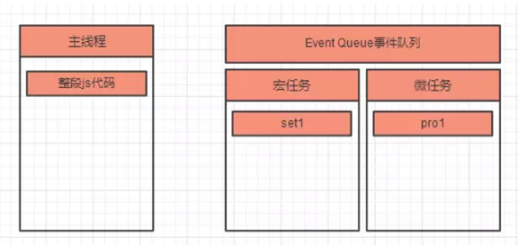

### 大致流程


1. js代码分为同步任务和异步任务。
2. 同步任务会进入主线程，异步任务会进入Event Table（事件表），当事件表中的异步任务完成后会在Event Queue（事件队列）中注册回调函数。
3. 主线程任务全部完成后，才会完成Event Queue中的任务。
4. js解析器会不断地重复检查主线程执行栈是否为空，然后重复第3步，这就是Event Loop（事件循环）。

js代码的类型分为：


1. 任务又可以进一步分为宏任务和微任务，这对js代码的执行有更为细致的影响，在文章下面会有讲解。
2. 异步任务中的宏任务和微任务会进入不同的Event Queue事件队列，即Event Queue又可以分为宏任务队列和微任务队列。
3. setInterval会按照设定的时间间隔重复地在Event Queue注册回调函数，如果某一段时间主线程代码执行太久，那么setInterval的回调函数可能阻塞到一起执行，无法保持设定的时间间隔，如果此时setInterval用于动画，则体现为卡顿。

### 详细流程


所以通常来说，我们页面中的js执行顺序是这样的：

- 第一轮事件循环：
1. 主线程执行js整段代码（宏任务），将ajax、setTimeout、promise等回调函数注册到Event Queue，并区分宏任务和微任务。
2. 主线程提取并执行Event Queue 中的ajax、promise等所有微任务，并注册微任务中的异步任务到Event Queue。


- 第二轮事件循环：


1. 主线程提取Event Queue 中的第一个宏任务（通常是setTimeout）。
2. 主线程执行setTimeout宏任务，并注册setTimeout代码中的异步任务到Event Queue（如果有）。
3. 执行Event Queue中的所有微任务，并注册微任务中的异步任务到Event Queue（如果有）。


- 类似的循环：**宏任务每执行完一个，就清空一次事件队列中的微任务**。

> 注意：事件队列中分“宏任务队列”和“微任务队列”，每执行一次任务都可能注册新的宏任务或微任务到相应的任务队列中，只要遵循“每执行一个宏任务，就会清空一次事件队列中的所有微任务”这一循环规则，就不会弄乱。

### Demo
```javascript
console.log('1');
// 1 6 7 2 4 5 9 10 11 8 3
// 记作 set1
setTimeout(function () {
    console.log('2');
    // set4
    setTimeout(function() {
        console.log('3');
    });
    // pro2
    new Promise(function (resolve) {
        console.log('4');
        resolve();
    }).then(function () {
        console.log('5')
    })
})

// 记作 pro1
new Promise(function (resolve) {
    console.log('6');
    resolve();
}).then(function () {
    console.log('7');
    // set3
    setTimeout(function() {
        console.log('8');
    });
})

// 记作 set2
setTimeout(function () {
    console.log('9');
    // 记作 pro3
    new Promise(function (resolve) {
        console.log('10');
        resolve();
    }).then(function () {
        console.log('11');
    })
})
```

- 第一轮事件循环：
1. 整体script作为第一个宏任务进入主线程，遇到console.log，输出1。


2. 遇到set1，其回调函数被分发到宏任务Event Queue中。


3. 遇到pro1，new Promise直接执行，输出6。then被分发到微任务Event Queue中。


4. 遇到了set2，其回调函数被分发到宏任务Event Queue中。

5. 主线程的整段js代码（宏任务）执行完，开始清空所有微任务；主线程执行微任务pro1，输出

6. 遇到set3，注册回调函数。


- 第二轮事件循环：

1. 主线程执行队列中第一个宏任务set1，输出2；代码中遇到了set4，注册回调；又遇到了pro2，new promise()直接执行输出4，并注册回调；

2. set1宏任务执行完毕，开始清空微任务，主线程执行微任务pro2，输出5。


- 第三轮事件循环：

1. 主线程执行队列中第一个宏任务set2，输出9；代码中遇到了pro3，new promise()直接输出10，并注册回调；
2. set2宏任务执行完毕，开始情况微任务，主线程执行微任务pro3，输出11。

- 类似循环...

所以最后输出结果为1、6、7、2、4、5、9、10、11、8、3。