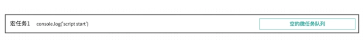
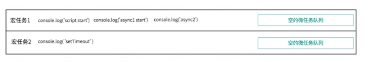
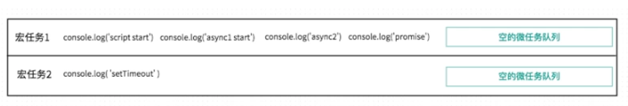
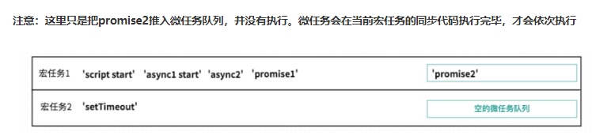
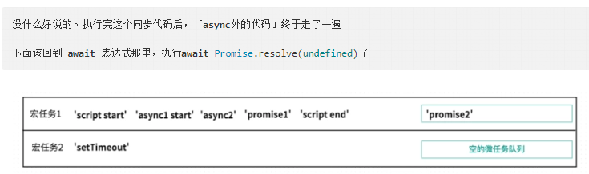
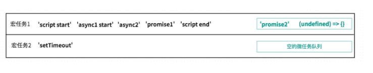

### question
```javascript
    async function async1() {
        console.log( 'async1 start' )
        await async2()
        console.log( 'async1 end' )
    }

    async function async2() {
        console.log( 'async2' )
    }

    console.log( 'script start' )

    setTimeout( function () {
        console.log( 'setTimeout' )
    }, 0 )

    async1();

    new Promise( function ( resolve ) {
        console.log( 'promise1' )
        resolve();
    } ).then( function () {
        console.log( 'promise2' )
    } )

    console.log( 'script end' )
```

### 需要具备的前置知识
- promise的使用经验
- 浏览器端的eventloop

### async await的理解
1. async 做一件什么事情？

**带async关键字的函数，它使得你的函数的返回值必定是promise对象**

如果async关键字函数返回的不是promise，会自动用Promise.resolve()包装

如果async关键字函数显式地返回promise，那就以你返回的promise为准
```javascript
async function fn1(){
    return 123
}

function fn2(){
    return 123
}

console.log(fn1())
console.log(fn2())
```
2. await 在等什么？

**await等的是右侧「表达式」的结果**

```javascript
//从右向左的。先打印async2，后打印的script start
async function async1() {
    console.log( 'async1 start' )
    await async2()
    console.log( 'async1 end' )
}
async function async2() {
    console.log( 'async2' )
}
async1()
console.log( 'script start' )
```
3. await 等到之后，做了一件什么事情？

- 如果不是promise,await会阻塞后面的代码,先执行async外面的同步代码,同步代码执行完,再回到async内部,把这个非promise的东西,作为await表达式的结果

- 如果它等到的是一个promise对象,await也会暂停async后面的代码,先执行async外面的同步代码,等着 Promise对象fulfilled,然后把resolve的参数作为await表达式的运算结果

### answser


也就是「宏任务」、「微任务」都是队列。

一段代码执行时，会先执行宏任务中的同步代码，

如果执行中遇到setTimeout之类宏任务，那么就把这个setTimeout内部的函数推入「宏任务的队列」中，下一轮宏任务执行时调用。
如果执行中遇到promise.then()之类的微任务，就会推入到「当前宏任务的微任务队列」中，在本轮宏任务的同步代码执行都完成后，依次执行所有的微任务1、2、3, 及清空当前宏任务的微任务队列





> 分析一下 await async2()
>
> 前文提过await，1.它先计算出右侧的结果，2.然后看到await后，中断async函数
>
> 先得到await右侧表达式的结果。执行async2()，打印同步代码console.log('async2'), 并且return Promise.resolve(undefined)
>
> await后，中断async函数，先执行async外的同步代码
>
> 目前就直接打印 console.log('async2')









回到async内部，执行await Promise.resolve(undefined), 在我们这个例子中，就是Promise.resolve(undefined)正常处理完成，并返回其处理结果。那么await async2()就算是执行结束了。

目前这个promise的状态是fulfilled，等其处理结果返回就可以执行await下面的代码了。

那何时能拿到处理结果呢？

回忆平时我们用promise，调用resolve后，何时能拿到处理结果？是不是需要在then的第一个参数里，才能拿到结果。（调用resolve时，会把then的参数推入微任务队列，等主线程空闲时，再调用它）

所以这里的 await Promise.resolve() 就类似于

```javascript
Promise.resolve(undefined).then((undefined) => {

})
```

把then的第一个回调参数 (undefined) => {} 推入微任务队列。

then执行完，才是await async2()执行结束。

await async2()执行结束，才能继续执行后面的代码



此时当前宏任务1都执行完了，要处理微任务队列里的代码。

微任务队列，先进选出的原则
- 执行微任务1，打印promise2
- 执行微任务2，没什么内容..
但是微任务2执行后，await async2()语句结束，后面的代码不再被阻塞，所以打印

console.log( 'async1 end' )

宏任务1执行完成后,执行宏任务2,宏任务2的执行比较简单，就是打印

console.log('setTimeout')