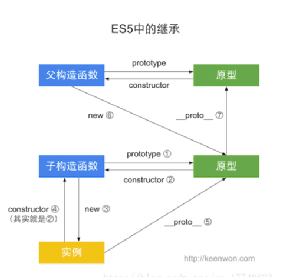

### this
1. `this`是动态决定的，调用函数时，除了传入在函数定义中显式声明的参数之外，同时还传入两个隐式参数:`arguments` 与 `this`
   - 非严格模式下,arguments与函数形参一一映射，严格模式下打破了这种关系

2. 调用函数的方式
   - 函数调用(在非严格模式下，`this`指向全局`window`对象;在严格模式下，`this`指向 `undefined`)
   - 方法调用(`this`通常指向调用的对象，而且是最近的对象)
   - 构造函数(`this`指向新创建的对象)
   -  `apply`与`call`(`this`指向`call`或`apply`的第一个参数)

3. bind
   - bind之后的函数的this无法再被改变

4. 箭头函数
   - 没有`this`,函数体里面的`this`是箭头函数定义时所在对象,不是运行时(this看上一级，若是箭头函数继续上找,作用域是栈内存不是堆内存)
   - 没有arguments,但有...
   - 不能用作构造函数,new调用
   - 不能改变this绑定,即使通过call / apply / bind
   - 形参名称不能重复
   - 没有原型对象
   - 没有自己的super和new.target绑定
   - 不可用yield,因此不能用Generator函数

5. demo
```javascript
const a = {
  a: 'a'
}
const obj = {
  getThis: () => this,
  getThis2 () {
    return this
  }
}
obj.getThis3 = obj.getThis.bind(obj)
obj.getThis4 = obj.getThis2.bind(obj)
const answers = [
  obj.getThis(),
  obj.getThis.call(a),
  obj.getThis2(),
  obj.getThis2.call(a),
  obj.getThis3(),
  obj.getThis3.call(a),
  obj.getThis4(),
  obj.getThis4.call(a)
]
```

6. class中的this
```javascript
class Obj {
  getThis = () => this
  getThis2 () {
    return this
  }
}
const obj2 = new Obj();
obj2.getThis3 = obj2.getThis.bind(obj2)
obj2.getThis4 = obj2.getThis2.bind(obj2)
const answers2 = [
  obj2.getThis(),
  obj2.getThis.call(a),
  obj2.getThis2(),
  obj2.getThis2.call(a),
  obj2.getThis3(),
  obj2.getThis3.call(a),
  obj2.getThis4(),
  obj2.getThis4.call(a)
]
```

### prototype
#### es5


#### es6
```javascript
class A {}
class B extends A {}

console.log(B.__proto__ === A)
console.log(B.prototype.__proto__ === A.prototype)
```

### inherit


