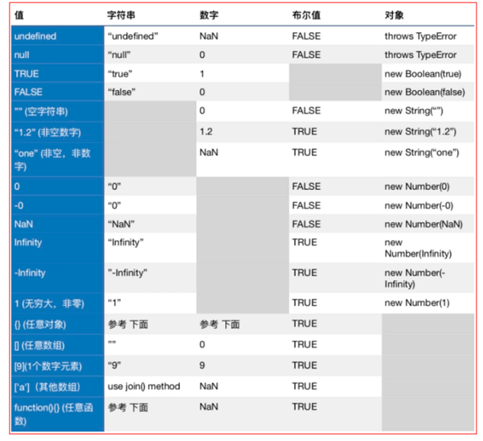

### 数据类型
- Boolean、Null、Undefined、Number、String、Symbol
- Object



### 显示强制类型转换
举个栗子：后台返回值为一个字符串，内容是0 ~ 5的数字，现在使用的时候需要将参数转化为数字类型。
```javascript
// wrong
return Number(value)
// '' -> 0
// undefined -> throw TypeError
// 'aaa' -> NaN

// right 前面是剔除掉 '' undefined ，后面可以剔除掉 NaN 的类型
if (value && Number(value) >= 0) {
    return Number(value);
} else {
    return null;
}
```
#### 浮点数转换成整型
很多人喜欢使用parseInt()，其实parseInt()是用于将字符串转换成数字，而不是浮点数和整型之间的转换，我们应该使用`Math.floor()`或者`Math.round()`

#### 各种类型转换
```javascript
var myVar = '3.1415'
    str = '' + myVar
    i_int = ~ ~myVar
    f_float = 1*myVar
    b_bool = !!myVar
    arr = [myVar]
```

关于值的比较，当我们只关心值是否正常时，还有一个比较靠谱的方法：正则表达式，上面的例子也可以这样来
```javascript
if (/[0-5]/.test(value)) {
    return Number(value);
} else {
    return null;
}
```

**小结：在判断两个值是否相等时，最好显式的转化，让代码更加清晰易读，然后用全等运算符 === 或者 !== 来比较**

### 隐式强制类型转换
#### ToBoolean
- if (..) 语句中的天健判断表达式。
- for (.. ; .. ; ..) 语句中的条件判断表达式。
- while (..) 循环中的条件判断表达式。
- ? : 中的条件判断表达式
- || 和 && 的做操作数
而 switch 语句使用的是全等判断，不会发生隐式的强制转换
[js compare](https://dorey.github.io/JavaScript-Equality-Table/)

### 对象转换为原始值
#### 对象转换为字符串 String(Object)
1. 当对象具有toString()会优先调用；
2. 如果没有toString()方法，或者toString()没有返回一个原始值，则会调用valueOf()方法；
3. 无法从toString()和valueOf()获取原始值的时候，则会抛出一个类型错误异常。
```javascript
String([1,2,3])  // "1,2,3"
String(function(x) {return x+1;})  // "function(x) {return x+1;}"
String("/\d+/g") // "/\d+/g"
String(new Date(2019,4,14)) // "Tue May 14 2019 00:00:00 GMT+0800 (中国标准时间)"
```
#### 对象转换为数字 Number(Object)
1. 当对象具有valueOf()会优先调用；
2. 如果没有valueOf()方法，或者valueOf()没有返回一个原始值，则会调用toString()方法；
3. 无法从toString()和valueOf()获取原始值的时候，则会抛出一个类型错误异常。
```javascript
Number([1,2,3])  // NaN 原始类型
Number(function(x) {return x+1;})  // NaN
Number("/\d+/g") // NaN
Number(new Date(2019,4,14)) // 1557763200000
```

**当判断两个数组是否相等时，可以简单的将其转换为 String 类型进行比较。
当判断两个对象是否相等时，就需要借助 其他工具来完成了[lodash](https://lodash.com/docs/4.17.11#isEqual)
