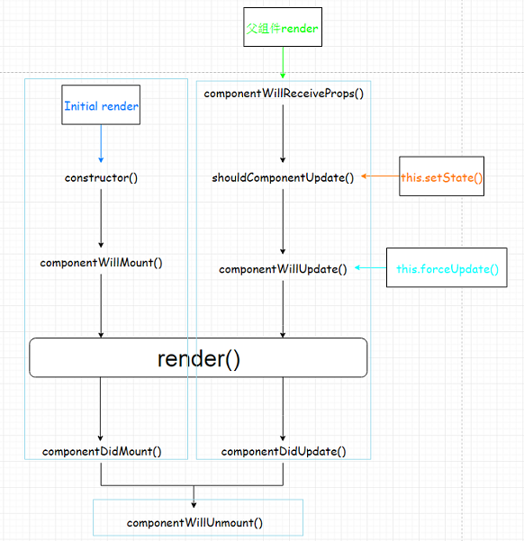

### 基本认识
#### website
1. https://reactjs.org/
2. https://doc.react-china.org/

#### 描述
1. 用于构建用户界面的`JS`库(只关注于View)
2. 由Facebook开源

#### 特点
1. Declarative(声明式编码)
2. Component-Based(组件化编码)
3. Learn Once, Write Anywhere(支持客户端与服务器渲染)
4. 高效
   - 虚拟(virtual)DOM, 不总是直接操作DOM
   - `DOM Diff`算法, 最小化页面重绘
5. 单向数据流

#### hello world
```html
<!DOCTYPE html>
<html lang="en">
<head>
    <meta charset="UTF-8">
    <meta name="viewport" content="width=device-width, initial-scale=1.0">
    <meta http-equiv="X-UA-Compatible" content="ie=edge">
    <title>hello world</title>
</head>
<body>
    <div id="test"></div>
    <script src="https://cdn.bootcss.com/react/16.8.1/umd/react.development.js"></script>
    <script src="https://cdn.bootcss.com/react-dom/16.8.1/umd/react-dom.development.js"></script>
    <script src="https://cdn.bootcss.com/babel-standalone/6.26.0/babel.min.js"></script>

    <!-- babel jsx to js -->
    <script type="text/babel">
        const arrs = ['js', 'vue', 'react']
        // arr convert to tag arr
        const virtualDOM = <ul>
                            {
                                arrs.map((arr, index) => <li key={ index }>{ arr }</li>)
                            }
                        </ul>
        ReactDOM.render(virtualDOM, document.getElementById('test'))
    </script>
</body>
</html>
```

### JSX
1. 全称: JavaScript XML
2. 作用: 用来创建react虚拟DOM(元素)对象
   - var ele = \<h1>Hello JSX!\</h1>
   - 它不是字符串, 也不是HTML/XML标签
   - 它最终产生的就是一个JS对象
3. 标签名任意: HTML标签或其它标签
4. 标签属性任意: HTML标签属性或其它
5. 基本语法规则
    - 遇到`<`开头的代码, 以标签的语法解析: html同名标签转换为html同名元素, 其它标签需要特别解析
    - 遇到以`{`开头的代码，以JS语法解析: 标签中的js代码必须用`{ }`包含

#### 创建virtualDOM的两种方式
1. React.createElement('h1', {id:'123'}, 'ssssss')
2. **jsx** `<h1 id='myTitle'>{title}</h1>`

### 模块
1. 向外提供特定功能的js程序, 一般就是一个js文件
2. 为什么:  js代码更多更复杂
3. 作用: 复用js, 简化js的编写, 提高js运行效率
4. 当应用的js都以模块来编写的, 这个应用就是一个模块化的应用

### 组件
1. 用来实现特定(局部)功能效果的代码集合(html/css/js)
2. 为什么: 一个界面的功能更复杂
3. 作用: 复用编码, 简化项目编码, 提高运行效率

### React面向组件编程

#### 工厂函数组件(简单组件)
```javascript
function MyComponent() {
    return <h2>factory component</h2>
}
ReactDOM.render(<MyComponent/>, document.getElementById('test'))
```

#### ES6 class组件(复杂组件)
```javascript
class MyComponent2 extends React.Component {
    constructor(props) {
        super(props)
    }
    render() {
        console.log(this)
        return <h2>class component</h2>
    }
}
ReactDOM.render(<MyComponent2/>, document.getElementById('test'))
```

> 1 组件名必须首字母大写
>
> 2 虚拟DOM元素只能有一个根元素
>
> 3 虚拟DOM元素必须有结束标签

#### 高阶组件
`const EnhanceComponent = higherOrderComponent(WrapperComponent)`

### 三大属性
#### state
1. state是组件对象最重要的属性, 值是对象(可以包含多个数据)
2. 组件被称为"状态机", 通过更新组件的state来更新对应的页面显示(重新渲染组件)
```javascript
//1)	初始化状态
constructor (props) {
    super(props)
    this.state = {
        stateProp1 : value1,
        stateProp2 : value2
    }
}

//读取某个状态值
this.state.statePropertyName

//更新状态---->组件界面更新
this.setState({
    stateProp1 : value1,
    stateProp2 : value2
})
```
#### props
1. 每个组件对象都会有props(properties的简写)属性
2. 组件标签的所有属性都保存在props中
3. 通过标签属性从组件外向组件内传递变化的数据
4. 注意: 组件内部不要修改props数据
```javascript
//内部读取某个属性值
this.props.propertyName

//对props中的属性值进行类型限制和必要性限制
Person.propTypes = {
    name: React.PropTypes.string.isRequired,
    age: React.PropTypes.number.isRequired
}

//扩展属性: 将对象的所有属性通过props传递
<Person {...person}/>

//默认属性值
Person.defaultProps = {
    name: 'Mary'
}

//组件类的构造函数
constructor (props) {
    super(props)
    console.log(props) // 查看所有属性
}
```

#### ref and event
1. 组件内的标签都可以定义ref属性来标识自己`<input type="text" ref={input => this.msgInput = input}/>`
2. 在组件中可以通过this.msgInput来得到对应的真实DOM元素
3. 通过onXxx属性指定组件的事件处理函数
4. 通过event.target得到发生事件的DOM元素对象
```javascript
<input onFocus={this.handleClick}/>
handleFocus(event) {
    event.target  //返回input对象
}
```

### 功能界面的组件化编码流程
1. 拆分组件: 拆分界面,抽取组件
2. 实现静态组件: 使用组件实现静态页面效果
3. 实现动态组件
    - 动态显示初始化数据
    - 交互功能(从绑定事件监听开始)

### 收集表单数据
- 受控组件: 表单项输入数据能自动收集成状态，表单元素状态由使用者维护
- 非受控组件: 需要时才手动读取表单输入框中的数据，表单元素状态DOM自身维护

### 组件生命周期



#### 生命周期流程:
- 第一次初始化渲染显示: ReactDOM.render()
  - constructor(props): 创建对象初始化state(可选)
  - componentWillMount() : 将要插入回调
  - render() : 用于插入虚拟DOM回调
  - componentDidMount() : 已经插入回调
    - 在这里进行 Ajax 调用
    - 如果你需要事件监听器，订阅等功能，可以在此处添加
    - 你可以在这里使用 setState（但是它会使组件重新渲染）
- 每次更新state: this.setSate()
  - componentWillUpdate() : 将要更新回调
  - render() : 更新(重新渲染)
  - componentDidUpdate(prevProps, prevState, snapshot): 已经更新回调
    - 在组件刚刚更新完毕时执行（在开始渲染时不会）
    - 有三个可选的参数（以前的props，以前的 state 和只有在你的组件实现 getSnapshotBeforeUpdate 时才会出现的快照 ）
    - 仅当shouldComponentUpdate返回true时才会执行
    - If you use setState here, you should guard it or you will land in an infinite loop
    - shouldComponentUpdate(nextProps, nextState)
      - 仅用于性能优化
      - 如果返回 false，则不会调用渲染器(如果重写的SCO只是对props/state的浅层比较，可以使用PureComponent)
    - getSnapshotBeforeUpdate()
      - 可用于保存一些与当前 DOM 有关的信息，例如当前的滚动位置，稍后可在 componentDidUpdate 中重用，用来恢复滚动的位置
- 移除组件: ReactDOM.unmountComponentAtNode(containerDom)
  - componentWillUnmount() : 组件将要被移除回调
    - 清除所有仍在进行的东西(Ajax应该被中断，取消订阅，清除定时器等等)
- componentDidCatch(error, info)
  - 应该记录日志错误的地方
  - 可以调用 setState，但在以后的版本中，将会在静态方法getDerivedStateFromError(error) 中被删除，它将通过返回一个值来更新状态
- static getDerivedStateFromError(error)
  - 此处提供错误信息
  - 应返回一个对象值，该值将会更新可用于处理错误的状态（通过显示内容）
  - 由于它是静态的，因此无法访问组件实例本身
- static getSnapshotBeforeUpdate(props, state)
  - 应该在props随时间变化的情况下使用 —— 例如根据React docs，它可能用于转换组件
  - 由于它是静态的，因此无法访问组件实例本身


#### 重要的勾子
- render(): 初始化渲染或更新渲染调用
- componentDidMount(): 开启监听, 发送ajax请求
- componentWillUnmount(): 做一些收尾工作, 如: 清理定时器
- componentWillReceiveProps(): 父子钩子

### DOM Diff


### create-react-app(react + webpack + es6 + eslint)
```
npm install -g create-react-app
create-react-app hello-react
cd hello-react
npm start
```


### react ajax
- jQuery: 比较重, 如果需要另外引入不建议使用
- axios: 轻量级, 建议使用
    - 封装XmlHttpRequest对象的ajax
    - promise风格
    - 可以用在浏览器端和node服务器端
```javascript
axios.get('/user?ID=12345')
  .then(function (response) {
    console.log(response);
  })
  .catch(function (error) {
    console.log(error);
  });

axios.get('/user', {
    params: {
      ID: 12345
    }
  })
  .then(function (response) {
    console.log(response);
  })
  .catch(function (error) {
    console.log(error);
  });

axios.post('/user', {
    firstName: 'Fred',
    lastName: 'Flintstone'
})
.then(function (response) {
  console.log(response);
})
.catch(function (error) {
  console.log(error);
});

```
- fetch: 原生函数, 但老版本浏览器不支持
    - 不再使用XmlHttpRequest对象提交ajax请求
    - 为了兼容低版本的浏览器, 可以引入兼容库fetch.js
```javascript
fetch(url).then(function(response) {
  return response.json()
}).then(function(data) {
  console.log(data)
}).catch(function(e) {
  console.log(e)
});


fetch(url, {
  method: "POST",
  body: JSON.stringify(data),
}).then(function(data) {
  console.log(data)
}).catch(function(e) {
  console.log(e)
})
```

### 组件间通信
1. props
    - 共同的数据放在父组件上, 特有的数据放在自己组件内部(state)
    - 通过props可以传递一般数据和函数数据, 只能一层一层传递
    - 一般数据-->父组件传递数据给子组件-->子组件读取数据
    - 函数数据-->父组件传递数据给子组件-->子组件调用函数
2. 使用消息订阅(subscribe)-发布(publish)机制`PubSubJS`
```javascript
import PubSub from 'pubsub-js' //引入
PubSub.subscribe('delete', function(data){ }); //订阅
PubSub.publish('delete', data) //发布消息
```
3. redux

### react-router4
#### concept
1. react的一个插件库
2. 专门用来实现一个SPA应用
3. 基于react的项目基本都会用到此库

#### SPA
1. 单页Web应用（single page web application，SPA）
2. 整个应用只有一个完整的页面
3. 点击页面中的链接不会刷新页面, 本身也不会向服务器发请求
4. 当点击路由链接时, 只会做页面的局部更新
5. 数据都需要通过ajax请求获取, 并在前端异步展现

#### 路由
1. 一个路由就是一个映射关系(key:value), key为路由路径, value可能是function/component
2. 后台路由: node服务器端路由, value是function, 用来处理客户端提交的请求并返回一个响应数据,注册路由: router.get(path, function(req, res)),当node接收到一个请求时, 根据请求路径找到匹配的路由, 调用路由中的函数来处理请求, 返回响应数据
3. 前台路由: 浏览器端路由, value是component, 当请求的是路由path时, 浏览器端前没有发送http请求, 但界面会更新显示对应的组件,注册路由: \<Route path="/about" component={About}>,当浏览器的hash变为#about时, 当前路由组件就会变为About组件

#### 前端路由的实现
1. [history库](https://github.com/ReactTraining/history)
2. history API
    - History.createBrowserHistory(): 得到封装window.history的管理对象
    - History.createHashHistory(): 得到封装window.location.hash的管理对象
    - history.push(): 添加一个新的历史记录
    - history.replace(): 用一个新的历史记录替换当前的记录
    - history.goBack(): 回退到上一个历史记录
    - history.goForword(): 前进到下一个历史记录
    - history.listen(function(location){}): 监视历史记录的变化

#### react-router相关API
##### 组件
- <BrowserRouter>
- <HashRouter>
- <Route>
- <Redirect>
- <Link>
- <NavLink>
- <Switch>
- history对象
- match对象
- withRouter函数

##### 使用
##### 嵌套路由
##### 传递参数
##### 路由跳转方式

### react-ui
1. [material-ui](https://v0.material-ui.com/)
2. ant-design
    - https://ant.design/index-cn
    - https://mobile.ant.design/index-cn

### redux
1. https://redux.js.org/
2. http://www.redux.org.cn/
3. redux是一个独立专门用于做状态管理的JS库(不是react插件库),它可以用在react, angular, vue等项目中, 但基本与react配合使用
4. 作用: 集中式管理react应用中多个组件共享的状态

#### 流程图


1. action
```
1)	标识要执行行为的对象
2)	包含2个方面的属性
a.	type: 标识属性, 值为字符串, 唯一, 必要属性
b.	xxx: 数据属性, 值类型任意, 可选属性
3)	例子:
		const action = {
			type: 'INCREMENT',
			data: 2
		}
4)	Action Creator(创建Action的工厂函数)
		const increment = (number) => ({type: 'INCREMENT', data: number})
```
2. reducer
```
1)	根据老的state和action, 产生新的state的纯函数
2)	样例
		export default function counter(state = 0, action) {
		  switch (action.type) {
		    case 'INCREMENT':
		      return state + action.data
		    case 'DECREMENT':
		      return state - action.data
		    default:
		      return state
		  }
		}
3)	注意
a.	返回一个新的状态
b.	不要修改原来的状态
```

3. store
```
1)	将state,action与reducer联系在一起的对象
2)	如何得到此对象?
		import {createStore} from 'redux'
		import reducer from './reducers'
		const store = createStore(reducer)
3)	此对象的功能?
		getState(): 得到state
		dispatch(action): 分发action, 触发reducer调用, 产生新的state
		subscribe(listener): 注册监听, 当产生了新的state时, 自动调用
```

#### 什么情况下需要使用redux
1. 总体原则: 能不用就不用, 如果不用比较吃力才考虑使用
2. 某个组件的状态，需要共享
3. 某个状态需要在任何地方都可以拿到
4. 一个组件需要改变全局状态
5. 一个组件需要改变另一个组件的状态

#### redux的核心API
1. createStore() 创建包含指定reducer的store对象
```javascript
import {createStore} from 'redux'
import counter from './reducers/counter'
const store = createStore(counter)
```

2. store对象(redux库最核心的管理对象)
    - 它内部维护着state / reducer
    - getState() / dispatch(action) / subscribe(listener)

```javascript
store.getState()
store.dispatch({type:'INCREMENT', number})
store.subscribe(render)
```

3. applyMiddleware()(应用上基于redux的中间件(插件库))
```javascript
import {createStore, applyMiddleware} from 'redux'
import thunk from 'redux-thunk'  // redux异步中间件
const store = createStore(
  counter,
  applyMiddleware(thunk) // 应用上异步中间件
)
```

4. combineReducers()(合并多个reducer函数)
```javascript
export default combineReducers({
  user,
  chatUser,
  chat
})
```

### react-redux
1. 一个react插件库
2. 专门用来简化react应用中使用redux(解耦)

#### React-Redux将所有组件分成两大类
- UI组件
    - 只负责 UI 的呈现，不带有任何业务逻辑
    - 通过props接收数据(一般数据和函数)
    - 不使用任何 Redux 的 API
    - 一般保存在components文件夹下
- 容器组件
    - 负责管理数据和业务逻辑，不负责UI的呈现
    - 使用 Redux 的 API
    - 一般保存在containers文件夹下

#### API
- Provider
```
让所有组件都可以得到state数据
<Provider store={store}>
    <App />
</Provider>
```
- connect()
```
用于包装UI组件生成容器组件
import { connect } from 'react-redux'
  connect(
    mapStateToprops,
    mapDispatchToProps
  )(Counter)
```
- mapStateToprops()
```
将外部的数据（即state对象）转换为UI组件的标签属性
  const mapStateToprops = function (state) {
   return {
     value: state
   }
  }
```
- mapDispatchToProps()
```
将分发action的函数转换为UI组件的标签属性
简洁语法可以直接指定为actions对象或包含多个action方法的对象
```

###  redux异步编程(默认不支持)
- npm install --save redux-thunk


