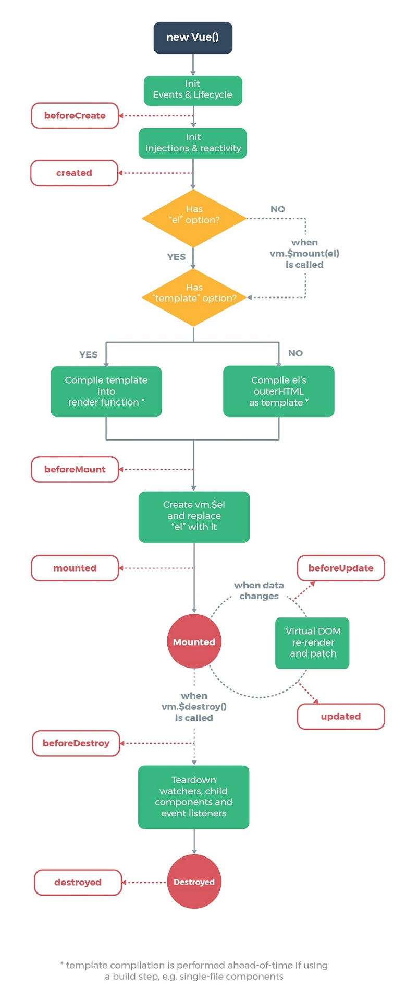

### 1.vue属性

- el
- template
- methods
- data
- components
- filters
- watch -> singel
- computed -> mutiple
  - `computed` 是计算一个新的属性，并将该属性挂载到 vm（Vue 实例）上，而 `watch` 是监听已经存在且已挂载到 `vm` 上的数据，所以用 `watch` 同样可以监听 `computed` 计算属性的变化（其它还有 `data`、`props`）
  - `computed` 本质是一个惰性求值的观察者，具有缓存性，只有当依赖变化后，第一次访问  `computed`  属性，才会计算新的值，而 `watch` 则是当数据发生变化便会调用执行函数
  - 从使用场景上说，`computed` 适用一个数据被多个数据影响，而 `watch` 适用一个数据影响多个数据

### 2.插值表达式

- 对象
- 字符串
- 判断后的布尔值
- 三元

### 3.指令

- v-xxx
- v-bind    ：
- v-on       @
- v-model

### 4.过滤器filter

### 5.组建component

### 6.slot（默认 | 具名）

### 7.获取DOM

- \$el   \$root  \$parent
- \$refs  获取组建内的元素 (eg: focus)

### 8.生命周期


### 9.路由

- onhashchange  (#xxx)

- router.addRoutes 比构造函数配置更灵活

- $route  只读

- $router  只写

- 嵌套路由

- 路由meta元数据-->meta是对于路由规则是否需要权限验证的配置

  - 路由对象中和name属性同级 { meta: {isChecked.true}}

- 路由钩子--> 权限控制的函数执行时期
  - 每次路由匹配后,渲染组建到router-view之前
  - router.beforeEach(function(to, from, next){ })

- 编程导航
  - this.$router.push({ name:'xxx', query:{id:1}, para,s:{name:'abc'}})
  - 配置规则 {name:'xxx', path:'/xxx/:name'}
  - this.$router.go(-1|1)

- 多视图

- axios
  - 属性
  - 拦截器

- Webpack

  - package.json

    ```
    "script": {
        "dev": "webpack ./main.js ./build.js --watch"
    }
    ```

  - webpack.config.js

    ```
    //webpack.config.js
      const HtmlWebpacjPlugin = requiew('html-webpack-plugin'); //install first
      module.exports = {
          entry
          output
          module: {
              //属性名后面版本roles
              loaders: [
                  {
                      test: /\.css$/,
                      //顺序相反的
                      loader: 'style-loader!css-loader'
                  },
                  {
                      test: /\.(jpg|png|gif|svg)$/,
                      //?后面加属性
                      //若图片大于limit 生成文件
                      //若图片小于生成base64,会有30%增大
                      //建议比较小的图片用base64
                      loader: 'url-loader?limit=4096'
                  },
                  {
                      test: /\.less$/,
                      loader: 'style-loader!css-loader!less-loader'
                  },
                   {
                      test: /\.js$/,
                      loader: 'babel-loader',
                      exclude: /node_modules/,
                      options: {
                          presets: ['env'], //处理关键字
                          plugins: ['transform-runtime'] //处理函数
                      }
                  },
                  {
                      test: /\.vue$/,
                      loader: 'vue-loader'
                  }
              ]
          },
          plugins: [
              new HtmlWebpacjPlugin({
                  template:''  //参照物
              })
          ]
      }
      import './xxx.css'
      import xxx from './xxx.js'
      import img from './xxx.jpg'
    ```

  - package.json

    ```
    "script": {
    	//--open --hot --inline --port
    	"dev": "webpack-dev-server --open --config ./webpack.dev.config.js"
        "dev": "webpack --config ./webpack.dev.config.js"
        "prod": "webpack --config ./webpack.prod.config.js"
    }
    ```

  - webpack-dev-server  babel-core babel-loader babel-preset-env  babel-plugin-transform-runtime

  - 开发恢复  npm i

  - 生产恢复  npm i --production