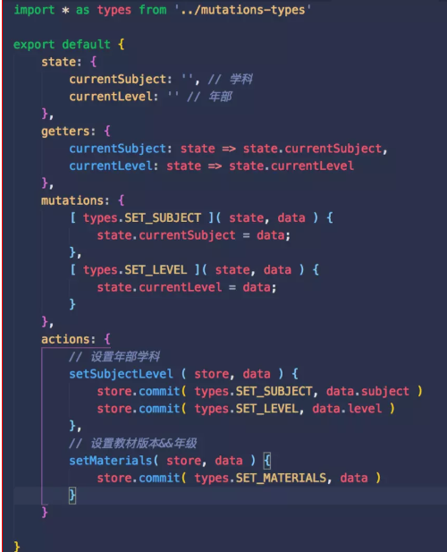

### 组件间通信基本原则
1. 不要在子组件中直接修改父组件的状态数据
2. 数据在哪, 更新数据的行为(函数)就定义在哪

### vue组件间通信方式
#### 1 props/$emit
```vue
//父组件
<AddComment :addComment="addComment"/>
//子组件
this.$emit('addComment', comment)
```
> 1. 父组件传递数据时类似在标签中写了一个属性，如果是传递的数据是data中的自然是要在传递属性前加v-bind:，如果传递的是一个已知的固定值呢
>     1. 字符串是静态的可直接传入无需在属性前加v-bind
>     2. 数字，布尔，对象，数组，因为这些是js表达式而不是字符串，所以即使这些传递的是静态的也需要加v-bind，把数据放到data中引用
> 2. 如果prop传到子组件中的数据是一个对象的话，要注意传递的是一个对象引用，虽然父子组件看似是分离的但最后都是在同一对象下
>     1. 如果prop传到子组件的值只是作为初始值使用，且在父组件中不会变化则赋值到data中使用
>     2. 如果传到子组件的prop的数据在父组件会被改变的，放到计算属性中监听变化使用。因为如果传递的是个对象的话，只改变下面的某个属性子组件中是不会响应式更新的，如果子组件需要在数据变化时响应式更新那只能放到computed中或者用watch深拷贝deep:true才能监听到变化
>     3. 当然如果你又需要在子组件中通过prop传递数据的变化做些操作，那么写在computed中会报警告，因为计算属性中不推荐有任何数据的改变，最好只进行计算。如果你非要进行数据的操作那么可以把监听写在watch（注意deep深拷贝）或者使用computed的get和set
>     4. 但问题又来了，如果你传进来的是个对象，同时你又需要在子组件中操作传进来的这个数据，那么在父组件中的这个数据也会改变，因为你传递的只是个引用， 即使你把prop的数据复制到data中也是一样的，无论如何赋值都是引用的赋值，你只能对对象做深拷贝创建一个副本才能继续操作，你可以用JSON的方法先转化字符串在转成对象更方便一点
>     5. 所以在父子传递数据时要先考虑好数据要如何使用，否则你会遇到很多问题或子组件中修改了父组件中的数据，这是很隐蔽并且很危险的

##### 父组件传递函数(原则数据在哪,操作在哪),可以一层一层传，子组件直接调用

```vue
<AddComment :addComment="addComment"/>
```
##### ref + 钩子函数

```javascript
//父组件
<AddComment ref="header"/>

mounted() {
    this.$refs.header.$on('addComment', this.addComment)
}
//子组件
this.$emit('addComment', comment)
```
##### slot传标签(父传子,相关的js代码父组件直接定义好)

```vue
//父组件，相关属性和方法从子组件定义到父组件
<TodoFooter>
  <input type="checkbox" v-model="checkAll" slot="checkAll"/>
  <span slot="size">已完成{{completeSize}} / 全部{{todos.length}}</span>
  <button class="btn btn-danger" v-show="completeSize" @click="deleteAllCompleted" slot="delete">清除已完成任务</button>
</TodoFooter>

//子组件
<div class="todo-footer">
  <label>
    <!--<input type="checkbox" v-model="checkAll"/>-->
    <slot name="checkAll"></slot>
  </label>

  <span>
    <slot name="size"></slot>
    <!-- <span>已完成{{completeSize}} / 全部{{todos.length}}</span>-->
  </span>

  <slot name="delete"></slot>
  <!-- <button class="btn btn-danger" v-show="completeSize" @click="deleteAllCompleted">清除已完成任务</button>-->
</div>
```
#### 2 event bus

```javascript
//bus.js
import Vue from 'vue'
export default new Vue
```

```javascript
import Bus from './bus.js'
export default {
    methods: {
        bus () {
            Bus.$emit('msg', '我要传给兄弟组件们')
        }
    }
}
```

```javascript
import Bus from './bus.js'
export default {
    mounted() {
        Bus.$on('msg', (e) => {
            console.log(e)
        })
        }
    }
```

#### 3 pubsub-js(发布订阅)

```javascript
//订阅组件
import PubSub from 'pubsub-js'
PubSub.subscribe('deleteItem', (msg, index) => {
  this.deleteComment(index)
})
//发布组件
import PubSub from 'pubsub-js'
PubSub.publish('deleteItem', index);
```

#### 4 provide / inject

```javascript
Vue.component('child',{
    inject:['for'],//得到父组件传递过来的数据
    data(){
        return {
            mymessage:this.for
        }
    },
    template:`
        <div>
        <input type="tet" v-model="mymessage">
        </div>`
})

Vue.component('parent',{
    template:`
        <div>
        <p>this is parent compoent!</p>
        <child></child>
        </div>
        `,
    provide:{
        for:'test'
    },
    data(){
        return {
            message:'hello'
        }
    }
})

var app=new Vue({
    el:'#app',
    template:`
        <div>
        <parent></parent>
        </div>
        `
})
```
> 1 provide 选项应该是一个对象或返回一个对象的函数。该对象包含可注入其子孙的属性
>
> 2 provide 和 inject 绑定并不是可响应的。这是刻意为之的。然而，如果你传入了一个可监听的对象，那么其对象的属性还是可响应的

#### 5 $attrs(inheritAttrs)、 \$listeners

> \$attrs包含了父作用域中不作为props被识别 (且获取) 的特性绑定(class 和 style 除外)。当一个组件没有声明任 props时，这里会包含所有父作用域的绑定(class 和 style除外)，并且可以通过v-bind="$attrs"传入内部组件 —— 在创建高级别的组件时非常有用
>
> \$listeners包含了父作用域中的(不含 .native 修饰器的)v-on事件监听器。它可以通过 v-on="$listeners"传入内部组件 —— 在创建更高层次的组件时非常有用
```javascript
// 祖先组件
// 在祖先组件中直接传入output和input
<template>
  <div>
    <child1 :output="output" :input="input"></child1>
  </div>
</template>
<script>
import child1 from './child1.vue'
export default {
  components: {
    child1
  },
  data () {
    return {
      input: 'jijijijjijiji',
      output: {
        name: '王文健',
        age: '18'
      }
    }
  }
</script>
```

```javascript
//子組件
<template>
  <div
    <h1>{{input}}</h1>
    <child2 :child="child" v-bind='$attrs'></child2>
  </div>
</template>
<script>
import child2 from './child2.vue'
export default {
  components: {
    child2
  },
  props: {
    input: [String]
  },
  data () {
    return {
      child: 'child1child1child1child1s'
    }
  },
// 默认为true，如果传入的属性子组件没有prop接受，就会以字符串的形式出现为标签属性
// 设为false，在dom中就看不到这些属性，试一下就知道了
  inheritAttrs: false,
  created () {
    // 在子组件中打印的$attrs就是父组件传入的值，刨去style,class,和子组件中已props的属性
    console.log(this.$attrs)  // 打印output
  }
}
</script>
```

```javascript
//孙组件
<template>
  <div>
    {{$attrs.output.name}}
  </div>
</template>
<script>
export default {
  created () {
    // 打印output和child
    console.log(this.$attrs)
  }
}
</script>
```

#### 6 \$children、\$parent、$root

```javascript
this.$parent.$parent
this.$children[index].$children[index]
```

#### 7 $refs

> 父组件需要子组件的一个数据但子组件并不知道或者说没有能力在父组件想要的时候给父组件，那么这个时候就要用ref
>
> 1. 父组件在标签中定义ref属性，在js中直接调用this.$refs.editor就是调用整个子组件，子组件的所有内容都能通过ref去调用，当然我们并不推荐因为这会使数据看起来非常混乱
> 2. 所以我们可以在子组件中定义一种专供父组件调用的函数，，比如我们在这个函数中返回子组件data中某个数据,当父组件想要获取这个数据就直接主动调用ref执行这个函数获取这个数据,这样能适应很大一部分场景，逻辑也更清晰一点
> 3. 另外，父向子传递数据也可以用ref，有次需要在一个父组件中大量调用同一个子组件，而每次调用传递的prop数据都不同，并且传递数据会根据之后操作变化，这样我需要在data中定义大量相关数据并改变它，我可以直接用ref调用子组件函数直接把数据以参数的形式传给子组件，逻辑一下子清晰了
> 4. 如果调用基础组件可以在父组件中调用ref执行基础组件中暴露的各种功能接口，比如显示，消失等


#### 8 Vuex

1. vuex分模块：项目不同模块间维护各自的vuex数据
2. 限制调用：只允许action操作数据，getters获取数据，使用mapGetters，mapActions等辅助函数调用数据




#### 9 localStorage，sessionStorage，cooikes

#### 10 通过共同的父级页面转换成父子通信
