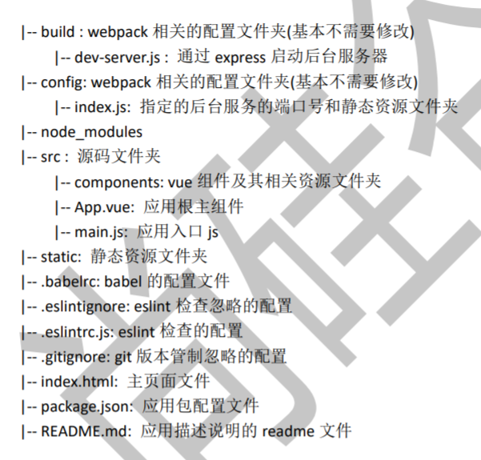

### get started(vue-cli 3.x)
1. npm i -g @vue/cli
2. vue create xxxx or  vue ui
3. cd xxxx 
4. npm run serve
5. add plugins(`vue add router、vue add vuex`)



### 打包发布
1. 静态服务器
```
npm install -g serve
# -s 参数的意思是将其架设在 Single-Page Application 模式下
# 这个模式会处理即将提到的路由问题
serve -s dist
```

2. 动态服务器like tomcat
```
//webpack.prod.config.js
output: {
    publickPath: 'xxx'
}
//修改dist为打包文件夹名
//copy到tomcat下
//visit
```

### vue-cli中一些webpack的配置
1. autoOpenBrowser
2. change port
3. npm run build --report
4. proxyTable
    ```
    proxyTable: {
        '/api/**': {    //'/api' 只代理 /api url下的请求
            target: 'http://www.xxx.com', // 后台服务器的地址
            secure: false,      // 如果是https接口，需要配置这个参数
            changeOrigin: true,     // 如果接口跨域，需要进行这个参数配置
        }
    }
    ```
5. 配置组件里面的路径
    ```
    resolve: {
        extensions: ['.js', '.vue', '.json'],
        alias: {
            '@': resolve('src'),
            'common': resolve('src/common'),
            'components':  resolve('src/components'),
            'base': resolve('src/base'),
            'api': resolve('src/api')
        }
    }
    ```
    在组建里面使用就不用使用相对路径一直向上找了
    ```javascript
    import Scroll from 'base/scroll/scroll';
    import {prefixStyle} from 'common/js/dom'；
    import {getRecommend, getDiscList} from 'api/recommend'
    ```

6. 处理打包上线后生成的js和css文件加载404 `index.js   assetsPublicPath: './',`
7. 去掉打包后生成的map文件  `productionSourceMap: false`


### vue-cli debug
- Install Chrome、Debugger for chrome extension of vs-code、vue-cli 

- Update your webpack configuration

  1. Vue CLI 2.X    `config/index.js`  -->  devtool: 'source-map',

  2. Vue CLI 3.X

  - The `devtool` property needs to be set inside `vue.config.js`. Create the file in your project's root directory if it doesn't already exist

    ```
    module.exports = {
      configureWebpack: {
        devtool: 'source-map'
      }
    }
    ```

- Configure launch.json File

  ```
  { 
  	"version": "0.2.0", 
  	"configurations": [ 
  		{ 
  			"type": "chrome", 
  			"request": "launch", 
  			"name": "vuejs: chrome", 
  			"url": "http://localhost:8080", 
  			"webRoot": "${workspaceFolder}/src", 
  			"breakOnLoad": true, 
  			"sourceMapPathOverrides": { 
  				"webpack:///src/*": "${webRoot}/*" 
  			} 
  		 } 
  	] 
  }
  ```


