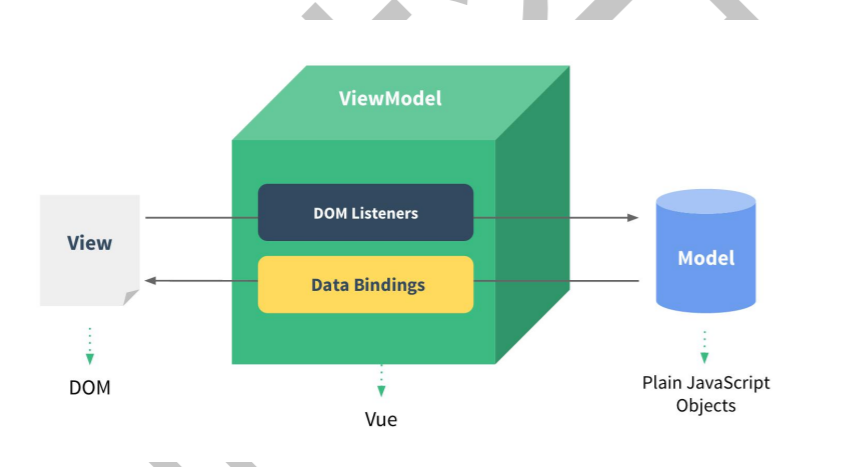
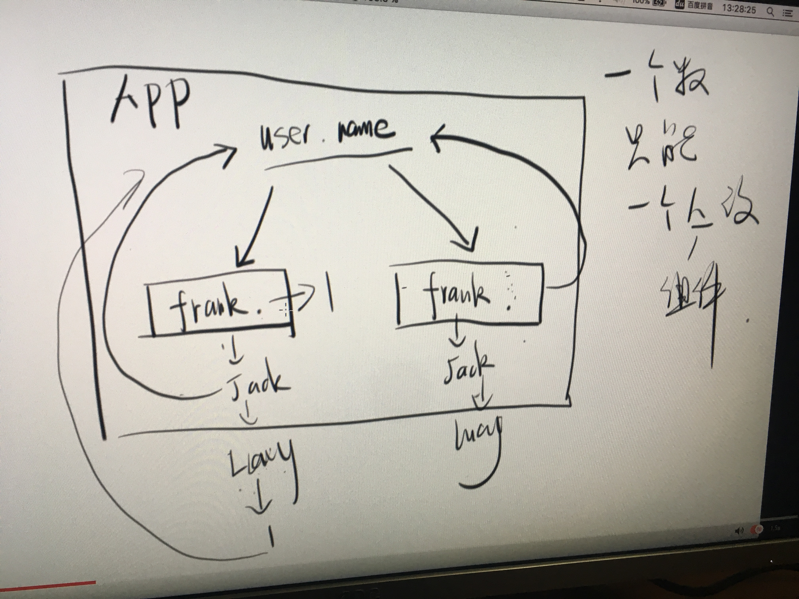

### 渐进式
Vue一个大特点就是**渐进式**,意思就是你可以渐渐地用Vue,而React几乎做不到这一点

动态构建用户界面
1. 你可以继续操作DOM
2. 你可以很方便地做SEO
3. 你可以局部做单页面
4. 你可以整体做单页面



### feature
1. 遵循MVVM
2. 编码简洁,体积小,运行效率高,适合PC/移动端开发
3. 本身只关注UI,可以轻松的引入Vue插件或其他第三方库

### compare
1. 借鉴Augular的**模板**和**数据绑定**
2. 借鉴React**组件化**和**虚拟DOM**

### technology stack
- vue-cli
- axios
- vue-router
- Vuex
- vue-lazyload
- vue-scroll
- nprogress
- ...

### grammar
#### vue属性
- el
- data
- template
- methods
- components
- filters
- watch -> singel data
- computed -> mutiple data
  - `computed`是计算一个新的属性,并将该属性挂载到vm上,而`watch`是监听已经存在且已挂载到`vm`上的数据, 计算属性不需要在data里面提前define,watch需要,所以用`watch`同样可以监听`computed`计算属性的变化(其它还有 `data`、`props`)
  - `computed`本质是一个惰性求值的观察者,具有缓存性,只有当依赖变化后,第一次访问`computed`属性,才会计算新的值,而`watch`则是当数据发生变化便会调用执行函数
  - 从使用场景上说,`computed`适用一个数据被多个数据影响,而`watch`适用一个数据影响多个数据,`watch`适合异步或开销大的场景
  - `methods`没有缓存
  - `computed`不可传参,`methods`可以
  - `computed`的`getter` 、`setter`
- `class` and `style`
  - `<p :class="aClass">xxx是字符串</p>`
  - `<p :class="{aClass: isA, bClass: isB}">xxx是对象</p>`
  - `<p :class="classObject">xxx是对象</p>`
  - `<p :class="['bClass', 'cClass']">xxx是数组</p>`
  - `<p :style="{ color: activeColor, fontSize: fontSize + 'px' }">test style</p>只能驼峰式写法`
  - `<p :style="styleObject">test style2</p>`
  - `<p :style="[baseStyles, overridingStyles]">test style2</p>`

#### 访问vue实例属性
- `$el、$options`
- `$attrs、$listeners`
- `$root、$children、$parent`
- `$ref`
- `$scopedSlots、$slots`

#### 插值表达式
- 对象
- 字符串
- 判断后的布尔值
- 三元

#### directive
- v-once、v-cloak、v-model
- v-for、v-if、v-show
- v-text、v-html
- v-slot、v-pre
- v-bind ==> :
- v-on   ==> @
- 自定义指令
  - hooks
    - bind 指令第一次绑定到元素时调用，只执行一次，可用于一次性初始化设置
    - inserted 元素插入父节点时调用
    - update 所有VNode更新时调用，可能发生在子VNode之前
    - componentUpdated 指令所在组件在VNode和其子VNode更新后调用
    - unbind 指令与元素解绑时调用
  - 参数
    - el 指令绑定元素，可操作DOM
    - binding 指令描述对象
    - vnode Vue生成的虚拟节点
    - oldVnode 上一个Vnode，仅在update和componentUpdated中使用

#### event
- 事件修饰符`stop、prevent、self、once、capture、passive`
- 按键修饰符`enter、tab、delete、esc、space、up、down、left、right`
- 系统修饰符`ctrl、alt、shift、exact、meta`
- 鼠标修饰符`left、right、middle`
- 自定义事件

#### v-slot(2.6+)

```javascript
<template v-slot:default>
  <p>A paragraph for the main content.</p>
  <p>And another one.</p>
</template>

//作用域插槽
<current-user>
  <template v-slot:default="slotProps">
    {{ slotProps.user.firstName }}
  </template>

  <template v-slot:other="otherSlotProps">
    ...
  </template>
</current-user>

//解构
<current-user v-slot="{ user }">
  {{ user.firstName }}
</current-user>


//具名插槽简
<current-user #default="{ user }">
  {{ user.firstName }}
</current-user>
```

#### 表单输入绑定
- 基础用法
- 值绑定
- 表单事件修饰符`v-model:lazy、v-model:number、v-model:trim`
> v-model (语法糖)
> 1. 实质 -> <input :value="user.name" @input="user.name = $event">
> 2. 单向绑定优点
>
>    数据拥有者清楚地知道数据变化的原因和时机(因为是它自己操作数据的)
>
>    数据拥有者可以阻止数据变化
>
>    这些都是在双向绑定中很难做到的



#### filter(global / local)
- `{{ msg | filter }}`
- `<div v-bind="msg | filter"></div>`

#### component(global / local)
- Vue.component
  - 全局定义: 命名不能重复
  - 字符串模板无法高亮
  - 不支持CSS
  - 没有构建步骤(babel,预处理器等)

#### 获取DOM

- \$el、\$root、\$parent
- \$refs  获取组建内的元素 (eg: focus)

### 组件
- 属性
  - 自定义
  - html属性自动挂载 //可以设置inheritAttrs = false关闭
  - 特殊class / style / ref / key / props
- 事件
- 插槽(普通/作用域)
```javascript
Vue.component(‘componentName',{
  props:[‘p1’,’p2’],
  template: ‘<li>{{ p1 }}</li>'
})
```
#### [生命周期](./lifecycle.md)
- `beforeCreate/created、beforeMount/mounted、beforeUpdate/updated、beforeDestory/destoryed`
- `activated/deactivated、errorCaptured`
#### [组件通信](./component-communicate.md)

### 动画
- transition
  - js hook
  - duration
  - 自定义过渡的类名