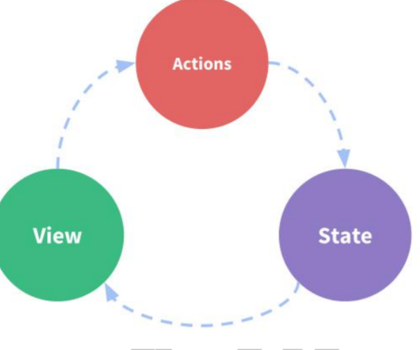
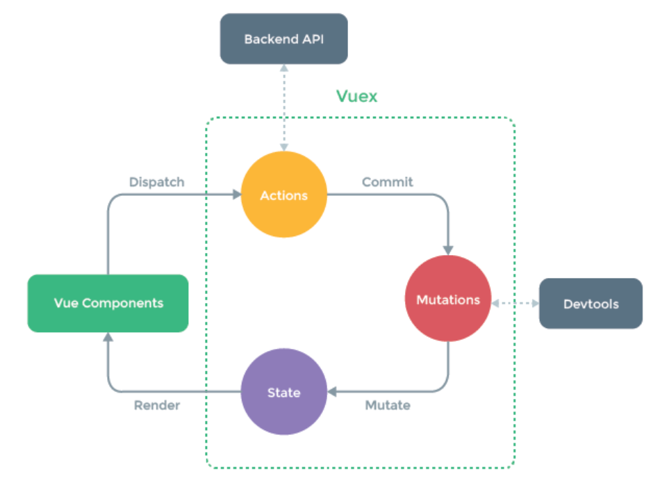

Vuex  (state、getter、mutation、action、module)

>1 引入Vuex
>
>2 安装插件
>
>3 创建store
>
>4 配置store里面的数据
>
>5 将store对象关联vue实例   //不要直接this.$store.state.xxx改数据!!!
>
>6 mutation(修改同步state),action进行异步操作,在mutation里面dispatch然后action异步操作后commit
>
>7 抽取module

#### vuex 是什么
简单来说: 对`vue`应用中多个组件的共享状态进行集中式的管理(读/写)

#### 状态自管理应
- state: 驱动应用的数据
- view: 以声明方式将state
- actions: 响应在view上的用户输入导致的状态变化(包含n个更新状态的方法)


#### 多组件共享状态的问题
1. 多个视图依赖于同一状态
2. 来自不同视图的行为需要变更同一状态
3. 以前的解决办法,vuex就是用来解决这个问题的
   - 将数据以及操作数据的行为都定义在父组件
   - 将数据以及操作数据的行为传递给需要的各个子组件(有可能需要多级传递)



#### state
vuex 管理的状态对象
```javascript
const state = {
    xxx: initValue
}
this.$store.state.xxx //取值 ----mapState
```

#### mutations
- 包含多个直接更新`state`的方法(回调函数)的对象
- 谁来触发: `action`中的 commit('mutation 名称')
- 只能包含同步的代码, 不能写异步代码
```javascript
const mutations = {
    yyy (state, {data1}) {
        // 更新 state 的某个属性
    }
}
this.$store.commit('xxx') //赋值----mapMutations
```
#### actions
- 包含多个事件回调函数的对象
- 通过执行: commit()来触发`mutation`的调用, 间接更新state
- 谁来触发: 组件中: $store.dispatch('action 名称', data1) // 'zzz' 4) 可以包含异步代码(定时器, ajax)
```javascript
const actions = {
    zzz ({commit, state}, data1) {
        commit('yyy', {data1})
    }
}
this.$store.dispatch('xxx')//赋值----mapActions
```

#### getters
- 包含多个计算属性(get)的对象
- 组件中读取: $store.getters.xxx
```javascript
const getters = {
    mmm (state) {
        return ...
    }
}
this.$store.getters.xxx //取值----mapGetters
```

#### modules
- 包含多个module
- 一个module是一个store的配置对象
- 与一个组件(包含有共享数据)对应

#### 向外暴露 store 对象
```javascript
export default new Vuex.Store({
    state,
    mutations,
    actions,
    getters
})
```
#### 组件中
```javascript
import { mapState, mapMutations, mapGetters, mapActions } from 'vuex'
export default {
	computed: {
		...mapState(["count"]),
		...mapGetters(["count"])
	}
    methods: {
		...mapMutations(['add','reduce']),
		...mapActions(['addAction','reduceAction'])
	},
}
{{xxx}} {{mmm}} @click="zzz(data)"
```

#### store 对象
- 所有用vuex管理的组件中都多了一个属性$store, 它就是一个store对象
- 属性:
    - state: 注册的state对象
    - getters: 注册的getters对象
- 方法:
dispatch(actionName, data): 分发调用 action

#### example_1.0 (store.js)
```javascript
/*
vuex最核心的管理对象store
 */
import Vue from 'vue'
import Vuex from 'vuex'

Vue.use(Vuex)

/*
相当于data对象的状态对象
 */
const state = {
  count: 0  // 指定初始化数据
}

/*
包含了n个直接更新状态的方法的对象
 */
const mutations = {
  INCREMENT (state) {
    state.count++
  },
  DECREMENT (state) {
    state.count--
  }
}

/*
包含了n个间接更新状态的方法的对象
 */
const actions = {
  increment ({commit}) {
    // 提交一个mutation请求
    commit('INCREMENT')
  },
  decrement ({commit}) {
    // 提交一个mutation请求
    commit('DECREMENT')
  },
  incrementIfOdd ({commit, state}) {
    if(state.count%2===1) {
      // 提交一个mutation请求
      commit('INCREMENT')
    }
  },
  incrementAsync ({commit}) {
    setTimeout(() => {
      // 提交一个mutation请求
      commit('INCREMENT')
    }, 1000)
  },
}

/*
包含多个getter计算属性的对象
 */
const getters = {
  evenOrOdd (state) { // 当读取属性值时自动调用并返回属性值
    return state.count%2===0 ? '偶数' : '奇数'
  }
}

export default new Vuex.Store({
  state,
  mutations,
  actions,
  getters
})

//App.vue
<p>click {{ $store.state.count }} times, count is {{evenOrOdd}}</p>
computed: {
    evenOrOdd () {
        return this.$store.getters.evenOrOdd
    }
},

methods: {
    increment () {
        this.$store.dispatch('increment')
    },
    decrement () {
        this.$store.dispatch('decrement')
    },
    incrementIfOdd () {
        this.$store.dispatch('incrementIfOdd')
    },
    incrementAsync () {
        this.$store.dispatch('incrementAsync')
    }
}
```

#### expample_2.0(App.vue)
```javascript
import {mapState, mapGetters, mapActions} from 'vuex'

computed: {
    ...mapState(['count']),
    ...mapGetters(['evenOrOdd'])
},

methods: {
    ...mapActions(['increment', 'decrement', 'incrementIfOdd', 'incrementAsync'])
}
```

#### in real project
创建一个store文件夹,一个index.js、state.js、action.js、mutation.js、getter.js、mutation-types.js

