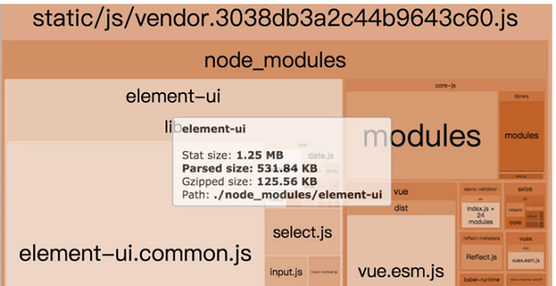

### [什么是webpack](https://gaodaqian.com/webpack4/11%E6%8F%90%E5%8D%87%20webpack%20%E7%9A%84%E6%9E%84%E5%BB%BA%E9%80%9F%E5%BA%A6.html#%E8%AE%A9-webpack-%E5%B0%91%E5%B9%B2%E7%82%B9%E6%B4%BB)
构建就是把源代码转换成线上可执行的js、css、html
- 代码转换ts->js、less->css等
- 文件优化 压缩js、css、html 合并图片
- 代码分割 提取多个页面的公共代码 提取首屏不絮语奥执行的代码异步加载
- 模块合并
- 自动刷新 监听本地源代码变化 自动重新构建 刷新浏览器
- 代码校验 在代码提交到仓库前校验代码 以及单元测试是否通过
- 自动发布 更新完代码后 自动构建出现上发布代码并传输给发布系统
- 删除死代码 Tree Shaking
- 按照路由拆分代码，实现按需加载，提取公共代码
- 利用CDN加速。在构建过程中，将引用的静态资源路径修改为 CDN 上对应的路径
- 压缩代码。删除多余的代码、注释、简化代码的写法等等方式

### 核心概念
- Entry：入口，Webpack执行构建的第一步将从Entry开始，可抽象成输入。
- Module：模块，在Webpack里一切皆模块，一个模块对应着一个文件Webpack 会从配置的Entry开始递归找出所有依赖的模块
- Chunk：代码块，一个Chunk由多个模块组合而成，用于代码合并与分割
- Loader：模块转换器，用于把模块原内容按照需求转换成新内容
- Plugin：扩展插件，在Webpack构建流程中的特定时机注入扩展逻辑来改变构建结果或做你想要的事情
- Output：输出结果，在Webpack经过一系列处理并得出最终想要的代码后输出结果


### webpack(webpack.confg.js)
1. 模块化
2. 自定义文件或npm install
3. 静态文件模块化(nodejs可以模块化js,但静态文件不可以) `npm install css-loader style-loader --save-dev`
4. loader
5. plugin
    - `define-plugin` 定义环境变量
    - `commons-chunk-plugin` 提取公共代码


### 优势
1. 代码分离
2. 装载器css、sass、jsx
3. 智能解析   require("./template" + names + .ejs)
4. 打包（js  其他成员css、less、sass、img由加载器实现、es6转es5）
   - AMD
   - CommonJS(node)
   - ES6
   - CMD
5. 开发工具  http服务器
6. 代码改变自动刷新浏览器  自动编译
7. 压缩代码


### how to use
1. mkdir webpack-demo
2. cd webpack-demo
3. npm init -y
4. npm i webpack webpack-cli webpack-dev-server(自动打包 监视文件改变 刷新浏览器) -D
5. 创建和配置webpack.config.js(可以修改名字)
6. 配置npm scripts
    ```javascript
    "scripts": {
        //--open --hot --inline --port --config ./webpack.dev.config.js
        "build": "webpack --config webpack.config.js", //真实文件
        "dev": "webpack-dev-server --open --color --port 9999", //内存
        "dev-simple": "webpack-dev-server",
        "watch": "webpack --watch"
    }
    ```
7. 安装plugin和loader
    ```javascript
    npm i html-webpack-plugin clean-webpack-plugin -D

    npm i babel-loader babel-core babel-preset-env (babel-loader)
    npm i babel-polyfill --D  (默认只转换语法,这个转换API )
    npm i babel-plugin-transform-runtime --D  (解决重复引用工具方法导致打包js过大的问题)
    npm i babel-runtime --save  (解决重复引用工具方法导致打包js过大的问题)
            cacheDirectory: true   //给babel增加打包缓存目录
    ```

    ```javascript
    npm i --D style-loader css-loader  (css-loader)

    npm i --D npm i file-loader url-loader  (image-loader)

    npm i --D less-loader  less(less-loader)

    npm i --D vue-loader vue-template-compiler(vue-loader)
    ```
8. npm run build / npm run dev / npm [run] start
9. 代码规范校验
10. npx webpack(本地node_modules下找webpack,如果没安装直接安装)
    npx webpack --config webpack.config.js
    webpack(全局执行不推荐)


### 不打包第三方js
    1. jQuery引入到index.html
    2. 配置文件不要打包jquery到main.js
        externals: {
            //key 包名
            //value 全局jQuery导出的接口对象
            jquery: 'jQuery',
        }
    3. 需要通过import引入


### webpack.config.js
 ```javascript
const path = require('path')
const HtmlWebpackPlugin = require('html-webpack-plugin')
//打包前先清空输出目录
const CleanWebpackPlugin = require('clean-webpack-plugin')
module.exports = {
    //多入口单出口
    //entry: ['./src/index.js', './src/a.js']
    entry: 'xxxx.js', //相对路径
    output: {
    filename: 'bundle.[hash:8].js',
    //publicPath : 'dist/js/'  处理图片路径
    //必须是绝对路径
    path: path.resolve(__dirname, 'dist/js')
    },
    mode: 'development',
    devServer: {
        contentBase: path.join(__dirname, 'dist'),
        port: 9000，
        compress: true,
        open: true
    },
    //默认只模块js
    //style-loader css-loader -D //css-loader自带hot
    //less less-loader -D
    //stylus stylus-loader -D
    //node-sass sass-loader -D
    module: {
        //属性名后面版本roles
          loaders: [
             {
                 test: /\.css$/,
                 //use: [
                 //  'style-loader',
                 //  'css-loader'
                 //]
                 //对象配置
                 //use: [
                 //  {loader: 'style-loader', options:{}}
                 //  {loader: 'css-loader', options:{}}
                 //]
                 //顺序从右往左
                 loader: 'style-loader!css-loader'，
                 include:path.join(__dirname,'./src'),
                 exclude:/node_modules/
             },
             {
                 //file-loader 解决CSS等文件中的引入图片路径问题
                 //url-loader 当图片较小的时候会把图片BASE64编码，大于limit参数的时候还是使用file-loader进行拷贝
                 test: /\.(jpg|png|gif|svg)$/,
                 //?后面加属性
                 //若图片大于limit 生成文件
                 //若图片小于生成base64,会有30%增大
                 //建议比较小的图片用base64
                 //options: {
                    //limit: 1024,
                    //指定打包后图片位置
                    //outputPath: 'images/'
                 //}
                 loader: 'url-loader?limit=4096'
              },
              {
                  test: /\.less$/,
                  loader: 'style-loader!css-loader!less-loader'
               },
               {
                   test: /\.js$/,
                   loader: 'babel-loader',
                   exclude: /node_modules/,
                   options: {
                       presets: ['env'], //处理关键字
                       plugins: ['transform-runtime'] //处理函数
                   }
                },
                {
                    test: /\.vue$/,
                    loader: 'vue-loader'
                }
          ]
    },
    plugins: [
        //./src/index.html需要存在
        new HtmlWebpackPlugin({
            template: './src/index.html'，
            title: 'test webpack',
            hash: true,
            minify: {
                removeAttributeQuotes: true,
                collapseWhitespace: true
            }
        }),
        //support regex
        new CleanWebpackPlugin(['./dist', 'a']))
    ],
    resolve:{}
}

import './xxx.css'
import xxx from './xxx.js'
import img from './xxx.jpg'
 ```

```javascript
//package.json
"script": {
	//--open --hot --inline --port
	"dev": "webpack-dev-server --open --config ./webpack.dev.config.js"
    "dev": "webpack --config ./webpack.dev.config.js"
    "prod": "webpack --config ./webpack.prod.config.js"
}
开发安装  npm i
生产安装  npm i --production
```

#### 多入口多出口 对应html引用对应的js
```javascript
entry: {
    index: './src/index.js',
    a: './src/a.js'
}
output: {
    filename: '[name].[hash:8].js',
}
plugins: [
    //./src/index.html需要存在
    new HtmlWebpackPlugin({
        filename: 'a.html', //default filename is index
        template: './src/index.html'，
        title: 'test webpack',
        hash: true,
        minify: {
            removeAttributeQuotes: true,
            collapseWhitespace: true
        },
        chunks: ['index']
    }),
    new HtmlWebpackPlugin({
        filename: 'b.html',
        template: './src/index.html'，
        title: 'test webpack',
        hash: true,
        minify: {
            removeAttributeQuotes: true,
            collapseWhitespace: true
        },
        chunks: ['a']
    })
]
```

#### 只更新局部 不刷新界面 默认刷新界面，只能hot组件和css
```javascript
const webpack = require('webpack')
module.exports = {
    devServer: {
        hot: true
    }
    plugins: [
        new webpack.HotModuleReplacementPlugin()
    ]
}

//index.js
if (module.hot) {
    module.hot.accept()
}
```

#### 抽离style from js to css link文件
```javascript
//MiniCssExtractPlugin
const ExtractTextWebpackPlugin = require('extract-text-webpack-plugin')
module: {
    rules: [
        {
            test: /\.css$/,
            //顺序从右往左
            use: ExtractTextWebpackPlugin.extract({
                use: [
                    {loader: 'css-loader', options:{}}
                ]
            })
        },
        {
            test: /\.less$/,
            use: ExtractTextWebpackPlugin.extract({
                use: [
                    {loader: 'css-loader'},
                    {loader: 'less-loader'}
                ]
            })
        }
    ],
    plugins: [
        new ExtractTextWebpackPlugin({
            filename: 'css/index.css'
        })
    ]
}
```

#### 抽离css和less到单独文件
```javascript
const ExtractTextWebpackPlugin = require('extract-text-webpack-plugin')
const lessExtract = new ExtractTextWebpackPlugin('css/less.css')
const cssExtract = new ExtractTextWebpackPlugin('css/css.css')
module: {
    rules: [
        {
            test: /\.css$/,
            use: cssExtract.extract({
                use: [
                    {loader: 'css-loader'}
                ]
            })
        },
        {
            test: /\.less$/,
            use: lessExtract.extract({
                use: [
                    {loader: 'css-loader'},
                    {loader: 'less-loader'}
                ]
            })
        }
    ],
    plugins: [
        lessExtract,
        cssExtract
    ]
}
```

#### 解决抽离后css不热更新问题，开发时需要
```javascript
const lessExtract = new ExtractTextWebpackPlugin({
    filename: 'css/less.css',
    disable: true
})
use: cssExtract.extract({
    fallback: 'style-loader',
    use: [
        {loader: 'css-loader', options:{}}
    ]
})
```

#### 删除没用的css
```javascript
//npm i purifycss-webpack purify-css glob -D
const PurifycssWebpack = require('purifycss-webpack')
const glob = require('glob')

plugins: [
    //删除没用到的css，一定绝对路径，一定放到HtmlWebpackPlugin之后
    new PurifycssWebpack({
        paths: glob.sync(path.resolve(src/*.html))
    })
]
```

#### css加前缀(如transform)
```javascript
//npm i postcss-loader autoprefixer -D
rules: [
    {
        test: /\.css$/,
        use: cssExtract.extract({
            use: [
                {loader: 'css-loader'}
                {loader: 'postcss-loader'}
            ]
        })
    }
]

//create postcss.config.js
module.exports = {
    plugin: [
        require('autoprefixer')
    ]
}
```

#### 拷贝静态文件
```javascript
const CopyWebpackPlugin = require('copy-webpack-plugin')
plugins: [
    new CopyWebpackPlugin([
        {
            from: './src/doc',
            to: 'public'
        }
    ])
],
```

#### other
- ProvidePlugin
- expose-loader

#### 在html中使用图片
```javascript
//npm i html-withimg-loader -D
<div class="img-container "></div>

{
    test:/\.(html|html)$/,
    use:'html-withimg-loader',
    include:path.join(__dirname,'./src'),
    exclude:/node_modules/
}
```

### 如何调试打包后的代码
webapck通过配置可以自动给我们source maps文件，map文件是一种对应编译文件和源文件的方法
- source-map 把映射文件生成到单独的文件，最完整最慢
- cheap-module-source-map 在一个单独的文件中产生一个不带列映射的Map
- eval-source-map 使用eval打包源文件模块,在同一个文件中生成完整sourcemap
- cheap-module-eval-source-map sourcemap和打包后的JS同行显示，没有映射列
devtool:'eval-source-map'

### resolve

#### extensions
指定extension之后可以不用在require或是import的时候加文件扩展名,会依次尝试添加扩展名进行匹配
```javascript
resolve: {
    //自动补全后缀，注意第一个必须是空字符串,后缀一定以点开头
    extensions: [" ",".js",".css",".json"],
```

#### alias
配置别名可以加快webpack查找模块的速度
- 每当引入jquery模块的时候，它会直接引入jqueryPath,而不需要从node_modules文件夹中按模块的查找规则查找
- 不需要webpack去解析jquery.js文件
```javascript
const bootstrap=path.join(__dirname,'node_modules/bootstrap/dist/css/bootstrap.css')

resolve: {
    alias: {
        'bootstrap': bootstrap
    }
}
```

### 区分环境变量
许多library将通过与process.env.NODE_ENV环境变量关联，以决定library中应该引用哪些内容。例如，当不处于生产环境中时，某些library为了使调试变得容易，可能会添加额外的日志记录(log)和测试(test)。其实，当使用 process.env.NODE_ENV === 'production'时，一些library可能针对具体用户的环境进行代码优化，从而删除或添加一些重要代码。我们可以使用webpack内置的DefinePlugin为所有的依赖定义这个变量

```javascript
npm install cross-env -D

scripts": {
    "build": "cross-env NODE_ENV=production webpack --mode development",
     "dev": "webpack-dev-server --open --mode development "
}

plugins: [
    new webpack.DefinePlugin({
        NODE_ENV:JSON.stringify(process.env.NODE_ENV)
    })
]

if (process.env.NODE_ENV == 'development') {
	console.log('这是开发环境');
} else {
	console.log('这是生产环境');
}
```

### webpack-bundle-analyzer
```javascript
// webpack.prod.conf.js
if (config.build.bundleAnalyzerReport) {
  const BundleAnalyzerPlugin = require('webpack-bundle-analyzer').BundleAnalyzerPlugin
  webpackConfig.plugins.push(new BundleAnalyzerPlugin())
}
// config/index.js
build: {
  // Run the build command with an extra argument to
  // View the bundle analyzer report after build finishes:
  // `npm run build --report`
  // Set to `true` or `false` to always turn it on or off
  bundleAnalyzerReport: process.env.npm_config_report
}
```

运行`npm run build --report`




```javascript
externals: {
    'vue': 'Vue',
    'element-ui': 'ELEMENT',
    'axios': 'axios'
}
```
