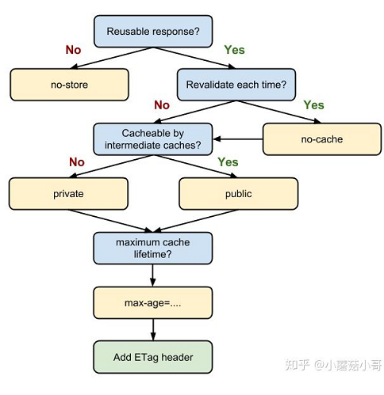
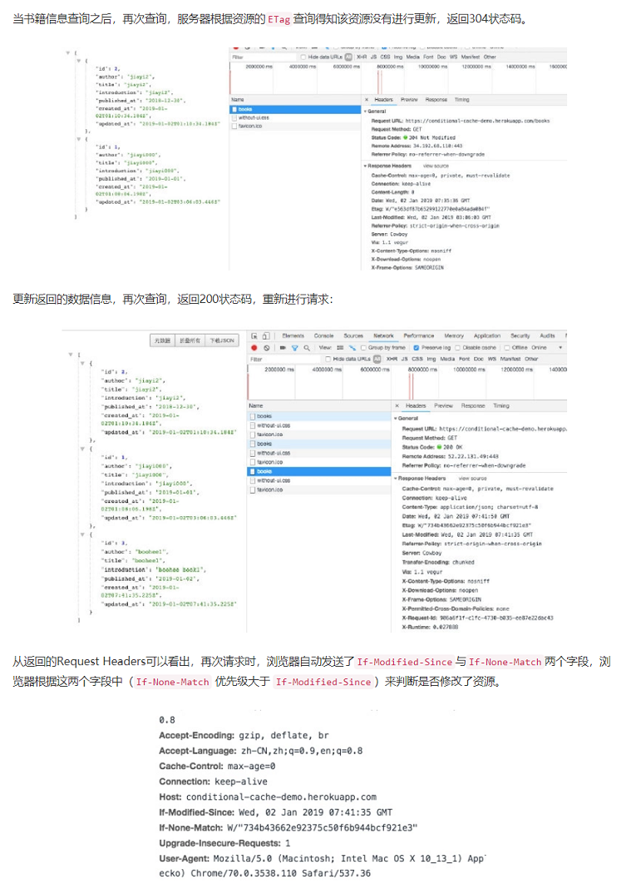
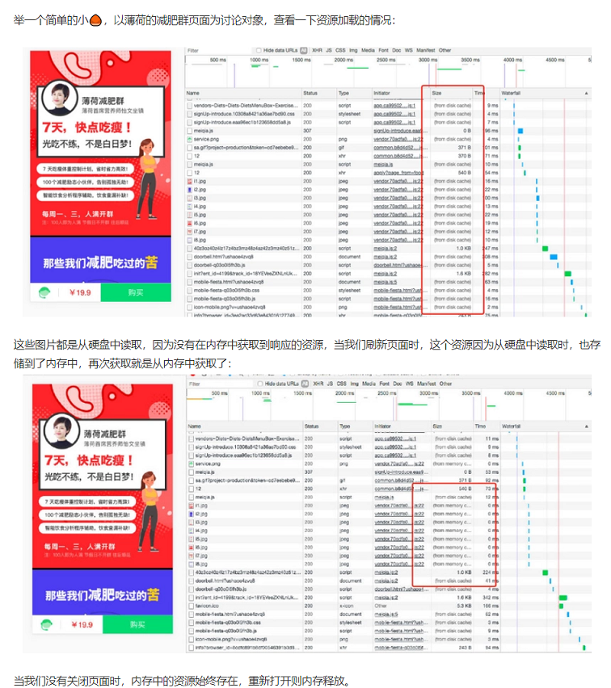
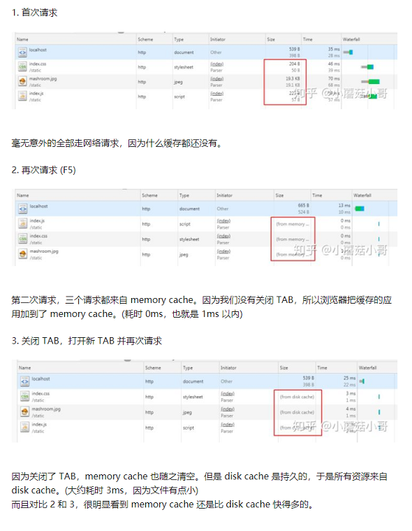
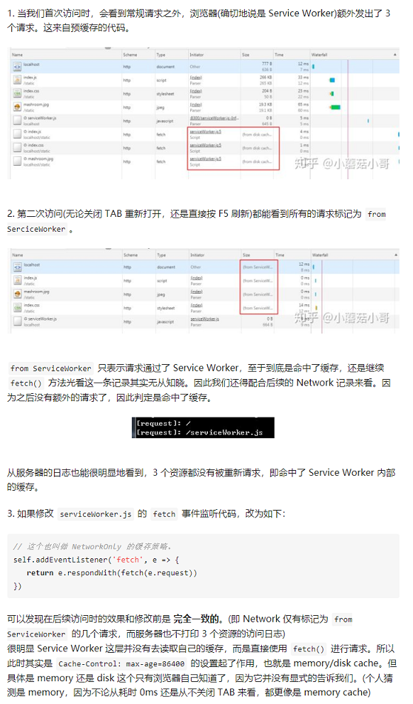

缓存的概念分很多种,本次讨论的主要就是前端缓存中的Http缓存

### 缓存是怎么回事
前端发送请求主要经历以下三个过程,请求->处理->响应
如果有多次请求就需要重复执行这个过程

重复请求的过程


从以上的流程图可以看书,如果用户重复请求同一资源的话,会对服务器资源造成浪费,服务器重复读取资源,发送给浏览器后浏览器重复下载,造成不必要的等待与消耗

### 缓存读取的过程


如何开启Http缓存并对缓存进行设置,是本次讨论的关键。

### 按缓存位置分类(按优先级排序)
1. Service Worker
2. Memory Cache
3. Disk Cache
4. 网络请求

### 按失效策略分类
- memory cache
- disk cache
  - Cache-control
  - Expires
    - 由于是绝对时间，用户可能会将客户端本地的时间进行修改，而导致浏览器判断缓存失效，重新请求该资源。此外，即使不考虑自信修改，时差或者误差等因素也可能造成客户端与服务端的时间不一致，致使缓存失效
    - 写法太复杂了。表示时间的字符串多个空格，少个字母，都会导致非法属性从而设置失效


### 缓存的类型
1. expires: 设置缓存过期的时间
2. private: 所有的内容只有客户端才可以缓存，代理服务器不能缓存。默认值
3. public: 所有的内容都可以被缓存 (包括客户端和代理服务器， 如 CDN)
4. max-age=xxx: 缓存的内容将在 xxx 秒后失效,相对时间
5. no-cache: 虽然字面意思是“不要缓存”，但实际上还是要求客户端缓存内容的，只是是否使用这个内容由后续的对比来决定
6. no-store: 真正意义上的“不要缓存”,强制缓存,对比缓存都不会触发
7. last-modified: 内容上次被修改的时间
8. Etag: 文件的特殊标识
9. must-revalidate：如果超过了max-age的时间，浏览器必须向服务器发送请求，验证资源是否还有效。



### 强制缓存和协商缓存
缓存方法可以分为强制缓存与协商缓存。

从字面理解,强制缓存的方式简单粗暴,给`cache`设置了过期时间,超过这个时间之后cache过期需要重新请求。上述字段中的`expires`与`cache-control`中的`max-age`都属于强制缓存。

协商缓存根据一系列条件来判断是否可以使用缓存。

强制缓存优先级高于协商缓存

#### 强制缓存
##### expires
`expires`给浏览器设置了一个绝对时间,当浏览器时间超过这个绝对时间之后,重新向服务器发送请求。

`Expires: Fri, 04 Jan 2019 12:00:00 GMT`

这个方法简单直接,直接设定一个绝对的时间 (当前时间+缓存时间)。但是也存在隐患,例如浏览器当前时间是可以进行更改的,更改之后expires设置的绝对时间相对不准确,`cache`可能会出现长久不过期或者很快就过期的情况。

##### cache-control: max-age
为了解决`expires`存在的问题,Http1.1版本中提出了`cache-control: max-age`,该字段与`expires`的缓存思路相同,都是设置了一个过期时间,不同的是`max-age`设置的是相对缓存时间开始往后多久,因此不存在受日期不准确情况的影响。

但是强制缓存存在一个问题,该缓存方式优先级高,如果在过期时间内缓存的资源在服务器上更新了,客服端不能及时获取最新的资源。
#### 协商缓存
协商缓存解决了无法及时获取更新资源的问题。以下两组字段,都可以对资源做标识,由服务器做分析,如果未进行更新,那返回304状态码,从缓存中读取资源,否则重新请求资源

对比缓存在请求数上和没有缓存是一致的，但如果是 304 的话，返回的仅仅是一个状态码而已，并没有实际的文件内容，因此 在响应体体积上的节省是它的优化点

##### 2组字段
- Last-Modified & If-Modified-Since
- Etag & If-None-Match


##### last-modify
1. 服务器通过`Last-Modified`字段告知客户端，资源最后一次被修改的时间，例如
`Last-Modified: Mon, 10 Nov 2018 09:10:11 GMT`
2. 浏览器将这个值和内容一起记录在缓存数据库中
3. 下一次请求相同资源时时，浏览器从自己的缓存中找出“不确定是否过期的”缓存。因此在请求头中将上次的`Last-Modified`的值写入到请求头的`If-Modified-Since`字段
4. 服务器会将`If-Modified-Since`的值与`Last-Modified`字段进行对比。如果相等，则表示未修改，响应304；反之，则表示修改了，响应200状态码，并返回数据


但是他还是有一定缺陷的：
- 如果资源更新的速度是秒以下单位，那么该缓存是不能被使用的，因为它的时间单位最低是秒
- 如果文件是通过服务器动态生成的，那么该方法的更新时间永远是生成的时间，尽管文件可能没有变化，所以起不到缓存的作用

##### ETag
为了解决上述问题，出现了一组新的字段Etag和If-None-Match

Etag 存储的是文件的特殊标识(一般都是 hash 生成的)，服务器存储着文件的Etag字段。之后的流程和Last-Modified一致，只是Last-Modified字段和它所表示的更新时间改变成了Etag字段和它所表示的文件hash，把If-Modified-Since变成了If-None-Match。服务器同样进行比较，命中返回304, 不命中返回新资源和200

**Etag的优先级高于Last-Modified**

`Etag: W/"e563df87b65299122770e0a84ada084f"`

以下有个小例子,查询书籍更新


ETag如何计算

ETag是针对某个文件的特殊标识,服务器默认采用SHA256算法生成。也可以采用其他方式,保证编码的唯一性即可

### 缓存的优先级
根据上文优缺点的比对,可以得出以下的优先级顺序：

Cache-Control > Expires > ETag > Last-Modified

如果资源需要用到强制缓存,Cache-Control相对更加安全,协商缓存中利用ETag查询更新更加全面


### 缓存存储在哪
#### disk cache
disk cache为存储在硬盘中的缓存,存储在硬盘中的资源相对稳定,不会随着tab或浏览器的关闭而消失,可以用来存储大型的,需长久使用的资源。

当硬盘中的资源被加载时,内存中也存储了该资源,当下次改资源被调用时,会优先从memory cache中读取,加快资源的获取。
#### memory cache
memory cache即存储在内存中的缓存,内存中的内容会随着tab的关闭而释放。

当接口状态返回304时,资源默认存储在memory cache中,当页面关闭后,重新打开需要再次请求

#### 为什么有的资源一会from disk cache,一会from memory cache
三级缓存原理
1. 先去内存看,如果有,直接加载
2. 如果内存没有,择取硬盘获取,如果有直接加载
3. 如果硬盘也没有,那么就进行网络请求
4. 加载到的资源缓存到硬盘和内存,下次请求可以快速从内存中获取到

#### 为什么有的请求状态码返回200,有的返回304
##### 200 from memory cache
不访问服务器,直接读缓存,从内存中读取缓存。此时的数据时缓存到内存中的,当关闭进程后,也就是浏览器关闭以后,数据将不存在。

但是这种方式只能缓存派生资源。
##### 200 from disk cache
不访问服务器,直接读缓存,从磁盘中读取缓存,当关闭进程时,数据还是存在。

这种方式也只能缓存派生资源
##### 304 Not Modified
访问服务器,发现数据没有
更新,服务器返回此状态码。然后从缓存中读取数据



### CDN缓存
CDN边缘节点缓存策略因服务商不同而不同,但一般都会遵循http标准协议,通过http响应头中的Cache-control: max-age的字段来设置CDN边缘节点数据缓存时间。

当客户端向CDN节点请求数据时,CDN节点会判断缓存数据是否过期,若缓存数据并没有过期,则直接将缓存数据返回给客户端；否则,CDN节点就会向源站发出回源请求,从源站拉取最新数据,更新本地缓存,并将最新数据返回给客户端

### 如何合理应用缓存
强制缓存优先级最高,并且资源的改动在缓存有效期内都不会对缓存产生影响,因此该方法适用于大型且不易修改的的资源文件,例如第三方CSS、JS文件或图片资源,文件后可以加上hash进行版本的区分。建议将此类大型资源存入disk cache,因为存在硬盘中的文件资源不易丢失。

协商缓存灵活性高,适用于数据的缓存,根据上述方法的对比,采用Etag标识进行对比灵活度最高,并考虑将数据存入内存中,因为内存加载速最快,并且数据体积小,不会占用大量内存资源

### 缓存小结
当浏览器要请求资源时
1. 调用 Service Worker 的 fetch 事件响应
2. 查看 memory cache
3. 查看 disk cache。这里又细分：
   - 如果有强制缓存且未失效，则使用强制缓存，不请求服务器。这时的状态码全部是200
   - 如果有强制缓存但已失效，使用协商缓存，比较后确定304还是200


1. 发送网络请求，等待网络响应
2. 把响应内容存入 disk cache (如果 HTTP 头信息配置可以存的话)
3. 把响应内容 的引用 存入 memory cache (无视 HTTP 头信息的配置)
4. 把响应内容存入 Service Worker 的 Cache Storage (如果 Service Worker 的脚本调用了 cache.put())

### example
1. memory cache & disk cache

我们写一个简单的 index.html，然后引用 3 种资源，分别是 index.js, index.css 和 mashroom.jpg。

我们给这三种资源都设置上 Cache-control: max-age=86400，表示强制缓存 24 小时。以下截图全部使用 Chrome 的隐身模式



2. no-cache & no-store

我们在 index.html 里面一些代码，完成两个目标：

- 每种资源都(同步)请求两次
- 增加脚本异步请求图片
```html
<!-- 把3种资源都改成请求两次 -->
<link rel="stylesheet" href="/static/index.css">
<link rel="stylesheet" href="/static/index.css">
<script src="/static/index.js"></script>
<script src="/static/index.js"></script>


<!-- 异步请求图片 -->
<script>
    setTimeout(function () {
        let img = document.createElement('img')
        img.src = '/static/mashroom.jpg'
        document.body.appendChild(img)
    }, 1000)
</script>
```


3. Service Worker & memory (disk) cache
我们尝试把 Service Worker 也加入进去。我们编写一个 serviceWorker.js，并编写如下内容：(主要是预缓存 3 个资源，并在实际请求时匹配缓存并返回)

```javascript
// serviceWorker.js
self.addEventListener('install', e => {
  // 当确定要访问某些资源时，提前请求并添加到缓存中。
  // 这个模式叫做“预缓存”
  e.waitUntil(
    caches.open('service-worker-test-precache').then(cache => {
      return cache.addAll(['/static/index.js', '/static/index.css', '/static/mashroom.jpg'])
    })
  )
})

self.addEventListener('fetch', e => {
  // 缓存中能找到就返回，找不到就网络请求，之后再写入缓存并返回。
  // 这个称为 CacheFirst 的缓存策略。
  return e.respondWith(
    caches.open('service-worker-test-precache').then(cache => {
      return cache.match(e.request).then(matchedResponse => {
        return matchedResponse || fetch(e.request).then(fetchedResponse => {
          cache.put(e.request, fetchedResponse.clone())
          return fetchedResponse
        })
      })
    })
  )
})
```
注册 SW 的代码这里就不赘述了。此外我们还给服务器设置 Cache-Control: max-age=86400 来开启 disk cache。我们的目的是看看两者的优先级



### 浏览器的行为
所谓浏览器的行为，指的就是用户在浏览器如何操作时，会触发怎样的缓存策略。主要有 3 种：

- 打开网页，地址栏输入地址： 查找 disk cache 中是否有匹配。如有则使用；如没有则发送网络请求
- 普通刷新 (F5)：因为 TAB 并没有关闭，因此 memory cache 是可用的，会被优先使用(如果匹配的话)。其次才是 disk cache
- 强制刷新 (Ctrl + F5)：浏览器不使用缓存，因此发送的请求头部均带有 Cache-control: no-cache(为了兼容，还带了 Pragma: no-cache)。服务器直接返回200和最新内容


### 缓存的应用模式
1. 不常变化的资源`Cache-Control: max-age=31536000`
通常在处理这类资源资源时，给它们的 Cache-Control 配置一个很大的 max-age=31536000 (一年)，这样浏览器之后请求相同的 URL 会命中强制缓存。而为了解决更新的问题，就需要在文件名(或者路径)中添加 hash， 版本号等动态字符，之后更改动态字符，达到更改引用 URL 的目的，从而让之前的强制缓存失效 (其实并未立即失效，只是不再使用了而已)。

在线提供的类库 (如 jquery-3.3.1.min.js, lodash.min.js 等) 均采用这个模式。如果配置中还增加 public 的话，CDN 也可以缓存起来，效果拔群。

这个模式的一个变体是在引用 URL 后面添加参数 (例如 ?v=xxx 或者 ?_=xxx)，这样就不必在文件名或者路径中包含动态参数，满足某些完美主义者的喜好。在项目每次构建时，更新额外的参数 (例如设置为构建时的当前时间)，则能保证每次构建后总能让浏览器请求最新的内容。

**特别注意**： 在处理 Service Worker 时，对待 sw-register.js(注册 Service Worker) 和 serviceWorker.js (Service Worker 本身) 需要格外的谨慎。如果这两个文件也使用这种模式，你必须多多考虑日后可能的更新及对策。
2. 经常变化的资源`Cache-Control: no-cache`
这里的资源不单单指静态资源，也可能是网页资源，例如博客文章。这类资源的特点是：URL 不能变化，但内容可以(且经常)变化。我们可以设置 Cache-Control: no-cache 来迫使浏览器每次请求都必须找服务器验证资源是否有效。

既然提到了验证，就必须 ETag 或者 Last-Modified 出场。这些字段都会由专门处理静态资源的常用类库(例如 koa-static)自动添加，无需开发者过多关心。

也正如上文中提到协商缓存那样，这种模式下，节省的并不是请求数，而是请求体的大小。所以它的优化效果不如模式 1 来的显著。
3. 非常危险的模式1和2的结合（反例）
不知道是否有开发者从模式 1 和 2 获得一些启发：模式 2 中，设置了 no-cache，相当于 max-age=0, must-revalidate。我的应用时效性没有那么强，但又不想做过于长久的强制缓存，我能不能配置例如 max-age=600, must-revalidate 这样折中的设置呢？

表面上看这很美好：资源可以缓存 10 分钟，10 分钟内读取缓存，10 分钟后和服务器进行一次验证，集两种模式之大成，但实际线上暗存风险。因为上面提过，浏览器的缓存有自动清理机制，开发者并不能控制。

举个例子：当我们有 3 种资源： index.html, index.js, index.css。我们对这 3 者进行上述配置之后，假设在某次访问时，index.js 已经被缓存清理而不存在，但 index.html, index.css 仍然存在于缓存中。这时候浏览器会向服务器请求新的 index.js，然后配上老的 index.html, index.css 展现给用户。这其中的风险显而易见：不同版本的资源组合在一起，报错是极有可能的结局。

除了自动清理引发问题，不同资源的请求时间不同也能导致问题。例如 A 页面请求的是 A.js 和 all.css，而 B 页面是 B.js 和 all.css。如果我们以 A -> B 的顺序访问页面，势必导致 all.css 的缓存时间早于 B.js。那么以后访问 B 页面就同样存在资源版本失配的隐患。


> 有开发者朋友（wd2010）在评论区提了一个很好的问题：
>
> 如果我不使用must-revalidate，只是Cache-Control: max-age=600，浏览器缓存的自动清理机制就不会执行么？如果浏览器缓存的自动清理机制执行的话那后续的index.js被清掉的所引发的情况都是一样的呀！


- 'max-age=600' 和 'max-age=600,must-revalidate' 有什么区别？

结论是没有区别。在列出 max-age 了之后，must-revalidate 是否列出效果相同，浏览器都会在超过 max-age 之后进行校验，验证缓存是否可用。

在 HTTP 的规范中，只阐述了 must-revalidate 的作用，却没有阐述不列出 must-revalidate 时，浏览器应该如何解决缓存过期的问题，因此这其实是浏览器实现时的自主决策。（可能有少数浏览器选择在源站点无法访问时继续使用过期缓存，但这取决于浏览器自身）

- 那 'max-age=600' 是不是也会引发问题？

是的。问题的出现和是否列出 'must-revalidate' 无关，依然会存在 JS CSS等文件版本失配的问题。因此常规的网站在不同页面需要使用不同的 JS CSS 文件时，如果要使用 max-age 做强缓存，不要设置一个太短的时间。

- 那这类比较短的 max-age 到底能用在哪里呢？

既然版本存在失配的问题，那么要避开这个问题，就有两种方法。

第一，整站都使用相同的 JS 和 CSS，即合并后的文件。这个比较适合小型站点，否则可能过于冗余，影响性能。（不过可能还是会因为浏览器自身的清理策略被清理，依然有隐患）

第二，资源是独立使用的，并不需要和其他文件配合生效。例如 RSS 就归在此类。


