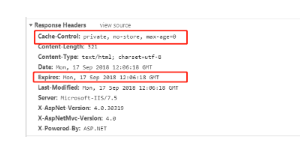
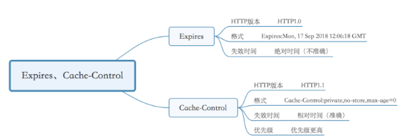
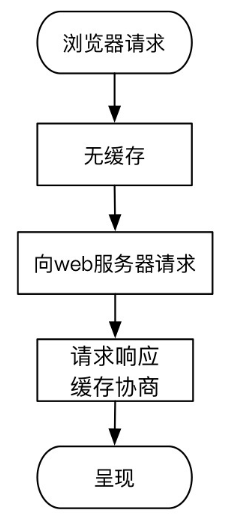
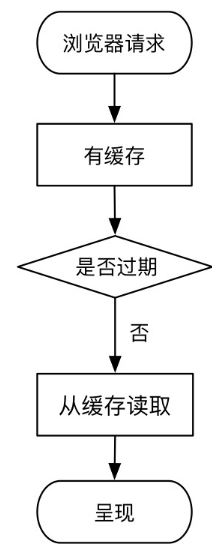
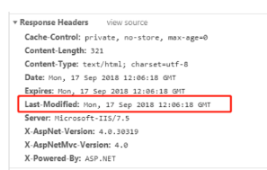
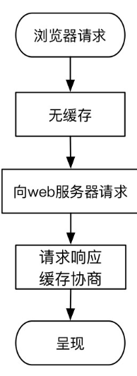
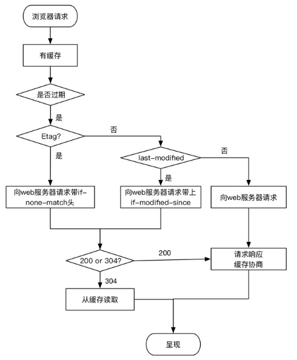
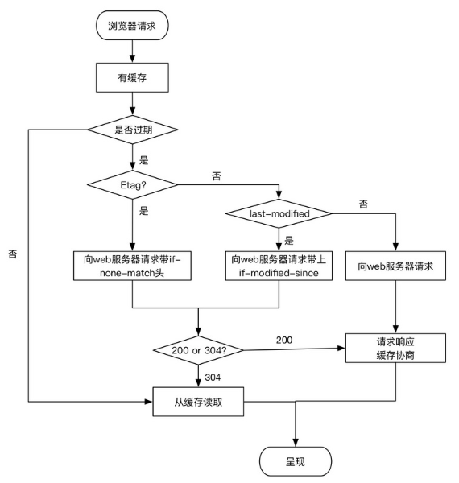

### 强缓存

#### 区分Expires和Cache-Control

以一个接口返回的响应头为例：

这里我画了张思维导图，对Expires和Cache-Control做比较：

具体介绍Expires和Cache-Control：

Expires:

(1)Expires是HTTP1.0的东西，现在默认浏览器均默认使用HTTP 1.1，所以它的作用基本忽略；

(2)Expires规定了缓存失效时间（Date为当前时间），是绝对时间。由于Expires返回的是一个绝对时间，在服务器时间与客户端时间相差较大的时候，缓存命中不准确；

Cache-Control：

(1)Cache-Control是HTTP1.1的

(2)Cache-Control的max-age规定了缓存有效时间（2552s)，是相对时间；

(3)若响应头Expires和Cache-Control同时存在，**Cache-Control优先级高于Expires**

Cache-Control的常用指令：

no-cache：不使用本地缓存，需要使用协商缓存，也就是先与服务器确认缓存是否可用。

no-store：禁用缓存。用于防止重要的信息被无意的发布。在请求消息中发送将使得请求和响应消息都不使用缓存。

public：其他用户也可使用缓存，适用于公共缓存服务器的情况。

private：只有特定用户才能使用缓存，适用于公共缓存服务器的情况。

max-age：客户机可以接收生存期不大于指定时间（以秒为单位）的响应。

min-fresh客户机可以接收响应时间小于当前时间加上指定时间的响应。

max-stale指示客户机可以接收超出超时期间的响应消息。如果指定max-stale消息的值，那么客户机可以接收超出超时期指定值之内的响应消息。

> 注意：no-cache指令并不是不缓存，no-cache的意思是可以缓存，但每次用应该去向服务器验证缓存是否可用。no-store才是不缓存内容。

#### 强缓存的过程

**强缓存**：浏览器直接从本地缓存中获取数据，不与服务器进行交互。

· 浏览器第一次跟服务器请求一个资源，服务器在返回这个资源的同时，在response的header会加上Expires/Cache-Control的header；

· 浏览器再请求这个资源时，先从缓存中寻找，找到这个资源后，比较Expires或Cache-Control的max-age字段值做比较, 如果在有效期内，则读取缓存内容；若缓存已过期，则重新向服务器发送请求；

· header在重新加载的时候会被更新

这里我画了两张图，浏览器第一次请求：

浏览器第一次请求

浏览器再次请求：

强缓存

对于强缓存，chrome浏览器的状态码：

200 OK(from disk cache)或是200 OK (from memory cache)

例如：请求某个图片后，当浏览器再次访问这个图片时，发现有这个图片的缓存，且缓存没过期，所以就使用缓存。

当浏览器发现缓存过期后，缓存并不一定不能使用了。比如文件虽然过了有效期，但内容并没有发生改变，还是可以用缓存数据。所以，这个时候需要与服务器协商，让服务器判断本地缓存是否还能使用。那么又怎么判断服务端文件有没有更新呢？主要有两种方式：

Last-Modified，If-Modified-since。

### 协商缓存

#### 区分Last-Modified和If-Modified-Since

以一个返回的接口为例：

Last-Modified的格式：

**Last-Modified**: Mon, 17 Sep 2018 12:06:18 GMT

If-Modified-Since的格式：

**If-Modified-Since**: Mon, 17 Sep 2018 12:06:18 GMT

#### Etag是什么

web服务器响应请求时，告诉浏览器当前资源在服务器的唯一标识（生成规则由服务器决定）。Apache中，ETag的值默认是对文件的索引节（INode），大小（Size）和最后修改时间（MTime）进行Hash后得到的。

#### 协商缓存的过程

浏览器第一次请求：

浏览器第一次缓存

浏览器再一次请求：

协商缓存

Last-Modified、If-Modified-Since：

· 浏览器第一次向服务器请求一个资源，服务器在返回这个资源的同时，在respone的header加上Last-Modified字段，表示该资源在服务器上的最后修改时间；

· 浏览器再次向服务器请求这个资源时，在request的header上加上If-Modified-Since字段，这个值就是上一次请求时返回的Last-Modified的值;

·服务器收到资源请求时，比较If-Modified-Since字段值和被请求资源的最后修改时间，若资源最后修改时间较旧，则说明文件没有修改，返回304 Not Modified, 浏览器从缓存中加载资源；若不相同，说明文件被更新，浏览器直接从服务器加载资源, 返回200；

·重新加载资源时更新Last-Modified Header

Etag、If-None-Match

· 浏览器第一次向服务器请求一个资源，服务器在返回这个资源的同时，在respone的header加上ETag字段；

·浏览器再次跟服务器请求这个资源时，在request的header上加上If-None-Match，这个值就是上一次请求时返回的ETag的值；

·服务器再次收到资源请求时，再根据资源生成一个新的ETag，与浏览器传过来If-None-Match比较，如果这两个值相同，则说明资源没有变化，返回304 Not Modified, 浏览器从缓存中加载资源，否则返回200 资源内容。与Last-Modified不一样的是，当服务器返回304 Not Modified的响应时，由于ETag重新生成过，response header中还会把这个ETag返回，即使这个ETag跟之前的没有变化

#### 为什么有了Last-Modified，还要用Etag呢？

HTTP1.1中ETag的出现主要是为了解决几个Last-Modified比较难解决的问题：

·一些文件也许会周期性的更改，但是他的内容并不改变(仅仅改变的修改时间)，这个时候我们并不希望客户端认为这个文件被修改了，而重新GET；

·某些文件修改非常频繁，比如在秒以下的时间内进行修改，(比方说1s内修改了N次)，If-Modified-Since能检查到的粒度是s级的，这种修改无法判断(或者说UNIX记录MTIME只能精确到秒)；

·某些服务器不能精确的得到文件的最后修改时间。

对于上述情景，利用**ETag能够更加准确的控制缓存**，因为ETag是服务器自动生成的资源在服务器端的唯一标识符，资源每次变动，都会生成新的ETag值。Last-Modified与ETag是可以一起使用的，但**服务器会优先验证ETag**

#### 比较强缓存和协商缓存

