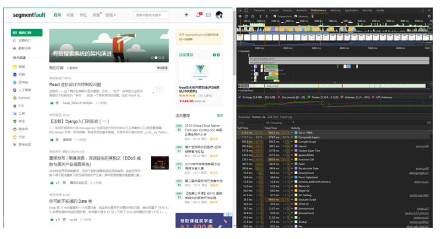

### 浏览器渲染过程
#### 浏览器的主要结构：

#### 浏览器的多进程模型：
以chorme为例：

- Browser进程：浏览器的主进程，负责浏览器界面的显示，各个页面的管理，其他各种进程的管理；
- Renderer进程：页面的渲染进程，负责页面的渲染工作，Blink的工作主要在这个进程中完成(主要分成render主线程和合成器线程)；
- NPAPI插件进程：每种类型的插件只会有一个进程，每个插件进程可以被多个Render进程共享；
- GPU进程：最多只有一个，当且仅当GPU硬件加速打开的时候才会被创建，主要用于对3D加速调用的实现；
- Pepper插件进程：同NPAPI插件进程，不同的是为Pepper插件而创建的进程

需要注意的是，NPAPI是指浏览器对系统或外部的一些程序的调用接口，比如播放视频的 flash 插件，而Pepper其实是基于NPAPI改进的插件架构。

#### 网页请求过程

#### 浏览器渲染过程
##### 主要流程
主流的浏览器内核主要有2种，Webkit 和 Geoko ，虽然 chorme 现在的内核更换为 blink ，但其实 blink是基于webkit的，差异不大。其渲染过程分别如下：

这两个内核的渲染流程大同小异，主要的过程可以总结为下列5个：

- DomTree: 解析html构建DOM树。
- CssomTree : 解析CSS生成CSSOM规则树。
- RenderObjectTree: 将DOM树与CSSOM规则树合并在一起生成渲染对象树。
- Layout: 遍历渲染树开始布局(layout)，计算每个节点的位置大小信息。
- Painting: 将渲染树每个节点绘制到屏幕。

使用chorme浏览器的开发者工具，我们很容易看到这5个过程的时间线，下面是segmentfault主页的渲染截图：

##### 具体流程

**DOM树的构建：**
浏览器在接收到html文件后即开始解析和构建DOM树，在碰到js代码段时，由于js代码可能会改变dom的结构，所以为避免重复操作，浏览器会停止dom树构建，先加载并解析js代码。而对于css，图片，视频等资源，则交由资源加载器去加载，这个过程是异步的，并不会阻碍dom树的生成。这个过程需要注意的点是：

display:none的元素、注释存在于dom树中
js会阻塞dom树的构建从而阻塞其他资源的并发加载，因此好的做法是将js放在最后加载
对于可异步加载的js片段加上 async 或 defer

**CSSOM树的构建：**
浏览器在碰到<link\> 和 <style\> 标签时，会解析css生成cssom ， 当然，link标签需要先将css文件加载完成才能解析。
需要注意的是：

js 代码会阻塞cssom的构建，在webkit内核中有所优化，只有js访问css才会阻塞
cssom的构建与dom树的构建是并行的
减少css的嵌套层级和合理的定义css选择器可以加快解析速度，可参考如何提升 CSS 选择器性能

**RenderObject树的构建：**
在cssom 和dom 树都构建完成后，浏览器会将他们结合，生成渲染对象树，渲染树的每一个节点，包含了可见的dom节点和节点的样式 。
需要注意的是：
- renderObject树 与 dom树不是完全对应的，不可见的元素如display：none 是不会放入渲染树的。
- visibility: hidden的元素在Render Tree中

**布局：**
这一步是浏览器遍历渲染对象树，并根据设备屏幕的信息，计算出节点的布局、位置，构建出渲染布局树（render layout）。渲染布局树输出的就是我们常说的盒子模型，需要注意的是：

- float， absolute ， fixed 的元素的位置会发生偏移
- 我们常说的脱离文档流，其实就是脱离布局树

**绘制：**
浏览器对生成的布局树进行绘制，由用户界面后端层将每个节点绘制出来。此时，Webkit内核还需要将渲染结果从Renderer进程传递到Browser进程。

#### 重绘和回流

前面讲到，js代码可以访问和修改dom节点和css，所以在解析js的过程中会导致页面重新布局和渲染，这就是重绘（repaint）和回流(reflow)。

##### 重绘：
概念：
重绘是指css样式的改变，但元素的大小和尺寸不变，而导致节点的重新绘制。

重绘的触发：
任何对元素样式，如`background-color、border-color、visibility `等属性的改变。css 和 js 都可能引起重绘。

##### 回流

回流（reflow）是指元素的大小、位置发生了改变，而导致了布局的变化，从而导致了布局树的重新构建和渲染。

回流的触发

- dom元素的位置和尺寸大小的变化
- dom元素的增加和删除
- 伪类的激活
- 窗口大小的变化
- 增加和删除class样式
- 动态计算修改css样式

当然，我们的浏览器不会每一次reflow都立刻执行，而是会积攒一批，这个过程也被成为异步reflow，或者增量异步reflow。但是有些情况浏览器是不会这么做的，比如：resize窗口，改变了页面默认的字体，等。对于这些操作，浏览器会马上进行reflow