### 浏览器渲染过程
#### 浏览器的主要结构：

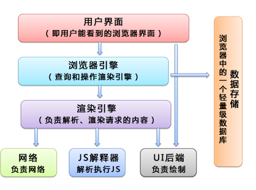
#### 浏览器的多进程模型：
以chorme为例：

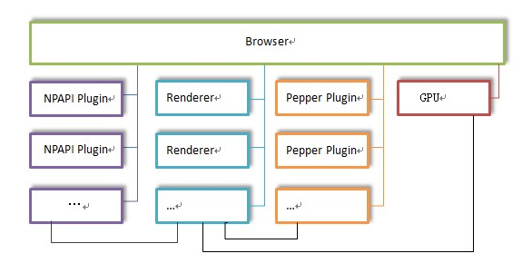

- Browser进程：浏览器的主进程，负责浏览器界面的显示，各个页面的管理，其他各种进程的管理；
- Renderer进程：页面的渲染进程，负责页面的渲染工作，Blink的工作主要在这个进程中完成(主要分成render主线程和合成器线程)；
- NPAPI插件进程：每种类型的插件只会有一个进程，每个插件进程可以被多个Render进程共享；
- GPU进程：最多只有一个，当且仅当GPU硬件加速打开的时候才会被创建，主要用于对3D加速调用的实现；
- Pepper插件进程：同NPAPI插件进程，不同的是为Pepper插件而创建的进程

需要注意的是，NPAPI是指浏览器对系统或外部的一些程序的调用接口，比如播放视频的 flash 插件，而Pepper其实是基于NPAPI改进的插件架构。

#### 网页请求过程
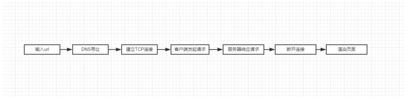
#### 浏览器渲染过程
##### 主要流程
主流的浏览器内核主要有2种，Webkit 和 Geoko ，虽然 chorme 现在的内核更换为 blink ，但其实 blink是基于webkit的，差异不大。其渲染过程分别如下：

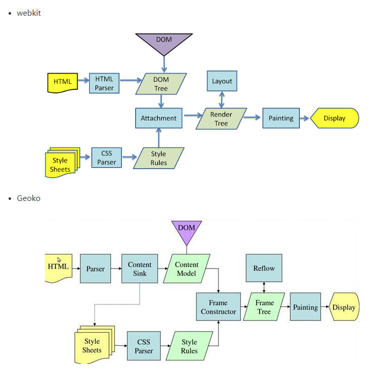

这两个内核的渲染流程大同小异，主要的过程可以总结为下列5个：

- DomTree: 解析html构建DOM树。
- CssomTree : 解析CSS生成CSSOM规则树。
- RenderObjectTree: 将DOM树与CSSOM规则树合并在一起生成渲染对象树。
- Layout: 遍历渲染树开始布局(layout)，计算每个节点的位置大小信息。
- Painting: 将渲染树每个节点绘制到屏幕。

使用chorme浏览器的开发者工具，我们很容易看到这5个过程的时间线，下面是segmentfault主页的渲染截图：


##### 具体流程

**DOM树的构建：**
浏览器在接收到html文件后即开始解析和构建DOM树，在碰到js代码段时，由于js代码可能会改变dom的结构，所以为避免重复操作，浏览器会停止dom树构建，先加载并解析js代码。而对于css，图片，视频等资源，则交由资源加载器去加载，这个过程是异步的，并不会阻碍dom树的生成。这个过程需要注意的点是：

display:none的元素、注释存在于dom树中
js会阻塞dom树的构建从而阻塞其他资源的并发加载，因此好的做法是将js放在最后加载
对于可异步加载的js片段加上 async 或 defer

**CSSOM树的构建：**
浏览器在碰到<link\> 和 <style\> 标签时，会解析css生成cssom ， 当然，link标签需要先将css文件加载完成才能解析。
需要注意的是：

js 代码会阻塞cssom的构建，在webkit内核中有所优化，只有js访问css才会阻塞
cssom的构建与dom树的构建是并行的
减少css的嵌套层级和合理的定义css选择器可以加快解析速度，可参考如何提升 CSS 选择器性能

**RenderObject树的构建：**
在cssom 和dom 树都构建完成后，浏览器会将他们结合，生成渲染对象树，渲染树的每一个节点，包含了可见的dom节点和节点的样式 。
需要注意的是：
- renderObject树 与 dom树不是完全对应的，不可见的元素如display：none 是不会放入渲染树的。
- visibility: hidden的元素在Render Tree中

**布局：**
这一步是浏览器遍历渲染对象树，并根据设备屏幕的信息，计算出节点的布局、位置，构建出渲染布局树（render layout）。渲染布局树输出的就是我们常说的盒子模型，需要注意的是：

- float， absolute ， fixed 的元素的位置会发生偏移
- 我们常说的脱离文档流，其实就是脱离布局树

**绘制：**
浏览器对生成的布局树进行绘制，由用户界面后端层将每个节点绘制出来。此时，Webkit内核还需要将渲染结果从Renderer进程传递到Browser进程。

#### 重绘和回流

前面讲到，js代码可以访问和修改dom节点和css，所以在解析js的过程中会导致页面重新布局和渲染，这就是重绘（repaint）和回流(reflow)。

##### 重绘：
概念：
重绘是指css样式的改变，但元素的大小和尺寸不变，而导致节点的重新绘制。

重绘的触发：
任何对元素样式，如`background-color、border-color、visibility `等属性的改变。css 和 js 都可能引起重绘。

##### 回流

回流（reflow）是指元素的大小、位置发生了改变，而导致了布局的变化，从而导致了布局树的重新构建和渲染。

回流的触发

- dom元素的位置和尺寸大小的变化
- dom元素的增加和删除
- 伪类的激活
- 窗口大小的变化
- 增加和删除class样式
- 动态计算修改css样式

当然，我们的浏览器不会每一次reflow都立刻执行，而是会积攒一批，这个过程也被成为异步reflow，或者增量异步reflow。但是有些情况浏览器是不会这么做的，比如：resize窗口，改变了页面默认的字体，等。对于这些操作，浏览器会马上进行reflow。

### 页面性能分析与测速
#### 性能分析

- [Chrome Devtool Performance](https://zhuanlan.zhihu.com/p/29879682)
- [google PageSpeed Insights](https://developers.google.com/speed/pagespeed/insights/?hl=zh-CN&utm_source=PSI&utm_medium=incoming-link&utm_campaign=PSI)


#### 测速上报
- 测速的关键指标

一般来说，我们打开一个页面，期望的是页面的响应和呈现速度和流畅的交互体验。所以，页面的测速指标可以大致概括为： 白屏时间，首屏时间，可交互时间。
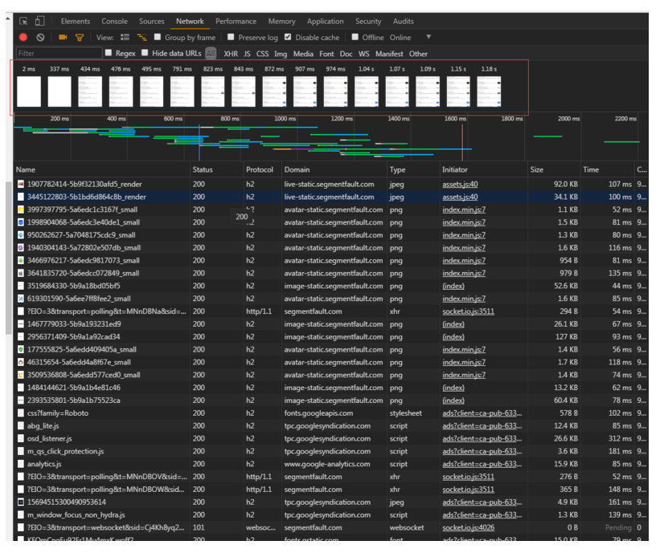

- 如何计算

window.performance是w3c提供的用来测量网页和Web应用程序的性能api。其中performance timing提供了延时相关的性能信息，可以高精度测量网站性能。timing的整体结构如下图所示:

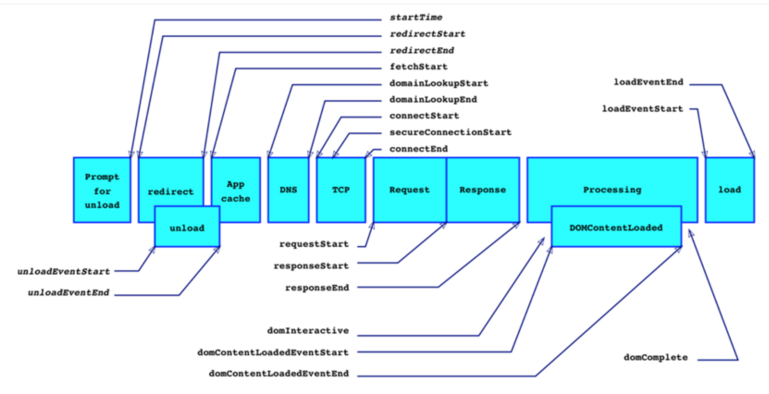

- 白屏时间=页面开始展示的时间点(PerformanceTiming.domLoading)-开始请求时间点(PerformanceTiming.navigationStart)
- 首屏时间=首屏内容渲染结束时间点(视业务具体情况而定)-开始请求时间点(PerformanceTiming.navigationStart)
- 可交互时间=用户可以正常进行事件输入时间点（PerformanceTIming.domInteractive）-开始请求时间点(PerformanceTiming.navigationStart)

### 性能优化

关于性能优化，涉及的方向太广了，从网络请求到数据库，整条链路都有其可优化的地方。这里我只总结一下前端比较需要关注的一些优化点。这里从两个个维度进行讨论：

#### 网络请求的优化
从上文可知，浏览器渲染网页的前提是下载相关的资源，html文档、css文档、图片资源等。这些资源是客户端基于HTTP协议，通过网络请求从服务器端请求下载的，大家都知道，有网络，必定有延迟，而资源加载的网络延迟，是页面缓慢的一个重要因素。所以，如何使资源更快、更合理的加载，是性能优化的必修课。

##### 静态资源
######  拼接、合并、压缩、制作雪碧图、懒加载

由于HTTP的限制，在建立一个tcp请求时需要一些耗时，所以，我们对资源进行合并、压缩，其目的是减少http请求数和减小包体积，加快传输速度。

- 拼接、合并、压缩： 在现代的前端工程化开发流程中，相信大家都有使用webpack或者gulp等打包工具对资源（js、css、图片等）进行打包、合并、去重、压缩。在这基础上，我们需要根据自身的业务，合理的对公共代码，公共库，和首屏代码进行单独的打包压缩
- 按需加载
```javascript
// about.js
export default render;

// main.js
document.getElementById('about').addEventListener('click', e => {
  import('./about').then(({default: render}) => {
    // 渲染页面
    render();
  });
}, !1);
```
- 雪碧图：对于图片资源，我们可以制作雪碧图，即对一些页面上的icon和小图标，集成到一张图片上，css使用背景图定位来使用不同的icon，这样做可以有效的减少图片的请求数，降低网络延迟。而它的缺点也很明显，由于集成在同一张图片上，使用其中的一个图标，就需要将整张图片下载下来，所以，雪碧图不能盲目的使用。
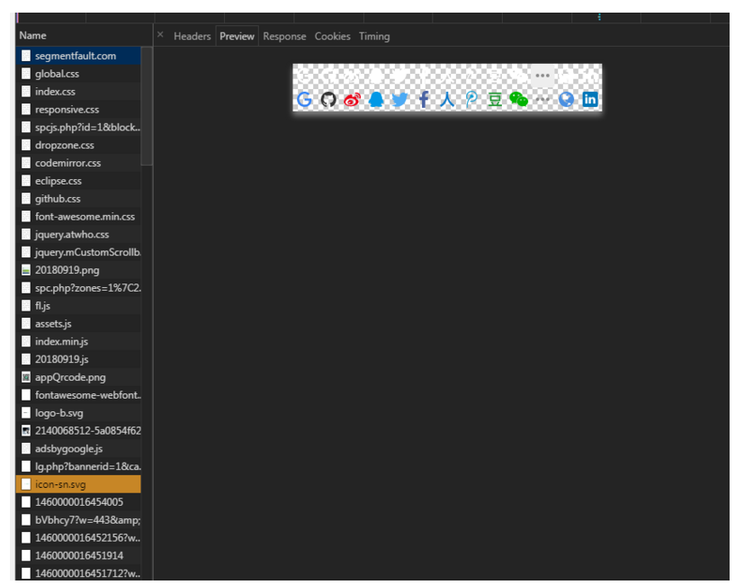

###### CDN资源分发

将一些静态资源文件托管在第三方CDN服务中，一方面可以减少服务器的压力，另一方面，CDN的优势在于，CDN系统能够实时地根据网络流量和各节点的连接、负载状况以及到用户的距离和响应时间等综合信息将用户的请求重新导向离用户最近的服务节点上，保证资源的加载速度和稳定性。

###### 缓存

缓存的范围很广，比如协议层的DNS解析缓存、代理服务器缓存，到客户端的浏览器本地缓存，再到服务端的缓存。一个网络链路的每个环节都有被缓存的空间。缓存的目的是简化资源的请求路径，比如某些静态资源在客户端已经缓存了，再次请求这个资源，只需要使用本地的缓存，而无需走网络请求去服务端获取。
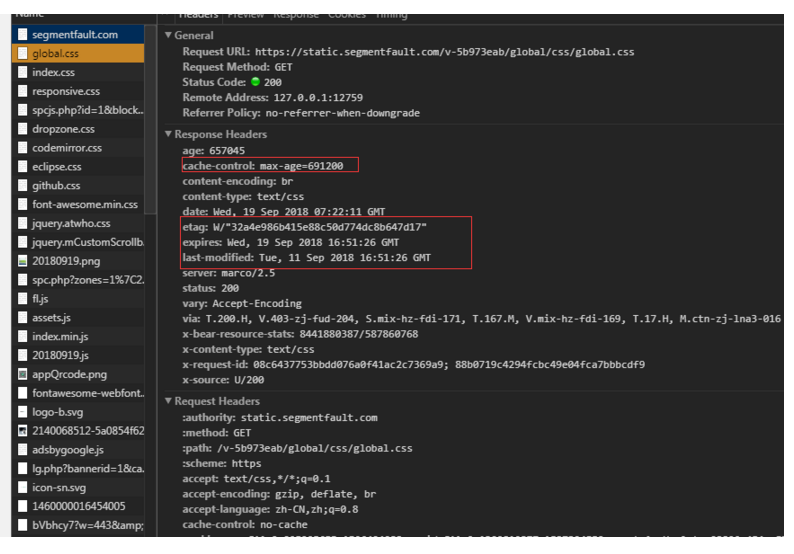

###### 分片
分片指得是将资源分布到不同的主机，这是为了突破浏览器对同一台主机建立tcp连接的数量限制，一般为6~8个。现代网站的资源数量有50~100个很常见，所以将资源分布到不同的主机上，可以建立更多的tcp请求，降低请求耗时，从而提升网页速度。
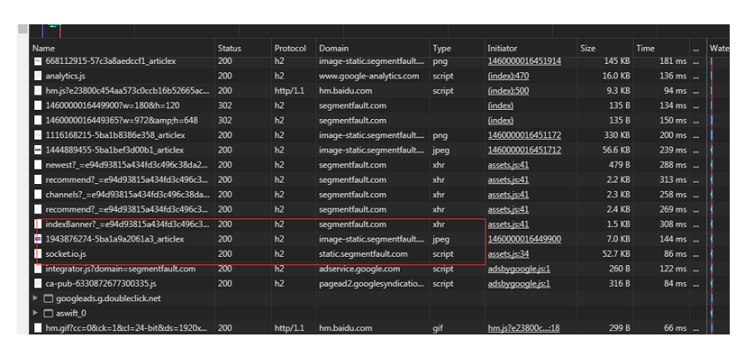

1. 升级协议：

可以升级我们的网络协议，比如使用HTTP2，quic 之类的，代替之前的http1.1，从协议层优化资源的加载。可以参考我之前的文章。

##### 业务数据
虽然做好了静态数据的加载优化，但是还是会出现一种情景，即静态数据已经加载完毕，但页面还是在转菊花，页面还没有进入可交互状态，这是因为现如今的网站开发模式，前后端分离已经成为主流，不再由php或jsp服务端渲染前端页面，而是前端先加载静态数据，再通过ajax异步获取服务器的数据，进而重新渲染页面。这就导致了异步从接口获取数据也是网页的一个性能瓶颈。响应缓慢，不稳定的接口，会导致用户交互体验极差，页面渲染速度也不理想。比如点击一个提交数据的按钮，接口速度慢，页面上菊花需要转好久才能交换完数据。

###### 首屏直出
为了提升用户体验，我们认为首屏的渲染速度是极为重要的，用户进来页面，首页可见区域的加载可以由服务端渲染，保证了首屏加载速度，而不可见的部分则可以异步加载，甚至做到子路由页面的预加载。业界已经有很多同构直出的方案，比如vue的nuxt ， react的beidou等。

###### 接口合并

前端经常有这样的场景，完成一个功能需要先请求第一个接口获得数据，然后再根据数据请求第二个接口获取第二个数据，然后第三、第四...前端通常需要通过promise或者回调，一层一层的then下去，这样显然是很消耗性能的

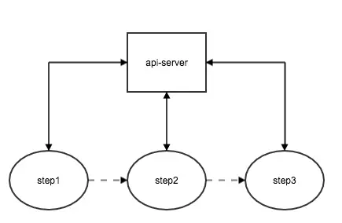

通常后台接口都按一定的粒度存在的，不可能一个接口满足所有的场景。这是不可避免的，那么如何做到只发送一个请求就能实现功能呢？有一种不错的方案是，代理服务器实现请求合并，即后台的接口只需要保证健壮和分布式，而由nodejs（当然也可以使用其他语言）建设一层代理中间层，流程如下图所示：

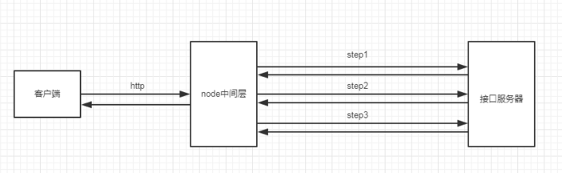

前端只需要按找约定的规则，向代理服务器发起一次请求，由代理服务器向接口服务器发起三次请求，再将目标数据返回给客户端。这样做的好处是：一方面是代理服务器代替前端做了接口合并，减少了前端的请求数量；另一方面代理服务器可以脱离HTTP的限制，使用更高效的通信协议与服务器通信；

#### 页面渲染性能的优化

###### 防止阻塞渲染

页面中的css 和 js 会阻塞html的解析，因为他们会影响dom树和render树。为了避免阻塞，我们可以做这些优化：

css 放在首部，提前加载，这样做的原因是： 通常情况下 CSS 被认为是阻塞渲染的资源，在CSSOM 构建完成之前，页面不会被渲染，放在顶部让样式表能够尽早开始加载。但如果把引入样式表的 link 放在文档底部，页面虽然能立刻呈现出来，但是页面加载出来的时候会是没有样式的，是混乱的。当后来样式表加载进来后，页面会立即进行重绘，这也就是通常所说的闪烁了。
js文件放在底部，防止阻塞解析

一些不改变dom和css的js 使用 `defer` 和 `async` 属性告诉浏览器可以异步加载，不阻塞解析

- defer是在HTML解析完之后才会执行，如果是多个，按照加载的顺序依次执行
- async是在加载完之后立即执行，如果是多个，执行顺序和加载顺序无关

###### 减少重绘和回流

重绘和回流在实际开发中是很难避免的，我们能做的就是尽量减少这种行为的发生。

- js尽量少访问dom节点和css 属性
- 尽可能的为产生动画的 HTML 元素使用 fixed 或 absolute 的 position ，那么修改他们的 CSS 是不会 Reflow 的。
- img标签要设置高宽，以减少重绘重排
- 把DOM离线后修改，如将一个dom脱离文档流，比如`display：none` ，再修改属性，这里只发生一次回流。
- 尽量用 transform 来做形变和位移，不会造成回流

###### 提高代码质量

这最能体现一个前端工程师的水平了，高性能的代码能在实现功能的同时，还兼顾性能。下面是一些好的实践：

**html**

- 避免再HTML中直接写css代码
- 使用Viewport加速页面的渲染
- 使用语义化标签，减少css的代码，增加可读性和SEO。
- dom的层级尽量不要太深，否则会增加dom树构建的时间，js访问深层的dom也会造成更大的负担
- meta标签里需要定义文档的编码，便于浏览器解析
- 为文件头指定 Expires 或 Cache-Control ，使内容具有缓存性
- 避免src、href等的值为空
- 减少dns查询的次数。

**css**
- css放head
- 压缩文件
- 减少 CSS 嵌套层级和选择适当的选择器，可参考[如何提高css选择器性能](https://www.jianshu.com/p/268c7f3dd7a6)

```css
// 不推荐
.one {
  .two {
    .three {}
  }
}

// 好
.one .two {}
.one {}
```
- 选择器合并：把有共同的属性内容的一系列选择器组合到一起，能压缩空间和资源开销
- 精准样式：尽可能减少不必要的属性设置，比如你只要设置`padding-left:10px`的值,那就避免`padding:0 0 0 10px`这样的写法
- 避免通配符：.a .b *{} 像这样的选择器，根据从右到左的解析顺序在解析过程中遇到通配符（*）回去遍历整个dom的，这样性能问题就大大的了
- 对于首屏的关键css 可以使用style标签内联。可参考[什么是关键css](https://juejin.im/entry/59ccb4c76fb9a00a6c12c645)
- 避免使用 CSS 表达式
- 用 <link> 代替 @import
- 避免使用滤镜
- 雪碧图：在合理的地方把一些小的图标合并到一张图中，这样所有的图片只需要一次请求，然后通过定位的方式获取相应的图标，这样能避免一个图标一次请求的资源浪费
- 少用Float:Float在渲染时计算量比较大，尽量减少使用
- 0值去单位：对于为0的值，尽量不要加单位，增加兼容性
- 原生 css 动画代替 js 动画

**js：**
- 尽可能把script标签放到body之后，避免页面需要等待js执行完成之后dom才能继续执行，最大程度保证页面尽快的展示出来
- 尽可能合并script代码
- css能干的事情，尽量不要用JavaScript来干。毕竟JavaScript的解析执行过于直接和粗暴，而css效率更高
- 尽可能压缩的js文件，减少资源下载的负担
- 减少通过JavaScript代码修改元素样式，尽量使用修改class名方式操作样式或动画
- 访问dom节点时需要对dom节点转存，防止循环中重复访问dom节点造成性能损耗。
- 尽量使用离线DOM，而不是真实的网面DOM，来改变元素样式。比如，操作Document Fragment对象，完成后再把这个对象加入DOM。再比如，使用 cloneNode() 方法，在克隆的节点上进行操作，然后再用克隆的节点替换原始节点。
- 先将元素设为`display: none`（需要1次重排和重绘），然后对这个节点进行100次操作，最后再恢复显示（需要1次重排和重绘）。这样一来，你就用两次重新渲染，取代了可能高达100次的重新渲染。
- 只在必要的时候，才将元素的display属性为可见，因为不可见的元素不影响重排和重绘。另外，`visibility : hidden`的元素只对重绘有影响，不影响重排。
- 使用 window.requestAnimationFrame()、window.requestIdleCallback() 这两个方法调节重新渲染
- position属性为`absolute`或`fixed`的元素，重排的开销会比较小，因为不用考虑它对其他元素的影响。
- 慎用定时器和计时器， 使用完后需要销毁。
- 用于复杂计算的js代码可以放在worker进程中运行
- 对于一些高频的回调需要对其节流和消抖，就是 debounce 和 throttle 这两个函数。比如scroll和touch事件
- `script`标签的`defer` 和`async`
- 动态加载js
- 使 AJAX 可缓存
- 使用 GET 来完成 AJAX 请求
- 延迟加载
- 预加载
- 优化图像
- 原生 js 代替第三方库
- 使用第三方库时，用子模块代替整个包`import forEach from 'lodash/forEach';`

**rollup**
**prepack**