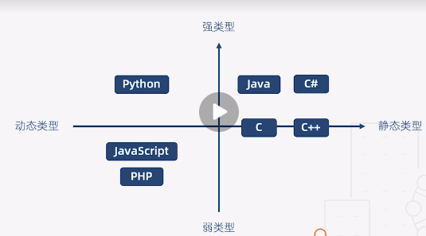
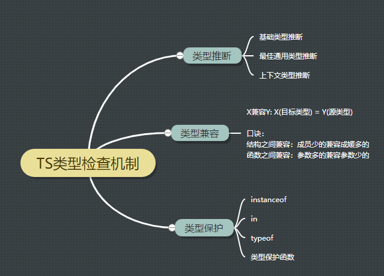

### 强类型vs弱类型 / 动态类型与静态类型


### get started

```bash
npm init -y

npm i typescript -g

//安装完成可以使用tsc命令
tsc -h

//创建配置文件
tsc --init

create index.ts

//compile
tsc .\src\index.ts
```

> `npm i ts-loader typescript -D` //安装ts-loader的时候需要本地安装typescript

### 基本类型

在js的6基本，1引用类型基础上增加 void、any、never、元祖、枚举、高级类型

### 类与接口

### 类型检查机制

